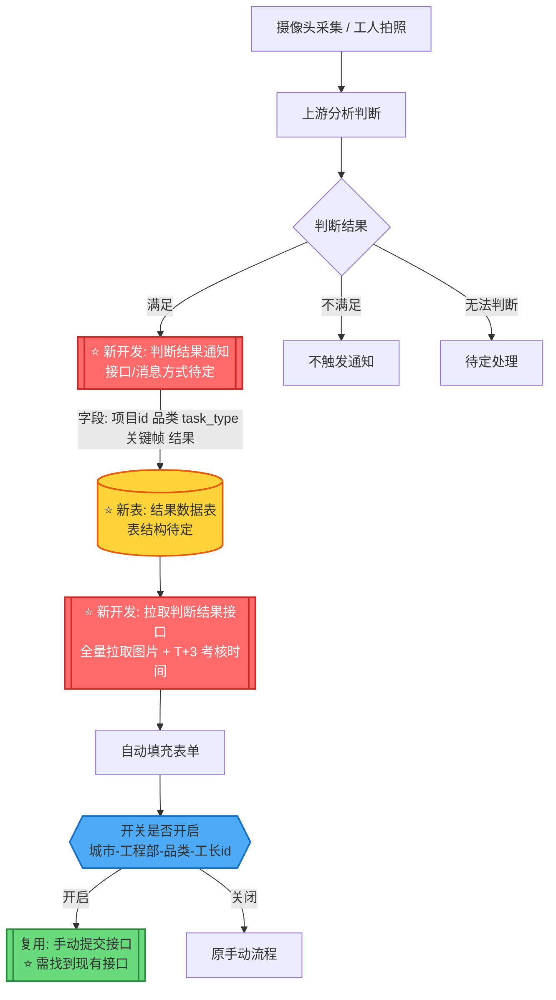
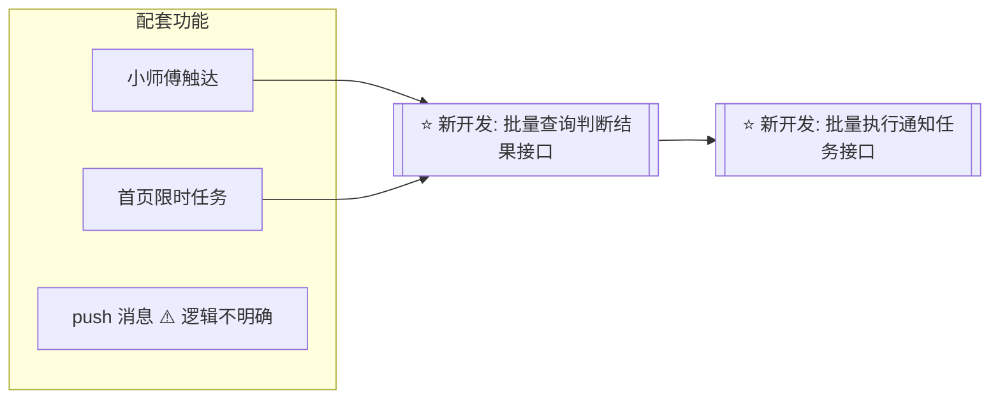

背景：项目经理多任务-提效-通知任务-判断交接面-是否可通知-如何触达    判断可通知的条件
源头；拿到工地的情况-现场    是否满足标准    复杂的任务-
系统的中前置的信息。

本次拿到的任务：室内门             目前可通知判断来自现场，一种是摄像头，工人拍摄的全屋信息（未来音频图像）来判断现场环境来判断是否可通知。

为什么：

作用：


改动：

完成后要观测系统通知占比和驳回率以及及时率（北京和西安）
小师傅触达
首页限时任务

延期包括不在本次品类中的

获取代客权限查看现有逻辑

# 需求背景

当前项目经理有多个通知类任务，处理繁琐影响效率，本次需求针对这个问题进行提效，通过使用工地的摄像头以及工人拍摄的照片进行条件判断。一期只实现通过摄像头和照片的进行判断是否满足通知任务的执行标准，若满足则使用自动提交，当前需要开关（城市-工程部-品类-工长id（暂定））维度来控制，一期只实现自动的填充。但是要项目经理手动提交（这个接口要找到后续要用到）

整体流程是摄像头和工人拍照采集后（先根据四个品类来执行自动通知），上游分析完结果后（满足、不满足、无法判断）将结果通知到主材任务，通知方式（接口、消息待定）结果内容字段暂定包括（项目id，品类-material_code，task_type，关键帧图片，判断结果）将结果落在一个新建的数据表中，数据表结构待确定。

项目经理在通知惹怒列表界面执行通知任务，目前是通过项目经理自己提交照片和期望上门时间，希望改造为自动填充，这个自动填充需要前端调用主材的接口拉取刚才的那个表中的照片以及考核时间，考核时间为T+3，这个T+3具体T是由哪里确定的需要明确。

除此之外还有小师傅触达、首页限时任务、push消息逻辑。前两个是需要提供一个批量查询判断结果的接口以及批量执行通知任务的接口，push消息逻辑不明确。

# 需求背景整理

图例：⭐ = 需要开发 / 修改点；不同颜色区分「新开发接口」「新数据库表」「复用现有接口」。

## 一、背景与目标

项目经理名下存在多个通知类任务（本次聚焦：**室内门**复尺通知），处理繁琐、影响效率。本次需求通过工地**摄像头**与工人拍摄的**照片**判断现场环境是否满足复尺通知的执行标准，满足则自动触发通知任务，减少人工判断与操作成本。

核心思路：拿到工地现场情况（源头）→ 判断是否满足标准 → 决定是否可通知、如何触达。

## 二、一期范围

- 仅实现通过摄像头 + 照片判断是否满足通知任务的执行标准；
- 判断满足后表单**自动填充**，但由项目经理**手动提交**（提交接口需找到，后续复用）；
- 开关维度暂定：城市 - 工程部 - 品类 - 工长id；
- 一期先按四个品类执行自动通知；延期品类不在本次范围。

## 三、整体流程（含修改点标注）


修改点：
1. **判断结果通知接口**：上游分析结果 → 主材任务（方式待定：接口 / 消息）；
2. **落库逻辑**：结果数据表结构设计 + 数据表创建；
3. **拉取判断结果接口**（点击去处理时调用）：**全量**拉取图片 + T+3 考核时间，不做条件过滤；
4. **开关判断**：放在自动提交位置，开关维度（城市 / 工程部 / 品类 / 工长id）决定是否放行自动提交；
5. **提交接口**：复用现有手动提交接口（需找到）；开关关闭时走原手动流程。

## 六、配套功能（批量接口修改点）
prd-小师傅的查询和执行


小师傅、首页限时任务、Mpush需要批量查询判断结果的接口，以及批量执行通知任务的接口，「todo」


开关配置入口、生效时机 → **待明确**。

1、开发接收上游判断结果-并落库的接口
2、数据表创建-结构
3、数据表查询的接口
	1、自动填充的 
	2、小师傅以及首页现实任务的
	3、Mpush消息的 **具体的功能需要看PRD明确 todo** 最后做
4、小师傅首页限定push消息提交要做，以及如何做再定方案 延期没要？

5、T+3 中 T 由哪里确定 → **待明确**。上游发消息的时间作为T

6、观测指标要pm定一下由谁做

7、新表中要加上，新表唯一的话用task_dispatch_id
	是否已经完成通知任务
	是否用ai推荐的
	用户修改后的图片和预期上门时间要留一下
8、用户批量修改的接口用于对话修改和手动修改-参数要全
	- 照片
	- 期望上门时间
	- 项目id
	- 任务ID
	- （数据表唯一）

9、**小师傅首页触达、小师傅项目详情页触达、小师傅测量复尺列表触达** 需要查询接口给前端
要实现可通知和延期预警两个接口查询，以及有几项
	 - 延期要给考核时间、任务ID、不满足项、交接面照片（未经系统判断不展示）
	 - 品类-供应商
	 - 可通知要传任务ID、上门时间、考核时间、以及项目地址
	 - 排序：先按工地分组，同一个工地下按品类分组，同一品类的通知复尺任务放在一起，对应分组下，按「考核时间-当前时间」倒排

```
1. 推送时机：每日查询该工长全部工地的最新识别结果，**若存在可通知任务**或**预警等级为黄色/红色的任务，**每日9:10，13:00，19:00悬浮框推送（暂定）
    
    1. 推送文案：您有**n个通知复尺可一键完成，m个通知复尺即将延期**
        
        1. n：可通知任务，即该工长全部工地下，「激活未完成」且「系统判定可通知」的通知复尺任务
            
        2. m：预警任务，分为两部分
            
            1. 该工长全部工地下，「激活未完成」且「系统判定未达到可通知标准」且「命中预警」的任务
                
            2. 该工长全部工地下，「激活未完成」且「未经过系统判定」且「命中预警」的任务
```

10、**一键通知完成后回执** 功能-可以用提交接口的返回值

11、首页限时任务 
	- 1. 首页限时任务卡片不需要接口直接倒计时24小时，
	- 点击去处理之后就要批量查询可通知、延期提醒的

12、通知复尺页内容填充
	需要接口查询新表，从缓存中取，- 注意若用户有过修改（时间或交界面照片），更新暂存结果
	
13、push消息
	每日09:10定时**触发push系统识别结果消息** 
	- 消息推送内容：xx工长您好，请查收今日需要关注的通知任务+查看详情链接
    - 查看详情跳转至「小师傅-首页路径-通知复尺」模块
- **系统自动完成通知****push**
	- push时机：系统完成「处理方是自动通知」的通知复尺任务
	- 消息推送内容：xx工长您好，检测到您有xx项通知复尺已满足交界面要求，已为您完成通知+查看详情链接
    - 查看详情跳转至「首页-通知复尺列表-已完成」tab
- **系统识别「****现场已完成，任务需关闭」****push**
	-push时机：每日09:10查询该工长全部工地的最新识别结果，**若存在「****现场已完成，任务需关闭」的****任务，触发push消息**
	-消息推送内容：
    - xx工长您好，您有xx项通知复尺任务，检测到现场已安装完成，请您关注+查看详情链接
        1. 查看详情跳转至「首页-通知复尺列表-未完成」模块
14、 上游给我什么才能定位到任务ID？

落库字段--待定-不一定对
![[00.需求/通知复尺自动化/fig/Pasted image 20260812151209.png]]
taskTypeEumn
```
MEASURE(1, "测量", 10, OrderTypeEnum.BEFORE_ORDER, BWSD_MODE,1),  
RESERVE(2, "预定", 11, OrderTypeEnum.UNKNOWN, BW_MODE, null),  
RECHECK_SCALE(3, "复尺", 30, OrderTypeEnum.BEFORE_ORDER, BW_XLS_MODE, 5),  
ORDER(4, "下单", 50, OrderTypeEnum.BEFORE_ORDER, BWSD_MODE, null),  
ENTER(5, "送货", 110, OrderTypeEnum.AFTER_ORDER, BWSD_MODE, 3),  
INSTALL(6, "安装", 130, OrderTypeEnum.AFTER_ORDER, BWSD_MODE, 4),  
ORDER_TAKING(7, "接单", 70, OrderTypeEnum.AFTER_ORDER, BWSD_MODE, null),  
STOCK_UP(8, "备货", 90, OrderTypeEnum.AFTER_ORDER, BW_MODE, null),  
ONCE_INSTALL(9, "预埋件安装", 120, OrderTypeEnum.AFTER_ORDER, BW_MODE, 7),  
DESIGN(10, "设计", 20, OrderTypeEnum.BEFORE_ORDER, BW_MODE, 2),  
DESIGN_REVIEW(11, "报价变更", 40, OrderTypeEnum.BEFORE_ORDER, BW_MODE, 6),  
PRODUCT_SCHEDULE(12, "排产", 80, OrderTypeEnum.AFTER_ORDER, BW_MODE, null),  
PRODUCT_ORDER(13, "下生产单", 60, OrderTypeEnum.AFTER_ORDER, BW_MODE, null),  
WAREHOUSE_ENTER(14, "进仓", 100, OrderTypeEnum.AFTER_ORDER, BW_MODE, null),  
QUOTE(15, "报价", 75, OrderTypeEnum.AFTER_ORDER, SD_MODE, null),  
CONFIRM_MANUFACTURER(16, "确认方案", 1, OrderTypeEnum.BEFORE_ORDER, SELF_BUY_MODE, null),  
MEASURE_ORDER(17, "下测量单", 40, OrderTypeEnum.BEFORE_ORDER, HOME25_MODE, null),
```

可以。结合你现在已经明确的**触达转化率、系统通知占比、AI采纳率、驳回率**，我建议最终就按下面这一版落地。

## 1. 枚举类

### 1.1 埋点事件枚举

```java
@Getter
@AllArgsConstructor
public enum NotifyTrackEventEnum {

    // ==================== 小师傅/入口触达 ====================

    FLOAT_EXPOSURE(
            "notify_float_exposure",
            "小师傅悬浮框曝光"
    ),

    FLOAT_CLICK(
            "notify_float_click",
            "小师傅悬浮框点击"
    ),

    DIALOG_EXPOSURE(
            "notify_dialog_exposure",
            "通知复尺对话曝光"
    ),

    NOTIFIABLE_TAB_EXPOSURE(
            "notify_task_notifiable_tab_exposure",
            "可通知Tab曝光"
    ),

    WARNING_TAB_EXPOSURE(
            "notify_task_warning_tab_exposure",
            "预警Tab曝光"
    ),

    // ==================== 一键通知 ====================

    ONE_CLICK_EXPOSURE(
            "notify_one_click_exposure",
            "一键通知按钮曝光"
    ),

    ONE_CLICK_CLICK(
            "notify_one_click_click",
            "一键通知按钮点击"
    ),

    ONE_CLICK_SUCCESS(
            "notify_one_click_success",
            "一键通知成功"
    ),

    ONE_CLICK_FAIL(
            "notify_one_click_fail",
            "一键通知失败"
    ),

    ONE_CLICK_RESULT_EXPOSURE(
            "notify_one_click_result_exposure",
            "一键通知回执曝光"
    ),

    // ==================== 任务操作 ====================

    SELECT_ALL(
            "notify_task_select_all",
            "通知任务全选"
    ),

    UNSELECT(
            "notify_task_unselect",
            "通知任务取消选中"
    ),

    HANDLE_EXPOSURE(
            "notify_task_handle_exposure",
            "去处理按钮曝光"
    ),

    HANDLE_CLICK(
            "notify_task_handle_click",
            "去处理按钮点击"
    ),

    MODIFY_EXPOSURE(
            "notify_task_modify_exposure",
            "修改按钮曝光"
    ),

    MODIFY_CLICK(
            "notify_task_modify_click",
            "修改按钮点击"
    ),

    MODIFY_TIME_EXPOSURE(
            "notify_task_modify_time_exposure",
            "修改时间按钮曝光"
    ),

    MODIFY_TIME_CLICK(
            "notify_task_modify_time_click",
            "修改时间按钮点击"
    ),

    // ==================== 限时任务 ====================

    TIME_LIMIT_TASK_EXPOSURE(
            "time_limit_task_exposure",
            "限时任务卡片曝光"
    ),

    TIME_LIMIT_TASK_CLICK(
            "time_limit_task_click",
            "限时任务点击"
    ),

    TODO_PAGE_EXPOSURE(
            "notify_todo_page_exposure",
            "待办页面曝光"
    ),

    // ==================== 通知页 ====================

    AI_FILL_EXPOSURE(
            "notify_ai_fill_exposure",
            "AI内容填充曝光"
    ),

    AI_FILL_MODIFY(
            "notify_ai_fill_modify",
            "用户修改AI填充内容"
    ),

    // ==================== 通知业务结果 ====================

    MANUAL_NOTIFY_SUBMIT(
            "notify_manual_submit",
            "人工通知提交"
    ),

    NOTIFY_REJECT(
            "notify_reject",
            "通知复尺被驳回"
    ),

    // ==================== Push ====================

    PUSH_SEND(
            "notify_push_send",
            "Push发送"
    ),

    PUSH_CLICK(
            "notify_push_click",
            "Push点击"
    );

    private final String code;

    private final String desc;
}
```

---

### 1.2 触达入口枚举

这个枚举**非常重要**，因为你的“各入口触达转化率”会直接使用它。

```java
@Getter
@AllArgsConstructor
public enum NotifyTrackSourceEnum {

    SMALL_MASTER_HOME(
            "small_master_home",
            "小师傅首页"
    ),

    PROJECT_DETAIL(
            "project_detail",
            "项目详情页"
    ),

    MEASURE_LIST(
            "measure_list",
            "测量复尺列表"
    ),

    PUSH(
            "push",
            "Push"
    ),

    TIME_LIMIT_TASK(
            "time_limit_task",
            "首页限时任务"
    );

    private final String code;

    private final String desc;
}
```

---

### 1.3 Tab枚举

```java
@Getter
@AllArgsConstructor
public enum NotifyTrackTabEnum {

    NOTIFIABLE(
            "notifiable",
            "可通知"
    ),

    WARNING(
            "warning",
            "预警"
    );

    private final String code;

    private final String desc;
}
```

---

### 1.4 通知方式枚举

```java
@Getter
@AllArgsConstructor
public enum NotifyActionTypeEnum {

    AUTO(
            "auto",
            "系统自动通知"
    ),

    REVIEW(
            "review",
            "人工审核通知"
    );

    private final String code;

    private final String desc;
}
```

---

### 1.5 AI内容修改枚举

```java
@Getter
@AllArgsConstructor
public enum NotifyAiModifiedEnum {

    NOT_MODIFIED(
            0,
            "未修改"
    ),

    MODIFIED(
            1,
            "已修改"
    );

    private final Integer code;

    private final String desc;
}
```

---

### 1.6 AI修改类型枚举

```java
@Getter
@AllArgsConstructor
public enum NotifyModifyTypeEnum {

    TIME(
            "time",
            "修改时间"
    ),

    IMAGES(
            "images",
            "修改图片"
    ),

    BOTH(
            "both",
            "同时修改时间和图片"
    );

    private final String code;

    private final String desc;
}
```

---

### 1.7 Push类型枚举

```java
@Getter
@AllArgsConstructor
public enum NotifyPushTypeEnum {

    NOTIFIABLE(
            "notifiable",
            "可通知任务"
    ),

    WARNING(
            "warning",
            "延期预警任务"
    ),

    MIXED(
            "mixed",
            "可通知及延期预警"
    ),

    AUTO_COMPLETE(
            "auto_complete",
            "自动完成通知"
    ),

    TASK_CLOSED(
            "task_closed",
            "现场已完成任务"
    );

    private final String code;

    private final String desc;
}
```

---

## 2. 数据库DDL

最终推荐这一版：

```sql
CREATE TABLE `notify_task_track_event` (
    `id` BIGINT NOT NULL AUTO_INCREMENT COMMENT '主键',

    -- ==================== 事件基础信息 ====================

    `event_name` VARCHAR(128) NOT NULL COMMENT '埋点事件编码',

    `event_time` DATETIME NOT NULL COMMENT '事件发生时间',

    `trace_id` VARCHAR(64) DEFAULT NULL COMMENT '一次用户行为链路ID',


    -- ==================== 用户/业务维度 ====================

    `foreman_id` BIGINT DEFAULT NULL COMMENT '工长ID',

    `city` VARCHAR(64) DEFAULT NULL COMMENT '城市',

    `project_id` BIGINT DEFAULT NULL COMMENT '项目ID',

    `task_id` VARCHAR(64) DEFAULT NULL COMMENT '任务ID',


    -- ==================== 核心分析维度 ====================

    `source` VARCHAR(32) DEFAULT NULL COMMENT '触达入口',

    `active_tab` VARCHAR(32) DEFAULT NULL COMMENT '当前Tab',

    `action_type` VARCHAR(32) DEFAULT NULL COMMENT '通知方式：auto-系统通知，review-人工审核',

    `is_ai_content_modified` TINYINT DEFAULT NULL COMMENT 'AI内容是否被修改：0-否，1-是',

    `push_type` VARCHAR(32) DEFAULT NULL COMMENT 'Push类型',

    `notifiable_count` INT DEFAULT NULL COMMENT '可通知任务数量',

    `warning_count` INT DEFAULT NULL COMMENT '预警任务数量',


    -- ==================== 扩展参数 ====================

    `extra_data` JSON DEFAULT NULL COMMENT '埋点扩展参数',


    -- ==================== 系统字段 ====================

    `gmt_create` DATETIME NOT NULL DEFAULT CURRENT_TIMESTAMP COMMENT '创建时间',

    `gmt_modified` DATETIME NOT NULL DEFAULT CURRENT_TIMESTAMP
        ON UPDATE CURRENT_TIMESTAMP COMMENT '修改时间',


    PRIMARY KEY (`id`),

    KEY `idx_event_time` (
        `event_name`,
        `event_time`
    ),

    KEY `idx_foreman_time` (
        `foreman_id`,
        `event_time`
    ),

    KEY `idx_source_event_time` (
        `source`,
        `event_name`,
        `event_time`
    ),

    KEY `idx_action_event_time` (
        `action_type`,
        `event_name`,
        `event_time`
    ),

    KEY `idx_project_task` (
        `project_id`,
        `task_id`
    ),

    KEY `idx_trace_id` (
        `trace_id`
    )

) ENGINE=InnoDB
  DEFAULT CHARSET=utf8mb4
  COMMENT='通知复尺埋点事件表';
```

---

# 3. 请求DTO

```java
@Data
public class NotifyTrackEventRequest {

    /**
     * 埋点事件编码
     */
    @NotBlank
    private String eventName;

    /**
     * 工长ID
     */
    private Long foremanId;

    /**
     * 城市
     */
    private String city;

    /**
     * 项目ID
     */
    private Long projectId;

    /**
     * 任务ID
     */
    private String taskId;

    /**
     * 链路ID
     */
    private String traceId;

    /**
     * 事件时间
     *
     * 建议前端不传，统一以后端接收时间为准
     */
    private LocalDateTime eventTime;

    /**
     * 触达入口
     */
    private String source;

    /**
     * 当前Tab
     */
    private String activeTab;

    /**
     * 通知方式
     */
    private String actionType;

    /**
     * AI内容是否修改
     */
    private Integer isAiContentModified;

    /**
     * Push类型
     */
    private String pushType;

    /**
     * 可通知任务数量
     */
    private Integer notifiableCount;

    /**
     * 预警任务数量
     */
    private Integer warningCount;

    /**
     * 扩展参数
     */
    private Map<String, Object> extraData;
}
```

---

# 4. 示例一：小师傅悬浮框曝光

```json
{
  "eventName": "notify_float_exposure",
  "foremanId": 10001,
  "city": "上海",
  "traceId": "trace-20260813-001",
  "source": "small_master_home",
  "notifiableCount": 3,
  "warningCount": 2,
  "extraData": {
    "push_time": "2026-08-13 09:10:00"
  }
}
```

数据库核心字段：

```text
event_name = notify_float_exposure
source = small_master_home
notifiable_count = 3
warning_count = 2
```

---

# 5. 示例二：悬浮框点击

```json
{
  "eventName": "notify_float_click",
  "foremanId": 10001,
  "city": "上海",
  "traceId": "trace-20260813-001",
  "source": "small_master_home",
  "notifiableCount": 3,
  "warningCount": 2
}
```

这样可以和前面的曝光通过：

```text
trace_id
```

关联。

---

# 6. 示例三：通知复尺页面曝光

```json
{
  "eventName": "notify_dialog_exposure",
  "foremanId": 10001,
  "city": "上海",
  "traceId": "trace-20260813-001",
  "source": "small_master_home",
  "activeTab": "notifiable",
  "notifiableCount": 3,
  "warningCount": 2
}
```

如果从项目详情页进入：

```json
{
  "eventName": "notify_dialog_exposure",
  "foremanId": 10001,
  "city": "上海",
  "source": "project_detail",
  "activeTab": "notifiable",
  "notifiableCount": 2,
  "warningCount": 1
}
```

---

# 7. 示例四：一键通知点击

```json
{
  "eventName": "notify_one_click_click",
  "foremanId": 10001,
  "city": "上海",
  "projectId": 20001,
  "traceId": "trace-20260813-001",
  "source": "small_master_home",
  "actionType": "auto",
  "notifiableCount": 3,
  "warningCount": 2,
  "extraData": {
    "task_ids": [
      "10001",
      "10002",
      "10003"
    ],
    "task_count": 3,
    "is_apollo": true,
    "suggest_time": "2026-08-16 00:00:00"
  }
}
```

这里：

```text
actionType = auto
```

表示这次是**系统自动填充后的一键通知**。

---

# 8. 示例五：一键通知成功

```json
{
  "eventName": "notify_one_click_success",
  "foremanId": 10001,
  "city": "上海",
  "projectId": 20001,
  "traceId": "trace-20260813-001",
  "source": "small_master_home",
  "actionType": "auto",
  "isAiContentModified": 0,
  "extraData": {
    "task_ids": [
      "10001",
      "10002",
      "10003"
    ],
    "task_count": 3,
    "actual_time": "2026-08-16 00:00:00",
    "frame_count": 3
  }
}
```

如果用户修改了AI推荐时间：

```json
{
  "eventName": "notify_one_click_success",
  "actionType": "auto",
  "isAiContentModified": 1,
  "extraData": {
    "task_ids": [
      "10001"
    ],
    "task_count": 1,
    "actual_time": "2026-08-17 00:00:00",
    "frame_count": 3
  }
}
```

---

# 9. 示例六：人工通知提交

```json
{
  "eventName": "notify_manual_submit",
  "foremanId": 10001,
  "city": "上海",
  "projectId": 20001,
  "taskId": "10001",
  "source": "project_detail",
  "actionType": "review",
  "extraData": {
    "actual_time": "2026-08-17 00:00:00",
    "image_count": 3
  }
}
```

---

# 10. 示例七：通知被驳回

系统通知被驳回：

```json
{
  "eventName": "notify_reject",
  "foremanId": 10001,
  "city": "上海",
  "projectId": 20001,
  "taskId": "10001",
  "source": "small_master_home",
  "actionType": "auto",
  "extraData": {
    "reject_reason": "交接面未达到要求"
  }
}
```

人工通知被驳回：

```json
{
  "eventName": "notify_reject",
  "foremanId": 10001,
  "city": "上海",
  "projectId": 20001,
  "taskId": "10001",
  "source": "project_detail",
  "actionType": "review",
  "extraData": {
    "reject_reason": "图片不符合要求"
  }
}
```

这样系统驳回和人工驳回就可以直接区分。

---

# 11. 示例八：AI内容修改

```json
{
  "eventName": "notify_ai_fill_modify",
  "foremanId": 10001,
  "city": "上海",
  "projectId": 20001,
  "taskId": "10001",
  "source": "small_master_home",
  "extraData": {
    "modify_type": "time",
    "original_val": "2026-08-16 00:00:00",
    "new_val": "2026-08-17 00:00:00"
  }
}
```

如果修改图片：

```json
{
  "eventName": "notify_ai_fill_modify",
  "foremanId": 10001,
  "projectId": 20001,
  "taskId": "10001",
  "source": "small_master_home",
  "isAiContentModified": 1,
  "extraData": {
    "modify_type": "images",
    "original_val": [
      "https://xxx/ai-1.jpg",
      "https://xxx/ai-2.jpg"
    ],
    "new_val": [
      "https://xxx/user-1.jpg"
    ]
  }
}
```

---

# 12. 示例九：Push发送

```json
{
  "eventName": "notify_push_send",
  "foremanId": 10001,
  "city": "上海",
  "source": "push",
  "pushType": "mixed",
  "notifiableCount": 3,
  "warningCount": 2,
  "extraData": {
    "push_time": "2026-08-13 09:10:00"
  }
}
```

---

# 13. 示例十：Push点击

```json
{
  "eventName": "notify_push_click",
  "foremanId": 10001,
  "city": "上海",
  "source": "push",
  "pushType": "mixed",
  "notifiableCount": 3,
  "warningCount": 2
}
```

---

# 14. 最终指标如何计算

### 入口触达转化

例如小师傅首页：

```text
曝光
↓
点击
↓
一键通知点击
↓
一键通知成功
```

通过：

```text
source = small_master_home
```

进行统计。

---

### 系统通知占比

```text
系统通知成功数
/
当日完成通知复尺总数
```

其中系统通知成功：

```text
event_name = notify_one_click_success
AND action_type = auto
```

**分母建议从业务任务数据获取，不建议从埋点表获取。**

---

### 一键通知采纳率

```text
notify_one_click_success
AND is_ai_content_modified = 0
/
notify_one_click_success
```

---

### 系统驳回率

```text
notify_reject
AND action_type = auto
/
notify_one_click_success
AND action_type = auto
```

---

### 人工驳回率

```text
notify_reject
AND action_type = review
/
notify_manual_submit
```

---

## 最终落地结构

```text
NotifyTrackEventEnum
NotifyTrackSourceEnum
NotifyTrackTabEnum
NotifyActionTypeEnum
NotifyAiModifiedEnum
NotifyModifyTypeEnum
NotifyPushTypeEnum
        │
        ↓
notify_task_track_event
        │
        ├── 行为数据
        │     曝光 / 点击 / 提交 / 成功
        │
        ├── 转化维度
        │     source / action_type / is_ai_content_modified
        │
        └── extra_data
              task_ids / 修改前后值 / 图片 / 失败原因
```

**这版就可以直接作为你技术方案中的“埋点设计”落地，不需要再为每个埋点单独建接口或数据表。**