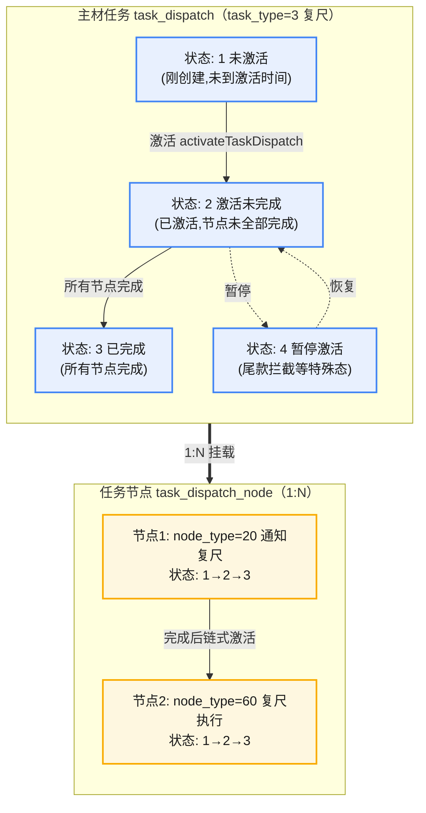
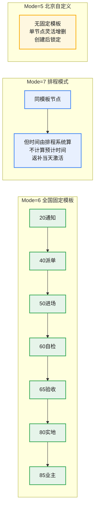

# 《edar-starlord 新人快速上手指南》

> 本文档面向**完全不了解项目**的 Java 后端新人，目标是让新人在较短时间内能**看懂、看会、动手开发**。
> 内容来自 vault 知识库（`10.项目整理/`、`11.数据库表/`、`12.项目分析/`、`00.需求/`、`20.知识沉淀/`、`80.日报周报/`）的重新组织，按"新人认知顺序"而非知识库原始顺序编排。
>
> 可信度标记约定：
> - 【已确认】知识库中有明确证据
> - 【代码推断】根据代码逻辑推断
> - 【合理推测】根据上下文推测，无直接证据
> - 【待确认】知识库无法确定

---

## 0. 阅读指南

如果你完全不了解这个项目，建议按以下顺序阅读：

```
1. 项目是什么        → 5 分钟知道项目干什么
2. 业务是什么        → 理解业务背景、角色、核心概念
3. 系统有哪些        → 知道系统全貌
4. 一条业务怎么跑    → 流程图 + 时序图
5. 数据在哪里        → DB / Redis / MQ
6. 系统怎么调用      → HTTP / Feign / Kafka
7. 核心代码在哪里    → 从哪开始看代码
8. 配置有哪些        → 哪些配置影响业务
9. 定时任务有哪些    → 系统什么时候自动做事
10. 状态与业务规则   → 系统为什么这样处理
11. 常见问题         → 出问题怎么查
12. 如何开始开发     → 真正动手改代码
13. 学习路线         → 第一天 / 第一周怎么走
```

---

## 1. 项目概览

### 1.1 这个项目是什么

**edar-starlord** 是贝壳家装事业线的**家装交付中台**，核心定位是：**主材任务全生命周期管理的调度引擎和配置中心**。【已确认】

通俗讲：客户签了装修合同后，家里要用到的各种主材（橱柜、木门、地板、瓷砖、窗帘、空调、净水器等）从"量房 → 测量 → 复尺 → 下单 → 排产 → 备货 → 送货 → 安装 → 验收"这整条长链条，全由 starlord 来**编排、调度、记录、驱动流转**。【已确认】

> **主材**：装修过程中用量大、金额高、对整体效果和品质起决定性作用的材料（区别于辅材，辅材不通过本系统履约）。【已确认】

### 1.2 解决什么业务问题

家装主材交付是个**长链条、多角色、多品类、强依赖工地进度**的业务：
- 一套房子的主材分十几个品类，每个品类都有自己的供应商和交付节奏；
- 每个品类都要经历"测量 → 下单 → 送货 → 安装 → 验收"等工序；
- 工序之间有先后依赖，还要和工地施工进度（水电、瓦木）对齐；
- 涉及设计师、管家、项目经理、工长、安装工、跟单员、供应商、业主等多方协作。

如果没有一个统一的中台，就会出现"任务谁在推、推到哪了、卡在哪了、谁该下一步"全靠人工追问、靠 Excel 记录的低效局面。starlord 把这条链路**标准化为可追踪的任务流**，让每个节点"通电"——到点自动激活、自动通知对应角色、自动记录状态。【已确认】

### 1.3 系统在大系统中的位置

家装整体流程：【已确认】

```
签单 → 设计 → 报价/选材 → 合同签订 → 开工准备 → 施工阶段 → 竣工验收 → 结算 → 售后
                                          ↑
                                   starlord 介入点
                              （从开工准备到售后的交付阶段）
```

- **上游**：客户域（CRM/客户主页 customer-home）、供应链（SCM 被窝、SDM 供应链配送）、设计/施工系统、施工包（cube）、资金服务（HOME 资金 utopia-nrs-sales-project）、外部消息系统（OMS 订单管理、SDM 配送）等
- **下游/被调用方**：OMS、SDM 通过回调把订单状态同步回 starlord；starlord 也作为主材任务数据源，向施工包（cube）、ES 搜索服务、C 端业主、跟单工作台等提供任务状态和进展数据
- **服务对象**：设计师、管家、项目经理、工长、安装工、跟单员、供应商、业主（C 端）

### 1.4 项目全景图

```
                 ┌──────────────────────────────────────┐
                 │  上游系统                              │
                 │  CRM(customer-home) / SCM(被窝) /     │
                 │  SDM(配送) / 施工包(cube) /            │
                 │  HOME资金 / 设计/施工系统              │
                 └─────────────────┬────────────────────┘
                                   │ HTTP/Feign/Kafka 回调
                                   ↓
                 ┌──────────────────────────────────────┐
                 │        edar-starlord（当前系统）       │
                 │   主材任务全生命周期管理中台            │
                 │  ┌──────────┐ ┌──────────┐ ┌────────┐│
                 │  │任务调度   │ │模板/配置  │ │延期/验收││
                 │  │引擎(核心) │ │中心      │ │管理    ││
                 │  └──────────┘ └──────────┘ └────────┘│
                 └──┬────────────┬────────────┬──────────┘
                    │            │            │
              ┌─────┘     ┌──────┘     ┌──────┘
              ↓           ↓            ↓
           MySQL        Redis        Kafka/MQ
        (task_dispatch  (缓存/       (事件驱动:
         等核心表)       分布式锁)    SCM/OMS/Athena
                                    等事件)
                    │            │            │
                    ↓            ↓            ↓
                 ┌──────────────────────────────────────┐
                 │  下游/外部系统                         │
                 │  OMS(消息回调) / SDM(状态回调) /       │
                 │  ES搜索服务 / 谛听(ke-diting群消息) /  │
                 │  微信消息 / 司南(语音转文字) /        │
                 │  C端业主APP / 跟单工作台              │
                 └──────────────────────────────────────┘
                                   │
                                   ↓
                       用户/业务人员（多角色）
```

### 1.5 系统的核心能力（一句话各一条）

starlord 自身做的事，按业务域可归纳为以下核心能力（详见 [[10.项目整理/业务知识沉淀/edar-starlord系统新人学习文档]]）：【已确认】

1. **主材任务调度引擎**（最核心）：管理主材任务从创建到完成的完整生命周期——进度追踪、状态变更、派发改派、改约、批量处理、任务创建、设计复核、下单、通知安装、ES 检索、考核时间计算、前置条件检查。
2. **主材任务模板与配置管理**：定义不同品类主材的标准化流程（节点顺序/DAG、考核时间、激活条件、尾款拦截、模板发布生效）。
3. **主材送货批次管理**：分批送货的时间安排和状态跟踪。
4. **主材进度可视化**：主材日历、主材日报。
5. **安装工任务管理**：面向安装工/工长的执行界面。
6. **管家端任务管理**：预约工人、测量预约、设计复核、物料自检。
7. **业主端主材进展**：C 端业主查看主材进度。
8. **验收与自检管理**：验收模板、安装自检、合并自检、施工包验收。
9. **延期管理**：延期单 CRUD、审批、补录、企微通知。
10. **用工管理（Home 2.5 人力调度）**：安装环节用工调度配置。
11. **测量申请单管理**：设计师测量申请流程。
12. **品类流程与履约配置**（供应链侧 + 排程侧两套）：材料履约流程配置。
13. **系统巡检与数据补偿**：全量/增量刷新、节点修复、事件重试、ES 同步补偿。
14. **外部消息同步**：接收 SDM/OMS/供应商推送的消息。
15. **运营配置与元数据**：城市安装规则、节假日、备货周期。

> **新人先记住这一句**：starlord = 主材任务的"调度引擎 + 配置中心"，所有主材任务的创建、激活、节点流转、完成都在这里驱动，配置驱动业务差异（不同品类/城市/供应商走不同流程）。

---

## 2. 核心业务概念

> 不要被业务名词吓到，这里用新人能懂的语言重新解释。每个概念说明：**是什么 / 为什么存在 / 谁产生 / 谁使用 / 生命周期 / 与其他概念的关系**。

### 2.1 概念速查表

| 概念 | 一句话理解 | 关键载体 |
|------|-----------|---------|
| 主材 | 装修中用量大、金额高、起决定性作用的材料 | `task_dispatch.material_code` |
| 主材任务（TaskDispatch） | 一个项目×一个主材×一个任务类型 = 一条主材任务 | `task_dispatch` 表 |
| 任务节点（TaskDispatchNode） | 主材任务下的具体工序（通知/派单/自检/验收等） | `task_dispatch_node` 表 |
| 项目/订单 | 客户的一单家装，全局主键 `project_order_id` | `project_info` 表 |
| 施工包 | "调度一个工人完成一项施工任务"的最小调度单元 | `package_construction`（cube，即施工包系统） |
| 流程模板 | 定义某品类主材的标准化节点流程（DAG） | `n_material_template` 等 n_ 系列表 |
| 品类流程规则 | 分公司+套餐+品类 → 命中哪套流程模板 | `delivery_flow_rule` 三表 |
| 复尺 | 量房后对实际尺寸的复核（影响下单） | task_type=3 |
| 通知复尺 | "通知工人去复尺"这个动作节点 | node_type=20 |
| 尾款拦截 | 尾款没付够，安装任务不激活 | Apollo + `PaymentInterceptConfig` |
| 延期单 | 任务超期时申请延期的审批单 | `material_delay_process` |
| 跟单任务（返补） | 送货/安装出问题后的补单跟进 | `coordinator_task_order` |
| 开城 | 某城市是否切换到新系统 | Apollo 配置 |
| 材料进排程 | 某订单的材料是否走排程模式 | Mode=7 开关 |

### 2.2 重点概念详解

#### 主材任务（TaskDispatch）
- **是什么**：一条主材任务记录，代表"某个项目的某个主材，要做的某一件大事"（测量/复尺/下单/送货/安装…）。
- **为什么存在**：把家装交付拆成可追踪、可调度、可考核的最小管理单元。
- **谁产生**：上游系统（SCM 测量申请单事件、VSS 供应链订单事件、SDM 施工任务创建）触发 starlord 创建。
- **谁使用**：所有角色工作台（管家/安装工/跟单/C 端）都围绕它展示和操作。
- **生命周期**：未激活(1) → 激活未完成(2) → 激活已完成(3)；特殊态：暂停激活(4)、已取消。
- **关系**：一条 `task_dispatch` 下挂多个 `task_dispatch_node`（1:N）。

> **容易混淆**：一条家装订单里，净水器、空调、窗帘会**各生成一条独立的 `task_dispatch`**；而一条 `task_dispatch`（如橱柜主任务）又会生成多条 `task_dispatch_node`（复尺、下单、备货、送货、安装等工序）。**"任务"是大的，"节点"是任务里的工序步骤**。【已确认】

#### 任务节点（TaskDispatchNode）
- **是什么**：主材任务内部的具体工序环节。
- **节点类型**（NodeTypeEnum，有意做成 20/40/60 间隔编号，方便插入新节点）：【已确认】
  - `1` 开始 → `20` 通知可启动(约工) → `40` 启动派单(派单) → `50` 进场 → `60` 启动(提交自检) → `65` 自检验收 → `80` 实地验收 → `85` 业主确认
- **节点状态**（3 态）：未激活(1) / 激活未完成(2) / 激活已完成(3)。
- **两个 processStatus 重名陷阱**：`TaskDispatch.processStatus`（任务级，1/2/3/4）和 `TaskDispatchNode.processStatus`（节点级，1/2/3）**字段同名但分属两层、值域不同**，读代码务必看清操作的是哪个对象。【已确认】

> **类型 vs 状态**（极易错）：类型回答"这是什么"（20/40/60 是节点类型），状态回答"进行到哪了"（1/2/3 是进度）。**看到 20 以上的数字基本是"类型"，个位数才是"状态"**。完整定位一个业务点需要「节点类型 + 节点状态」组合，如"40 派单节点 + 状态 2"="派单环节进行中"。【已确认】

#### 施工包（PackageConstruction）
- **是什么**：家装业务中"调度一个工人完成一项施工任务"的最小业务单元，连接"调度决策"与"工人执行"。
- **为什么存在**：把材料安装任务拆成可执行的施工调度单元，协调"什么人 + 在什么工地 + 用什么工具 + 对什么材料 + 按工序 + 施加工艺"。
- **两类施工包**：【已确认】
  - **供应商施工包**：供应商在 VSS 端提交质检，验收标准按"品类+关联工艺"匹配。
  - **自营施工包**：项目经理约工派给内部工人，验收标准按"人工分类+关联工艺"匹配。
- **关系**：项目订单(1) → 组合单(N) → 施工包(N)；施工包 1:N 人工分项；施工包 1:N 工单（可拆分给不同工人）。
- **归属系统**：施工包主数据在 **cube（施工包系统）**，不是 starlord。starlord 是 cube 的上游（触发施工包创建），安装任务现在放在 cube 施工包里，作为 starlord 的下游系统。【已确认】
- **状态→安装节点映射**（Mode=6/7）：RESERVING→20 通知安装 / DISPATCHING→40 派单 / WAIT_APPROACH→50 进场 / SELF_CHECK→60 自检 / PROCESSING→65 自检验收 / BUTLER_CHECK→80 实地验收 / COMPLETE→85 业主确认。【已确认】

#### 流程模板与配置体系
- **是什么**：定义"某品类主材应该走哪些节点、节点之间怎么连、每个节点的考核时间和激活条件"。
- **核心表**（`n_` 前缀为模板/配置表）：【已确认】
  - `n_material_template`：流程模板顶层（state: 0草稿/1有效/2删除/3失效/4审核中）
  - `n_material_define`：物料定义（套餐×主材×供应商×任务类型 → 模板映射）
  - `n_material_process_define`：流程定义主表（process_code + version 唯一）
  - `n_material_node_cfg`：节点定义（节点类型、激活条件、时间间隔）
  - `n_material_route`：流程路由/连线（source→target，含规则表达式）
  - `n_material_time_cfg` / `n_material_time_relation`：考核时间配置
  - `n_material_task_cfg`：节点任务属性（角色、操作项、重启规则、合并规则）
  - `n_material_push_cfg`：消息推送配置
- **配置查询三处入口**（重要，曾因入参不一致引发 Bug）：【已确认】
  - `CategoryProcessController#queryConfigOFCList`（主材申请单）
  - `CategoryProcessController#queryCategoryConfigOFCList`（货的创建）
  - `MaterialCreateV2ServiceImpl#createMaterialTask`（主材任务创建）

#### 尾款拦截（PaymentIntercept）
- **是什么**：某些节点（尤其安装）要求客户尾款支付到一定比例后才激活，否则任务被挂起到"暂停激活(4)"态。
- **规则示例**：北京 2.5 项目尾款支付比例 < 95% 时，安装任务暂不激活。【已确认】
- **实现**：`checkInterceptConfigure` → 尾款未结清不抛异常，而是 `updateTaskDispatch` 把任务置为 `SUSPEND_ACTIVE`，并联动把关联批次任务(`task_process_batch`)也置为暂停，保证主材任务与批次任务状态一致。【已确认】

#### 开城 / 材料进排程 / Mode
- **开城**：某城市是否已切换到新系统（一个城市一个城市地切，不是全国一次性上线）。【已确认】
- **材料进排程**：开城后，某订单的材料是否走排程模式（可能先部分试跑）。【已确认】
- **Mode（业务模式）**：决定走哪套任务模板/激活/考核逻辑（详见 §11 配置、§15 业务规则）。【已确认】

#### 延期单（MaterialDelayProcess）
- **是什么**：任务节点考核时间超期时，申请延期的审批单。
- **状态流转**：未确认(0) → 待审批(2) → 已确认(1)/已驳回(3)。【已确认】

#### 跟单任务 / 返补单（CoordinatorTask）
- **是什么**：送货或安装环节出问题后，需要补单（原厂返补/当场返补）跟进的跟单单据。
- **状态**：0待处理/10处理中/20待跟进/30待下单/40已下单/50已提交提货/90已关单。【已确认】

### 2.3 容易混淆的概念

| 对比 | 区别 | 何时用 A / 何时用 B |
|------|------|---------------------|
| **主材任务 vs 任务节点** | 任务是"大"，节点是任务里的"工序步骤"；1 任务 :N 节点 | 谈"这条主材任务推到哪了"看任务状态；谈"当前在哪个工序"看节点 |
| **TaskDispatch.processStatus vs TaskDispatchNode.processStatus** | 同名不同层：任务级 1/2/3/4，节点级 1/2/3 | 改状态前一定看清楚操作的是哪个对象 |
| **节点类型 vs 节点状态** | 类型是"是什么"(20/40/60)，状态是"到哪了"(1/2/3) | 定位业务点必须"类型+状态"组合 |
| **复尺 vs 通知复尺** | 复尺(task_type=3)是任务；通知复尺(node_type=20)是其中的通知节点 | "通知复尺"是"该去复尺了"的动作，复尺本身是量房后的尺寸复核 |
| **供应商施工包 vs 自营施工包** | 验收标准不同：品类+工艺 / 人工分类+工艺 | 供应商工人 vs 项目经理约的内部工人 |
| **流程模板(delivery_flow_rule) vs 任务模板(n_material_template)** | 前者是排程侧履约配置，后者是主材任务模板 | 排程模式(Mode=7)看前者；任务节点定义看后者 |
| **中控 vs 内控** | 中控=报价/定额/数据汇总（业务中台）；内控=工程量审核/成本把控（风控） | 报价走中控，工程量审核走内控，二者都不是 starlord |

#### 以"复尺任务"为例看任务与节点、状态的关系

下面以**复尺任务**（`task_type=3`）为例，直观展示"主材任务 → 任务节点"的 1:N 关系，以及任务状态、节点状态如何分层联动。【已确认】



**怎么读这张图**：【已确认】

- **上层是任务、下层是节点**：一条复尺任务（`task_type=3`）下挂 2 个节点——`20 通知复尺`（"通知工人来复尺"的动作）和 `60 复尺执行`（实际量尺复核）。
- **任务状态 1/2/3/4**（`TaskDispatch.processStatus`）：刻画整条任务推进到哪了；**节点状态 1/2/3**（`TaskDispatchNode.processStatus`）：刻画单个工序推进到哪了。**两层同名 `processStatus` 但值域不同**，是新人最常踩的坑。
- **链式激活**：20 节点完成（状态→3）后，自动激活 60 节点（状态 1→2）；当 60 节点也完成（状态→3），且没有更多节点时，整条任务状态才从 2 推进到 3。
- **节点类型 vs 节点状态**：`20`/`60` 是"是什么工序"（类型），`1/2/3` 是"进行到哪了"（状态）。定位一个业务点必须组合看，如"`20 通知复尺节点 + 状态 2`" = 通知复尺环节进行中。
- **不合格回退**：60 节点若复尺不合格（`qualified=2`），会重启 20+60 节点（重新建一组 20+60），任务整体仍停留在状态 2。

---

## 3. 业务角色

starlord 是多方协同平台，连接以下角色。每个角色说明"谁/做什么/何时参与/可操作什么/对系统的影响"。

| 角色                   | 做什么                   | 何时参与      | 可操作                   | 对系统的影响        |
| -------------------- | --------------------- | --------- | --------------------- | ------------- |
| **设计师**              | 提交测量申请单、设计复核          | 签单后、量房阶段  | 测量申请单操作/详情、设计复核提交     | 触发主材任务创建（测量类） |
| **管家（材料员）**          | 跟进主材任务、预约工人、测量预约、物料自检 | 全程        | 预约工人管理、测量预约、设计复核、物料自检 | 驱动节点流转、改约     |
| **项目经理**             | 约工派单、审批延期、施工包管理       | 施工阶段      | 约工、派单确认、延期审批、验收       | 触发安装任务、审批延期单  |
| **工长（foreman）**      | 接派单、带工人施工             | 安装阶段      | 查看名下任务、确认派单           | 推进安装节点        |
| **安装工**              | 进场、提交自检、完成安装          | 安装阶段      | 安装任务列表、一键完成/合格、自检提交   | 推进安装→验收节点     |
| **跟单员（Coordinator）** | 返补单跟进、下单              | 送货/安装出问题时 | 返补单分配、跟进、状态修改         | 创建/推进返补跟单单    |
| **供应商**              | 接单、备货、发货、提交验收         | 接单后~验收    | 供应商验收审核               | 推进送货→安装节点     |
| **业主（C 端）**          | 查看自己家装的主材进度、确认验收      | 全程（被动查看）  | 查看主材进展、业主确认(85)       | 业主确认=任务最终完成   |
| **排产员**              | 排产任务管理                | 下单后       | 排产任务列表、完成排产           | 推进排产节点        |

### 外部"系统角色"

除了人，还有一类"系统角色"会驱动 starlord：

| 外部系统 | 角色 | 何时与 starlord 交互 | 方向 |
|---------|------|---------------------|------|
| SCM（被窝供应链） | 上游 | 测量申请单事件、订单变更 | SCM → starlord（Kafka 事件） |
| SDM（供应链配送） | 上游/被回调方 | 采购单/服务单状态变更 | SDM → starlord（回调 `/starlord/sdm/status/sync`） |
| OMS（订单管理） | 被回调方 | 订单状态、图片、延期原因、验收结果 | OMS → starlord（回调 `OmsMessageSyncFeign`） |
| 施工包 cube | 下游 | 施工包创建、状态同步 | starlord → cube（Feign/Kafka） |
| VSS（供应链系统） | 下游 | 推单、状态变更 | starlord → VSS |
| 作业中心（Athena/BPM） | 上游事件源 | 工单创建/变更事件 | Athena/BPM → starlord（Kafka） |
| CRM（customer-home） | 上游 | 客户信息、强弱耦合城市、维护人、DFcode→整装订单号 | starlord → CRM（Feign） |
| HOME 资金 | 上游 | 项目款项、存管信息、通用节点状态 | starlord → HOME 资金（Feign） |
| 权限服务 | 上游 | 用户角色权限 | starlord → permission-service |
| 谛听/微信/司南 | 下游通知 | 群消息/个人消息/语音转文字 | starlord → 通知服务 |

### 角色之间的关系

- **设计师**触发测量类任务 → **管家/项目经理**跟进并约工 → **工长/安装工**执行安装 → **供应商**发货并参与验收 → **业主**最终确认。
- 任何环节超期 → **项目经理**审批延期单。
- 送货/安装出问题 → **跟单员**处理返补单。
- **外部系统**通过 Kafka 事件或 HTTP 回调驱动 starlord 内部状态变化，starlord 再通知对应人类角色。

---

## 4. 核心业务流程

> 这是整份文档最重要的部分之一。每个核心流程按"业务背景→触发条件→入口→步骤链→最终结果"描述，并回答：谁触发/何时触发/调哪个接口/写什么数据/调哪个系统/什么情况继续/什么情况终止/兜底。

### 4.1 主材业务全流程（全景）

家装主材从报价到验收的全链路：【已确认】

```
主材任务
  ↓
报价 → 选品 → 确品 → 下单
  ↓                    ↑(复尺→变更回流)
供应链：接单→备货(部分排产)→发货(单发/齐发)
  ↓                    (按工地进度安排预约日发货)
  ↓ → 工地现场
安装（以施工包为单位：人+料）
  ↓
施工包（工长/自营工人/供应商工人）
  ↓
验收（专人负责，可能一人盯多场）
  ↓
完成
```

**货前/货后划分**：【已确认】
- **货前任务**（送货前）：测量 → 复尺 → (报价变更) → 设计 → 下单
- **货后任务**（送货后）：接单 → 备货 → 发货 → 送达 → 签收 → 安装 → 验收

### 4.2 主材任务创建（SCM 事件驱动）

- **业务背景**：客户签单开工后，需要为每个主材生成可追踪的任务。
- **触发条件**：SCM 商家端发 `measure-apply-order` 事件 / VSS 供应链发 `order_info_push_task` 事件。
- **入口**：`ScmMeasureApplyEventHandler#handleBiz()` → `ScmMeasureApplyServiceImpl.createTask()`（Kafka 事件驱动，异步，无 `@Transactional`）。
- **步骤链**：【已确认】
  1. 前置校验：payload 为空、addRangeList 和 cancelRangeList 都空 → return。
  2. `projectOrderManager.getProjectOrder`（Feign 查订单）。
  3. 模式判定：`isMaterialSchedule`（是否排程）/ `isDownServiceOrder`（是否下服务单：非北京→true；北京+Apollo 开关→true）。
  4. 未开排程 → `createTaskOld`（旧逻辑）；未开下服务单 → return。
  5. 分布式锁（`projectOrderId` 粒度，5s 超时，Redis）。
  6. **CREATE 分支**：查项目排期 → 逐物料检测已有 ENTER/INSTALL 任务（避免重复）→ `supportMode` 优先级判定（HOME2.5 → V2.5 → HOME2.5_MANPOWER → DELIVERY_FLOW）→ `materialCreateV2Service.createMaterialTask`（创建主材任务）→ 新复尺打标 → 双写 OMS 服务单。
  7. **CANCEL 分支**：`taskDispatchCancelService.batchCancelTaskDispatch`。
  8. `createOrderTask`：下单任务（未开城 return；八合一下单 + 异步双写 OMS）。
- **写入数据**：`task_dispatch` + `task_dispatch_node` + `task_dispatch_extend`（新复尺打标）。
- **调用系统**：CRM（Feign 查订单）、工作台 施工包 cube（Feign）、OMS（双写）、Redis（分布式锁）。
- **最终结果**：生成主材任务记录，等待激活。

> **批量创建的底层链路**（`TaskDispatchBatchCreateServiceImpl.invoke`）：【已确认】
> `prepareData`(查模板 material_task + 过滤已存在实例 + 查节点) → `buildWithConfig`(模板映射为 TaskDispatch/TaskDispatchNode，`nodeTask="20,40,60,80"` 拼接，`currentNodeType`=第一个节点) → `buildTaskDispatch`(按 `activateMode` 计算 `planActivateTime`) → `batchInsert`(task_dispatch 回填 ID) → `buildTaskDispatchNode`(分配执行人 + 计算考核时间) → `batchInsert`(task_dispatch_node) → `activateTaskDispatchAsync`(afterCommit 异步激活) → 发 Kafka(`material-task-dispatch-state-change` v1+v2)。

### 4.3 任务激活（定时扫描 + 事件触发）

- **业务背景**：任务创建后不一定立即执行，要等到"该做了"才激活（到点、前置完成、尾款付够）。
- **触发条件**：① 定时任务扫描当天 `planActivateTime` 的任务；② 前置节点完成链式激活；③ 创建后立即激活（IMMEDIATELY 模式）。
- **入口**：`MaterialActivateV2ServiceImpl.activateTaskDispatch()`（V2，`@Transactional`）/ `DispatchActivateServiceImpl`（定时扫描入口）。
- **激活模式**（ActivateModeEnum）：【已确认】
  - `0` PLAN_TIME 按计划时间 / `1` IMMEDIATELY 立即 / `2` DEPENDENT_NODE 前置节点完成（默认）/ `3` CUSTOMER_CONTRACT_PAY_RATIO 付款比例 / `4` DEPOSIT_FUND_RATIO 资金解冻比例 / `5` TASK_NODE 货单节点。
- **步骤链**（V2）：【已确认】
  1. 守卫：`processCode` 为空 → return（交给 V1）。
  2. 守卫：Mode=7 排程返补（`flowType=REVERSE_ORDER`）→ `doActivateTaskDispatch` 直接激活。
  3. 查流程定义 `n_material_node_cfg`（先查有效/失效，再查删除，取 version 最大）。
  4. **Mode=7 分支**：查最新模板条件 → 逐条检查订单状态 ≥ 配置工序 && 未取消 → 任一不满足 → `updateTaskSuspendActive`（置 SUSPEND_ACTIVE=4），return。
  5. **Mode≠7 分支**：`shouldActivate`（PLAN_TIME 查订单状态；HOME2.5 走双路径；DEPENDENT_NODE 查前置任务是否全完成）→ 不满足 → SUSPEND_ACTIVE → `checkInterceptConfigure`（尾款拦截）→ 被拦截 → SUSPEND_ACTIVE。
  6. `doActivateTaskDispatch`：乐观锁（processStatus 必须 UN_ACTIVE 或 SUSPEND_ACTIVE）→ 更新 task_dispatch 为 UNCOMPLETED(2) → 激活第一个 UN_ACTIVE 节点 → `completeAssignerTaskWhenActivate` → 发 Kafka → OMS 同步（HOME2.5→sendVssNew；其他→sendOmsMsg）→ IM 推送 → 计算考核时间 → 激活工作台货单 → 批次检查。
- **终止/兜底**：尾款未付 → SUSPEND_ACTIVE（不抛异常，挂起等尾款）；条件不满足 → SUSPEND_ACTIVE。
- **最终结果**：任务从 NOT_ACTIVE(1) → UNFINISHED(2)，第一个节点"通电"。

> **两次激活竞争**（真实案例，供应商汰换场景）：创建后异步激活一次，回调后 `activateIfNeeded` 同步激活一次，都调 `doActivateTaskDispatch`。靠**乐观锁 CAS**（`WHERE id=? AND process_status=?`，affected=1 才成功）保护，失败即"已被其他路径处理"跳过。边界风险：任务更新成功但节点查询失败会导致状态不一致。【已确认】

### 4.4 节点完成处理（handleNode）—— 核心

- **业务背景**：执行人（工长/安装工/管家）在 APP/Web 点"完成"，或外部系统回调，驱动节点流转。
- **触发条件**：用户点击完成 / 外部系统回调。
- **入口**：`MaterialHandleV2ServiceImpl.handleNode(DispatchHandleParam, OperatorDTO)`（`@Transactional(rollbackFor=Exception.class)`）。
- **步骤链**：【已确认】
  1. **前置检查**：参数校验 → 查节点 → 查任务；零售无任务路径走 `handleWithoutTask`。
  2. **节点状态判断**：COMPLETED → return true（幂等）；UN_ACTIVE → 三步曲（`completePreTask` 递归完成前置 → `doActivateTaskDispatch` 激活当前 → `completePreTaskNode` 完成当前任务中更早的未完成节点）。
  3. **completeTaskDispatchNode**：更新 processStatus→COMPLETED(3)、readinessStatus→READY(1)、submitTime、图片、附件 JSON、noticeRetainTime；量尺/复尺任务 `saveMeasureInfo`。
  4. **后置**：发 IM push；有 noticeRetainTime → 发时间变更 MQ；有 processCode → 计算延期天数；变更单(>CHANGE) → 任务直接 COMPLETED。
  5. **决定下一节点**：不合格(UNQUALIFIED) → `restartProcess`（回退到流程第一个节点，restart+1）；合格 → `getNextNodeType` + `activateNextNode`。
  6. **更新 task_dispatch**：currentNodeType=nextNode；无下一节点 → COMPLETED；通知供应链（HOME2.5→sendVssFinish+sendVssNew；其他→sendOmsMsg）。
  7. **MQ + C 端 + 链式激活**：发 TaskNodeChange + TaskDispatchChange MQ；无下一节点 → 发 C 端完成通知；任务 COMPLETED → `activateNextTaskDispatch`（链式激活下游任务）；`afterHandle`（事务后异步：Redis 缓存红点、更新考核时间、复尺完成推送 VSS）。
- **分支**：合格走下一节点 / 不合格回退重启 / 变更单直接完成。
- **最终结果**：节点流转，或驳回重启。

### 4.5 安装流程

- **触发条件**：送货任务(ENTER)完成 → 激活安装任务；VSS 推单 `needInstall=1` → 创建 INSTALL 任务。
- **节点链**：【已确认】
  ```
  20(通知安装) → 40(派单) → 50(进场) → 60(提交自检) → 65(自检验收) → 80(实地验收) → 85(业主确认)
  ```
- **三种完成驱动**：验收报告驱动(`completeInstallTask`) / 施工包状态驱动(`completePackageTask`) / 直接操作(`handleNode`)。
- **特殊规则**：安装任务不推送 VSS 新节点/完成消息；80 节点完成时通知 OMS。【已确认】
- **尾款拦截**：北京 2.5 项目尾款支付比例 < 95% → 安装任务暂不激活（SUSPEND_ACTIVE）。【已确认】
- **最终结果**：业主确认(85)完成，发 C 端消息。

### 4.6 复尺流程

- **触发条件**：测量申请单提交 / 项目变更完成 / 手动"再次复尺" / 复尺服务单状态变更。
- **入口**：`ScmMeasureApplyEventHandler` / `AtomProjectChangeEventHandler.invokeRecheckAgain()` / `MaterialMeasureTaskController.invokeRecheckAgain()`。
- **节点链**：【已确认】
  ```
  20(通知复尺) → 60(复尺执行)
  ```
- **步骤链**：模式判定 → 模板配置查询 → 创建复尺任务 → 20 节点填期望上门时间 → 60 节点获取模板+提交复尺数据 → 合格→激活下游(下单/报价变更) / 不合格→重启 20+60 节点。
- **新复尺(FUCHI_VERSION_2)**：额外需用量确认 + SKU 保存 + 直接调 `invokeOrder()` 下单。判定条件：分公司在白名单 + 正签时间在阈值后 + 品类不在黑名单。【已确认】
- **自动下单品类**：北京 2.5 走 SCM 下单策略配置（`orderOpportunity=REWORK_COMPLETED`）；其他走 Apollo `select.need.special.process.categoryId`。复尺提交时推送规格到 Aquaman/Atom。【已确认】
- **复尺去重**：同品类+供应商已存在复尺任务 → 阻止重复创建；供应商 9999999 定额复尺跳过。【已确认】
- **最终结果**：复尺完成，推动下单或报价变更。

### 4.7 延期处理流程

- **业务背景**：任务节点考核时间超期，需申请延期并审批。
- **触发条件**：节点考核时间超期。
- **入口**：`POST /material-delay-process/create-material-delay-process` → `MaterialDelayProcessServiceImpl.createMaterialDelayProcess`（`@Transactional`）。
- **步骤链**：【已确认】
  1. 参数校验（普通延期单 relation=0：查可延期 SKU；已完成首次安装进场→抛异常）。
  2. 校验订单。
  3. 按角色拆分（`MaterialDelayReasonEnum.delayRole`：FOREMAN(1)/PROPRIETOR(2)/OTHER(3)，业主排第一）。
  4. 按角色循环：汇总延期天数 → 确认状态（业主→NEED_APPROVE(2)；其他→CONFIRMED(1)；工长→NO_CONFIRM(0)）→ 业主角色计算新承诺进场时间（`constructionManager` 工期日历）→ INSERT `material_delay_process` + `_reason` + `_log` → 推送（工长确认/工程经理审批）。
  5. 补录（relation=1）且无业主+无工长 → 自动完成补录任务。
- **状态流转**：NO_CONFIRM(0) → NEED_APPROVE(2) → CONFIRMED(1)/APPROVE_REJECT(3)。【已确认】
- **最终结果**：延期生效，重新计算考核时间。

### 4.8 验收流程

- **触发条件**：安装 60 节点提交自检后。
- **入口**：订单详情红包模块 / 独立验收模块（双入口）。
- **步骤链**：获取验收模板 → 提交自检报告 → 自检验收(65) → 实地验收(80，项目经理) → 业主确认(85)。【已确认】
- **验收标准匹配**：供应商施工包按"品类+关联工艺"；自营施工包按"人工分类+关联工艺"。【已确认】
- **批量操作**：`completeAll`（需图片备注）/ `passAll`（直接通过）。【已确认】

### 4.9 通知复尺自动化流程（新需求，进行中）

- **业务背景**：项目经理/工长名下多个"通知复尺"任务处理繁琐。通过工地摄像头+工人拍照判断现场交界面是否满足复尺通知标准，满足则自动填充表单。
- **整体链路**：【已确认】
  ```
  摄像头采集/工人拍照
    → 上游分析(调度层)判断是否满足可通知标准
    → 判断结果通知主材任务(POST /api/recognize/task/result)
    → 落新表 material_notify_task_automation(只新增不更新)
    → 小师傅/首页批量查询判断结果 → 一键通知批量执行
    → push 消息(09:10/13:00/19:00 悬浮框推送)
  ```
- **判定枚举**：1 可通知→notifyTasks；2 不可通知/3 无法判断/无记录→delayTasks（延期预警）；4 现场已完成→另接口。【已确认】
- **任务匹配**（上游不传 task_dispatch_id）：按 项目+品类+任务类型 两跳定位 node：① task_dispatch(project_order_id + material_code + task_type=3 + process_status=2) → task_dispatch_id；② task_dispatch_node(task_dispatch_id + node_type=20 + process_status=2 + state=1) → node_id。【已确认】
- **并发保护**：node 表 `process_status` 条件更新(2→3) CAS；automation 表 `notify_execute_type` CAS(0→1) 防重复。【已确认】
- **遗留**：09:10 轮巡 push 未开发；batch/submit 一键通知未开发。【已确认】

### 4.10 供应商汰换流程

- **业务背景**：货后流转中上游发起供应商汰换（A→B），需根据汰换方式+新老商角色+老商任务状态决定取消/生成/保留任务。
- **三种汰换方式**：1 常规 / 2 紧急+立即 / 3 紧急+不立即。【已确认】
- **整体链路**：【已确认】
  ```
  上游发供应商汰换消息(skuId+merchantId+old/newSupplierId+replaceType)
    → Starlord 接收并保存到中间表 supplier_replace_message
    → T+1 定时任务聚合(同 SKU×店铺一天内 A→B→C→D 聚合为 A→D)
    → 结合 Hive 查询的订单/货单/任务数据,按汰换方式判断最终新商还是老商履约
    → 同一订单下汰换结果汇总发送给需求层
    → 需求层统一修改施工需求并发布需求变更事件
    → Starlord 收到回调后:老任务取消/新任务创建/状态复制/任务激活 + 同步主材/考核/排程/OMS
    → 紧急+立即:额外通知 OMS 取消老商货单并重新下单给新商
  ```
- **履约判断**：常规→老商任务已完成且同步 SDM 则老商履约，否则新商；紧急+立即→无货单或未发货(≤2600)则新商，已发货老商；紧急+不立即→无货单新商，有货单老商。【已确认】
- **角色场景**：a（新老商均非供应商）认可老商任务结果；b（含供应商）不认可，老商在途任务取消。【已确认】
- **Hive 查询**：`HiveApiNewUtil.searchHiveApi`，分页 1000 条/批，HTTP POST → `i.data.api.lianjia.com`，MD5 双重签名 + guava-retrying 重试（最多 3 次）。【已确认】
- **涉及表**：`supplier_replace_message`（中间表）。【已确认】

### 4.11 核心流程时序图（主材任务创建→激活→完成）

```
上游(SCM/VSS)    starlord               MySQL              Kafka           下游(OMS/施工包cube/VSS)
     │              │                      │                  │                  │
     │─Kafka事件───>│                      │                  │                  │
     │              │─查订单(Feign CRM)────>│                  │                  │
     │              │<─订单详情────────────│                  │                  │
     │              │─分布式锁(Redis)──────>│                  │                  │
     │              │─INSERT task_dispatch─>│                  │                  │
     │              │  +task_dispatch_node─>│                  │                  │
     │              │─afterCommit异步激活──>│                  │                  │
     │              │  乐观锁CAS激活────────>│                  │                  │
     │              │  尾款拦截检查────────>│                  │                  │
     │              │  (尾款未付→SUSPEND)──>│                  │                  │
     │              │─发状态变更消息─────────────────────────────>│                  │
     │              │─OMS双写/通知──────────────────────────────────────────────────>│
     │              │                      │                  │                  │
   执行人点完成       │                      │                  │                  │
     │─POST handle─>│                      │                  │                  │
     │              │─更新node=COMPLETED──>│                  │                  │
     │              │─激活下一节点──────────>│                  │                  │
     │              │─发节点变更MQ──────────────────────────────>│                  │
     │              │─任务完成→C端通知──────────────────────────────────────────────>│
     │              │─链式激活下游任务──────>│                  │                  │
```

---

## 5. 系统架构

### 5.1 分层架构

```
┌─────────────────────────────────────────────────────┐
│                  Entry Points（入口层）              │
│  REST Controllers (80个,430+端点) + Feign (46个对外) │
│  + Kafka Listeners (23个事件驱动入口) + 定时任务      │
├─────────────────────────────────────────────────────┤
│              Service Layer（业务逻辑层）             │
│     service/ (V1)  +  servicev2/ (V2)              │
│  ┌──────────┐ ┌──────────┐ ┌──────────────┐        │
│  │ Material │ │  Task    │ │ DeliveryFlow │        │
│  │  Tasks   │ │ Dispatch │ │   Config     │        │
│  └──────────┘ └──────────┘ └──────────────┘        │
│  ┌──────────┐ ┌──────────┐ ┌──────────────┐        │
│  │  Delay   │ │Coordinator│ │  Acceptance  │        │
│  │ Process  │ │   Task   │ │   Report     │        │
│  └──────────┘ └──────────┘ └──────────────┘        │
├─────────────────────────────────────────────────────┤
│            Manager Layer（外部集成层）               │
│  SCM / Athena / Construction / Zeus / Ceres ...    │
├─────────────────────────────────────────────────────┤
│               DAO Layer（数据访问层）                │
│     MyBatis Mapper + DAO + Model                   │
└─────────────────────────────────────────────────────┘
```
【已确认】

### 5.2 V1 vs V2

项目存在两套 Service 层（重要，读代码先看是 V1 还是 V2）：【已确认】

| 版本 | 包路径 | 特点 |
|------|--------|------|
| V1 | `com.ke.utopia.service.impl.*` | 原始版本，面向管家/安装工/客户的角色视图；配置表 `material_task`/`material_task_node`/`material_task_route_instance` |
| V2 | `com.ke.utopia.servicev2.impl.*` | 重构版本，面向交付流(DeliveryFlow)配置驱动 + 品类规则引擎；配置表 `n_material_node_cfg`/`n_material_route`/`n_material_node_transfer_condition` |

**分流规则**（代码推断）：有 `processCode` 的任务走 V2 流程定义，无 `processCode` 的走 V1 模板。`DispatchCreateServiceImpl.activateTaskDispatch` 作为统一入口，内部按 `processCode` 是否为空分流。V2 逐步替代 V1，但 V1 中面向角色的服务（`MaterialButlerService`、`MaterialCustomerService`）仍在使用。

### 5.3 入口点类型

| 入口类型 | 数量 | 说明 |
|---------|------|------|
| REST Controllers | 80 个 / 430+ 端点 | 直接面向前端/外部系统的 HTTP API |
| Feign 接口（对外暴露） | 46 个 | 微服务间 RPC，定义在 `edar-starlord-api` 模块，实现在 `edar-starlord-web` 的 Controller |
| Kafka Listeners | 23 个 | 事件驱动异步入口，监听 SCM/Athena/BPM/CRM 等事件 |
| 定时任务 | 多个 | `DispatchActivateService`（激活）、`CoordinatorTaskService`（返补刷新）、`DelayTaskSchedule`（延期检查）、`MaterialVssSchedule`（C 端刷新）、`SelfBuyTaskSchedule`（自购）等 |

【已确认】

### 5.4 关键 Kafka Listener → Service 映射

【已确认】
- `ScmOrderEventListener` → `DeliveryMaterialBizService`（子订单变更 → 创建/取消主材任务）
- `ScmMeasureApplyEventHandler` → 测量申请单事件 → 创建/取消主材任务和下单任务
- `WorkCenterTaskChangedEventHandler` → `MaterialDelayProcessService`（工单变更 → 撤销延期）
- `WorkOrderCreateEventHandler` → `CoordinatorTaskService`（工单创建 → 返补检查）
- `DeliveryProcessChangeListener` → `CategoryProcessService`（交付流程变更）
- `ProjectVssListener` → `MaterialVssSchedule`（项目 VSS 变更 → C 端数据刷新）
- `AcceptanceReportChangeListener` → `AcceptanceReportService`（验收报告变更）
- `CubePackageCreateEventListener` → `MaterialHandleV2Service`（套餐包创建 → 物料处理）

### 5.5 系统全景关系图

```
┌─────────────────────────────────────────────────────────────┐
│                         上游系统                              │
│  CRM(customer-home)  SCM(被窝供应链)  SDM(供应链配送)         │
│  施工包(cube)/作业中心(Athena/BPM)  HOME资金  设计/施工系统    │
└───────────┬───────────────────────────────────┬─────────────┘
            │ Kafka事件 / Feign / HTTP回调        │
            ↓                                    ↑
┌──────────────────────────────────────────────────────────────┐
│                   edar-starlord（当前系统）                    │
│                                                               │
│  入口层: 80 Controller + 46 Feign + 23 Kafka Listener + 定时  │
│  服务层: V1(角色视图) + V2(配置驱动/DeliveryFlow)            │
│  集成层: Manager(CRM/SCM/Construction/Ceres/HOME资金...)      │
│  数据层: MyBatis Mapper + DAO + Model                         │
└──┬──────────┬──────────┬──────────┬──────────┬───────────────┘
   │          │          │          │          │
   ↓          ↓          ↓          ↓          ↓
 MySQL     Redis     Kafka/MQ     ES        外部通知
(82张表)  (缓存/锁)  (事件驱动)   (搜索)   (谛听/微信/司南)
   │          │          │
   └──────────┴──────────┴──→ 下游系统
                              OMS(回调) / SDM(回调) / C端业主 / 跟单工作台
```

### 5.6 系统职责清单（10 大核心业务能力）

详见 [[10.项目整理/业务知识沉淀/edar-starlord系统新人学习文档]]，核心：【已确认】

1. 主材任务调度引擎（最核心）
2. 主材任务模板与配置管理
3. 主材送货批次管理
4. 主材进度可视化
5. 安装工任务管理
6. 管家端任务管理
7. 业主端主材进展
8. 验收与自检管理
9. 延期管理
10. 用工管理（Home 2.5 人力调度）

> 另有：测量申请单管理、品类流程与履约配置、跟单员工作台、排产管理、业主自购材料管理、施工任务创建与激活、外部消息同步、系统巡检与数据补偿、运营配置与元数据、通话记录等业务域。

---

## 6. 系统调用关系

### 6.1 系统调用总表

| 系统 | 作用 | 与 starlord 关系 | 主要通信方式 |
|------|------|------------------|--------------|
| CRM（customer-home） | 客户信息、强弱耦合城市、维护人、DFcode→整装订单号 | starlord → CRM | Feign HTTP |
| SCM（被窝供应链） | 供应链配置查询、预分配送货单 | 双向 | Feign + Kafka 事件 |
| SDM（供应链配送） | 采购单/服务单状态变更 | SDM → starlord | HTTP 回调（`/starlord/sdm/status/sync`） |
| OMS（订单管理） | 订单状态、图片、延期原因、验收结果 | OMS → starlord | HTTP 回调（`OmsMessageSyncFeign`） |
| 施工包 cube | 施工包创建、状态同步 | starlord → cube | Feign + Kafka |
| VSS（供应链系统） | 推单、状态变更 | starlord → VSS | Feign |
| HOME 资金（utopia-nrs-sales-project） | 项目款项、存管信息、通用节点状态 | starlord → HOME 资金 | Feign（注册中心发现） |
| 权限服务（permission-service） | 用户角色权限 | starlord → 权限 | Feign |
| ES 搜索服务（search-service） | 跟单任务/任务单 ES 索引查询 | starlord → ES | Feign |
| 谛听（ke-diting） | 企微群消息推送 | starlord → 谛听 | Feign |
| 微信消息（wechat-message） | 个人微信消息 | starlord → 微信 | Feign |
| 司南（call-service） | 语音转文字 | starlord → 司南 | Feign（开关 `sinan.lianjia.enable`） |
| 隐私加密（cipher-feign） | 手机号加密 | starlord → cipher | Feign |
| 大C（big-c） | 城市小程序开城信息 | starlord → big-c | Feign |

【已确认】

### 6.2 对外暴露的 Feign API（其他系统调我们）

共 46 个 Feign 接口，定义在 `edar-starlord-api` 模块，`@FeignClient(value="edar-starlord")`，由 `edar-starlord-service` 实现。按域分组：【已确认】

| 域 | 代表 Feign 接口 | 调用方 | 核心方法 |
|----|----------------|--------|----------|
| 任务调度 | `TaskDispatchFeign`(58方法) | foreman-api/workbench/供应链 | processStatus、handle、batchHandle、taskDetail、calendarTaskList、createSingleTask |
| 任务调度V2 | `TaskDispatchV2Feign`(22) | foreman-api/施工包 | taskDetail、pageTaskDetail、nodeCfgDetail、checkCancel、searchProject(ES) |
| 送货交付 | `MaterialDeliveryFeign` | 供应链/多端 | listDeliveryTime、submit、deliveryNoticeTime |
| 品类流程 | `CategoryProcessFeign` | 排程/履约配置 | categoryProcessInfo、deliveryProcessSync、materialScheduleSwitch |
| 自检验收 | `AcceptanceReportFeign` / `AuditFeign` | foreman-api/供应商 | getAcceptanceTemplate、submitInstallerAcceptanceReport、materialAuditBatchHandle |
| 安装/用工 | `InstallerTaskFeign` / `ManpowerTaskFeign` / `ManpowerCfgFeign` | 安装工APP/PC后台/SDM | listTaskByType、completeAll、queryTaskByPage、templatePublish |
| 模板配置 | `MaterialTemplateFeign`(37) / `TaskTemplateFeign`(18) | 配置后台 | templateCreate、processDefineSave、templatePublish、queryFinalPaymentConfig |
| 测量 | `MeasureApplyFeign` / `MeasureConfigRuleFeign` | 设计师端/配置后台 | operate、autoCommitMeasureApply、checkAndSave |
| 消息同步 | `OmsMessageSyncFeign` / `SdmMessageSyncFeign` / `SupplierMessageSyncFeign` | OMS/SDM/供应商 | messageSync、syncOrderStatus、receiveStoreMsg |
| 延期 | `MaterialDelayProcessFeign` / `MaterialDelayApproveFeign` / `DelayFeign` | 多端/OA审批/企微 | createMaterialDelayProcess、approveDelayProcess、pushDelayTaskListByChatId |
| C端/管家 | `MaterialCustomerFeign` / `MaterialButlerFeign` | C端业主/管家端 | listTaskDispatch、recentAppointUncompleted |
| 跟单 | `ReplenishCoordinatorTaskFeign` | 跟单工作台 | replenishOrderAssignmentToCoordinator |

### 6.3 核心调用链

#### 物料任务主链路
```
SCM订单事件 → DeliveryMaterialBizService.createMaterialTask()
  → MaterialCreateV2Service（创建物料任务模板）
  → MaterialActivateV2Service（激活任务）
  → TaskDispatchV2Service（生成调度实例）
    → MaterialTaskBizV2Service（业务操作）
      → MaterialHandleV2Service（节点处理）
```

#### 延期处理链路
```
WorkCenter TaskChanged 事件 → MaterialDelayProcessService.createDelayUndoTasks()
管家派工事件 → MaterialDelayProcessService.handleButlerManagerAssign()
客户/管家操作 → MaterialDelayProcessController.createMaterialDelayProcess()
  → MaterialDelayApproveService（审批流）
  → MessagePushClient（推送通知）
```

#### 返补单协调链路
```
工单创建事件 → CoordinatorTaskService.handleWorkOrderNotice()
  → PlaceOrderCommander（下单）
  → 分配协调人 → 跟单进度
    → CoordinatorTaskSchedule（定时刷新SCM状态）
```

### 6.4 核心流程时序图（任务激活与节点完成）

```
执行人APP    starlord(Controller)   Service          MySQL        Kafka        下游(OMS/VSS)
   │              │                    │               │            │              │
   │─POST handle─>│                    │               │            │              │
   │              │─handleNode────────>│               │            │              │
   │              │                    │─查节点/任务────>│            │              │
   │              │                    │  (UN_ACTIVE?   │            │              │
   │              │                    │   先completePreTask)        │              │
   │              │                    │─doActivateTaskDispatch─────>│              │
   │              │                    │  CAS:WHERE id AND status──>│              │
   │              │                    │─更新node=COMPLETED─────────>│              │
   │              │                    │─通知供应链──────────────────────────────────>│
   │              │                    │  (HOME2.5→sendVssNew/Finish;│              │
   │              │                    │   其他→sendOmsMsg)          │              │
   │              │                    │─发TaskNodeChange MQ────────>│              │
   │              │                    │─任务完成?→C端通知──────────────────────────>│
   │              │                    │─链式激活下一任务─────────────>│              │
   │<─200 OK─────│<───────────────────│               │            │              │
```

---

## 7. 接口

> 748 个 REST 接口，89 个 Controller/Feign 类。这里只列**最核心**的接口，按业务模块归类。完整字典见 [[10.项目整理/REST汇总/starlord接口字典文档]]。

### 7.1 REST 接口总览

【已确认】接口总数 748，按模块分布：

| 模块 | 接口数 |
|------|--------|
| 主材任务模块 | 173 |
| Feign 内部接口 | 154 |
| 材料流程配置模块 | 115 |
| 后门&工具&测试 | 81 |
| 人力配置模块 | 62 |
| 安装任务&验收 | 49 |
| 其他接口 | 51 |
| 测量复尺模块 | 32 |
| 调度派工模块 | 31 |

### 7.2 核心接口清单

#### 主材任务 / 任务调度

| Method | Path | 用途 | 调用方 |
|--------|------|------|--------|
| POST | `/material-task/dispatch/handle` | 节点提交处理（核心流转） | 前端/Feign |
| POST | `/material-task/dispatch/batch-handle` | 批量处理节点 | 前端 |
| POST | `/material-task/dispatch/change-status` | 变更任务状态 | Feign |
| POST | `/material-task/dispatch/task-detail` | 任务详情查询 | 前端/Feign |
| POST | `/material-task/dispatch/complete-task` | 完成任务 | 前端 |
| POST | `/material-task/dispatch/notify-install` | 通知启动（派单） | 前端 |
| POST | `/material-task/dispatch/reassignExecute` | 重新指派执行人 | 前端 |
| POST | `/material-task/v2/save` | V2 保存任务（含创建） | Feign |
| POST | `/material-task/design-review/submit` | 设计复核提交 | 前端 |
| GET | `/material-task/dispatch/delay-detail` | 延期详情 | 前端 |

#### 调度派工

| Method | Path | 用途 |
|--------|------|------|
| POST | `/dispatch/common/change-appoint` | 改约 |
| POST | `/dispatch/common/batch-change-appoint` | 批量改约 |
| POST | `/dispatch/common/visit-time-limit` | 上门时间限制校验 |
| POST | `/dispatch/re-procurement/place-order` | 返补下单 |

#### 测量复尺

| Method | Path | 用途 |
|--------|------|------|
| GET | `/measure/query-appointment-info` | 查询测量预约信息 |
| POST | `/measure/batch-submit` | 测量批量提交 |
| POST | `/api/designer/measure-apply/autoCommitMeasureApply` | 自动提交测量申请 |
| POST | `/material-measure/interface/config/save` | 交界面配置保存 |

#### 安装 / 验收

| Method | Path | 用途 |
|--------|------|------|
| GET | `/api/material-task/installer-task/list-install-task` | 安装工任务列表 |
| POST | `/api/material-task/installer-task/complete-all` | 全部完成安装 |
| POST | `/api/material-task/installer-task/pass-all` | 全部验收通过 |
| POST | `/api/material/self-check/acceptance-pass` | 自检验收通过 |

#### 延期管理

| Method | Path | 用途 |
|--------|------|------|
| POST | `/material-delay-process/create-material-delay-process` | 创建延期申请 |
| POST | `/material-delay-process/confirm` | 确认延期 |
| POST | `/material-delay/approve/approveDelayProcess` | 审批延期申请 |

#### 消息同步（外部回调）

| Method | Path | 用途 | 调用方 |
|--------|------|------|--------|
| POST | `/starlord/sdm/status/sync` | SDM 状态同步 | SDM |
| POST | `/installer-task/message-sync` | OMS 消息同步 | OMS |
| POST | `/api/recognize/task/result` | 识别结果落库（通知复尺自动化） | 上游 AI |

#### 配置管理

| Method | Path | 用途 |
|--------|------|------|
| POST | `/material-task/config/template-create` | 创建流程模板 |
| POST | `/material-task/config/template-publish` | 发布模板 |
| POST | `/material-task/config/process-define-save` | 保存流程定义 |

【已确认】

### 7.3 接口在业务链路中的位置

- `/material-task/dispatch/handle` 是**节点流转的核心**——所有"完成一个工序"的动作都走这里，对应 `MaterialHandleV2Service.handleNode`（见 §4.4）。
- `/material-task/v2/save` 是**任务创建**入口，对应 `MaterialCreateV2Service`（见 §4.2）。
- `/starlord/sdm/status/sync`、`/installer-task/message-sync` 是**外部系统回调**入口，把 OMS/SDM 的状态变更同步进来。
- `/api/recognize/task/result` 是**通知复尺自动化**的上游 AI 回调入口（见 §4.9）。
- `/material-task/config/*` 是**配置后台**，运营人员配置流程模板/规则的地方。

### 7.4 跨系统核心 DTO

| DTO | 用途 | 关键字段 |
|-----|------|----------|
| `TaskDispatchDetailDTO` | 任务详情（最核心 DTO） | supplierName/Code, materialName/Code, taskType, state, estimatedTime, 节点信息 |
| `TaskDispatchNodeItemDTO` | 任务节点列表项 | taskDispatchNodeId, nodeType, processStatus, executor 信息 |
| `DispatchHandleParam` | 任务处理入参 | taskDispatchNodeId, action, remarks, images |
| `MaterialProcessParam` | 进度查询参数 | projectOrderId, supplierCode, materialCode |
| `OfcMessageSyncParam` | OMS→starlord | projectOrderId, orderNo, supplierCode, taskType, nodeType, arrivalTime, images |
| `SdmOrderOperationParam` | SDM→starlord | purchaseOrderNo, orderNo, operation, operationTime |
| `MaterialTaskCreateResultDTO` | 任务创建结果 | fulfillmentOrderNo, details(fulfillmentLink, taskId, processStatus, saleType) |
| `ResultDTO<T>` | 统一返回包装 | code, message, data |

【已确认】

---

## 8. 数据库

> 全库共约 **82 张表**，分 8 大层级，**核心全局关联键为 `project_order_id`**。这里不无差别罗列，而是按"核心业务表/状态表/结果表/任务表/配置表/日志表"分层说明。完整目录见 [[11.数据库表/所有的starlord数据库表]]。

### 8.1 核心数据库表（15 张）

#### 核心业务表 / 任务表

| 表名 | 作用 | 核心字段（状态/外键） | 写入时机 | 分类 |
|------|------|----------------------|----------|------|
| **project_info** | 项目/订单中心实体 | `project_order_id`(全局FK), `home_order_no`, `customer_ucid`, `has_lift`(0无/1有) | 客户签单 | 核心业务表 |
| **task_dispatch** | 任务派发主表（项目×主材×任务类型一条） | `process_status`(1未激活/2激活未完成/3已完成/4暂停), `state`(0无效/1有效), `task_type`(1测量…6安装…99供应链), `source_type`(0供应链/1测量申请), `flow_type`(0正单/1返补), `template_id` | 项目下单自动实例化 | 任务表 |
| **task_dispatch_node** | 节点执行主表（流程核心载体） | `process_status`(同上), `node_type`(1/20/40/50/60/65/80/85/200/201), `qualified`(1合格/2不合格), `executor_type`(RoleTypeEnum), `readiness_status`(0未就绪/1已就绪), `restart`(重启次数), `delay_day` | 节点激活/提交时 | 状态表/任务表 |
| **task_dispatch_extend** | 任务扩展(1:1) | `usage_confirm`, `project_change_no`, `has_order`, `sku_info`, `biz_version`(复尺V2) | 测量/下单/变更时 | 扩展表 |
| **task_node_progress** | 异常/延期节点跟进 | `task_handle_type`(0待处理/1已处理/2挂起/3关单/4无需), `cur_task_status`, `delay_reason_type`, `responsible_party` | 客服/管家督办时 | 日志表/状态表 |
| **task_process_batch** | 批量调度批次 | `batch_type`(1第一批/2第二批), `task_dispatch_node_ids`(逗号分隔) | 同类型节点统一激活 | 任务表 |
| **coordinator_task_order** | 返补跟单(CT单) | `status`(0/10/20/30/40/50/90), `compensation_type`(1原厂/2当场) | 送货/安装出问题 | 任务表 |

#### 配置表（`n_` 前缀）

| 表名 | 作用 | 核心字段 |
|------|------|----------|
| **n_material_template** | 流程模板顶层配置 | `state`(0草稿/1有效/2删除/3失效/4审核中), `range_type`(1内部/2外部), `sale_type`(位运算) |
| **n_material_define** | 物料定义（套餐×主材×供应商×任务类型→模板映射） | 复合 key: (material_code, supplier_code, task_type, mode, mdm_code), `template_id`, `process_batch` |
| **n_material_process_define** | 流程定义主表（新版） | `process_code`+`version`(唯一), `task_type`, `delivery_type` |
| **n_material_node_cfg** | 节点定义配置 | `process_code`+`version`, `node_type`, 激活条件, 时间间隔 |
| **n_material_route** | 流程路由（连线） | `source_code`/`target_code`, `rule_expression`, `type`(1小节点/2大节点路由) |
| **n_material_time_cfg** | 考核时间配置 | `process_code`+`version`+`node_code`, 平台/首次/重启考核, 自然日/工作日 |

#### 其他重要表

| 表名 | 作用 | 分类 |
|------|------|------|
| **measure_material_detail** | 测量详情（图片/备注/筛选项），关联 `task_dispatch_node_id` | 结果表 |
| **material_delay_process** | 延期申请单主表（带审批流），`project_order_id` 关联 | 任务表 |
| **material_delay_process_reason** / **_log** | 延期原因 / 延期操作日志 | 日志表 |
| **event_pub / event_sub** | 事件发布/订阅（本地消息表，保证最终一致性） | 日志表 |
| **oms_message_sync** | OMS 消息同步表 | 同步表 |
| **operation_log** | 全系统操作日志（含 trace_id） | 日志表 |
| **supplier_replace_message** | 供应商汰换中间表（sku_id/merchant_id/old_new_supplier/replace_type/fulfill_result/status） | 任务表 |
| **material_notify_task_automation** | 通知复尺自动化判定结果表（只新增不更新） | 结果表 |
| **stock_up** | 备货周期（cycle_type: 10测量/20复尺/30备货/40送货/50安装） | 配置表 |

【已确认】

### 8.2 核心字段生命周期（task_dispatch_node 为例）

```
node_type（节点类型，静态）
  ↓ 业务含义：这是哪种工序（20通知/40派单/60自检/80验收）
  ↓ 谁修改：创建时由模板配置写入，流转中不变
  ↓ 何时变化：不变（除非流程模板变更）
process_status（节点状态，动态）
  ↓ 业务含义：进行到哪了（1未激活/2未完成/3已完成）
  ↓ 谁修改：MaterialActivateV2Service（1→2）、MaterialHandleV2Service.handleNode（2→3）
  ↓ 何时变化：激活时、执行人提交完成时
qualified（合格判定）
  ↓ 业务含义：1合格/2不合格
  ↓ 谁修改：handleNode 时由验收方提交
  ↓ 何时变化：验收节点完成时；不合格→触发 restartProcess
restart（重启次数）
  ↓ 业务含义：被驳回重启了几次
  ↓ 谁修改：materialRestartV2Service.restartProcess
  ↓ 何时变化：节点不合格回退时 +1
```

### 8.3 状态字段流转

#### task_dispatch.process_status（任务级）
```
未激活(1) ──激活──> 激活未完成(2) ──全部节点完成──> 激活已完成(3)
    │                  │
    │尾款未付/条件不满足   │取消
    ↓                  ↓
 暂停激活(4)          已取消
```

#### task_dispatch_node.process_status（节点级）
```
未激活(1) ──激活──> 激活未完成(2) ──完成──> 激活已完成(3)
```
（节点级少一个"4 暂停"——暂停是任务整体行为，不落单节点）

【已确认】

### 8.4 接口与数据表映射

| 核心接口 | 操作的核心表 | 依据 |
|---------|------------|------|
| `/material-task/dispatch/handle` | task_dispatch, task_dispatch_node, task_dispatch_extend, measure_material_detail | 节点提交更新状态+回填扩展【代码推断】 |
| `/material-task/dispatch/change-status` | task_dispatch(process_status) | 状态变更直接写主表【代码推断】 |
| `/material-task/dispatch/notify-install` | task_dispatch_node(process_status), task_process_batch | 通知启动走批次激活【代码推断】 |
| `/material-task/v2/save` | task_dispatch, task_dispatch_node(创建), n_material_define(读取配置) | 任务实例化【代码推断】 |
| `/dispatch/common/change-appoint` | task_dispatch_node(estimated_time, promise_time) | 改约更新时间字段【代码推断】 |
| `/measure/batch-submit` | task_dispatch_node, measure_material_detail | 测量提交写节点+详情【代码推断】 |
| `/material-delay-process/create` | material_delay_process, _reason, _log | 延期单创建【代码推断】 |
| `/api/recognize/task/result` | material_notify_task_automation | 识别结果落库【已确认】 |
| `/starlord/sdm/status/sync` | oms_message_sync, task_dispatch_node | SDM 状态同步【代码推断】 |

### 8.5 数据表分层全景

```
核心业务表（实体）
  project_info（项目/订单）
       ↓ project_order_id（全局FK）
  task_dispatch（主材任务）──1:N── task_dispatch_node（任务节点）
       ↓                                  ↓
  task_dispatch_extend(扩展)       measure_material_detail(测量详情)
  task_node_progress(异常跟进)     task_process_batch(批次)
       ↓
配置表（n_ 前缀）
  n_material_template ── n_material_define ── n_material_process_define
       └─ n_material_node_cfg / n_material_route / n_material_time_cfg
       └─ delivery_flow_rule(3表: rule+unit+category)
业务单据表
  material_delay_process(延期) / coordinator_task_order(返补)
  supplier_replace_message(供应商汰换) / material_notify_task_automation(通知自动化)
日志/同步表
  operation_log / event_pub / event_sub / oms_message_sync
```

---

## 9. Redis / Cache

> 知识库中关于 Redis 在 starlord 项目内的**具体 Key 设计文档较少**，以下为已确认的用途，其余标注【待确认】。

### 9.1 Redis 在项目中的用途

| 用途 | 说明 | 可信度 |
|------|------|--------|
| **分布式锁** | 主材任务创建/供应商汰换处理时按 `projectOrderId` 粒度加锁（5s 超时），防止并发创建重复任务 | 【已确认】 |
| **红点提示缓存** | `TaskProgressTipService.addCache`（handleNode 事务后异步写 Redis），C 端任务进展红点 | 【已确认】 |
| **幂等/防重** | 一键通知并发保护（CAS）、消息消费幂等（SetNX 模式） | 【代码推断】 |
| **缓存查询结果** | Apollo 配置解析缓存（`@PostConstruct` 解析一次缓存，详见 §11、§18） | 【已确认】 |

### 9.2 通用 Redis 设计要点（知识沉淀）

【已确认】来自 [[20.知识沉淀/📚 Redis epoll 事件循环机制]] 等文档：
- Redis 单线程 + epoll 事件循环，命令原子执行。
- 分布式锁推荐 SET NX EX（带过期），避免死锁。
- 缓存与数据库一致性：先更新 DB，再删除缓存（Cache Aside）；或先删缓存再更新 DB（延迟双删防脏读）。
- 缓存击穿（热点 key 过期）→ 互斥锁或永不过期+异步刷新；缓存穿透（查不存在）→ 空值缓存或布隆过滤器；缓存雪崩（大量同时过期）→ 过期时间加随机扰动。

### 9.3 DB / Cache / 业务读取关系

```
DB（最终数据源）
  ↓ 写入时同步更新/删除
Redis（缓存/锁）
  ↓
业务读取（优先 Redis，miss 回源 DB）
```

> **【待确认】**：知识库未提及 starlord 内具体的 Redis Key 命名规范、TTL 策略、定时刷新任务列表。如需排查具体 Key，建议直接看 `RedisTemplate`/`RedisUtil` 的调用点，或 SkyWalking 调用链中的 ⚡ 缓存 span。

---

## 10. Kafka / MQ / 消息

### 10.1 项目中的 Kafka 使用

edar-starlord 使用 **`eventDrivenPublisher.persistPublishMessage`**（本地消息表/Outbox 模式：先持久化到 DB 再发 Kafka，保证不丢）。【已确认】

**核心 Topic**：【已确认】

| Topic | 用途 |
|-------|------|
| `material-task-dispatch-state-change` (v1) | 主材任务状态变更（创建） |
| `material-task-dispatch-state-change-v2` (v2) | 主材任务状态变更（V2） |
| `MATERIAL_TASK_NODE_COMPLETE` | 任务节点完成 |
| `MATERIAL_TASK_DISPATCH_CHANGE` | 任务调度变更 |
| `MATERIAL_TASK_DISPATCH_TIME_CHANGE` | 任务时间变更 |
| `MATERIAL_TASK_COMPLETE_CUSTOMER` | 任务完成→C 端通知 |
| `utopia-cube-package` / `package-construction-status-change` / `package-second-status-change` | 施工包状态变更（cube 相关，starlord 是生产方/消费方视场景） |

**消费的上游事件**（23 个 Kafka Listener）：【已确认】
- SCM `measure-apply-order` / `order_info_push_task`（测量申请/订单推送）
- Athena/BPM 工单创建/变更事件
- CRM 项目 VSS 变更事件
- 验收报告变更事件
- 套餐包创建事件

### 10.2 本地消息表模式（Outbox Pattern）

```
业务事务内:
  写业务表（task_dispatch 等）
    + 写本地消息表（event_pub）
  事务提交
    ↓
定时扫描 event_pub 未发送消息
  → 发 Kafka
  → 标记 event_pub 已发送
  → 失败重试
```
保证业务数据与消息发送的最终一致性。【已确认】

### 10.3 Kafka 生产/消费全景

```
Producer（starlord 业务）
  ↓ persistPublishMessage（先落 event_pub 表）
Kafka Topic
  ↓ Partition（key=orderId 保证同业务实体有序）
Consumer Group
  ↓ Consumer
业务处理（幂等：唯一索引/Redis SetNX/状态机）
```

### 10.4 通用 Kafka 开发知识（知识沉淀）

【已确认】来自 [[20.知识沉淀/📚 Kafka开发级知识手册]]：

| 要点 | 说明 |
|------|------|
| **消费幂等** | Kafka 是 At-Least-Once，可能重复消费，必须幂等（唯一索引/Redis SetNX/状态机 CAS） |
| **重试** | Producer `retries` + `acks=all` + `min.insync.replicas`；Consumer 处理失败不提交 offset 重试 |
| **offset** | 存在 `__consumer_offsets` 内部 Topic；自动提交可能丢消息（处理失败但已提交）；推荐手动提交 |
| **Rebalance** | `max.poll.interval.ms` 两次 poll 最大间隔，超时踢出触发 Rebalance，期间暂停消费 |
| **顺序** | 只保证单 Partition 内有序；同业务实体有序用 `key=orderId` 落同一 Partition |
| **Consumer Lag** | Kafka offset - Consumer offset = Lag；增长原因：消费慢/Consumer 不足/下游慢/Rebalance 频繁/Partition 热点 |
| **本地消息表** | DB 事务内同时写业务表+消息表，事务提交后定时扫描发 Kafka，保证最终一致性 |

### 10.5 为什么用 Kafka（业务视角）

主材交付是**长链条、多角色、多系统协作**的业务：
- **解耦**：SCM/OMS/上游事件触发 starlord，不需要同步等待。
- **异步**：任务创建后异步激活、异步通知下游，不阻塞用户请求。
- **最终一致性**：本地消息表 + Kafka 重试，保证跨系统的状态最终一致（如任务状态变更要同步到 ES、C 端、跟单工作台）。
- **广播**：一个任务变更事件可被多个下游消费（ES 同步、C 端刷新、跟单工作台更新）。

---

## 11. 配置

> 配置驱动业务差异是 starlord 的核心设计。这里把会**改变业务行为**的配置单独列出。

### 11.1 Apollo 配置项

| 配置项 | 作用 | 影响 | 可信度 |
|--------|------|------|--------|
| `select.need.special.process.categoryId` | 自动下单品类 ID（逗号分隔），非 2.5 订单走此配置 | 复尺提交时推送规格到 Aquaman/Atom | 【已确认】 |
| `new.fuchi.whitelist` | 新复尺白名单 JSON：`{"分公司编码":"正签时间阈值"}` | 决定是否走 FUCHI_VERSION_2 新复尺流程 | 【已确认】 |
| `new.fuchi.materialcode.black.list` | 新复尺黑名单品类 | 命中则不走新复尺 | 【已确认】 |
| `no.default.template.categoryId` | 非默认模板品类（如定制柜 029006010,029006013） | 走特殊模板逻辑 | 【已确认】 |
| `sku.white.list` | SKU 白名单品类 | 影响复尺/下单处理 | 【已确认】 |
| `recheckScaleSkipSupplierDuplicateMaterialCodes` | 跳过复尺去重检查的品类 | 命中则允许重复创建复尺任务 | 【已确认】 |
| `material.measure.interface.config.node.options` | 交界面规则节点选项 JSON | 测量复尺交界面配置可选节点 | 【已确认】 |
| `interceptConfigure` | 尾款拦截配置 JSON | 通用尾款拦截规则 | 【已确认】 |
| `sinan.lianjia.enable` | 司南语音转文字开关 | true 才启用 call-service | 【已确认】 |
| `supplier.replace.app.key` / `supplier.replace.app.secret` | Hive API 鉴权 | 供应商汰换查 Hive 数据 | 【已确认】 |
| `notification.remeasure.automation.open` | 通知复尺自动化总开关 `{"cities":[],"projectManagers":[],"departments":[]}` | OR 命中才生效，fail-closed | 【已确认】 |
| `notification.remeasure.automation.autoNotify` | 通知复尺自动通知（按品类） | 命中品类自动通知 | 【已确认】 |
| `notification.remeasure.automation.open-city-engineering-forcemanucid-dept` | 通知复尺自动化开城开关（城市-工程部-品类-工长级联） | 控制试点范围 | 【已确认】 |
| `install.demolition.worker.reform.switch` | 安装拆除用工改造开关（组织城市+工种） | 控制新用工链路 | 【已确认】 |

### 11.2 Mode / Model 配置（最重要）

Mode 决定走哪套任务模板/激活/考核逻辑，是理解业务差异的钥匙。【已确认】

| Mode 值 | 枚举 | 业务模式 | 影响 |
|---------|------|----------|------|
| 5 | HOME2_5 | 北京 1.0 自定义模式 | 无固定模板，单节点灵活增删；任务创建后锁定不可改；时间按套餐维度 |
| 6 | HOME2_5_MANPOWER | 全国固定模板模式（八合一） | 产品预置固定节点模板；支持用工管理；允许修改任务；考核按工作日；完成不绑定订单号 |
| 7 | DELIVERY_FLOW | 材料进排程模式 | 整合材料+人力工期；不计算预计时间（排程系统管）；有独立计划激活时间计算；返补任务当天激活 |

**Mode 判定优先级**：Mode=7 > Mode=6 > Mode=5。`materialScheduleSwitch()` 为 Mode=7 的核心开关。【已确认】

**其他 Mode**（ModeEnum）：BW(1,北京被窝) / SD(2,HOME2.0整装) / XLS(3,新零售) / SELF_BUY(4,业主自购)。【已确认】

**Mode 影响的业务行为对比**：【已确认】

| 行为 | Mode=5 | Mode=6 | Mode=7 |
|------|--------|--------|--------|
| 任务修改 | 不允许 | 允许 | 允许 |
| 考核时间计算 | 按套餐维度 | 按工作日 | 不计算（排程系统管） |
| 完成后绑定订单号 | 正常绑定 | 跳过不绑定（workbench 管） | 正常绑定 |
| 执行人切换 | 支持 | 支持 | 支持 |

### 11.3 配置查询的三处入口（重要，曾引发 Bug）

【已确认】同一套配置查询逻辑被三处复用，入参语义必须全局一致：
- `CategoryProcessController#queryConfigOFCList`（主材申请单）
- `CategoryProcessController#queryCategoryConfigOFCList`（货的创建）
- `MaterialCreateV2ServiceImpl#createMaterialTask`（主材任务创建）

> **历史 Bug**（2026-08-10）：Mode=7 优先查最新配置且不带套餐维度过滤，导致非大宅项目查到 casa1.0 大宅套餐的橱柜测量配置。修复时只在主材任务创建入口加了套餐维度，但施工包生成入口没同步，导致两侧查询结果不一致，预埋件安装施工包生成失败。**教训：新增过滤维度必须盘点全部调用方。** 详见 [[80.日报周报/笔记集/主材流程配置查询-套餐维度问题排查-20260810]]。

### 11.4 城市配置 / 品类配置

- **配置维度**：分公司 + 订单版本 + 单据类型三维度匹配（店铺、套餐维度基本不用）。【已确认】
- **三表结构**（delivery_flow_rule 体系）：【已确认】
  - `delivery_flow_rule`（主表）：存储规则基本信息
  - `delivery_flow_rule_unit`（N:1）：多维度条件（单据/业务/分公司/套餐）
  - `delivery_flow_rule_category`（N:1）：品类、供应商、节点流程
- **规则单元** = 单据类型 × 业务类型 × 分公司 × 套餐。【已确认】
- **品类供应商匹配**：品类+供应商为最小粒度；可设"不限制"匹配全部供应商（三种：单个/多个/不限制）。【已确认】
- **八合一**：北京+全国共 8 套配置页面集成，双写同步到履约配置侧，存在时序异常风险。【已确认】

### 11.5 配置体系全景

```
配置后台（运营人员）
  ↓
流程模板（n_material_template）—— 任务模板
  ↓ process_code + version
流程定义（n_material_process_define → n_material_node_cfg → n_material_route）
  ↓
品类流程规则（delivery_flow_rule + unit + category）—— 排程侧履约配置
  ↓
分公司+套餐+品类 匹配 → 命中模板
  ↓
Apollo 开关（开城/自动化/品类白名单）
  ↓
具体业务执行（按配置的节点/角色/时间/激活条件）
```

### 11.6 会改变业务行为的配置（重点）

| 配置 | 开启时 | 关闭时 | 修改风险 |
|------|--------|--------|----------|
| `materialScheduleSwitch`（Mode=7） | 走排程模式，不计算预计时间 | 走全国模式（Mode=6） | 改变激活/考核逻辑，影响所有排程城市 |
| `notification.remeasure.automation.open` | 通知复尺自动化生效 | 不自动化，全人工 | 影响工长/项目经理工作流 |
| 尾款拦截 `interceptConfigure` | 尾款未付任务挂起 | 任务直接激活 | 影响资金回收与交付节奏 |
| `new.fuchi.whitelist` | 走新复尺流程（用量确认+SKU） | 走旧复尺流程 | 改变下单链路 |
| `install.demolition.worker.reform.switch` | 新用工链路（长期合作 PM） | 旧组织树用工链路 | 影响派单审批 |

### 11.7 贯穿示例：同一套房的橱柜，不同 Mode / 配置下任务怎么不一样

> 这一节把 §5.6 的两大核心能力——**主材任务调度引擎** + **主材任务模板与配置管理**——用一个具体例子串起来，看 Mode 和配置如何改变最终生成的任务与节点。【已确认】口径来自 §11.2/§11.4/§15/§4.6。

**场景**：北京某家装订单，客户选了**橱柜**这一主材。运营在配置后台为"北京分公司 + 橱柜品类"维护了流程模板。下面看同一套橱柜在三种 Mode 下的差异。

#### ① Mode=6（全国固定模板，八合一）—— 最常见

```
配置后台 → n_material_template(橱柜标准模板)
         → 节点链: 20通知启动 → 40派单 → 50进场 → 60提交自检 → 65自检验收 → 80实地验收 → 85业主确认
                      ↓ 分公司+套餐+品类 匹配命中
starlord 创建橱柜主材任务(task_dispatch, task_type=安装类)
         → 按模板生成 7 个 task_dispatch_node
         → 考核时间按"工作日"计算
         → 允许修改任务（增删节点）
         → 完成后不绑定订单号（workbench 管）
```

#### ② Mode=7（材料进排程）—— 排程城市走这套

```
同一条橱柜订单，但 materialScheduleSwitch 命中 → 走 Mode=7
         → 仍套用模板生成节点，但:
           · 不计算预计时间（排程系统管）
           · 用独立的"计划激活时间"计算逻辑
           · 返补任务当天激活
           · 整合材料工期 + 人力工期
         → 任务完成后正常绑定订单号
```

> ⚠️ **这就是 §11.3 那个 Bug 的现场**：Mode=7 查配置时优先取最新且不带套餐维度过滤，结果非大宅项目查到了大宅套餐的橱柜测量配置，导致预埋件安装施工包生成失败。**配置查询的入参语义必须全局一致**。

#### ③ Mode=5（北京 1.0 自定义）—— 灵活但锁定

```
同一条橱柜订单走 Mode=5
         → 无固定模板，单节点灵活增删
         → 任务创建后锁定不可改
         → 时间按"套餐维度"计算
         → 完成后正常绑定订单号
```

#### 三种 Mode 的节点链对比（同一套橱柜）



#### 再叠加 Apollo 配置开关：同一套橱柜任务，行为还会再变

| 配置命中 | 对这套橱柜任务的影响 |
|----------|---------------------|
| `materialScheduleSwitch` ON | 橱柜任务从 Mode=6 切到 Mode=7（时间逻辑全变） |
| `new.fuchi.whitelist` 命中北京分公司 | 橱柜的**复尺任务**走 FUCHI_VERSION_2 新流程（用量确认+SKU+直接下单） |
| `select.need.special.process.categoryId` 含橱柜 | 复尺提交时把规格推到 Aquaman/Atom 自动下单 |
| `interceptConfigure` 尾款未付 | 橱柜安装任务挂起，状态停在 4 暂停激活 |
| `notification.remeasure.automation.open` 命中 | 橱柜复尺的"通知复尺"节点走自动化判定，不靠人工 |

#### 一句话总结

**"模板与配置管理"决定任务长什么样（多少节点、什么顺序、什么考核规则），"任务调度引擎"负责按这套模板把任务跑起来（创建、激活、节点流转、完成）**。Mode 选择哪套模板体系，Apollo 开关再在模板之上做业务行为的微调——三层叠加，才是 starlord "配置驱动业务差异"的完整含义。

---

## 12. 定时任务

> 知识库未提供所有定时任务的具体 CRON 表达式（【待确认】），但任务清单和作用已确认。

### 12.1 定时任务清单

| 任务 | 入口 | 作用 | 频率 | 可信度 |
|------|------|------|------|--------|
| **任务激活扫描** | `DispatchActivateService` / `MaterialTaskSchedule` | 扫描当天 `planActivateTime` 的待激活任务，触发激活 | 每天 | 【已确认】CRON【待确认】 |
| **返补单状态刷新** | `CoordinatorTaskService` / `CoordinatorTaskSchedule` | 定时刷新返补单的 SCM 状态 | 定时 | 【已确认】CRON【待确认】 |
| **延期任务检查** | `MaterialDelayProcessService` / `DelayTaskSchedule` | 检查延期任务，企微通知已延期/将要延期任务 | 定时 | 【已确认】CRON【待确认】 |
| **C 端进展刷新** | `MaterialCustomerService` / `MaterialVssSchedule` | 定时刷新 C 端业主主材进展 | 定时 | 【已确认】CRON【待确认】 |
| **自购任务处理** | `MaterialSelfBuyService` / `SelfBuyTaskSchedule` | 业主自购材料定时处理 | 定时 | 【已确认】CRON【待确认】 |
| **供应商汰换 T+1** | `SupplierReplaceScheduleServiceImpl#processT1Batch` | T+1 处理昨日供应商汰换消息：聚合→查 Hive→判断履约→调需求层→标记完成 | T+1（每天） | 【已确认】 |
| **通知复尺自动化 push** | （未开发） | 09:10/13:00/19:00 悬浮框推送 | 3 次/天 | 【已确认】**未开发**【待确认】 |
| **派单 30min 自动确认** | （安装拆除用工改造） | 待确认状态 30min 未处理自动确认 | 30min | 【已确认】 |

### 12.2 供应商汰换 T+1 任务执行链路（典型定时任务）

【已确认】
```
SupplierReplaceScheduleServiceImpl#processT1Batch
  ↓ 查询 supplier_replace_message 昨天的数据（status=PENDING）
  ↓ 聚合：同 SKU×merchant 一天内 A→B→C→D 聚合为 A→D（aggregate）
  ↓ 按 skuId_merchantId 分组
  ↓ queryOrderRange 调用 HiveApi 查询受影响订单
  │   ├─ 查不到 → 中间表 mark 为已完成
  │   └─ 查到 → 按 projectOrderId 分组分批处理
  ↓ 履约判断（按 replaceType：常规/紧急立即/紧急不立即）
  │   ├─ 老商履约 → doneByKey
  │   └─ 新商履约 → fulfillByKey
  ↓ fulfillByKey 汇总成 param，每订单调一次需求层
  │   ├─ 成功 → sendByKey
  │   └─ 失败 → errByKey
  ↓ 按 sendByKey/errByKey/doneByKey 对 supplier_replace_message 做 mark
  ↓ 需求层回调 → SupplierReplaceProcessServiceImpl#process
  │   ├─ handleBiz（创建/取消任务、taskHandle、OMS）
  │   ├─ 紧急+立即 → callOmsReplace（取消老商货单重下给新商）
  │   └─ markReplaceMessagesDone（状态闭环：PROCESSING→DONE）
```

### 12.3 定时任务通用模式

```
定时任务（CRON 触发）
  ↓ 查询 DB（待处理数据）
  ↓ 业务处理（聚合/判断/调用外部）
  ↓ 更新 DB/Redis
  ↓ 发送消息/调用下游（Kafka/Feign）
  ↓ 标记完成（状态闭环）
```

> **【待确认】**：具体 CRON 表达式需查代码中 `@Scheduled` 注解或 xxl-job 配置。文档未提供。

---

## 13. 核心代码结构

### 13.1 分层职责

```
Controller（HTTP/Feign 入口，参数校验，委托 Service）
  ↓
Service（核心业务逻辑，事务边界，编排 Manager/DAO）
  ↓
Manager（领域封装，聚合外部 Feign 调用）
  ↓
DAO / Mapper（MyBatis 数据访问）
  ↓
DB
```

| 层级 | 职责 | 代表类 |
|------|------|--------|
| **Controller** | HTTP/Feign 入口，参数校验，委托 Service | `TaskDispatchController`、`MaterialTaskInstallerTaskController`、`NotifyTaskAutomationController` |
| **Service** | 核心业务逻辑，事务边界 | `TaskDispatchBatchCreateServiceImpl`、`MaterialActivateV2ServiceImpl`、`MaterialHandleV2ServiceImpl` |
| **Manager** | 领域封装，聚合外部 Feign | `ProjectOrderManager`（查订单）、`ConstructionManager`（排期/工期日历）、`PackageConstructionManager`（施工包） |
| **DAO** | MyBatis 数据访问 | `TaskDispatchDaoImpl.listWithMultiFieldIn()`、`MaterialTaskDaoImpl` |

【已确认】

### 13.2 V1 vs V2 包路径（读代码必看）

- **V1**：`com.ke.utopia.service.impl.*`（如 `DispatchCreateServiceImpl`、`TaskDispatchCreateServiceImpl`）
- **V2**：`com.ke.utopia.servicev2.impl.*`（如 `MaterialActivateV2ServiceImpl`、`MaterialHandleV2ServiceImpl`、`TaskDispatchV2ServiceImpl`、`DeliveryMaterialBizServiceImpl`）
- **分流规则**：有 `processCode` 走 V2，无 `processCode` 走 V1。`DispatchCreateServiceImpl.activateTaskDispatch` 是统一入口。【代码推断】

### 13.3 模块结构

【已确认】
- `edar-starlord-api`：Feign 接口定义模块（`@FeignClient(value="edar-starlord")`）
- `edar-starlord-web`：Controller 实现 Feign 接口
- `edar-starlord-service`：Service 实现（V1 + V2）
- `edar-starlord-manager`：Manager 层，外部 Feign 调用（`feign/` 下定义外部 FeignClient）
- `edar-starlord-dao`：MyBatis Mapper + DAO + Model
- `edar-starlord-base`：枚举、工具类、常量（`enumeration/` 下是 TaskTypeEnum、NodeTypeEnum 等）

### 13.4 核心 Service / Manager / Controller 清单

| 类名 | 职责 |
|------|------|
| `TaskDispatchBatchCreateServiceImpl` | 批量创建主材任务入口：查模板→构建实例→落库→异步激活→发 MQ |
| `DispatchCreateServiceImpl` (V1) | V1 激活、排期查询、节点依赖查询；有 processCode 委托 V2 |
| `MaterialActivateV2ServiceImpl` (V2) | V2 通用激活：三层检查(processCode/排程返补/条件+尾款)后激活第一节点 |
| `MaterialHandleV2ServiceImpl` (V2) | 节点完成处理核心：前置自动完成→激活→完成当前节点→合格走下一节点/不合格回退重启→MQ→激活下一任务 |
| `MaterialCreateV2Service` | 创建主材任务、采购单号生成、OMS 服务单双写 |
| `TaskDispatchV2ServiceImpl` | 任务/节点直接持久化、详情查询、批次管理、采购单号更新 |
| `MaterialDelayProcessServiceImpl` | 延期单全生命周期：创建/确认/更新/删除/审批，按角色拆分 |
| `DeliveryMaterialBizServiceImpl` | SCM 事件驱动：货单生成→创建任务+施工包；货单取消→取消任务 |
| `ScmMeasureApplyEventHandler` | 消费 SCM 测量申请单事件，创建/取消主材任务和下单任务 |
| `InstallerTaskServiceImpl` | 执行人分配（`assignExecutor`）、派单员任务处理 |
| `EstimatedTimeService` / `EstimatedTimeV2Service` | 节点预计时间计算（首次考核/平台考核/延期天数） |
| `MaterialTaskProducer` | Kafka 消息生产者：任务状态变更(v1+v2)、节点变更、时间变更 |
| `OmsMessageSyncService` | 同步 OMS：sendOmsMsg(通用)/sendVssNew+sendVssFinish(HOME2.5) |
| `DispatchActivateServiceImpl` | 定时扫描当天 planActivateTime 的任务，触发激活 |
| `HiveApiNewUtil` | Hive 大数据平台 HTTP 调用，MD5 双重签名+自动重试 |
| `SupplierReplaceScheduleServiceImpl` | 供应商汰换 T+1 定时处理 |
| `SupplierReplaceProcessServiceImpl` | 供应商汰换回调处理 |
| `NotifyTaskAutomationService` | 通知复尺自动化判定结果落库 |
| `NotifyTaskBatchQueryService` | 通知复尺批量查询 |

【已确认】

### 13.5 核心 Entity / BO / DTO / VO

| 类型 | 代表 | 用途 |
|------|------|------|
| Model（实体） | `TaskDispatch`、`TaskDispatchNode`、`MaterialNotifyTaskAutomation` | 对应数据库表 |
| BO（业务对象） | `MaterialBatchCreateBO`、`ProcessCreateV2Context`、`ProjectOrderDetailBO` | 业务处理中间对象 |
| DTO（传输） | `TaskDispatchDetailDTO`、`DispatchHandleParam`、`OfcMessageSyncParam` | 接口传输 |
| VO（视图） | `NotifyTaskProjectGroupVO`、`NotifyTaskDetailVO` | 前端展示 |

---

## 14. 核心代码执行链路

> 针对重要业务入口，从代码层面追踪到叶子节点。每一层说明"负责什么/做了哪几件事/哪个函数负责/有哪些分支/数据变化"。

### 14.1 主材任务创建链路

**入口**：`TaskDispatchBatchCreateServiceImpl.invoke(MaterialBatchCreateBO)` 【已确认】

```
invoke
├─ ① prepareData → prepareCfg
│   ├─ 查 material_task（条件：productComboId + sourceType + state=1 + supplier/material IN）
│   ├─ 查 task_dispatch 过滤已存在实例（避免重复创建）
│   ├─ 查 material_task_node（material_task_id IN + state=1）
│   └─ projectOrderManager.getProjectOrder() → Feign 查订单
│
├─ ② buildWithConfig → 模板映射
│   ├─ MaterialTask → TaskDispatch 映射
│   ├─ MaterialTaskNode → TaskDispatchNode 映射
│   ├─ nodeTask = 节点排序后逗号拼接（如 "20,40,60,80"）
│   └─ currentNodeType = 排序后第一个节点
│
├─ ③ buildTaskDispatch
│   ├─ buildWithCreator（设置创建人）
│   └─ buildTaskDispatchWithTime（核心：按 activateMode 计算 planActivateTime）
│       ├─ activateMode=0 PLAN_TIME → 查排期工序 startTime ± 偏移；找不到→INIT_DATE
│       ├─ activateMode=1 IMMEDIATELY → new Date()
│       ├─ activateMode=2 DEPENDENT_NODE → 查前置 task_dispatch；全 FINISHED→取 gmtModified；否则 INIT_DATE
│       └─ 其他 → INIT_DATE（2000 年前，表示暂不激活）
│
├─ ④ taskDispatchDao.batchInsertSelectiveWithPrimaryKey → 批量 INSERT task_dispatch，回填 ID
│
├─ ⑤ buildTaskDispatchNode
│   ├─ fillWithTaskDispatchId（外键关联）
│   ├─ buildWithExecutor → installerTaskService.assignExecutor()（按角色优先级分配执行人）
│   └─ buildTaskDispatchNodeWithTime → estimatedTimeService.calculateEstimatedTime()（首次/平台考核时间）
│
├─ ⑥ taskDispatchNodeDao.batchInsertSelective → 批量 INSERT task_dispatch_node
│
├─ ⑦ pushMsg → messagePushClient.pushMessageWhenTaskDispatchNodeProcessChange（仅 UNCOMPLETED 节点）
│
├─ ⑧ activateTaskDispatchAsync（事务 afterCommit → CompletableFuture 异步）
│   └─ 逐个 activateTaskDispatch：检查 UN_ACTIVE + planActivateTime 在今天 → 有 processCode 走 V2，无走 V1
│
└─ ⑨ afterTransactional → materialTaskProducer.publishTaskStateChange（CREATE，发 v1+v2 两个 Kafka topic）
```

**落库**：`task_dispatch`(N) + `task_dispatch_node`(N×M)
**MQ**：`material-task-dispatch-state-change` (v1) + (v2)
**外部**：IM 推送、订单服务 Feign

### 14.2 任务激活链路（V2）

**入口**：`MaterialActivateV2ServiceImpl.activateTaskDispatch(TaskDispatch)`（L272-343，`@Transactional`）【已确认】

```
activateTaskDispatch
├─ 守卫①：processCode 为空 → return（交给 V1）
├─ 守卫②：mode==DELIVERY_FLOW(7) && flowType==REVERSE_ORDER(1) → doActivateTaskDispatch 直接激活，return
│
├─ ③ 查 n_material_node_cfg（processCode + nodeCode=1000）
│   └─ 先查 state IN (1,2)（有效/失效），查不到再查 state=3（删除），取 version 最大
│
├─ 分支④-甲：mode==7（排程模式）
│   ├─ getLastestConditionList → deliveryProcessCfgManager.queryNewestTemplateIdByProjectId
│   ├─ 过滤 PLAN_TIME 条件，逐条检查 MajorSequenceEnum.canActivateByProjectOrderStatus
│   │   （订单状态 ≥ 配置工序 && 未取消）
│   └─ 任一不满足 → updateTaskSuspendActive（UN_ACTIVE→SUSPEND_ACTIVE(4)），return
│
├─ 分支④-乙：mode!=7（全国模式）
│   ├─ shouldActivate
│   │   ├─ PLAN_TIME + TODAY/AFTER → 查订单状态；HOME2_5(5) 走双路径（订单状态 OR 验收报告）
│   │   ├─ DEPENDENT_NODE → 查 n_material_route → 查前置 task_dispatch；全 FINISHED → true
│   │   └─ 其他 → true
│   ├─ 不满足 → SUSPEND_ACTIVE，return
│   └─ checkInterceptConfigure（尾款拦截）
│       ├─ 跳过：mode==SD(2)/XLS/SELF_BUY
│       ├─ 北京 2.5：查 material_payment_intercept_config + paymentManager.balancePaymentIsClosingV2
│       └─ 通用：Apollo interceptConfigure JSON → checkPaymentResult
│       └─ 被拦截 → SUSPEND_ACTIVE(4)，return
│
└─ ⑤ doActivateTaskDispatch
    ├─ 守卫：processStatus 必须 UN_ACTIVE(1) 或 SUSPEND_ACTIVE(4)（幂等+乐观锁 CAS）
    ├─ 更新 task_dispatch：processStatus→UNCOMPLETED(2)，currentNodeTime=now
    ├─ 查第一个 UN_ACTIVE 节点 → activateTaskDispatchNode：processStatus→UNCOMPLETED(2)，startTime=now
    ├─ completeAssignerTaskWhenActivate（派单员任务自动完成）
    ├─ materialTaskProducer.publishTaskDispatchChange（MQ）
    ├─ OMS 同步：HOME2_5_MANPOWER/HOME2_5 → sendVssNew；其他 → sendOmsMsg
    ├─ messagePushClient.pushMessage（IM 推送）
    ├─ estimatedTimeV2Service.calculateEstimatedTime（更新节点时间）
    ├─ 排程任务 → workbenchManager.activeTask（激活工作台货单）
    └─ materialBatchV2Service.doActivateTaskBatch（送货批次检查）
```

**V1 vs V2 关键区别**：V1 用 `material_task`/`material_task_node`/`material_task_route_instance` 配置表；V2 用 `n_material_node_cfg`/`n_material_route`/`n_material_node_transfer_condition` 流程定义表。V2 支持排程模式多模板条件检查、北京 2.5 验收报告双路径。【已确认】

### 14.3 节点完成处理链路（handleNode）—— 最核心

**入口**：`MaterialHandleV2ServiceImpl.handleNode(DispatchHandleParam, OperatorDTO)`（`@Transactional(rollbackFor=Exception.class)`）【已确认】

```
handleNode
├─ 一、前置检查
│   ├─ 参数校验（taskDispatchNodeId / salesSubOrderNo 至少一个非空）
│   ├─ taskDispatchNodeId 为空 → handleWithoutTask（零售无任务路径：查零售单→查模板→创建任务→递归 handleNode）
│   ├─ 查节点 TaskDispatchNode（不存在→抛 TASK_NONE_EXIST）
│   ├─ 查任务 TaskDispatch（不存在→抛 TASK_NONE_EXIST）
│   └─ RETAIL + processCode 空 → 复制 XlsOrderInfoBo → completeTaskDispatchNode → createMaterialTaskWithDefaultParam
│
├─ 二、节点状态判断
│   ├─ COMPLETED → return true（幂等）
│   └─ UN_ACTIVE → 三步曲：
│       1. completePreTask（递归完成前置任务：沿 n_material_route 向前追溯，前置节点全标 COMPLETED，发 MQ）
│       2. materialActivateV2Service.doActivateTaskDispatch（激活当前任务）
│       3. completePreTaskNode（完成当前任务中 nodeType < 当前节点的未完成节点）
│
├─ 三、completeTaskDispatchNode（完成当前节点）
│   ├─ 更新 processStatus→COMPLETED(3)、readinessStatus→READY(1)、submitTime、图片、附件 JSON、noticeRetainTime
│   ├─ 有 location → 插入 TaskHandleExtension
│   └─ 量尺/复尺任务 → saveMeasureInfo
│
├─ 四、后置处理
│   ├─ 发 IM push（COMPLETED）
│   ├─ 有 noticeRetainTime → 发时间变更 MQ
│   ├─ 有 processCode → estimatedTimeV2Service.updateDelayDays（计算延期天数）
│   └─ nodeType >= CHANGE（变更单）→ 任务直接 COMPLETED，return true（不走下一节点）
│
├─ 五、决定下一节点
│   ├─ 不合格（UNQUALIFIED）→ materialRestartV2Service.restartProcess（回退到流程第一个节点，restart+1）
│   └─ 合格/未传 → NodeTypeUtil.getNextNodeType + taskDispatchNodeDao.activateNextNode
│
├─ 六、更新 task_dispatch
│   ├─ currentNodeTime=now，currentNodeType=nextNode
│   ├─ 无下一节点 → COMPLETED
│   └─ 通知供应链（HOME2.5→sendVssFinish+sendVssNew；其他→sendOmsMsg）
│
└─ 七、MQ + C端 + 链式激活
    ├─ 发 TaskNodeChange MQ + TaskDispatchChange MQ
    ├─ 无下一节点 → materialCustomerProducer.publishMaterialCustomer（C 端完成通知）
    ├─ 任务 COMPLETED → materialActivateV2Service.activateNextTaskDispatch（链式激活）
    └─ afterHandle（事务后异步：Redis 红点缓存、更新三种考核时间、复尺完成 HOME2.5_MANPOWER→主动推 VSS）
```

**业务规则还原**：
- 节点未激活就提交 → 先把前置任务全完成 + 激活当前任务 + 完成更早的节点（保证顺序正确）
- 不合格 → 回退重启（restart+1，重新创建节点组）
- 变更单 → 直接完成，不走下一节点
- 任务整体完成 → 链式激活下游任务

### 14.4 延期单创建链路

**入口**：`MaterialDelayProcessServiceImpl.createMaterialDelayProcess`（`@Transactional`）【已确认】

```
createMaterialDelayProcess
├─ Step1 参数校验：checkCreateSkuDelayProcessParam
│   └─ 普通延期单(relation=0)：查可延期 SKU；已完成首次安装进场→抛异常
├─ Step2 校验订单：projectOrderManager.getByProjectOrderId
├─ Step3 按角色拆分：MaterialDelayProcessTransfer.transferMaterialDelayProcessReasonBoMap
│   └─ 按 delayRole 分组：FOREMAN(1)/PROPRIETOR(2)/OTHER(3)，业主排第一
├─ Step4 按角色循环：
│   ├─ 4.1 汇总该角色总延期天数
│   ├─ 4.2 确认状态：PROPRIETOR→NEED_APPROVE(2)；OTHER→CONFIRMED(1)；FOREMAN→NO_CONFIRM(0)
│   ├─ 4.2a 业主：calculatePromiseDate → delayProcessDateCalculateService + constructionManager 工期日历
│   ├─ 4.3 INSERT material_delay_process（角色/状态/天数/进场时间/审批人）
│   ├─ 4.4 INSERT material_delay_process_reason（原因/角色/图片逗号拼接）
│   ├─ 4.5 INSERT material_delay_process_log（操作类型=COMMIT）
│   ├─ 4.6 sendPushMessage：FOREMAN→推送工长确认；PROPRIETOR→推送工程经理审批
│   └─ 4.7 补录(relation=1)且无业主+无工长 → workCenterManager.completeTask（自动完成）
```

**落库**：`material_delay_process` + `_reason` + `_log`

### 14.5 测量申请单事件处理链路

**入口**：`ScmMeasureApplyEventHandler#handleBiz`（`@EventType(bizType="measure-apply-order", serverName="utopia-construction-scm-merchant")`，无 `@Transactional`，异常只打日志）【已确认】

```
handleBiz
├─ 前置校验：payload 为空 / addRangeList 和 cancelRangeList 都空 → return
├─ trans：参数转换 → createList / cancelList
├─ createTask（货前服务任务）
│   ├─ projectOrderManager.getProjectOrder
│   ├─ 判断开城：isDownServiceOrder / isMaterialSchedule
│   ├─ 未开排程 → createTaskOld（旧逻辑：检查 HOME2.5 配置 → materialCreateV2Service.createMaterialTask）
│   ├─ 未开下服务单 → return
│   ├─ 分布式锁（projectOrderId 粒度，5s 超时）
│   ├─ CREATE 分支：
│   │   ├─ 查项目排期
│   │   ├─ 逐物料：检测已有 ENTER/INSTALL 任务 + orderCheck → 跳过
│   │   ├─ supportMode 优先级：HOME2.5 → V2.5 → HOME2.5_MANPOWER → DELIVERY_FLOW
│   │   ├─ materialCreateV2Service.createMaterialTask（创建主材任务）
│   │   ├─ 新复尺打标：judgeNewFuchiProcess + 供应商执行人 → INSERT TaskDispatchExtend
│   │   └─ 双写 OMS：materialCreateV2Service.createServiceOrder
│   └─ CANCEL 分支：taskDispatchCancelService.batchCancelTaskDispatch
└─ createOrderTask（下单任务）
    ├─ 未开城 → return
    ├─ 分布式锁
    ├─ workbenchManager.dealDispatchTask（八合一下单）
    └─ materialCreateV2Service.syncCreateOrderTask（异步双写 OMS）
```

### 14.6 Hive 大数据 API 调用链路

**入口**：`HiveApiNewUtil#searchHiveApi(Map<String,String> param, String url)`【已确认】

```
HiveApiNewUtil.searchHiveApi(param, url)
  ← Apollo 注入 ${supplier.replace.app.key} / ${supplier.replace.app.secret}
  │
  └─→ HiveApiUtil.searchHiveApi(param, url, key, secret)  [静态工具类]
      ├─ 参数校验（url/key/secret 非空）
      ├─ 构建 FormBody（application/x-www-form-urlencoded）
      ├─ 构建请求头：
      │   ├─ HiveApiSignUtil.getHeaderSignParamMap(param, key, secret)
      │   │   ├─ 参数按 key 字典序排序 → URL 编码 → 拼装 key1=val1&...
      │   │   ├─ 转小写 → 第一次 MD5
      │   │   └─ 第一次 MD5 + secret 拼接 → 第二次 MD5 → sign
      │   ├─ header: key, ts(yyyy-MM-dd HH:mm:ss), sign
      │   └─ header: logId = "utopia_starlord" + UUID
      ├─ syncCall(request, param)  [guava-retrying 重试器：最多 3 次，固定 1s 间隔]
      │   ├─ HTTP status != 200 → 抛异常（触发重试）
      │   ├─ 解析 JSON → HiveApiResult；!isSuccess || data==null → 抛异常（触发重试）
      │   └─ 第 3 次仍失败 → log.error + 抛异常
      └─ 解析返回：JSON.parseObject → getData() → List<Map<String,Object>>
```

**外部调用**：HTTP POST → `i.data.api.lianjia.com`（Hive 大数据平台）
**调用方**：`SupplierReplaceHiveManagerImpl`（供应商替换查订单范围）、`BackDoorController`（后门调试）

> **真实排查案例**（2026-07-16）：Hive API 返回 success 但 data 为空。根因：Hive 数据落在 MySQL 中，开始没索引导致超时；且对大数据量表做 GROUP BY 代价高。解决：提工单加索引 + 去掉不必要的 GROUP BY + 加分页参数。【已确认】

---

## 15. 业务规则

> 从需求、代码、SQL、历史讨论中提取的业务规则。重点关注：状态/时间/配置/权限/城市/品类/角色/是否完成/是否为空/数据优先级/兜底。

| 业务规则 | 条件 | 处理 | 来源 | 可信度 |
|---------|------|------|------|--------|
| **尾款拦截** | 北京 2.5 项目尾款支付比例 < 95% | 安装任务暂不激活，置 SUSPEND_ACTIVE(4) | 安装流程.md | 【已确认】 |
| **尾款拦截通用** | Apollo interceptConfigure 命中且未付清 | 挂起任务，联动批次任务也挂起 | handleNode 逻辑 | 【已确认】 |
| **发货拦截** | 未配置通知送货节点或无上门时间 | 拦截发货，需 PD 端补录时间 | 全链路总结 | 【已确认】 |
| **下单前置条件** | 拆除工程完成 | 自动下单（已配自动下单规则） | 全链路总结 | 【已确认】 |
| **自动下单品类** | 北京 2.5 走 SCM 策略(orderOpportunity=REWORK_COMPLETED)；其他走 Apollo `select.need.special.process.categoryId` | 复尺提交时推送规格到 Aquaman/Atom | 复尺流程.md | 【已确认】 |
| **复尺去重** | 同品类+供应商已存在复尺任务 | 阻止重复创建；供应商 9999999 定额复尺跳过 | 复尺流程.md | 【已确认】 |
| **新复尺判定** | 分公司在白名单 + 正签时间在阈值后 + 品类不在黑名单 | 走 FUCHI_VERSION_2 流程（用量确认+SKU+直接下单） | 复尺流程.md | 【已确认】 |
| **复尺驳回** | qualified=UNQUALIFIED(2) | restartProcess 重启，restart+1，新建 20+60 节点 | 复尺流程.md | 【已确认】 |
| **考核时间** | Mode=5 按套餐维度；Mode=6 按工作日；Mode=7 不计算 | 分别走不同时间计算逻辑 | Model=5/6/7.md | 【已确认】 |
| **任务修改权限** | Mode=5 不允许修改；Mode=6/7 允许 | Mode=5 任务锁定 | Model=5/6/7.md | 【已确认】 |
| **完成后绑定订单号** | Mode=6 跳过不绑定（workbench 管）；Mode=5/7 正常绑定 | — | Model=5/6/7.md | 【已确认】 |
| **执行人切换** | Mode=5/6/7 支持 | 供应商→非供应商：发 SDM 取消+SCM 服务单取消；反之发 VSS 新建 | Model=5/6/7.md | 【已确认】 |
| **配置匹配维度** | 分公司+订单版本+单据类型 | 店铺、套餐维度基本不用 | 全链路总结 | 【已确认】 |
| **品类供应商匹配** | 品类+供应商最小粒度 | 三种：单个/多个/不限制 | 全链路总结 | 【已确认】 |
| **驳回重启** | 节点不合格(UNQUALIFIED=2) | 重新创建节点组，restart 计数+1 | handleNode 流程 | 【已确认】 |
| **变更单直接完成** | nodeType >= CHANGE（变更单） | 任务直接 COMPLETED，不走下一节点 | handleNode 流程 | 【已确认】 |
| **考核状态判定** | 考核日-当前日>3=未到；0=即将超期；<0=延期 | CurrentStateEnum 7 种状态 | 枚举梳理 | 【已确认】 |
| **延期预警** | estimated_time − now ≤ 3 天 | 保留在 delayTasks，超期负差排最前 | 通知复尺自动化 | 【已确认】 |
| **通知复尺判定** | judge=1 可通知；2/3/无记录 不可/无法判断；4 现场已完成 | 1→notifyTasks；2/3→delayTasks；4→另接口 | 通知复尺自动化 | 【已确认】 |
| **一键通知并发** | node 表 process_status 2→3 CAS | affected=1 才成功，失败即"已被其他路径处理" | 通知复尺自动化 | 【已确认】 |
| **激活乐观锁** | processStatus 必须 UN_ACTIVE 或 SUSPEND_ACTIVE | CAS：WHERE id AND process_status，affected=1 才成功 | 两次激活竞争分析 | 【已确认】 |
| **安装任务不推 VSS** | 安装任务节点 | 不推送 VSS 新节点/完成消息；80 节点完成时通知 OMS | 安装流程.md | 【已确认】 |
| **供应商汰换履约判断** | 常规：老商已完成且同步 SDM→老商，否则新商；紧急立即：无货单/未发货(≤2600)→新商，已发货→老商；紧急不立即：无货单→新商，有货单→老商 | — | 供应商汰换 | 【已确认】 |
| **OMS 取消重下** | 仅 replaceType=2（紧急+立即） | 通知 OMS 取消老商货单重新下给新商 | 供应商汰换 | 【已确认】 |
| **角色场景 a/b** | a：新老商均非供应商→认可老商任务结果；b：含供应商→不认可，老商在途任务取消 | — | 供应商汰换 | 【已确认】 |
| **派单二级确认** | 待接单拆为"待上级确认"+"待工人确认" | 30min 未处理自动确认 | 安装拆除用工改造 | 【已确认】 |
| **T+1 聚合** | 同 SKU×店铺一天内 A→B→C→D | 聚合为 A→D 避免重复处理 | 供应商汰换 | 【已确认】 |

### 15.1 兜底逻辑汇总

| 场景 | 兜底方式 |
|------|----------|
| 尾款未付 | 不抛异常，置 SUSPEND_ACTIVE 挂起 |
| 配置查不到 | 先查有效/失效，再查删除，取 version 最大；都查不到→跳过/INIT_DATE |
| 激活竞争 | 乐观锁 CAS，失败跳过（已被其他路径处理） |
| 复尺去重 | 有套餐用套餐查，查不到降级为不限制套餐查 |
| Hive 查询失败 | guava-retrying 重试 3 次，仍失败抛异常 |
| 消息发送失败 | 本地消息表(event_pub)重试，保证最终一致 |
| 通知复尺无判定记录 | automation 无记录也露出（延期预警含"未经过系统判定"的任务） |

---

## 16. 状态机

### 16.1 TaskDispatch（主材任务）状态机

```
                    创建
                     ↓
                 未激活(1)
                     │
        ┌────────────┼────────────┐
        │            │            │
     条件不满足     激活         取消
     (尾款/前置)      │            │
        ↓            ↓            ↓
     暂停激活(4)  激活未完成(2)  已取消
        │            │
        │条件满足    │全部节点完成
        └──→激活未完成(2)→激活已完成(3)
```

| 状态值 | 状态名 | 进入条件 | 谁修改 | 下一状态 |
|--------|--------|----------|--------|----------|
| 1 | 未激活 | 任务创建 | MaterialCreateV2Service | 激活→2 / 挂起→4 |
| 2 | 激活未完成 | 激活条件满足 | DispatchActivateService / MaterialActivateV2Service | 完成→3 / 挂起→4 |
| 3 | 激活已完成 | 所有节点完成 | TaskDispatchCompleteService | 终态 |
| 4 | 暂停激活 | 尾款未付/条件不满足 | checkInterceptConfigure | 条件满足→2 |
| — | 已取消 | 任务取消 | TaskDispatchCancelService | 终态 |

【已确认】`TaskDispatchStatusEnum`：UN_ACTIVE(1) / UNCOMPLETED(2) / FINISHED(3) / SUSPEND_ACTIVE(4)

### 16.2 TaskDispatchNode（任务节点）状态机

```
未激活(1) ──激活──> 激活未完成(2) ──完成──> 激活已完成(3)
                      │
                   不合格(qualified=2)
                      ↓
                  restartProcess 回退
                  (restart+1，重新创建节点组)
```

| 状态值 | 含义 |
|--------|------|
| 1 | 未激活（前置节点未完成） |
| 2 | 激活未完成（前置条件满足，执行中） |
| 3 | 激活已完成（节点完工） |

【已确认】节点级少一个"4 暂停"——暂停是任务整体行为。

### 16.3 MaterialDelayProcess（延期单）状态机

```
新建 → NO_CONFIRM(0)
         │
         │工长确认
         ↓
      已确认(1)  ←── 其他角色直接确认
         │
         │业主角色
         ↓
      NEED_APPROVE(2)
         │
    ┌────┴────┐
  审批通过   审批驳回
    ↓         ↓
  CONFIRMED  APPROVE_REJECT
   (1)         (3)
```

【已确认】`MaterialDelayConfirmStateEnum`：NO_CONFIRM(0) / CONFIRMED(1) / NEED_APPROVE(2) / APPROVE_REJECT(3)

### 16.4 节点类型流转（NodeTypeEnum）

节点类型有意做成 20/40/60 间隔编号，方便插入新节点，天然按数值排出流程顺序：

```
开始(1) → 通知可启动/约工(20) → 启动派单(40) → 进场(50) → 启动/提交自检(60) → 自检验收(65) → 实地验收(80) → 业主确认(85)
```

特殊节点类型：200 变更单 / 201 撤销单（定义在 TaskChangeTypeEnum）。【已确认】

### 16.5 施工包状态→安装节点映射（Mode=6/7）

【已确认】
```
RESERVING → 20(通知安装)
DISPATCHING → 40(派单)
WAIT_APPROACH → 50(进场)
SELF_CHECK → 60(自检)
PROCESSING → 65(自检验收)
BUTLER_CHECK → 80(实地验收)
COMPLETE → 85(业主确认)
```

### 16.6 跟单任务（CoordinatorTaskOrder）状态机

```
待处理(0) → 处理中(10) → 待跟进(20) → 待下单(30) → 已下单(40) → 已提交提货(50) → 已关单(90)
```
`compensation_type`：1 原厂返补 / 2 当场返补。【已确认】

### 16.7 任务类型（TaskTypeEnum）

| 值 | 含义 | 订单阶段 |
|----|------|----------|
| 1 | 测量 | 货前 |
| 3 | 复尺 | 货前 |
| 4 | 下单 | 货前 |
| 5 | 送货(ENTER) | 货后 |
| 6 | 安装(INSTALL) | 货后 |
| 7 | 接单 | 货后 |
| 8 | 备货 | 货后 |
| 9 | 预埋件安装 | 货后 |
| 10 | 设计 | 货前 |
| 11 | 报价变更 | 货前 |
| 99 | 供应链 | — |
| 200 | 变更单 | — |
| 201 | 撤销单 | — |

【已确认】

---

## 17. 数据流

> 从整个业务角度说明数据从哪里来、谁接收、存在哪里、谁处理、谁修改、谁消费、最终展示在哪里。

### 17.1 主材任务数据流（核心）

```
上游数据来源
  ├─ SCM 测量申请单事件（Kafka）
  ├─ VSS 供应链订单事件（Kafka）
  ├─ SDM 采购单/服务单状态（HTTP 回调）
  ├─ OMS 订单状态/图片/延期原因/验收结果（HTTP 回调）
  ├─ 设计师测量申请单（HTTP）
  └─ 上游 AI 识别结果（HTTP，通知复尺自动化）
        ↓
starlord 接收（Controller / Kafka Listener）
        ↓
数据库（task_dispatch + task_dispatch_node + 配置表 n_* + 业务单据表）
        ↓
Redis（分布式锁/红点缓存/幂等）
        ↓
业务服务（激活/节点处理/延期/验收）
        ├─ Kafka（事件驱动，发下游）
        ├─ Feign（同步调外部系统：CRM/HOME 资金/施工包cube/OMS/VSS）
        └─ ES（任务索引，供搜索）
        ↓
下游消费
  ├─ C 端业主 APP（主材进展）
  ├─ 跟单工作台（ES 搜索）
  ├─ 施工包 cube（施工包系统）
  ├─ OMS/SDM（订单/货单状态同步）
  └─ 谛听/微信（消息通知）
        ↓
最终展示
  ├─ 业主看到主材进度
  ├─ 管家/项目经理看到任务待办
  ├─ 安装工看到安装任务
  └─ 跟单员看到返补单
```

### 17.2 供应商汰换数据流

```
上游发供应商汰换消息（skuId+merchantId+old/newSupplier+replaceType）
  ↓
starlord 接收 → supplier_replace_message 中间表
  ↓
T+1 定时任务聚合（A→B→C→D 聚合为 A→D）
  ↓
Hive 查询受影响订单/货单（HiveApiNewUtil.searchHiveApi）
  ↓
履约判断（新商 vs 老商）
  ↓
调需求层修改施工需求（Feign）
  ↓
需求层回调 → starlord 处理
  ├─ 老商任务取消
  ├─ 新商任务创建/状态复制/激活
  ├─ 同步主材/考核/排程
  └─ 紧急+立即 → OMS 取消老商货单重下
  ↓
各业务系统数据一致
```

### 17.3 通知复尺自动化数据流

```
摄像头/工人拍照
  ↓
上游 AI 分析（调度层）判断是否满足通知标准
  ↓
POST /api/recognize/task/result 批量回调 starlord
  ↓
material_notify_task_automation 表（只新增不更新，暂存判定）
  ↓
小师傅/首页批量查询（node 表为主体 + automation 补判定字段）
  ↓
一键通知批量执行（handleNode + CAS）
  ↓
push 消息（09:10/13:00/19:00 悬浮框推送）
```

### 17.4 数据流向总结

```
上游数据 → starlord → DB（最终数据源）
                → Redis（缓存/锁）
                → Kafka（事件驱动下游）
                → ES（搜索索引）
                → Feign（同步调外部）
                    → 下游系统（OMS/SDM/施工包cube/C 端/通知）
                    → 用户（多角色工作台）
```

---

## 18. 常见异常和排查

> 这部分尽可能利用知识库中的**真实历史问题**，而不是编造。排查模板来自 [[20.知识沉淀/📚 异常排查 & 调用链分析 完整手册]]，真实案例来自 [[80.日报周报/日报记录-个人]] 和 [[80.日报周报/笔记集]]。

### 18.1 异常排查通用方法

#### 堆栈分析四步法（二八定律）

> 堆栈里 80% 是框架代码（Spring/Tomcat/Feign/Jackson），你只需关注 20% 跟业务相关的代码。【已确认】

| 步骤 | 做什么 | 看哪里 | 得到什么 |
|------|--------|--------|----------|
| 第一步 | 看"头" | 堆栈第一行 | 知道是什么错（异常类型+错误信息） |
| 第二步 | 找"自己的代码" | 搜公司包名（`com.ke`） | 知道哪里触发的 |
| 第三步 | 找"Caused by" | 最后一个 `Caused by:` | 找到根本原因 |
| 第四步 | 从下往上读 | 你的代码行从下往上读 | 理清调用链路 |

#### 堆栈关键词速查

| 看到什么 | 说明什么 |
|---------|---------|
| `NullPointerException` | 空指针，某对象是 null |
| `FeignException` | Feign 远程调用异常 |
| `MismatchedInputException` | JSON 解析失败（输入有问题） |
| `SocketTimeoutException` | 网络超时 |
| `ConnectException` | 连接失败（连不上对方） |
| `at ...$Proxy...` / `at ...Feign...` | 动态代理/远程调用 |
| `Caused by:` | 真正原因在这里 |

#### 可直接跳过的堆栈

- Web/Filter 链（`ApplicationFilterChain`、`xxxFilter`）
- Spring AOP 代理（`$$EnhancerBySpringCGLIB$$`）
- 反射调用（`reflect.Method.invoke`）
- Tomcat/容器（`catalina`、`StandardWrapperValve`）
- 框架代码（`feign.xxx`、`jackson.xxx`）

### 18.2 SkyWalking 调用链排查

【已确认】starlord 接入 SkyWalking，是排查远程调用问题的核心工具。

**traceId 从哪里来**：HTTP 响应头 `sw8`/`X-Trace-Id`，或应用日志搜 `traceId`。

**查询步骤**：打开 SkyWalking UI → Trace → 输入查询条件（有 traceId 直接粘；没有就选 Service+Endpoint+时间范围，Status 选 Error）→ Search → 点开报错的 trace。

**调用链图标**：🌐服务入口 / 📊本地方法 / 🔗远程调用 / 🗄️数据库 / ⚡缓存 / 📨消息队列。从左到右是时间顺序，缩进越深层级越低，红色=报错，黄色=慢调用。

**查不到应用的排查清单**：①SkyWalking 地址对吗（dev/test/prod 各一套）；②服务名对吗（区分大小写）；③时间范围对吗（1 小时内，注意时区差 8 小时）；④应用接入 SkyWalking 了吗（`-javaagent:skywalking-agent.jar`）；⑤采样率是不是 0；⑥网络通吗（11800 端口）。

### 18.3 通用排查思路

```
发现报错
  ↓
1. 看异常第一行 → 知道是什么错
  ↓
2. 找自己的代码（com.ke）→ 知道哪里触发
  ↓
3. 理清调用链路 → 知道怎么走到这的
  ↓
4. 判断是本地错还是远程调用错
  ├─ 本地错 → 看代码逻辑
  └─ 远程错 → 去 SkyWalking 查调用链
     ↓
5. 确定调用的是哪个系统、哪个接口
  ↓
6. 查被调用方的日志/监控
  ↓
7. 定位根因，修复
```

### 18.4 常见问题排查手册（真实历史案例）

#### 问题 1：任务没有生成

```
排查步骤：
1. 查上游是否发送（SCM/Kafka 事件是否发出）
2. 查接口日志（Kafka Listener 是否收到）
3. 查数据库（task_dispatch 是否有记录）
4. 查任务状态（process_status 是否正确）
5. 查配置开关（materialScheduleSwitch / Mode 判定）
6. 查分布式锁（是否被锁住超时）
7. 查模式判定（isDownServiceOrder / isMaterialSchedule 是否正确）
```

#### 问题 2：施工包生成失败（2026-08-10 真实案例）

**现象**：创建主材任务时，生成安装施工包失败。
**排查过程**：【已确认】
1. 用 fast 日志查询，利用 traceId 追踪链路，用 `AND` 拼接关键词定位到"创建施工包失败"位置。
2. 从日志看到原因：**未查到用工配置**。
3. 定位代码：施工包生成时会调 starlord 的流程规则查询接口。
4. 根因：本次修改在主材任务创建的配置查询入参新增了"套餐"维度（有套餐用套餐查，查不到降级不限制套餐），但**施工包查询时未传套餐维度**，导致两侧查询结果不一致——主材任务侧有"预埋件安装任务"，施工包侧查到的配置里没有，预埋件安装施工包失败，连锁导致其后的安装施工包也失败。
5. 三处配置查询入口：`CategoryProcessController#queryConfigOFCList` / `queryCategoryConfigOFCList` / `MaterialCreateV2ServiceImpl#createMaterialTask`。
**解决**：套餐维度的修改同步覆盖所有调用方。
**教训**：**配置查询类接口被多处复用时，入参语义必须全局一致**——新增过滤维度要盘点全部调用方。

#### 问题 3：非大宅项目查到大宅套餐配置（2026-08-10 真实案例）

**现象**：非大宅项目查到只有大宅套餐 casa1.0 才配置的橱柜测量任务配置。
**根因**：【已确认】Mode=7（排程模式）流程配置查询会优先查最新配置，且**套餐维度不影响查询结果**（查询条件没按套餐过滤）。
**解决**：主材任务生成时对配置查询入参增加套餐维度（有套餐用套餐；有套餐查不到降级不限制；没套餐不限制）。
**教训**：Mode=7 优先查最新配置的设计意味着配置查询默认不带业务隔离维度，调用方需自行补齐过滤条件。

#### 问题 4：Feign 远程调用返回空响应

**异常**：`MismatchedInputException: No content to map due to end-of-input`
**分析**：【已确认】
1. 看头：Jackson 解析失败，因为没有内容。
2. 找自己代码：定位到调用方方法。
3. 判断调用类型：有 Feign + Sentinel → 是远程调用。
4. 确定调用的服务：找 Feign 接口的 `@FeignClient(name=...)`。
5. 根因：远程服务返回了空响应体，解析失败。
**解决**：让远程服务正常返回标准格式；或调用方加容错（try-catch 降级）；或统一 Feign 解码器处理空响应。

#### 问题 5：Hive API 返回 success 但 data 为空（2026-07-16 真实案例）

**现象**：调用 Hive API 返回 success，但 data 为空。
**排查**：【已确认】
1. 检查数据表是否有数据：在 odin 上写 SQL 查询该 API 请求的表，能正确返回 → 排除数据表无数据。
2. 锁定问题在 API 侧。
3. 尝试减少返回数据 → 成功 → 猜测数据量太大。
4. 加分页参数 → 部分解决但 13 分区仍无数据。
5. 最终根因：**Hive 数据落在 MySQL 中，开始没索引导致超时**；且对大数据量表做 GROUP BY 代价高。
**解决**：提工单加索引 + 去掉不必要的 GROUP BY + 加分页参数。
**教训**：明细数据查 Hive（慢），指标查聚合数据；大数据量表 GROUP BY 代价高，查明细不需要聚合去重就别带 group。

#### 问题 6：供应商汰换消息卡在 PROCESSING 状态（真实案例）

**现象**：大量 `SupplierReplaceMessage` 长期卡在 PROCESSING 状态。
**根因**：【已确认】调度层标记为 PROCESSING 后，需求层回调处理完业务逻辑（handleBiz）但**没有将消息标记为 DONE**，状态未闭环。
**解决**：在 `SupplierReplaceProcessServiceImpl#process` 成功路径末尾新增 `markReplaceMessagesDone`，按 (skuId, merchantId, status=PROCESSING) 反查后批量 markDone（fulfillResult 固定传 NEW_SUPPLIER(1)）。
**教训**：状态机要有闭环——PENDING → PROCESSING → DONE，每条路径都要有终止态。

#### 问题 7：两次激活导致事务竞争（真实案例）

**现象**：供应商汰换场景，任务创建后异步激活一次，回调后同步激活一次，担心数据不一致。
**分析**：【已确认】两次都调 `doActivateTaskDispatch`，该方法是事务。靠**乐观锁 CAS**（`WHERE id=? AND process_status=?`，affected=1 才成功）保护，失败即"已被其他路径处理"跳过。
**边界风险**：任务更新成功但节点查询失败会导致任务状态=UNCOMPLETED 但节点未激活的不一致。
**解决**：在 `activateIfNeeded` 中增加状态检查，避免重复激活；长期考虑增强节点检查+补偿机制。
**教训**：多处调用激活逻辑时，统一入口 + 状态前置检查 + 乐观锁保护。

#### 问题 8：@Valid 批量 List 校验失效（真实案例）

**现象**：`@Valid @RequestBody List<NotifyTaskResultParam>` 空数组/非法数据直接穿透写库。
**根因**：【已确认】JSR-380 `@Valid` 只在"对象图边上"（bean 字段）才级联校验；List 作为根对象时 `validator.validate(list)` 返回 0 violations。Spring MVC DataBinder 只把 `@Valid` 当"要不要校验"的开关，级联意图被丢弃。
**解决**：自定义 `@ValidList` 注解 + `ValidListAspect` 切面，逐元素 `validator.validate(item)`。
**坑**：①项目没有 controller 包层级（Controller 在 `com.xxx.web`）；②`@RestController` 无 `@Inherited`，CGLIB 代理后 within 匹配不到；③CGLIB 代理类方法参数注解为空，需 `AopUtils.getMostSpecificMethod`+`ClassUtils.getUserClass`；④不重启切面静默失效（用 `jcmd` 看类加载验证）。

#### 问题 9：Apollo 配置 JSON 注入 Map 启动失败

**现象**：`@Value` 声明 `Map<String,String>`，Apollo 配 JSON 类型，启动报 `ConversionFailedException: Failed to convert String to Map`。
**根因**：【已确认】Apollo 的 JSON 只是页面展示类型，下发到 Spring 是 String；Spring `@Value` 的 ConversionService 没有 String→Map 转换路径。
**解决**：字段改 String，调用处 `JSON.parseObject(str, new TypeReference<Map<String,String>>(){})`；或 `@PostConstruct` 解析一次缓存（不支持热刷新）；或 `@ApolloConfigChangeListener` 监听变化重新解析（Map 字段加 volatile）。
**陷阱**：`JSON.parseObject` 不带 TypeReference 会因泛型擦除埋 ClassCastException 雷。

#### 问题 10：功能开关位置写在循环外导致工程部配置不生效（真实案例）

**现象**：工程部配置"不生效"，数据/配置/链路全对，本地不复现预发复现。
**根因**：【已确认】开关判断写在整体循环外，只对第一个任务的工程部判了一次，第一个不中直接 return，后续任务没机会走到开关。
**解决**：开关判断挪进循环内，不中用 `continue` 不是 `return`。
**防回归**：本地测试要覆盖"第一个任务不命中"的场景。

#### 问题 11：Spring 事务失效

**五层排查**：【已确认】
1. **现象**：开 `org.springframework.transaction: DEBUG` 看有无 `Rolling back`。
2. **注解**：必须 public 且非 final/static；`rollbackFor=Exception.class`（checked 异常默认不回滚）；propagation 不能是 NOT_SUPPORTED/NEVER。
3. **调用链（最高频）**：**`this` 自调用绕过代理**；多线程（`new Thread`/`@Async`/线程池）事务不跨线程。
4. **异常**：try-catch 吞掉异常没重新抛出→代理感知不到→不回滚。
5. **环境**：类未被 Spring 管理；多数据源事务管理器不匹配；MyISAM 不支持事务；`@PostConstruct` 阶段代理未就绪。

### 18.5 排查工具清单

| 工具 | 用途 |
|------|------|
| **fast 日志平台** | 查应用日志，用 traceId + `AND` 拼接关键词定位 |
| **SkyWalking** | 查调用链，定位远程调用报错 |
| **odin** | 查数据库（写 SQL 验证数据） |
| **硏小二（企微版）** | 抓取前端元素追溯数据来源，从预发环境打包页面信息+后端代码梳理业务逻辑（注意长文本截断，转飞书或 md 输出） |
| **codeLink 插件** | 热部署和 debug |
| **jcmd** | 看类加载，验证切面是否生效 |

### 18.6 上线发布排查

【已确认】starlord 上线流程：构建 → 预发 → 预发验证 → 灰度发布 → 灰度验证 → 生产发布。通过 fast 日志平台在验证时观察有无报错，**15 分钟无问题可进行下一步**。灰度下若报错，需区分报错是否由本次发布引起（对比其他服务器有无相同报错）。

---

## 19. 新人开发指南

> 告诉新人：要做什么改动时，去哪里改、改什么、注意什么。

### 19.1 如果我要新增一个接口

1. **定义 Feign**（如需对外暴露）：在 `edar-starlord-api` 模块加 `@FeignClient(value="edar-starlord")` 接口。
2. **写 Controller**：在 `edar-starlord-web` 实现 Feign 接口（或普通 `@RestController`，如 `NotifyTaskBatchQueryController` 不建 Feign 的场景）。
3. **写 Service**：在 `servicev2.impl`（V2）或 `service.impl`（V1）实现业务逻辑，`@Transactional` 加事务边界。
4. **写 DAO/Mapper**：如需新表，在 `edar-starlord-dao` 加 Model + Example + Mapper XML（MyBatis 生成器风格，加字段要一次改全 10 处：resultMap/列清单/insert/update/batch）。
5. **参数校验**：单个 Bean 用 `@Valid`；批量 List 用自定义 `@ValidList` 切面（`@Valid` 对 List 根对象不级联校验，见 §18 问题 8）。
6. **登录上下文**：工长/操作人从 `OperatorContextHandler` 取，不要从前端入参传。
7. **接口字典**：更新 [[10.项目整理/REST汇总/starlord接口字典文档]]。

### 19.2 如果我要修改业务规则

1. **先定位规则在哪**：状态规则看枚举（`TaskDispatchStatusEnum` 等）+ `MaterialHandleV2ServiceImpl.handleNode`；配置规则看 `n_*` 配置表 + `CategoryProcessController`；时间规则看 `n_material_time_cfg` + `EstimatedTimeService`。
2. **判断是配置驱动还是代码驱动**：能用配置（Apollo/DB 配置）解决的优先用配置，不要硬编码。
3. **盘点全部调用方**（关键教训）：配置查询类接口被多处复用时，改入参必须同步所有调用方（见 §18 问题 2/3）。
4. **关注 Mode 分支**：业务规则常按 Mode=5/6/7 分叉，改一处要看三种模式是否都覆盖。
5. **更新业务规则表**：本文档 §15 和 [[10.项目整理/全部枚举类型梳理]]。

### 19.3 如果我要增加一个 Kafka 消费者

1. **定义 EventHandler**：仿 `ScmMeasureApplyEventHandler`，加 `@EventType(bizType="xxx", serverName="xxx")`。
2. **实现 handleBiz**：注意无 `@Transactional`（事件驱动异步），异常只打日志不抛（避免消息重试风暴）。
3. **幂等设计**：Kafka 是 At-Least-Once，必须幂等（唯一索引/Redis SetNX/状态机 CAS）。
4. **分布式锁**：按 `projectOrderId` 粒度加锁，防止并发处理。
5. **落库 + 发下游 MQ**：用 `persistPublishMessage`（本地消息表）保证最终一致。
6. **更新 Kafka 映射**：本文档 §5.4 和 [[12.项目分析/edar-starlord项目学习/concepts/delivery-architecture]]。

### 19.4 如果我要增加一个定时任务

1. **入口**：仿 `SupplierReplaceScheduleServiceImpl#processT1Batch` 或 `DispatchActivateServiceImpl`。
2. **状态闭环**：PENDING → PROCESSING → DONE，每条路径都要有终止态（见 §18 问题 6 的教训）。
3. **分批处理**：大数据量按 projectOrderId 分组分批，避免单次处理过多。
4. **失败重试**：记录失败列表（errByKey），单独重试。
5. **更新定时任务表**：本文档 §12。

### 19.5 如果我要增加一个数据库字段

**MyBatis 生成器风格的表加字段，要一次改全 10 处**（漏一处会字段静默丢失）：【已确认】
1. Model 实体类加字段
2. Mapper XML 的 resultMap
3. Base_Column_List
4. insert
5. insertSelective
6. 4 个 update
7. 2 个 batchInsert
8. Example（如需按该字段查询，补 Criteria 方法）
9. DTO/VO（如对外暴露）
10. 调用方代码

> 真实案例（2026-07-31）：`new_package_member` 表新增 `long_term_pm_id`/`long_term_pm_name` 两字段，同步更新实体和 Mapper XML 全部 10 处语句。

### 19.6 如果我要排查线上问题

按 §18 的通用思路：
1. **拿到 traceId**（HTTP 响应头 `sw8` 或应用日志）。
2. **fast 日志平台**：用 traceId + `AND` 拼接关键词定位。
3. **判断本地错还是远程错**：堆栈有 `feign`/`$Proxy` → 远程；否则本地。
4. **远程错 → SkyWalking** 查调用链，定位哪个系统/接口报错。
5. **查数据库**：odin 写 SQL 验证数据状态（task_dispatch/task_dispatch_node 的 process_status）。
6. **查配置**：Apollo 开关是否命中、配置查询是否带了正确维度。
7. **对比灰度**：区分是否本次发布引起（对比其他服务器）。

### 19.7 如果我要理解一个业务

1. **先看本文档对应章节**（§4 核心业务流程）。
2. **看流程图**：[[10.项目整理/主材任务流程梳理]] / [[10.项目整理/安装流程]] / [[10.项目整理/复尺流程]]。
3. **顺代码链路读**：从 Controller → Service（§13、§14），重点看 `handleNode`、`activateTaskDispatch`、`createMaterialTask`。
4. **看枚举**：[[10.项目整理/全部枚举类型梳理]]（任务类型/节点类型/状态/Mode）。
5. **看接口逻辑梳理**：[[10.项目整理/接口逻辑梳理]] 目录下对应 Service 的业务流文档。
6. **用硏小二抓前端元素**追溯数据来源（预发环境）。

### 19.8 开发流程（项目规范）

【已确认】整体开发流程：需求评审 → 技术方案设计 → 技术方案评审 → 开发 → case 评审 → 提测 → 上线。

**技术评审前要对齐**：【已确认】
- 和上下游、前后端对齐接口和字段
- 技术评审前要打 jar 包，明确新增/修改的接口及对现有接口的修改逻辑
- 明确涉及哪些表、上游是谁、下游是谁

**Vibe coding 质量控制链路**（团队实践）：【已确认】
1. AI 阅读需求 → 2. AI 阅读设计文档 → 3. AI 建立调用链路 → 4. AI 输出影响分析 → 5. 人确定修改范围 → 6. AI 编码（限制目录与文件）→ 7. AI 自我 review → 8. AI 生成测试 → 9. 运行静态检查 → 10. 人工 review + 提交。

**定位代码的技巧**：用业务名称对应的英文搜索（创建=create/build，删除=delete/cancel，查询=query/list/get），可快速定位业务逻辑的具体代码实现。【已确认】

---

## 20. 新人第一天 / 第一周学习路线

> 一条实际的学习路径，来自 [[80.日报周报/日报记录-个人]] 中真实的新人成长轨迹。

### Day 1：建立整体认知

```
① 阅读本文档 §1 项目概览（5 分钟知道项目干什么）
② 阅读本文档 §2 核心业务概念（理解主材任务/节点/施工包/模板）
③ 阅读本文档 §3 业务角色（知道有哪些角色）
④ 看本文档 §5 系统架构图（系统全貌）
⑤ 看本文档 §4.1 主材业务全流程（一条业务怎么跑）
```

**产出**：能回答"这个项目是干什么的、解决什么问题、有哪些核心概念和角色"。

### Day 2：理解数据与中间件

```
① 阅读本文档 §8 数据库（task_dispatch / task_dispatch_node 核心表）
② 阅读本文档 §9 Redis
③ 阅读本文档 §10 Kafka/MQ
④ 阅读本文档 §6 系统调用关系
⑤ 看 [[11.数据库表/所有的starlord数据库表]] 全库目录
```

**产出**：能回答"数据存在哪里、Redis/Kafka 做什么、系统之间怎么调用"。

### Day 3：跟踪代码链路

```
① 阅读本文档 §13 核心代码结构（分层、V1/V2）
② 阅读本文档 §14 核心代码执行链路（handleNode / activateTaskDispatch / createMaterialTask）
③ 跟踪一个完整请求：POST /material-task/dispatch/handle → handleNode → 落库 → MQ
④ 跟踪一条完整消息：SCM 事件 → ScmMeasureApplyEventHandler → createMaterialTask
```

**产出**：能回答"一个请求进入代码后怎么执行、核心代码在哪里"。

### Day 4：理解状态、规则与配置

```
① 阅读本文档 §16 状态机（任务/节点/延期/施工包状态流转）
② 阅读本文档 §15 业务规则
③ 阅读本文档 §11 配置（Mode=5/6/7、Apollo 开关）
④ 阅读本文档 §12 定时任务
⑤ 看 [[10.项目整理/全部枚举类型梳理]]
```

**产出**：能回答"业务状态如何流转、核心业务规则是什么、有哪些配置影响业务"。

### Day 5：异常排查与实战

```
① 阅读本文档 §18 常见异常和排查
② 看 [[20.知识沉淀/📚 异常排查 & 调用链分析 完整手册]]
③ 看真实历史案例：[[80.日报周报/笔记集/主材流程配置查询-套餐维度问题排查-20260810]]
④ 熟悉工具：fast 日志、SkyWalking、odin、硏小二
⑤ 阅读本文档 §19 新人开发指南
```

**产出**：能回答"出问题应该怎么排查、要改代码应该从哪入手"。

### Week 2+：参与开发

```
① 接一个简单需求（如新增字段、加配置开关）
② 走完整开发流程：需求评审 → 技术方案 → 评审 → 开发 → case 评审 → 提测 → 上线
③ 梳理一个业务模块，输出文档（参照 [[10.项目整理/接口逻辑梳理]] 格式）
④ 尝试用硏小二/AI 辅助分析业务逻辑
⑤ 沉淀踩坑笔记到 [[20.知识沉淀]]（参照 📚 命名风格）
```

### 新人自检清单

读完后自问能否回答以下问题（对照本文档章节）：

- [ ] 这个项目是干什么的？（§1）
- [ ] 为什么需要这个项目？（§1）
- [ ] 核心业务是什么？（§2、§4）
- [ ] 核心业务概念有哪些？每个什么意思？（§2）
- [ ] 有哪些业务角色？（§3）
- [ ] 有哪些系统？系统之间什么关系？（§5、§6）
- [ ] 一条完整业务流程怎么跑？（§4）
- [ ] 谁调用谁？HTTP/Feign/Kafka 分别在哪里？（§6、§7）
- [ ] 核心数据在哪里？核心表是什么？（§8）
- [ ] Redis 存什么？Kafka 消息是什么？（§9、§10）
- [ ] 有哪些核心配置？有哪些定时任务？（§11、§12）
- [ ] 核心代码在哪里？一个请求进入后怎么执行？（§13、§14）
- [ ] 业务状态如何流转？核心业务规则是什么？（§15、§16）
- [ ] 异常如何处理？出问题应该怎么排查？（§18）
- [ ] 如果我要开发新需求，应该从哪里入手？（§19）

---

## 附录

### A. 知识库导航（按主题）

| 主题 | 文档 |
|------|------|
| 系统新人学习 | [[10.项目整理/业务知识沉淀/edar-starlord系统新人学习文档]] |
| 项目分析 wiki | [[12.项目分析/edar-starlord项目学习/index]] |
| 全链路业务配置 | [[10.项目整理/主材全链路业务与系统配置总结]] |
| 主材任务流程图 | [[10.项目整理/主材任务流程梳理]] |
| 安装流程 | [[10.项目整理/安装流程]] |
| 复尺流程 | [[10.项目整理/复尺流程]] |
| Mode 配置 | [[10.项目整理/Mode配置入口完整汇总]] / [[10.项目整理/Model=5、6、7 业务模式影响哪些]] |
| 全量枚举 | [[10.项目整理/全部枚举类型梳理]] / [[10.项目整理/枚举类和上下游梳理-starlord系统]] |
| 接口字典 | [[10.项目整理/REST汇总/starlord接口字典文档]]（748 接口） |
| Feign 接口 | [[10.项目整理/REST汇总/starlord-Feign接口]]（154 接口） |
| 数据库表 | [[11.数据库表/所有的starlord数据库表]]（82 张表） / [[11.数据库表/starlord10张核心数据库表]] |
| 接口逻辑梳理 | [[10.项目整理/接口逻辑梳理]] 目录 |
| 异常排查手册 | [[20.知识沉淀/📚 异常排查 & 调用链分析 完整手册]] |
| Kafka 手册 | [[20.知识沉淀/📚 Kafka开发级知识手册]] |
| Spring 事务排查 | [[20.知识沉淀/📚 Spring事务失效排查手册]] |
| 真实排查案例 | [[80.日报周报/笔记集/主材流程配置查询-套餐维度问题排查-20260810]] |
| 日报（成长轨迹） | [[80.日报周报/日报记录-个人]] |
| 需求-通知复尺自动化 | [[00.需求/通知复尺自动化]] 目录 |
| 需求-供应商汰换 | [[00.需求/供应商汰换20260709]] 目录 |
| 需求-安装拆除用工改造 | [[00.需求/安装 拆除经营主体用工改造]] 目录 |
| 施工包概念 | [[10.项目整理/业务知识沉淀/施工包概念理解]] |
| 用工平台 | [[10.项目整理/业务知识沉淀/用工平台新人学习文档]] |
| Home 交付体系 | [[10.项目整理/业务知识沉淀/Home-交付学习新人文档]] |

### B. 核心枚举速查

| 枚举 | 值域 | 含义 |
|------|------|------|
| TaskDispatchStatusEnum | 1/2/3/4 | 未激活/激活未完成/已完成/暂停激活 |
| TaskDispatchNodeStatusEnum | 1/2/3 | 未激活/激活未完成/已完成 |
| NodeTypeEnum | 1/20/40/50/60/65/80/85 | 开始/通知启动/派单/进场/提交自检/自检验收/实地验收/业主确认 |
| TaskTypeEnum | 1/3/4/5/6/7/8/9/10/11/99/200/201 | 测量/复尺/下单/送货/安装/接单/备货/预埋件安装/设计/报价变更/供应链/变更单/撤销单 |
| ProcessStatusEnum | 1/2/3/4 | NOT_START/IN_PROGRESS/COMPLETED/CANCELLED |
| QualifiedEnum | 1/2 | 合格/不合格 |
| MaterialDelayConfirmStateEnum | 0/1/2/3 | 未确认/已确认/待审批/已驳回 |
| ModeEnum | 1-7 | BW/SD/XLS/SELF_BUY/HOME2_5/HOME2_5_MANPOWER/DELIVERY_FLOW |
| ActivateModeEnum | 0-5 | PLAN_TIME/IMMEDIATELY/DEPENDENT_NODE/付款比例/资金解冻/货单节点 |
| DeliveryTypeEnum | 0/1/2/3 | 仓库配送/代销直送/代销配送/代销自提 |

### C. 可信度与冲突说明

本文档内容来自知识库重新组织，优先级为：【已确认】
```
当前代码实现 > 最新正式需求/技术方案 > 最新配置 > 历史讨论 > 个人推测
```

**已知冲突/历史版本**：
- **task_type 口径**（通知复尺自动化）：一期 Integer → 二期临时改 String 拼接串 → 最终定稿回退 Integer（3=复尺）。本文档以**最终 Integer 口径**为准。【已确认】
- **recommend_visit_time**：早期"= recognize_time + 3 天"的 T+3 计算规则**已取消**，改为上游直传必传。【已确认】
- **V1 vs V2**：V2 逐步替代 V1，但 V1 面向角色的服务仍在使用。新需求优先走 V2。【已确认】
- **派单二级确认状态**：从"不落 DB"改为"落库到 package_construction.package_second_status"（2000/2001/2002）。【已确认】

**待确认项**：
- 具体 Kafka Topic 的 Producer/Consumer Group/Partition/Offset 策略【待确认】
- 具体 Redis Key 命名规范与 TTL【待确认】
- 所有定时任务的具体 CRON 表达式【待确认】
- 接口幂等性设计与事务边界的完整清单【待确认】

### D. 名词解释

| 名词 | 解释 |
|------|------|
| 星主（starlord） | 漫威角色，项目代号 |
| edar | 贝壳家装事业线前缀 |
| 中控 | 中央控制系统/报价中控系统（业务中台，非 starlord） |
| 内控 | 内部控制系统/内控调量系统（风控/审核，非 starlord） |
| cube | 施工包系统，施工包主数据所在系统，starlord 下游 |
| VSS | 供应链系统 |
| SCM 被窝 | 供应链系统 |
| SDM | 供应链配送管理 |
| OMS | 订单管理系统 |
| 八合一 | 北京+全国共 8 套配置页面集成 |
| 开城 | 某城市是否切换到新系统 |
| 材料进排程 | 某订单材料是否走排程模式（Mode=7） |
| 硏小二 | AI 辅助工具，可抓取前端元素追溯数据来源 |

---

> **文档结束**。本文档是基于知识库的重新组织，难免有遗漏或过时之处。代码是最终事实来源——遇到不一致，以代码为准，并回头更新本文档。
>
> 新人看完后如发现任何"无法回答"的问题，请对照 §20 自检清单，从知识库对应文档继续深挖，并补充到本文档。
