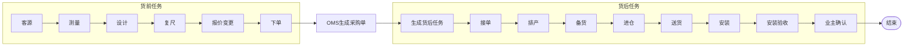

# 新人测试环境配置实操指南：业务流程 → 执行人/考核 → 配置 → 脏数据避坑 → 库表对照

> **适用对象**：刚入职、接手 edar-starlord（家装材料履约中台）的新人。
> **目标**：拿到一个全新的测试环境，能从零把"报价 → 测量 → 复尺 → 报价变更 → 下单 → 送货 → 安装 → 安装验收"这条主材全链路**亲手配一遍并跑通**，且知道每一步卡住时去哪查、怎么绕。
> **定位**：本文是**实操指南**，不重复讲业务全景与系统架构——那些在 [[80.日报周报/新人串讲/新人第一次串讲]] 和 [[10.项目整理/edar-starlord新人快速上手指南]] 已有。本文只补三块新人最缺的：① 各节点**执行人 + 考核时间**；② **测试环境配置步骤 + 脏数据避坑**；③ **配置流程 ↔ 库表落数据对照**。
> **沉淀日期**：2026-09-01
> **关联**：[[80.日报周报/新人串讲/新人第一次串讲]]（业务全链路）、[[10.项目整理/edar-starlord新人快速上手指南]]（系统全景）、[[10.项目整理/主材任务与流程配置/README]]（配置代码级细节）、[[11.数据库表/starlord10张核心数据库表]]（库表）、[[20.知识沉淀/📚 排程材料配置四表关联链路]]（排程四表）

---

## 目录

1. [业务全流程认知（先建立全局观）](#1-业务全流程认知先建立全局观)
2. [每个节点的执行人与考核时间](#2-每个节点的执行人与考核时间)
3. [测试环境配置前置准备（配之前先确认这些）](#3-测试环境配置前置准备配之前先确认这些)
4. [配置步骤逐步走（starlord 为主，提及其他系统）](#4-配置步骤逐步走starlord-为主提及其他系统)
5. [脏数据避坑手册（新人最常卡住的点）](#5-脏数据避坑手册新人最常卡住的点)
6. [库表落数据 ↔ 配置流程一一对照](#6-库表落数据--配置流程一一对照)
7. [配完如何验证全链路跑通](#7-配完如何验证全链路跑通)

---

## 1. 业务全流程认知（先建立全局观）

> 新人第一步不是动手配，而是先在脑子里把"一户家装的主材，从客户报价到最后安装验收"这条线走一遍。这一节只给**配流程所需的最小全局观**，完整业务/系统全景见 [[80.日报周报/新人串讲/新人第一次串讲]]。

### 1.1 一条主线：以"下单"为分界

主材任务全链路的**唯一分界点是正式下单**——下单前只是需求确认（货前），下单后才产生真实货物进入供应链履约（货后）。记住这条分界，后面每个节点的执行人、考核时间、配流程的先后顺序才有锚点。



### 1.2 货前 / 货后各做什么

| 阶段 | 节点 | 本质 | 谁触发本系统 |
|---|---|---|---|
| **货前** | 报价 → 测量 → 设计 → 复尺 → 报价变更 → 下单 | 尚未产生真实货物，只是需求确认 | 前置系统（设计师提交主材测量申请单） |
| **货后** | 接单 → 排产 → 备货 → 进仓 → 送货 → 安装 → 安装验收 → 业主确认 | 下单后货物正式产生，由供应链履约 | 下单后 OMS 生成采购单，回带生成货后任务 |

> 注意：本系统（starlord）在货前只是**管理任务**，业务起点是前置系统生成的主材申请单；货后才是真正的供应链履约。

### 1.3 一句话主线

> 以**前置系统生成的主材申请单**为起点，把客户主材需求拆分为具体 SKU；以**下单**作为货前/货后分界，用**货单号**串联供应商履约全过程（接单/备货/发货/安装），靠**配置驱动**让不同分公司/品类/套餐走不同流程。

### 1.4 为什么配流程前必须先懂这条线

因为"配流程"配的就是这条线**每个节点上挂什么角色、什么考核时间、什么激活方式**——节点没挂对，任务生成后流转不动；节点挂对了但脏数据缺基础数据，任务压根生成不出来（见第 5 章）。所以第 2 章先讲每个节点的执行人和考核时间，第 3 章开始才讲怎么配。

## 2. 每个节点的执行人与考核时间

> 这一节回答两个问题：**每个业务节点由谁、在哪个系统操作**；**每个节点的考核时间怎么算、存在哪个字段**。这是新人配流程时最容易忽略、却直接决定任务能不能按预期激活和考核的部分。

### 2.1 业务节点 × 执行人 × 操作系统 × 节点类型

把第 1 章全链路按业务节点拆开，每个节点对应 starlord 里的 `node_type`（ NodeTypeEnum：1/20/40/50/60/65/80/85），执行人和操作落地系统如下：

| 业务节点 | 谁执行 | 在哪个系统操作 | starlord 节点类型(node_type) | 说明 |
|---|---|---|---|---|
| 报价/选品 | 供应商 + 客户选品 | VSS | （随设计任务） | 供应商完成设计任务后，客户选品 → 自动创建项目变更单，发起报价变更 |
| 测量 | 供应商为主（也可能是项目经理/设计师/管家，按配置） | VSS | 20→60 | 设计师在 Home 提测量申请单并通知测量（填上门时间）；供应商在 VSS 确认、填计划完成时间、完成测量填结果 |
| 设计 | 供应商 | VSS | 60 | 供应商在 VSS 完成设计任务 |
| 复尺 | 项目经理通知 + 供应商执行 | 精工 + VSS | 20→60 | 项目经理在精工完成"通知复尺"；供应商在 VSS 完成复尺（流程同测量） |
| 报价变更 | 供应商发起 | VSS | （变更单 200） | 供应商添加 SKU/规格/报价单后提交，审核通过自动完成设计任务 |
| 下单 | 需求变更单 → OMS | BIM/OMS | （下单任务 taskType=4） | 完成需求变更单 → 去 OMS 下单 → 生成主材任务 + 采购单 |
| 接单 | 供应商 | VSS | 20→60 | 供应商在 VSS 完成接单任务 |
| 备货 | 供应商 | VSS | 60 | 供应商在 VSS 完成备货任务 |
| 排产/进仓 | 供应商 | VSS | 60 | 供应商操作（部分件涉及排产） |
| 送货 | 供应商发货 | VSS | 20→60 | 供应商操作采购单发货（单发/齐发，按工地进度安排预约日） |
| 安装 | 项目经理通知 + 安装工执行 | 精工 + 现场 | 20→40→50→60→65→80 | 项目经理在精工通知安装（填计划完成时间、安装结果并同步主材任务）；安装工进场、提交自检、实地验收 |
| 安装验收 | 管家 | Home | 80 | 管家在 Home 完成安装验收任务 |
| 业主确认 | 业主 | C 端 | 85 | 业主确认安装完成 |

> ⚠️ 关键认知：**供应商是测量/复尺最常见的执行者，但按业务场景和配置，也可能是项目经理、设计师、管家等其他角色**——具体由配置时给节点挂的 `executor_type`（RoleTypeEnum）决定。这就是为什么"配流程"时每个节点都要选执行人角色。

### 2.2 考核时间：两套时间体系

考核时间分**业务侧 SLA 时效**和**系统侧时间字段**两层，前者是规则，后者是规则落到 `task_dispatch_node` 表上的具体时间值。

#### 2.2.1 业务侧 SLA 时效（来自 stock_up 表配置）

各环节的标准周期天数**不是硬编码，而是按「主材 + 供应商」维度配置在 `stock_up` 表**，由 `cycle_type` 区分环节：

| cycle_type | 环节 | 用途 |
|---|---|---|
| 10 | 测量周期 | 算测量节点预估/承诺时间 |
| 20 | 复尺周期 | 算复尺节点预估/承诺时间 |
| 30 | 备货周期 | 算备货节点时间 |
| 40 | 送货周期 | 算送货节点时间 |
| 50 | 安装周期 | 算安装节点时间 |

> 测试环境里具体几天，**以 `stock_up` 表实际配置值为准**——不同分公司/供应商可能不同，别套线上经验值。自查 SQL 见第 3.3 节。

#### 2.2.2 系统侧时间字段（task_dispatch_node 表）

每个节点实例在 `task_dispatch_node` 上有 7 个时间字段，**配流程时不会直接填这些值**——它们是任务生成/激活/完成时由系统按 stock_up 周期计算回填的。理解每个字段含义才能在任务卡住时定位是"没算到时间"还是"时间没到期"：

| 字段 | 含义 | 何时写入 | 定位用法 |
|---|---|---|---|
| `notice_retain_time` | 通知保留时间 | 通知节点（20）激活时 | 通知类节点卡住先看这个有没有值 |
| `estimated_time` | 预估开始时间 | 任务生成时按 stock_up 周期算 | 节点不激活先看它是否到期（定时激活通道依据） |
| `promise_time` | 对客承诺考核时间 | 按周期 + 延期调整计算 | 对客延期判定依据 |
| `platform_check_time` | 平台考核时间 | 激活时回填 | 内部考核（服务商/项目经理）依据 |
| `start_time` | 实际开始时间 | 节点开始处理时 | 看节点是否真的动过 |
| `end_time` | 实际结束时间（表单时间） | 节点提交时 | 看节点是否完成 |
| `submit_time` | 提交时间（系统时间） | 节点提交时 | 对比 end_time 判断提交延迟 |

### 2.3 节点怎么"到期激活"——两条通道

考核时间的最终目的是驱动节点激活。激活有两条通道，配流程时给节点的"激活方式"二选一，决定了用哪条：

| 激活方式 | 通道 | 触发条件 | 典型节点 |
|---|---|---|---|
| 依赖前置节点（DEPENDENT_NODE） | 级联激活 | 前置任务/节点 FINISHED 后级联激活本节点 | 复尺（依赖测量）、安装（依赖送货） |
| 时间型 | 定时激活 | `plan_activate_time` 到期且未激活 | 按下单后 N 天激活的备货/送货 |

> 这就是第 4 章配节点时要选"激活方式"的原因——选错会导致节点要么永远不激活（依赖前置但前置没配连线），要么乱激活（时间型但周期没配）。机制细节见 [[10.项目整理/主材任务与流程配置/04-任务流转机制]]。

### 2.4 工期五种（理解"考核"的业务语境）

业务上讲"考核时间"时常混用五种工期，新人要分清（详见 [[80.日报周报/新人串讲/新人第一次串讲]] 工期一节）：

- **底线工期**：总部规定的上限（如泥木最长 15 天）
- **计划工期**：对标合同签约工期，生成后不变
- **考核工期**：面向服务商/项目经理绩效考核，不对客
- **实际工期**：施工中实际发生时间，竣工后与对客承诺对比判延期
- **对客承诺工期**：计划工期 + 已审批延期，是判对客延期的依据

> 落到 starlord：`platform_check_time` 对应"考核工期"语义，`promise_time` 对应"对客承诺工期"语义。配流程时关心的是"周期天数怎么配"，出了问题关心的是"字段值算没算对"。

## 3. 测试环境配置前置准备（配之前先确认这些）

> **这是新人最容易跳过、跳过就必卡的一章。** 测试环境有大量脏数据，"配一遍"之前不把这些基础数据确认齐，配到一半发现分公司不存在、套餐没配、供应商没有主材，就会卡死且不知道怎么绕。先按下面清单逐项确认。

### 3.1 基础数据清单（配流程的"地基"）

配主材流程前，必须确认这些基础数据在测试环境已存在且有效：

| # | 基础数据 | 对应表/来源 | 为什么必须有 |
|---|---|---|---|
| 1 | 分公司（mdm_code） | `project_info.mdm_code` | 规则单元按分公司维度落行，分公司是匹配维度之一 |
| 2 | 套餐（product_combo_id） | `n_material_define.product_combo_id` | 规则单元维度之一，不同套餐走不同流程 |
| 3 | 品类（material_code） | `material_flow_rule_category.material_code` | 品类规则按"品类×供应商"落行，没品类配不了 |
| 4 | 供应商（supplier_code） | `material_flow_rule_category.supplier_code` | 品类规则另一维度，也是节点执行人候选 |
| 5 | 项目订单（project_order_id） | `project_info` | 任务最终挂在项目上，没项目订单任务生成不了 |
| 6 | 备货周期（stock_up） | `stock_up`（cycle_type 10/20/30/40/50） | 节点预估/承诺时间靠它算，没配则时间字段全空，定时激活通道失效 |

### 3.2 配之前先确认：当前分公司走哪套 mode

starlord 有三套配置链路，由 `mode_type` 区分，**不同 mode 查的表族完全不同**——配错表族就是第 5 章最典型的卡点。先确认你的目标分公司走哪套：

| mode | 适用 | 配置表族 | 匹配链路 |
|---|---|---|---|
| 5 八合一 | 北京被窝 | `material_flow_rule*` | category→template |
| 6 全国 | 圣都等非北京分公司 | `n_material_template*` | template→unit→processDefine |
| 7 排程 | 排程材料配置 | `delivery_flow_rule*` | rule→unit→category→processDefine |

> **怎么确认走哪套**：看目标项目订单的 `project_info` 里 `mdm_code` 对应哪个分公司体系，或问导师/产品确认。当前主用排程体系（mode=7）和 HOME2.5。三套 mode 详解见 [[80.日报周报/新人串讲/新人第一次串讲]] starlord 系统一节，mode/model 入口见 [[10.项目整理/Mode配置入口完整汇总]]。

### 3.3 前置脏数据自查 SQL

**配流程前先跑这几条 SQL**，确认基础数据齐不齐。任何一条返回空，就先补这条数据再配，否则必然卡住：

```sql
-- ① 分公司是否存在（替换为目标分公司code）
SELECT * FROM project_info
WHERE mdm_code = '<目标分公司code>' LIMIT 5;

-- ② 该分公司下是否已有项目订单可测
SELECT project_order_id, home_order_no, customer_name, mdm_code
FROM project_info
WHERE mdm_code = '<目标分公司code>'
ORDER BY create_time DESC LIMIT 10;

-- ③ 该分公司+品类+供应商 是否已有品类规则（排程体系）
SELECT category_id, rule_id, material_code, supplier_code, node_process, state
FROM material_flow_rule_category
WHERE material_code = '<目标品类code>'
  AND supplier_code = '<目标供应商code>';

-- ④ 模板是否已存在且有效（模板清单来自OFC镜像）
SELECT template_id, template_name, task_type, task_name, rank
FROM n_material_process_template
WHERE template_name LIKE '%<目标流程名>%';

-- ⑤ 备货周期是否配齐（缺这个=节点时间全空=定时激活失效）
SELECT material_code, supplier_code, cycle_type, status, state
FROM stock_up
WHERE material_code = '<目标品类code>'
  AND supplier_code = '<目标供应商code>';

-- ⑥ 已有任务里该分公司的 mode 分布（反推该分公司走哪套）
SELECT mode, COUNT(*) FROM task_dispatch
WHERE mdm_code = '<目标分公司code>'
GROUP BY mode;
```

> 跑完⑥如果该分公司在测试环境**完全没有历史任务**，说明从没配通过——此时更要从第 4 章第一步开始配。如果已有任务但 mode 和你预期不符，先和导师确认是不是走错了 mode。

### 3.4 如果基础数据缺失怎么办

测试环境脏数据多，缺分公司/套餐/品类/供应商很常见。两条路：

1. **找源头补数据**：分公司、套餐、品类、供应商这类基础数据多数不在 starlord 配（来自基础能力系统），需要找对应系统负责人在测试环境补。
2. **换一条已有数据的路**：不硬刚脏数据——用 3.3 节 SQL ②③ 找一个"分公司+品类+供应商"三项都已有数据的组合，在这个组合上配流程，能更快跑通全链路验证。

> 经验：**新人配流程卡住 80% 不是流程配错，是基础数据缺**。先自查 SQL 确认数据齐，再动手配，能省掉大量"为什么任务生成不了"的排查时间。具体卡点定位见第 5 章。

## 4. 配置步骤逐步走（starlord 为主，提及其他系统）

> 本章以**排程体系（mode=7，当前主用）**为主线，讲从零配通一条主材流程的五步。每步给：**做什么 → 调什么接口 → 落什么表 → 容易卡哪**。接口/curl 来自 [[10.项目整理/主材任务与流程配置/01-接口速查与curl]]，配置体系细节见 [[10.项目整理/主材任务与流程配置/02-配置体系与数据来源]]。
> 本地服务地址：`127.0.0.1:8080`（测试环境替换为对应测试网关地址）。

### 4.0 配流程总览：配置人员在 starlord 配什么

当前配置方式是"**表格勾选维度 + 下拉选现成流程模板**"，不是画流程图。五步串起来：

```
① 配主规则(勾维度) → ② 配品类规则(勾品类供应商+选模板) → ③ 节点细节配置(逐节点挂角色/激活方式/时间) → ④ 生效 → ⑤ 回测任务生成
```

> 这五步对应的数据落表，以及与第 6 章"库表对照"的映射，见每步末尾的"落表"行。

### 4.1 第一步：配主规则（勾选维度）

**做什么**：勾选单据类型/订单版本/分公司/店铺/套餐，落主规则 + 规则单元。

**接口**：`POST /material/flow/rule/save`

```bash
curl -X POST 'http://127.0.0.1:8080/material/flow/rule/save' \
  -H 'Content-Type: application/json' \
  -d '{
    "mdmCompanyCode": "<分公司code>",
    "saleType": -99,
    "productComboId": <套餐id>,
    "documentType": ...
  }'
```

**落表**：`material_flow_rule`（主规则头） + `material_flow_rule_unit`（按分公司×店铺×套餐×单据类型×订单版本笛卡尔积落行） + Feign 同步 OFC `saveMainRule`。

**卡点**：
- `mdmCompanyCode` 必须是第 3 章确认过存在的分公司，否则后续查询走登录人权限返回空。
- `saleType` 字段在排程表存的是 **OFC 单据类型 value（-99/12/22 等）**，不是 SaleTypeEnum 1-6——别按注释"1整装2零售"误填（详见 [[10.项目整理/主材任务与流程配置/05-业务类型与整装零售]] 第 4 节的坑）。

### 4.2 第二步：配品类规则（勾品类+供应商+选模板）

**做什么**：在主规则下，按"品类×供应商"配品类规则，下拉选一个现成流程模板。

**接口**：`POST /material/flow/category/save`（入参 `MaterialFlowCatgoryCreateParam`，`node_process` = 模板 id）

```bash
# 先查可选模板（Feign 查 OFC 模板列表，非本地表）
curl 'http://127.0.0.1:8080/material/flow/query/selected/ofcNodeProcessTemplateList'

# 再保存品类规则
curl -X POST 'http://127.0.0.1:8080/material/flow/category/save' \
  -H 'Content-Type: application/json' \
  -d '{
    "ruleId": <主规则id>,
    "materialCode": "<品类code>",
    "supplierCode": "<供应商code>",
    "nodeProcess": <模板id,即上一步查到的templateId>,
    "nodeProcessName": "测量-设计-复尺-报价变更-送货-安装"
  }'
```

**落表**：`material_flow_rule_category`（每供应商一条，`category_id` = 雪花 id） + OFC `saveSecondRule`。此时 state 为草稿。

**卡点**：
- 模板列表是**从 OFC 远程拉的**，测试环境如果 OFC 侧模板没配，下拉是空的——这是第 5 章典型卡点，starlord 侧补不了，要找 OFC 侧。
- `category_id` 是雪花 id，后面节点配置会用它当 `template_id` 关联 `n_material_process_define`（见 [[20.知识沉淀/📚 排程材料配置四表关联链路]]）。

### 4.3 第三步：节点细节配置（逐节点挂角色/激活方式/时间）

**做什么**：基于所选模板，给每个节点（node_type 20/40/50/60/65/80/85）挂执行人角色、激活方式、时限。**这一步是"配流程"的核心**——决定了第 2 章讲的执行人和考核时间怎么落地。

**接口**：`CategoryProcessController.processDefineInfoSave`（流程定义保存链路）

**落表**：`n_material_process_define`（一个 taskType 一条流程定义） + `n_material_node_cfg`（node_type / activateMode / 时限） + `n_material_task_cfg`（角色 role_types） + `n_material_route`（type=2 任务间连线，复尺依赖测量时生成）。

**每个节点要配的关键项**（对照第 2 章）：

| 配置项 | 对应表字段 | 决定了什么 |
|---|---|---|
| 节点类型 | `n_material_node_cfg.node_type` | 这个节点是约工/派单/进场/验收中的哪个 |
| 执行人角色 | `n_material_task_cfg.role_types` → 运行时 `task_dispatch_node.executor_type` | 第 2 章执行人表里"谁执行" |
| 激活方式 | `n_material_node_cfg.activate_mode` | 第 2.3 节两条激活通道：依赖前置节点 / 时间型 |
| 时限 | `n_material_node_cfg` 时限配置 → 运行时 `task_dispatch_node.estimated_time` 等 | 第 2.2.2 节考核时间字段 |
| 任务间连线 | `n_material_route`（type=2，sourceCode=前置 processCode, targetCode=本 processCode） | 测量→复尺的级联激活 |

**卡点**：
- 复尺任务的开始节点如果选了"激活方式=依赖前置任务（测量）"，才会生成 `n_material_route` type=2 连线；**不选依赖就靠定时激活**，任务间不会自动级联（机制见 [[10.项目整理/主材任务与流程配置/04-任务流转机制]]）。新人常漏配这个连线，导致测量完成后复尺永远不激活。
- `node_type` 是**本地枚举**，配置人员在页面逐节点选，不是 OFC 下发（02 篇第 5 节已核验）。

### 4.4 第四步：生效

**做什么**：把草稿态的品类规则和模板配置置为有效，旧规则置失效。

**接口**：`category/effective`（生效接口）

**落表**：OFC `secondRuleChangeStatus` + 本地模板草稿→有效 + `material_flow_rule_template_mapping` 置 VALID + 品类规则置 VALID（旧→INVALID） + `material_flow_rule_template_record`。

**卡点**：
- **配了不生效 = 任务查不到**。`material_flow_rule_category.state` 为 0(草稿)/2(失效) 时，生成侧查不到该规则，任务直接不生成。这是第 5 章两大卡点之一。生效后必须确认 state=1(有效)。

### 4.5 第五步：回测任务生成

**做什么**：配完生效后，用一个真实项目订单触发任务生成，验证配置是否正确。

**接口**：`POST /api/construction/task/create`（主用）

```bash
curl -X POST 'http://127.0.0.1:8080/api/construction/task/create' \
  -H 'Content-Type: application/json' \
  -d '{ /* 项目/订单维度数据 */ }'
```

**落表**：`task_dispatch`（主材任务主表） + `task_dispatch_node`（按模板节点序列生成 N 个节点，初始 process_status=1 未激活） + `task_dispatch_extend`（扩展信息）。

**卡点**：
- 生成侧只读本地表，不调 OFC。如果查不到模板配置会**直接 return 不生成任务**（`MaterialCreateV2ServiceImpl.execCreateMaterialProcess` 查不到 `queryAllMaterialForm` 返回空就 return）——这是第 5 章头号卡点。
- 具体业务入参结构逐字段说明见 [[10.项目整理/主材任务与流程配置/99-待确认事项]] 第 5 条。

### 4.6 跨系统操作点（提及其他系统）

主流程在 starlord 配，但某些节点操作落在其他系统，测试时需要去对应系统执行：

| 业务节点 | 其他系统操作 | 说明 |
|---|---|---|
| 通知测量 | Home（设计师） | 设计师在 Home 提测量申请单并通知测量 |
| 通知复尺 | 精工（项目经理） | 项目经理在精工完成"通知复尺"任务 |
| 通知安装 | 精工（项目经理） | 项目经理在精工完成"通知安装"，填计划完成时间/安装结果并同步主材任务 |
| 安装验收 | Home（管家） | 管家在 Home 完成安装验收任务 |
| 测量/复尺/接单/备货/发货执行 | VSS（供应商） | 供应商在 VSS 完成各执行节点 |
| 下单 | OMS | 完成需求变更单后去 OMS 下单 |

> 测试环境走全链路时，需要在这些系统间切换账号操作。如果某个系统测试环境也没数据，先确认是不是该节点的数据问题，而不是 starlord 配错。

## 5. 脏数据避坑手册（新人最常卡住的点）

> 本章是新人配流程最常卡住的地方。**测试环境脏数据多，"配一遍"卡住 80% 不是流程配错，是数据问题。** 下面按卡点类型给"现象 → 定位 SQL → 解法"。两大高频卡点：**基础数据缺失** 和 **模板/品类未生效**（这两类是你实测选的），再补 mode 混用和激活拦截。

### 5.1 卡点一：基础数据缺失（头号卡点）

**现象**：调 `/api/construction/task/create` 没报错但**任务没生成**；或品类规则保存时报分公司/套餐/品类/供应商不存在。

**根因**：生成侧 `MaterialCreateV2ServiceImpl.execCreateMaterialProcess` 调 `materialConfigV2Service.queryAllMaterialForm(condition)` 查不到模板配置时**直接 return，不生成任务**。查不到的原因往往是基础数据维度对不上——分公司不存在、套餐没配、品类/供应商在测试环境没有记录。

**定位 SQL**（按顺序排查，哪步返回空就是哪步缺数据）：

```sql
-- ① 项目订单存不存在、分公司对不对
SELECT project_order_id, mdm_code, product_combo_id
FROM project_info WHERE project_order_id = <你的项目订单id>;

-- ② 该分公司下有没有已生效的主规则（排程体系）
SELECT rule_id, state FROM material_flow_rule_unit
WHERE mdm_company_code = '<分公司code>' AND state = 1;

-- ③ 该品类+供应商有没有品类规则
SELECT category_id, material_code, supplier_code, node_process, state
FROM material_flow_rule_category
WHERE material_code = '<品类code>' AND supplier_code = '<供应商code>';

-- ④ 备货周期有没有（缺它→节点时间全空→定时激活失效）
SELECT cycle_type, status, state FROM stock_up
WHERE material_code = '<品类code>' AND supplier_code = '<供应商code>';
```

**解法**：
- ②返回空 → 该分公司从没配过主规则，回第 4.1 步从头配。
- ③返回空 → 品类规则没配或品类/供应商在测试环境不存在，回第 4.2 步配；品类/供应商本身缺则找基础能力系统负责人补（starlord 配不了）。
- ④返回空 → 备货周期没配，节点时间字段会全空、定时激活通道失效。补 `stock_up` 或换一个已配周期的品类/供应商组合测。
- **绕坑捷径**：不硬刚脏数据——用 ③ 和 ④ 都有结果的"品类+供应商"组合去配，能最快跑通验证。

### 5.2 卡点二：模板/品类未生效（配了等于没配）

**现象**：主规则、品类规则都配了，节点也配了，但任务还是不生成，或生成侧查不到配置。

**根因**：`material_flow_rule_category.state` 和模板 state 仍是**草稿/失效**状态，没走 `effective` 生效。生成侧只查有效态配置，草稿/失效查不到。

**定位 SQL**：

```sql
-- 品类规则 state：0草稿/1有效/2失效
SELECT category_id, state, node_process, node_process_name
FROM material_flow_rule_category
WHERE material_code = '<品类code>' AND supplier_code = '<供应商code>';

-- 模板映射 state 是否 VALID
SELECT rule_category_id, n_template_code, task_type, state
FROM material_flow_rule_template_mapping
WHERE rule_category_id IN (
  SELECT category_id FROM material_flow_rule_category
  WHERE material_code = '<品类code>' AND supplier_code = '<供应商code>'
);

-- 流程定义有没有真的生成（节点细节落表了没）
SELECT process_code, template_id, task_type
FROM n_material_process_define
WHERE template_id IN (
  SELECT category_id FROM material_flow_rule_category
  WHERE material_code = '<品类code>' AND supplier_code = '<供应商code>'
);
```

**解法**：
- 品类 state≠1 → 回第 4.4 步走 `category/effective` 生效，生效后旧规则自动置 INVALID。
- 模板映射 state 不是 VALID → 同样走生效链路；写入分散在 processSave/copyCategoryTemplate/categoryInfoUpdate，生产入口未完全钉死（见 [[10.项目整理/主材任务与流程配置/99-待确认事项]] 第 4 条），不确定时问后端同事。
- `n_material_process_define` 查不到 → 节点细节配置（第 4.3 步）没落表，categorySave 只写 rule_category + 同步 OFC，**不写 node_cfg/process_define**——流程定义数据要走独立的"流程定义保存/模板复制"链路（02 篇第 6 节已核验）。回第 4.3 步重配节点。

### 5.3 卡点三：mode 混用（配错表族）

**现象**：明明配了规则，但生成侧查不到；或同一个分公司在不同 mode 表里都有数据，互相干扰。

**根因**：三套 mode 查的表族完全不同（mode=5 `material_flow_rule*` / mode=6 `n_material_template*` / mode=7 `delivery_flow_rule*`），在错的表族里配，生成侧按 mode 走对应表族自然查不到。

**定位 SQL**：

```sql
-- 该分公司历史任务走哪个 mode（反推应配哪套）
SELECT mode, COUNT(*) FROM task_dispatch
WHERE mdm_code = '<分公司code>' GROUP BY mode;

-- 你配的规则在哪个表族
SELECT 'material_flow_rule_category' tbl, COUNT(*) FROM material_flow_rule_category WHERE material_code='<品类code>'
UNION ALL
SELECT 'delivery_flow_rule_category', COUNT(*) FROM delivery_flow_rule_category WHERE material_code='<品类code>';
```

**解法**：
- 先确认目标分公司走哪套 mode（问导师/产品，或看历史任务 mode 分布），再在**对应表族**里配。
- 三套 mode 详解见 [[80.日报周报/新人串讲/新人第一次串讲]]，mode/model 入口见 [[10.项目整理/Mode配置入口完整汇总]]。
- ⚠️ 同一字段名 `saleType` 在排程表=单据类型 value、模板表=SaleTypeEnum 1-6、老体系表=业务类型——**两套枚举语义**，排查数据先确认看的哪张表（05 篇第 4 节坑）。

### 5.4 卡点四：激活被前置条件拦截

**现象**：任务生成了（task_dispatch 有记录，process_status=1 未激活），但**节点迟迟不激活**，或任务卡在 `暂停激活(4)` 状态。

**根因**：激活受前置条件约束——尾款未付、订单状态不对、依赖节点未完成，都会拦截激活。也可能是第 4.3 步漏配了任务间 `n_material_route` type=2 连线，导致级联激活走不通。

**定位 SQL**：

```sql
-- 任务当前状态（1未激活/2激活未完成/3已完成/4暂停激活）
SELECT id, task_type, process_status, current_node_type, plan_activate_time,
       node_task, process_code
FROM task_dispatch
WHERE project_order_id = <项目订单id> AND material_code = '<品类code>';

-- 节点状态
SELECT node_type, process_status, estimated_time, start_time, end_time, executor_type
FROM task_dispatch_node
WHERE task_dispatch_id = <上面查到的task_dispatch.id>
ORDER BY node_type;

-- 任务间路由连线配了没（复尺依赖测量）
SELECT type, source_code, target_code, state
FROM n_material_route WHERE type = 2 AND state = 1;
```

**解法**：
- 任务 process_status=4 暂停激活 → 前置条件拦截（尾款/订单状态），确认项目订单状态、尾款是否付清。
- 节点 process_status=1 且 estimated_time 已过仍不激活 → 查定时任务是否在跑（定时激活通道）；若 estimated_time 为空 → 第 4.3 步时限没配或 stock_up 周期缺失。
- 测量完成但复尺不激活 → 99% 是漏配 `n_material_route` type=2 连线，回第 4.3 步给复尺开始节点选"激活方式=依赖前置任务（测量）"。
- 两次激活竞争（异步 afterCreate 与汰换回调同步激活）属并发场景，依赖乐观锁 CAS + 事务保证正确，一般不需处理，详见 [[80.日报周报/新人串讲/新人汇报]] 2.5 节。

### 5.5 卡点速查表

| 现象 | 先查 | 多半原因 | 去哪章 |
|---|---|---|---|
| 调创建接口没报错但任务没生成 | 5.1 定位 SQL ①②③ | 基础数据缺失，queryAllMaterialForm 查不到直接 return | 5.1 |
| 配了规则但任务还是不生成 | 5.2 定位 SQL（品类 state） | 品类/模板未生效 | 5.2 |
| 规则在表里但生成侧查不到 | 5.3 定位 SQL（mode 分布） | 配错表族 / mode 混用 | 5.3 |
| 任务生成了但节点不激活 | 5.4 定位 SQL（process_status / route） | 前置条件拦截 / 漏配 route 连线 | 5.4 |
| 节点 estimated_time 为空 | stock_up 表 | 备货周期没配 | 5.1 ④ |

## 6. 库表落数据 ↔ 配置流程一一对照

> 本章回答你最后一个问题：**"配完之后，目前数据库里分别存了什么数据，与整个配置流程怎么一一对应？"** 把第 4 章五步配置、第 5 章卡点定位、库表笔记串成一张"配置动作 → 落表 → 字段"的对照表。库表完整字段见 [[11.数据库表/starlord10张核心数据库表]]。

### 6.1 三阶段分层：配置侧 → 生成侧 → 运行侧

整个数据流分三层，**配置侧只写不读运行态，生成侧只读配置不写配置，运行侧只读固化数据**——这是理解"配完 DB 里有什么"的总纲（来自 [[10.项目整理/主材任务与流程配置/03-任务生成与数据落表]]）：

```
配置侧（第4章五步）     →    生成侧（创建任务时）    →    运行侧（节点流转时）
material_flow_rule*          task_dispatch              只读 task_dispatch.node_task
n_material_process_define    task_dispatch_node          只读 n_material_route 连线
n_material_node_cfg          task_dispatch_extend
n_material_route
```

### 6.2 配置侧：配流程时 DB 里写了什么

对应第 4 章 4.1~4.4 步，每个配置动作落哪些表、哪些关键字段：

| 配置动作（第4章） | 落表 | 关键字段 | 说明 |
|---|---|---|---|
| ① 主规则 rule/save | `material_flow_rule` | rule_id, state | 主规则头 |
| | `material_flow_rule_unit` | mdm_company_code, sale_type(OFC单据类型value), product_combo_id, state | 按维度笛卡尔积落行 |
| ② 品类规则 category/save | `material_flow_rule_category` | category_id(雪花id), material_code, supplier_code, node_process(模板id), node_process_name, state(草稿) | 每供应商一条 |
| ③ 节点细节 processDefineSave | `n_material_process_define` | process_code, template_id(=category_id), task_type | 一个 taskType 一条流程定义 |
| | `n_material_node_cfg` | node_type, activate_mode, 时限 | 逐节点配置 |
| | `n_material_task_cfg` | role_types | 执行人角色 |
| | `n_material_route` | type=2, source_code, target_code, state | 任务间连线（复尺依赖测量时） |
| ④ 生效 effective | `material_flow_rule_category` | state → 1(有效) | 旧规则 → 2(失效) |
| | `material_flow_rule_template_mapping` | state → VALID | 模板映射生效 |
| | `material_flow_rule_template_record` | 生效记录 | 生效审计 |

> 关键认知：`material_flow_rule_category.category_id` 在生成侧被当成 `n_material_process_define.template_id` 来查——**两个字段名不同但存同一个值**，是排程配置表族和工艺定义表族之间的"隐形桥"（详见 [[20.知识沉淀/📚 排程材料配置四表关联链路]]）。

### 6.3 生成侧：创建任务时 DB 里写了什么

对应第 4 章 4.5 步，调 `/api/construction/task/create` 后落哪些表。生成侧**只读本地配置表，不调 OFC**：

| 落表 | 关键字段 | 数据来源 |
|---|---|---|
| `task_dispatch` | node_task, node_path, current_node_type, process_status(=1未激活), process_code, condition_code, template_id, project_order_id, material_code, supplier_code, plan_activate_time, purchase_order_no | 按 nodeCode 升序 join 成 node_task（nodeType×1000） |
| `task_dispatch_node` | node_type, node_code, task_code, u_task_code, process_status(=1待激活), template_node_id, estimated_time(按stock_up周期算) | 按模板节点序列生成 N 个 |
| `task_dispatch_extend` | task_dispatch_id, task_dispatch_node_id, sku_info, project_change_no, has_order | 1:1 扩展 |

> 此时所有节点 process_status=1（待激活），等第 2.3 节两条通道之一来激活。分支模式（非 home2.5）还会经 `n_material_route` + `n_material_branch_condition`（SpEL）重算实际 node_task 路径（03 篇第 3 节）。

### 6.4 运行侧：节点流转时 DB 里改了什么

运行侧**只读固化数据，不碰配置**。节点激活/完成时更新的字段：

| 动作 | 表 | 更新字段 |
|---|---|---|
| 节点激活 | `task_dispatch_node` | process_status: 1→2（按 task_dispatch_id+node_type+process_status=1 更新为 2） |
| 节点开始处理 | `task_dispatch_node` | start_time, executor_type, executor_id, executor_name |
| 节点提交完成 | `task_dispatch_node` | process_status: 2→3, end_time, submit_time, submit_by, qualified, images, remarks |
| 任务当前节点前移 | `task_dispatch` | current_node_type, current_node_time |
| 末节点完成 | `task_dispatch` | current_node_type=1000, process_status=COMPLETED(3) |
| 任务间级联 | （查 `n_material_route` type=2）→ 激活后置 task_dispatch | 触发 activateNextTaskDispatch |
| 用量/SKU 回填 | `task_dispatch_extend` | usage_confirm, sku_info, project_change_no, has_order |

### 6.5 配置流程 ↔ 库表对照总表

把全链路 7 个业务阶段（[[11.数据库表/starlord10张核心数据库表]] 阶段一~七）与配置流程串起来，一张表看全"每个阶段配什么、生成什么、运行改什么"：

| 业务阶段 | 配置侧落表（第4章） | 生成侧落表 | 运行侧改 |
|---|---|---|---|
| 前置配置 | n_material_template, material_flow_rule*, n_material_node_cfg, n_material_route, stock_up | —（配置阶段无运行态） | — |
| 项目创建 | — | project_info | — |
| 任务生成 | — | task_dispatch, task_dispatch_node, task_dispatch_extend | — |
| 节点执行(测量/复尺/下单/送货/安装) | — | — | task_dispatch_node 激活+完成, task_dispatch 前移 |
| 批量调度 | — | task_process_batch | 批量激活同批次节点 |
| 异常跟进 | — | — | task_node_progress（跟进记录） |
| 售后返补 | — | coordinator_task_order | CT 单闭环 |

> 一句话：**配置侧写"规则"，生成侧把规则实例化成"任务+节点"，运行侧只读实例化的数据往前推**。配流程时写第 6.2 节那些表，配完任务生成写第 6.3 节那些表，任务流转只动第 6.4 节那些字段——三者各司其职，分层清晰。

## 7. 配完如何验证全链路跑通

> 配完不是结束——要在测试环境验证全链路真的能跑通。下面是验证清单：配完后按这个顺序查 task_dispatch / task_dispatch_node 的状态推进，确认每个节点都能激活、完成、级联。

### 7.1 验证清单（按顺序查）

```sql
-- ① 任务生成成功：task_dispatch 有记录，process_status=1(未激活)
SELECT id, task_type, process_status, current_node_type, node_task, plan_activate_time
FROM task_dispatch
WHERE project_order_id = <项目订单id> AND material_code = '<品类code>';

-- ② 节点序列正确：task_dispatch_node 按 node_type 顺序生成
SELECT node_type, process_status, estimated_time, start_time, end_time, executor_type
FROM task_dispatch_node
WHERE task_dispatch_id = <①查到的id>
ORDER BY node_type;

-- ③ 首节点激活：process_status 从 1→2
SELECT node_type, process_status FROM task_dispatch_node
WHERE task_dispatch_id = <id> ORDER BY node_type LIMIT 1;

-- ④ 节点流转推进：current_node_type 前移，末节点完成后任务 process_status=3
SELECT current_node_type, process_status FROM task_dispatch WHERE id = <id>;

-- ⑤ 任务间级联：测量完成后复尺任务被激活
SELECT task_type, process_status FROM task_dispatch
WHERE project_order_id = <项目订单id> AND material_code = '<品类code>'
ORDER BY task_type;
```

**通过标准**：① 有记录且 process_status 随流程从 1→2→3 推进；② 节点按 node_type 顺序激活完成；④ current_node_type 前移到末节点（1000）；⑤ 测量完成后复尺任务自动激活。任何一步不满足，回第 5 章对应卡点查。

### 7.2 验证时的跨系统操作

验证全链路跑通需要在其他系统执行节点操作（见第 4.6 节）：
- 测量/复尺/接单/备货/发货 → VSS（供应商账号）
- 通知复尺/通知安装 → 精工（项目经理账号）
- 安装验收 → Home（管家账号）
- 下单 → OMS

> 如果某个节点在其他系统操作后，starlord 侧 task_dispatch_node 没更新——先查 Kafka 消息是否消费成功（详见 [[10.项目整理/edar-starlord新人快速上手指南]] 第 10 章 Kafka 部分），再查该节点配置是否正确。

### 7.3 关联文档索引

| 文档 | 看什么 |
|---|---|
| [[80.日报周报/新人串讲/新人第一次串讲]] | 业务全链路 + 各节点执行人 + starlord 定位 + 三套 mode + 节点类型枚举（本文第1、2章的上游） |
| [[80.日报周报/新人串讲/新人汇报]] | 更精炼的业务/系统/领域模型 + 任务激活 vs 节点激活 |
| [[10.项目整理/edar-starlord新人快速上手指南]] | 系统全景：概念/角色/流程/架构/接口/数据库/配置/Redis/Kafka（157KB大而全） |
| [[10.项目整理/主材任务与流程配置/README]] | 配置体系代码级细节目录（本文第4章的深度版） |
| [[10.项目整理/主材任务与流程配置/01-接口速查与curl]] | 配置/查询接口 curl |
| [[10.项目整理/主材任务与流程配置/02-配置体系与数据来源]] | 配置怎么配、模板/node_type 数据从哪来 |
| [[10.项目整理/主材任务与流程配置/03-任务生成与数据落表]] | 创建任务查什么配置、落什么表（本文第6章上游） |
| [[10.项目整理/主材任务与流程配置/04-任务流转机制]] | 节点级/任务级流转机制（本文第2.3、5.4节上游） |
| [[10.项目整理/主材任务与流程配置/05-业务类型与整装零售]] | 整装/零售区分 + saleType 字段语义坑 |
| [[11.数据库表/starlord10张核心数据库表]] | 10 张核心表字段 + 7 阶段表对照（本文第6章上游） |
| [[20.知识沉淀/📚 排程材料配置四表关联链路]] | 排程四表怎么串、category_id==template_id 隐形桥 |
| [[10.项目整理/Mode配置入口完整汇总]] | 三套 mode/model 配置入口 |
| [[10.项目整理/主材任务流程梳理]] | 主材业务全流程流转图 |
| [[10.项目整理/复尺流程]] | 复尺任务创建/流转全细节 |
| [[10.项目整理/安装流程]] | 安装任务两个创建入口 + 状态流转 |

### 7.4 新人学习路径建议

1. **先读** [[80.日报周报/新人串讲/新人第一次串讲]] 建立业务全局观（1~2 天）
2. **再读** [[10.项目整理/edar-starlord新人快速上手指南]] 第 1~5 章建立系统认知（2~3 天）
3. **然后** 用本文第 3~5 章在测试环境动手配一遍（本文价值所在，3~5 天）
4. **配通后** 用第 6 章对照库表，理解"配的数据去哪了"
5. **深入** 读 [[10.项目整理/主材任务与流程配置/]] 全套 + [[20.知识沉淀/📚 排程材料配置四表关联链路]] 啃配置复杂点

> 踩坑后沉淀到 `20.知识沉淀/` 时，按 [[knowledge-sediment-template]] 的 7 段模板写，命名 `📚 <问题简述>.md`。

---
---

> 本文是新人**实操向**指南，聚焦"怎么配 + 怎么避坑 + 配完 DB 里有什么"。业务/系统全景请配合上游文档阅读。如有事实性错误或过时之处，欢迎批评指正。

---
