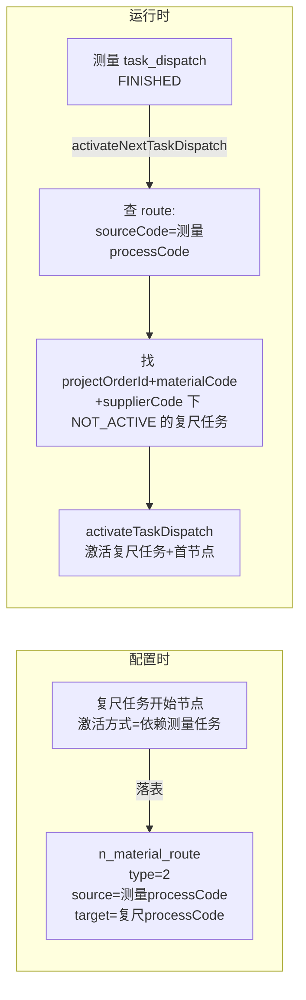

# 04 任务流转机制（节点级 + 任务级）

> 回答的问题：任务流转依据哪个表的哪个数据？节点间流转用 node_type，那任务间（测量→复尺）怎么流转？

## 0. 两套机制并行（先分清层级）

| 层级 | 机制 | 数据载体 |
|---|---|---|
| 节点级（任务内：约工→派单→进场→…） | node_task 字符串顺序推进 + activateNextNode | `task_dispatch.node_task` |
| 任务级（测量→复尺） | 路由表 type=2 连线 + 级联激活 | `n_material_route` |

## 1. 节点级流转

- 运行时只读固化数据，不碰配置：`task_dispatch.node_task`（getNextNodeType binarySearch 取下一个）/ `node_path` / `condition_code`。
- 激活：`TaskDispatchNodeDaoImpl.activateNextNode` 按 task_dispatch_id + node_type + process_status=1 更新为 2。
- 回写：`MaterialHandleV2ServiceImpl.prepareHandleDispatch` 更新 current_node_type；末节点 → currentNodeType=1000、processStatus=COMPLETED；完成后 activateNextTaskDispatch 级联。
- 分支数据源：DELIVER_WAY(10)=scmSubOrder、CRAFT_TYPE(50)=craftCodeList、NEED_RECHECK(30)=recheckDataList。

## 2. 任务级流转：n_material_route type=2「流程间路由」（大节点路由）

`RouteTypeEnum`（`RouteTypeEnum.java:16-19`）：

| type | 枚举 | 连的是什么 |
|---|---|---|
| 1 | NODE 节点路由 | 任务内节点→节点 |
| **2** | **PROCESS 流程间路由** | **任务→任务（测量→复尺）** |
| 3 | PROCESS_NODE | 流程间的节点路由 |
| 4 | RESTART_ROUTE | 重启连线 |

"测量之后是复尺"存成一条 route：**sourceCode = 测量任务的 processCode，targetCode = 复尺任务的 processCode**。

## 3. processCode：任务的身份键

每个任务（taskType）一条 `n_material_process_define`，processCode 由 `LangUtils.generateProcessCode`（`LangUtils.java:83-92`）拼接：

```
processCode = 模板code(category_id) + [_交付类型] + _三位taskType
例：123456_001（测量）、123456_005（复尺）
```

taskType 就是模板任务序列（OFC 模板 nodeCode 映射来的 TaskTypeEnum）。**任务间先后顺序本质上是配置时按 processCode 建立的有向连线。**

## 4. 连线怎么写入：复尺任务的"开始节点"配置为依赖前置

写入点（`MaterialConfigV2ServiceImpl.java:3083-3091`）：

```java
// 大节点路由
if (Objects.equals(startNodeParam.getActivateMode(), ActivateModeEnum.DEPENDENT_NODE.getType())) {
    NMaterialRoute materialRoute = new NMaterialRoute();
    materialRoute.setType(RouteTypeEnum.PROCESS.getValue().byteValue());   // type=2
    materialRoute.setSourceCode(startNodeParam.getActivateRelationCode()); // 前置任务的 processCode
    materialRoute.setTargetCode(processDefine.getProcessCode());           // 本任务 processCode
    result.setTaskRoute(materialRoute);
}
```

- 触发条件：**配置人员给复尺任务的开始节点选"激活方式=依赖前置任务（测量）"时才生成**，落表在「保存大节点路由」（`MaterialConfigV2ServiceImpl.java:1901-1906`）。
- 页面回显（:1113-1126）：把 `taskRoute.sourceCode.split("_")[1]` 解析出前置 taskType，显示"依赖 XX 任务"。
- **不选依赖的任务没有前置连线，靠定时激活**（见第 6 点）。

## 5. 运行时：测量如何"流转"到复尺（级联激活）

生成任务时，模板下每个 taskType 各建一条 `task_dispatch`（NOT_ACTIVE，processCode 带入）。测量任务 FINISHED 后触发：

**`MaterialActivateV2ServiceImpl.activateNextTaskDispatch`（:183-222）**，调用入口 `MaterialHandleV2ServiceImpl.java:266`：

| 步骤 | 代码 | 说明 |
|---|---|---|
| ① 校验 | :185-188 | 当前任务必须 FINISHED 才级联 |
| ② 查路由 | :191-195 | `n_material_route` where sourceCode = 测量.processCode（state=ACTIVE/INVALID） |
| ③ 取后置 | :201 | targetCode 集合 = 复尺（等）的 processCode |
| ④ 找任务 | :202-217 | 按 projectOrderId + materialCode + supplierCode（home2.5 用户业务类不带 orderNo，:211-216）找 NOT_ACTIVE 的 task_dispatch |
| ⑤ 激活 | :218-221 | 逐个 activateTaskDispatch：更新状态、激活首个节点、发节点变更消息 |

## 6. 第二条激活通道：定时

`MaterialActivateV2ServiceImpl.activateTaskDispatch()`（:151-179）定时任务：扫 `plan_activate_time` 到期且未激活的 task_dispatch，到期即激活。**开始节点激活方式选"时间型"（如按下单后 N 天）的任务走这条通道**。

任务的激活方式在配置时两种二选一：依赖前置节点（DEPENDENT_NODE）→ 写 type=2 路由；时间型 → 只算 plan_activate_time。

## 7. 旁路：completePreTask

`completePreTask`（`MaterialHandleV2ServiceImpl.java:695-730`）反向用法：激活某任务时反查 route（targetCode=当前 → sourceCode=前置），若前置任务还没完成则把它**自动补完成**——处理"上游系统已完成对应任务"的场景。

## 8. 一图总结



**一句话**：节点级流转看 `node_task` 顺序，任务级流转看 `n_material_route`（type=2）连线 + 级联激活，两套机制并行。
