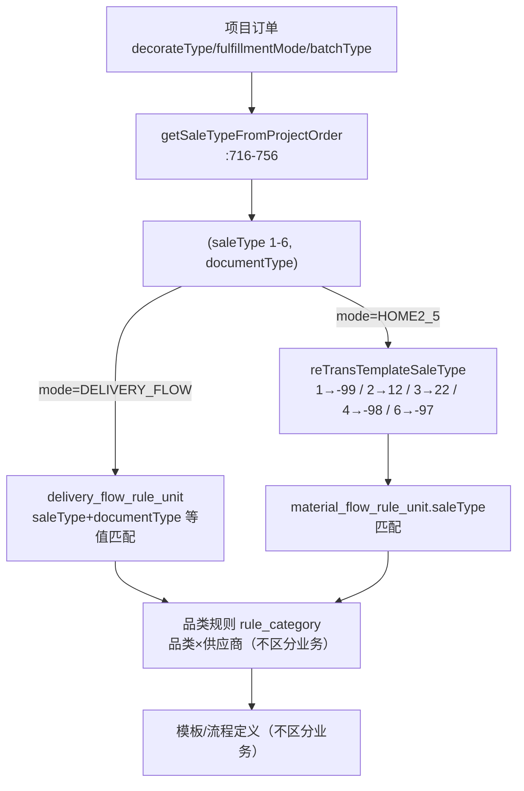

# 05 业务类型与整装零售

> 回答的问题：配置中的业务类型"整装零售"是什么？配置对这些业务有没有区分、如何区分？

## 1. 概念层级：业务类型 → 单据类型

定义在外部依赖 **OMS 侧**（`com.ke.utopia.scm.oms.refactor.enums.core.*`，本仓库不可见），本地 `DocumentTypeEnum` 是组合后的扁平化镜像（`DocumentTypeEnum.java:25-88`，注释原话："OMS 业务类型：整装、零售、团装"）：

```
BusinessType(业务类型) × MainType(主类型：常规/补货/领用) × SecondType(子类型：主材/小主材/辅材/配套)
        → DocumentTypeEnum（单据类型，value 与 OFC OfcOrderTypeEnum 同构）
```

- **BusinessType**：DECORATE 整装 / RETAIL 零售 / GROUP 团装 / PARTIAL_DECORATION 局装 / OTHERS 其他
- **MainType**：REGULAR 常规 / REPLENISH 补货 / APPLY_USING 领用
- **SecondType**：MASTER 主材 / SUPPLEMENT 小主材 / AUXILIARY 辅材 / INTEGRATE_RETAIL_ORDER 配套

## 2. "整装"和"零售"分别覆盖哪些单据

| 业务线 | 业务含义 | 单据类型（value + desc） |
|---|---|---|
| **整装** DECORATE | 家装硬装主业务（含搭售/配套），主单号=履约单号 | 1 主材单(整装)、2 小主材单(整装)、3 辅材单(整装)、5 竣工前补货(整装)、7 竣工后补货(整装)、8 中控订单、9 装企通订单、21 整装补寄单 |
| **零售** RETAIL | 定软电零售业务线（无开工准备/竣工，非北京纯零售不生成履约单） | 4 配套单(定软电)、12 纯定软电单(定软电)、22 精装全案(定软电)、29/30 竣工前/后补货(定软电) |
| 复合类 | 整装+配套 / 团装 / 局装 同单场景 | -99 主材单(整装)&配套单(定软电)、-98 团装复合、-97 局装复合（**配置页用这几个代表整装/团装/局装场景**） |

"整装"和"零售"是**两大业务线**，不是两种单据——各覆盖一簇单据。

## 3. SaleTypeEnum（模板侧统一编码 1-6）

| code | desc | 对应 projectBusiness |
|---|---|---|
| 1 | 整装/配套 | 2.0_whole、2.5_whole |
| 2 | 纯定软电 | 2.0_retail、2.5_retail |
| 3 | 精装全案 | 2.5_quan（北京纯零售） |
| 4 | 团装/配套 | 2.5_group_whole |
| 5 | 团装定软电 | 2.5_group_quan |
| 6 | 局装/配套 | 2.5_renovate |

projectBusiness → saleType 完整映射见 `doc/saleTypeConvert.md`。

## 4. 配置落表：两套体系字段语义不同（⚠️ 易踩坑）

| 体系 | 表 | 字段 | 实际存的值 | 证据 |
|---|---|---|---|---|
| 排程体系（当前主用） | `material_flow_rule_unit` | `saleType` + `saleTypeName` | **OFC 单据类型 value**（-99/12/22/-98/-97…）+ desc | 保存 `MaterialFlowRuleServiceImpl.java:441-442`；下拉 key 来自 OFC `queryOrderTypeList`（`MaterialFlowSelectQueryServiceImpl.java:362-389`） |
| 老体系 | `delivery_flow_rule_unit` | `saleType`（单选）+ `documentType`（多选）双字段 | saleType = SaleTypeEnum code（1-6 业务类型）；documentType = 单据类型 value | `DeliveryFlowRuleServiceImpl.java:422-425` |

⚠️ **坑**：`material_flow_rule_unit.saleType` 的 model 注释写"单据类型(1:整装,2:零售)"是**早期简化描述，有误导**。实际存 OFC 单据类型 value。同一字段名"saleType"，在排程表=单据类型 value、在模板表=SaleTypeEnum 1-6、在老体系表=业务类型——**两套枚举语义，排查数据先确认看的哪张表**。

### 配置页下拉选项来源

| 入口 | 来源 |
|---|---|
| 排程 `/material/flow/...querySaleType`（`MaterialFlowSelectQueryServiceImpl:362-389`） | OFC `queryOrderTypeList`，兜底 `getDefaultSaleTypeList` = OfcOrderTypeEnum.values() 过滤 1/4/GROUP 常规 |
| 老 `manpower/cfg/saleTypeList`（`ManpowerCfgController:177-186`） | 直接遍历本地 SaleTypeEnum.values() |

## 5. 转换关系（核心，两处）

### 5.1 BusinessType → SaleTypeEnum

`StarlordEnumConvert.getSaleTypeByBusinessType`（`StarlordEnumConvert.java:11-30`）：

| BusinessType | → SaleTypeEnum |
|---|---|
| 整装 DECORATE | 1 整装/配套 |
| 零售 RETAIL（非配套单） | 2 纯定软电 |
| 零售 RETAIL（配套单 INTEGRATE_RETAIL_ORDER） | 1 整装/配套 |
| 团装 GROUP | 4 |
| 局装 | 6 |

### 5.2 SaleTypeEnum → OFC 单据类型 value（读取侧匹配用）

`reTransTemplateSaleType`（`MaterialFlowMixTemplateServiceImpl.java:2234-2256`）：

| SaleTypeEnum | → rule_unit 单据类型 value |
|---|---|
| 1 整装/配套 | -99 |
| 2 纯定软电 | 12 |
| 3 精装全案 | 22 |
| 4 团装/配套 | -98 |
| 5 团装定软电 | 团装精装全案 |
| 6 局装/配套 | -97 |

## 6. 配置对整装/零售如何区分（生成侧匹配机制）

**结论：有区分，且只在「规则入口层」（rule_unit）分流；品类规则和模板层完全不区分业务类型。**

| 层 | 是否区分整装/零售 |
|---|---|
| 规则入口（rule_unit） | ✅ 区分的核心层（单据类型是匹配维度之一） |
| 品类规则（rule_category） | ❌ 只有品类 × 供应商维度 |
| 模板 / 流程定义 | ❌ 同一规则下所有业务共用 |

### 6.1 生成侧判定订单业务

`MaterialCreateV2ServiceImpl.getSaleTypeFromProjectOrder`（:716-756），从项目订单特征推导 `(saleType, documentType)`：

| 订单特征 | 判定结果 |
|---|---|
| 默认（无特殊特征） | 整装/配套(1) + 复合单(-99) |
| decorateType=零售 且 精装房 | 精装全案(3) + 单据22 |
| 零售非精装房（安装任务） | 纯定软电(2) + 单据12 |
| 团装（batchType + 含硬装 / 精装房） | 团装(4)+(-98) / 团装定软电(5) |
| 翻新/局装 | 局装(6) + (-97) |
| 查不到订单 | 纯定软电(2) + 12 |

:681-683：**mode < HOME2_5 的老版本订单 saleType 置 null 不参与区分**（历史全国老版本无销售类型概念）。判定结果经 `buildCondition`(:644-708) 塞进 `NMaterialDefineCondition`。

### 6.2 两条匹配路径（按 mode 分流）

| 路径 | mode | 匹配方式 |
|---|---|---|
| ① DELIVERY_FLOW | 老模式 | `queryDeliveryFlowFormByUnit`(:330-353)：saleType+documentType 直接作为 `delivery_flow_rule_unit` 查询条件（双字段语义一一对应，精确等值匹配） |
| ② HOME2_5 / HOME2_5_MANPOWER | 新链路 | `queryMaterialFlowRuleCategoryMode6`(:282-325)：condition.saleType(1-6) 经 `reTransTemplateSaleType` 转 OFC 单据类型 value 匹配 `material_flow_rule_unit.saleType`，命中后用 `node_process_name` 反推 taskTypeIn 过滤（:690-701） |

### 6.3 配置侧表现（配置人员视角）

- 想让整装和零售走不同流程 → **建两条规则**（或同规则不同单据类型维度），各自绑定不同品类规则/模板；
- 模板本身**不带业务类型标签**——同一套模板可被整装规则和零售规则同时引用；
- rule_unit 按"分公司×店铺×套餐×单据类型×订单版本"**笛卡尔积**落行。

## 7. 一图总结



**一句话**：整装/零售区分 = 生成任务时从订单特征判定 saleType+documentType，作为 rule_unit 等值匹配条件命中不同规则；区分止步于规则入口，品类+供应商+模板层业务无关。
