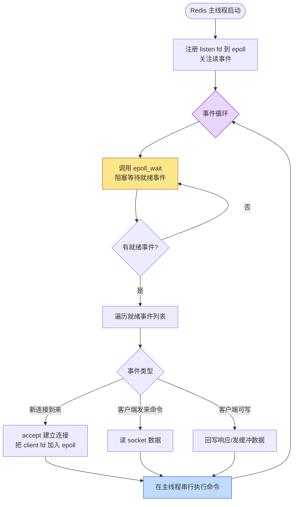

# 📚 Redis epoll 事件循环机制

> **适用场景**:理解 Redis 如何用 epoll 管理海量客户端连接、理解"单线程为何也能扛高并发"。
> **一句话结论**:Redis 主线程跑一个事件循环,核心是 `epoll_wait` —— 有就绪事件就处理,没有就阻塞等待。主线程只管"事件来了就执行",不关心是哪个连接、等了多久。
> **沉淀日期**:2026-08-25

---

## 0. 一张图看懂



> 图解核心：主线程在 `epoll_wait` 处**阻塞等通知**，被唤醒后只处理"已经就绪"的那批事件，处理完回到 `epoll_wait` 继续等。整个循环不关心当前有几个连接、每个连接等了多久，只关心"有没有事件"和"事件该谁来处理"。

---

## 1. epoll 是什么

epoll 是 Linux 内核提供的高性能 **I/O 多路复用机制**，让一个线程能同时"盯着"大量文件描述符(fd)，谁的数据准备好了就通知谁，而不是傻等一个连接。

> 旧的 `select`/`poll` 每次调用都要把全部 fd 拷到内核、再线性扫描一遍，连接一多就拖垮性能。epoll 用内核里维护的**就绪队列**解决了这个问题。

三个核心 API：

| API | 作用 | 类比 |
|---|---|---|
| `epoll_create` | 在内核创建一个 epoll 实例，返回 fd | 建了个"登记处" |
| `epoll_ctl` | 增删改某个 fd 的事件监听（注册/注销连接） | 在登记处挂上/摘下某个连接 |
| `epoll_wait` | 阻塞等待，直到有就绪事件，返回就绪列表 | 问登记处"现在谁好了" |

**关键点**：fd 就绪是内核帮忙判断的（数据到了缓冲区、可写了等），`epoll_wait` 只是**取走结果**，不需要轮询全部连接，复杂度 O(就绪数) 而非 O(总连接数)。

## 2. Redis 怎么用 epoll 管理连接

Redis 不直接写 `epoll_ctl`，而是封装了一层**统一的多路复用抽象**，在 `src/ae.c` 里定义事件循环（`aeEventLoop`），底层按平台挑实现：

- Linux → `ae_epoll.c`（epoll）
- macOS → `ae_kqueue.c`（kqueue）
- 兜底 → `ae_select.c`（select）

> 所以 epoll 是 Redis 在 Linux 上的"具体实现"，对上层事件循环来说是个可替换的机制。

每个被监听的 fd 注册时挂两个回调（在 `ae.c` 里）：

| 事件 | 触发时机 | Redis 的回调动作 |
|---|---|---|
| **读就绪 (AE_READABLE)** | 有新连接 / socket 收到数据 | `acceptTcpHandler` 建连 或 `readQueryFromClient` 读命令 |
| **写就绪 (AE_WRITABLE)** | 客户端可写、有待发送的响应 | `writeToClient` 把输出缓冲区刷出去 |

新连接的流程：`epoll_wait` 通知 listen fd 读就绪 → 主线程 `accept` 拿到新的 client fd → 用 `epoll_ctl(ADD)` 把这个新 fd 也注册进 epoll。**连接是动态增删的，但事件循环始终是那一个主线程在跑。**

## 3. 主线程的事件循环(epoll_wait 在哪)

主线程的入口是 `main()` → `aeMain()`，核心就是一个 `while` 循环（`ae.c` 的 `aeProcessEvents`），每一轮做三件事：

1. **算超时**：找最近一个该执行的时间任务(beforesleep 之后的定时任务)，作为 `epoll_wait` 的最长等待时间，避免事件循环睡过头。
2. **`epoll_wait`**：阻塞在这个调用上，**没有事件就一直等**，有就绪事件才被内核唤醒并返回就绪列表。
3. **处理就绪事件 + 时间事件**：依次调用每个就绪 fd 注册的回调；再跑到点的定时任务(如过期 key 清理、统计)。

> 这正是你描述的："主线程调用 `epoll_wait`，有就绪的就执行，没有就等待；不关心有几个连接、等了多久，只管执行。"

用伪代码浓缩：

```c
// aeMain 的本质 —— Redis 主线程的一生
while (!eventLoop->stop) {
    aeProcessEvents();          // 内部:
    //   1. beforeSleep()       // 写 AOF / 发回复缓冲等"睡前工作"
    //   2. timeout = 下个定时任务的到期时间
    //   3. n = epoll_wait(..., timeout)   // 阻塞等,有事件才返回
    //   4. for i in n: 调用该就绪 fd 的读/写回调
    //   5. 跑到点的时间事件
}
```

`beforeSleep` 是个小细节：每次进 `epoll_wait` 之前先做完"刷盘、发待回复"等动作，保证延迟敏感的操作不堆积。

## 4. "不关心有几个、等了多久"——为什么这样设计

"不关心有几个、等了多久" 这句话点透了 epoll + 事件循环的设计精髓：

- **数量无关**：连接再多，`epoll_wait` 只返回真正就绪的那批，复杂度跟**就绪数**挂钩，跟**总连接数**解耦。10 万空闲连接也不增加单轮开销。
- **时间无关**：等待期间主线程完全在内核态阻塞（不占 CPU 轮询），被唤醒的时机由内核决定，主线程不需要自己计时或轮询。设 timeout 只是为了不漏掉定时任务。
- **执行模型简单**：主线程只做一件事——拿就绪事件 → 跑回调。逻辑线性、无锁、无并发竞争，这也是 Redis 单线程能保持代码简单且快的根本。

代价是：**所有命令在主线程串行执行**，一条慢命令会卡住整个循环。所以 Redis 才反复强调"命令必须 O(1)/O(log n)"，并把持久化、大 key 删除等重活尽量挪到后台线程 / 子进程。

## 5. 容易混淆的几个点

- **epoll ≠ Redis 全部 I/O 模型**：epoll 只是 Linux 上的实现，Redis 用 `ae.c` 抽象层适配 epoll/kqueue/select，机制统一、底层可换。
- **"单线程"指命令执行**：真正单线程的是"读命令 → 执行 → 写回复"这条核心链路；epoll_wait 也在主线程。但 Redis 6.0+ 的 **I/O 多线程** 只是多线程读写 socket 数据，**命令执行仍在主线程**，所以并发安全模型没变。
- **epoll_wait 不是忙等**：没有事件时线程让出 CPU 阻塞，不是空转轮询，这是它高并发的关键，别和 `select` 的轮询混为一谈。
- **"等了多久"为什么无所谓**：因为 epoll 用内核的就绪队列"通知"，而不是 Redis 主动去问每个连接；谁就绪了谁进队列，主线程只取队列里的。

## 6. 一句话记忆

> **一句话记忆**：epoll 管连接，主线程管执行；`epoll_wait` 等通知，有就绪就干活，没有就睡觉——线程不数连接、不数时间，只问一句"现在谁好了"。

---

## 附：关键代码位置

| 文件 | 作用 |
|---|---|
| `src/ae.c` | 事件循环抽象层 `aeEventLoop` / `aeMain` / `aeProcessEvents` |
| `src/ae_epoll.c` | Linux 下 epoll 实现（`aeApiAddEvent`/`aeApiPoll`） |
| `src/networking.c` | `acceptTcpHandler` 建连、`readQueryFromClient` 读命令、`writeToClient` 写回复 |

## 参考

- Redis 源码 `src/ae.c`、`src/ae_epoll.c`、`src/networking.c`
- `epoll(7)` Linux man page
- 《Redis 设计与实现》——事件机制章节
