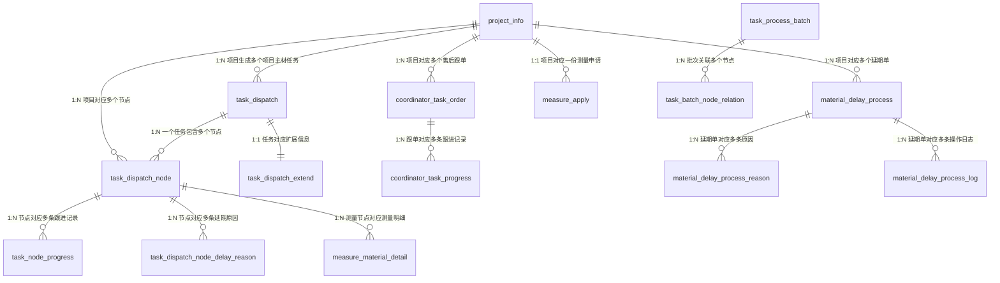
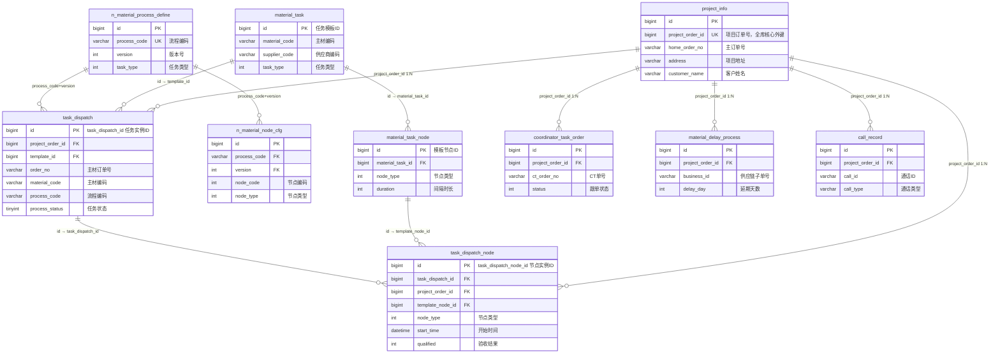

---

## 一、全库表分类清单
### 分类规则回顾
- **A类**：核心业务主表，独立业务实体，重点梳理
- **B类**：关联/明细表，依附A类主表存在，跟着主表一起梳理
- **C类**：配置/日志/同步/支撑表，按需查阅
- **D类**：废弃/无数据表，暂时搁置

| 表名                                             | 表分类 | 表说明                               | 核心关联键                                          |
| :--------------------------------------------- | :-- | :-------------------------------- | :--------------------------------------------- |
| **A类-核心业务主表（共6张）**                             |     |                                   |                                                |
| project_info                                   | A类  | 项目信息表，全库根实体，存储家装项目核心基础信息          | project_order_id（全局唯一关联键）                      |
| task_dispatch                                  | A类  | 主材任务派发表，任务维度核心实体，每个主材对应一条任务       | id（任务主键）、project_order_id                      |
| task_dispatch_node                             | A类  | 任务节点实例表，流程流转最小执行单元，存储节点状态/时间/执行人  | id（节点主键）、task_dispatch_id、project_order_id     |
| coordinator_task_order                         | A类  | 返补跟单任务表，售后返补业务主单据                 | id（跟单主键）、project_order_id、ct_order_no          |
| material_delay_process                         | A类  | 主材延期单表，正式延期申请主单据，带审批流程            | id（延期单主键）、project_order_id                     |
| measure_apply                                  | A类  | 测量申请单表，测量业务申请主单据                  | id（申请单主键）、project_order_id                     |
| **B类-关联/明细表（共22张）**                            |     |                                   |                                                |
| task_dispatch_extend                           | B类  | 任务扩展表，1:1依附任务主表，存储用量/变更单/SKU等扩展字段 | task_dispatch_id                               |
| task_node_progress                             | B类  | 节点进度跟进表，存储异常/延期节点的多次督办记录          | task_dispatch_node_id、project_order_id         |
| task_process_batch                             | B类  | 任务批次表，同类型节点批量调度的业务载体              | project_order_id                               |
| task_batch_node_relation                       | B类  | 批次-节点关联表，批次与节点的多对多映射              | task_batch_id、task_dispatch_node_id            |
| task_dispatch_node_delay_reason                | B类  | 节点延期原因记录表，存储节点延期的标准化原因            | task_dispatch_node_id                          |
| task_dispatch_node_report_relation             | B类  | 节点验收报告关联表，节点与验收报告的映射              | task_dispatch_node_id                          |
| task_estimated_time_change_log                 | B类  | 考核时间变更日志，节点预估/考核时间的调整记录           | task_dispatch_node_id                          |
| task_handle_extension                          | B类  | 任务处理扩展表，存储打卡经纬度等外勤校验数据            | task_dispatch_node_id                          |
| design_review_alteration                       | B类  | 设计复核变更属性表，存储设计复核节点的专属字段           | task_dispatch_node_id                          |
| coordinator_task_progress                      | B类  | 返补跟单进展表，存储跟单的多次跟进记录               | coordinator_task_id                            |
| coordinator_task_order_unit                    | B类  | 跟单单元表，存储跟单下的主材明细单元                | coordinator_task_order_id                      |
| coordinator_retail_record                      | B类  | 纯零售跟单记录表，零售场景专属跟单记录               | ct_order_no                                    |
| material_delay_process_log                     | B类  | 延期单操作日志，存储延期单全流程操作记录              | material_delay_process_id                      |
| material_delay_process_reason                  | B类  | 延期原因明细表，一条延期单对应多条原因明细             | material_delay_process_id                      |
| measure_material_detail                        | B类  | 测量详情表，存储测量节点提交的图片、备注              | task_dispatch_node_id                          |
| measure_material_unit                          | B类  | 测量单元表，存储测量的SKU明细、属性值              | task_dispatch_id                               |
| measure_apply_operate_log                      | B类  | 测量申请操作日志，存储测量申请的增删改记录             | project_order_id                               |
| call_record                                    | B类  | 通话记录表，存储项目相关的所有通话、录音记录            | project_order_id                               |
| task_select_category                           | B类  | 选材明细表，存储项目的主材选材记录                 | project_order_id                               |
| self_buy_remind_record                         | B类  | 业主自购提醒记录表，存储自购提醒的发送状态             | project_order_id                               |
| notice_time_history                            | B类  | 通知时间修改历史，存储通知时间的人工调整记录            | task_dispatch_node_id                          |
| notice_task_info                               | B类  | 通知任务信息表，存储专项通知的发送记录               | project_order_id、biz_id                        |
| **C类-配置/支撑表（共54张，分4子类）**                       |     |                                   |                                                |
| ▶ 新一代流程配置（n_前缀，核心配置体系）                         |     |                                   |                                                |
| n_material_template                            | C类  | 用工任务模板主表，流程模板顶层基础配置               | id（模板主键）                                       |
| n_material_template_unit                       | C类  | 模板维度绑定表，按城市/分公司/套餐/主材绑定模板         | template_id、material_code                      |
| n_material_process_define                      | C类  | 流程定义主表，每套流程的核心入口配置                | process_code + version（流程唯一标识）                 |
| n_material_node_cfg                            | C类  | 节点定义表，定义流程包含的所有节点基础属性             | process_code + version、node_code               |
| n_material_task_cfg                            | C类  | 节点业务配置表，定义执行角色、重启、合并等规则           | process_code + version、node_id                 |
| n_material_route                               | C类  | 流程路由表，定义节点间的流转连线与条件分支             | process_code + version、source_code/target_code |
| n_material_route_time                          | C类  | 路由时间配置表，定义连线上的时间间隔规则              | route_id                                       |
| n_material_node_transfer_condition             | C类  | 节点流转条件表，定义节点激活的前置依赖               | node_id                                        |
| n_material_time_cfg                            | C类  | 考核时间配置表，平台/首次/重启三类考核规则            | process_code + version、node_code、time_type     |
| n_material_time_relation                       | C类  | 考核时间依赖表，定义考核时间的计算基准锚点             | time_id                                        |
| n_material_time_calculate_rule_cfg             | C类  | 节点耗时配置表，定义作业耗时的计算规则               | node_id                                        |
| n_material_period_calculate_hit_craft_cfg      | C类  | 工艺耗时规则表，特殊工艺对应的耗时增量               | node_period_calculate_rule_id                  |
| n_material_period_calculate_hit_house_cfg      | C类  | 户型耗时规则表，房屋类型对应的耗时增量               | node_period_calculate_rule_id                  |
| n_material_push_cfg                            | C类  | 节点推送配置表，定义节点各时机的通知规则              | process_code + version、node_code               |
| n_material_branch                              | C类  | 任务分支表，定义流程中的分支选项                  | branch_code                                    |
| n_material_branch_condition                    | C类  | 分支条件表，定义每个分支的判断条件                 | branch_code                                    |
| n_material_edge                                | C类  | 流程画布坐标表，存储流程图可视化坐标数据              | process_code + version                         |
| n_material_cfg_log                             | C类  | 配置变更日志表，存储所有流程配置的修改记录             | template_code、process_code                     |
| n_material_template_copy_log                   | C类  | 模板复制日志表，存储模板复制操作记录                | source_template_id                             |
| n_material_process_template                    | C类  | 调度流程模板配置表，调度层面的模板基础配置             | template_id                                    |
| n_material_task_process_template               | C类  | 任务节点模板配置表，细粒度节点模板配置               | process_template_id                            |
| ▶ 旧版兼容配置（历史过渡用）                                |     |                                   |                                                |
| material_flow_rule                             | C类  | 旧版材料流程规则主表                        | rule_id                                        |
| material_flow_rule_category                    | C类  | 旧版流程品类规则表                         | rule_id、category_id                            |
| material_flow_rule_unit                        | C类  | 旧版流程维度绑定表                         | rule_id                                        |
| material_flow_rule_template_mapping            | C类  | 旧规则与新模板映射表                        | rule_id、n_template_code                        |
| material_flow_rule_template_record             | C类  | 旧规则修改记录表                          | rule_id                                        |
| delivery_flow_rule                             | C类  | 排程流程规则主表（送货专项）                    | delivery_process_cfg_id                        |
| delivery_flow_rule_category                    | C类  | 排程流程品类规则表                         | rule_id                                        |
| delivery_flow_rule_unit                        | C类  | 排程流程维度绑定表                         | rule_id                                        |
| material_task                                  | C类  | 早期任务模板主表                          | id                                             |
| material_task_node                             | C类  | 早期任务节点模板表                         | material_task_id                               |
| material_task_node_time                        | C类  | 早期节点时间配置表                         | template_node_id                               |
| material_task_node_time_relation               | C类  | 早期时间依赖关系表                         | template_node_time_id                          |
| cfg_material_task_route                        | C类  | 通用任务路由配置表                         | source_id、target_id                            |
| ▶ 基础业务配置                                       |     |                                   |                                                |
| stock_up                                       | C类  | 主材备货周期主表，按主材+供应商配置标准周期            | id、material_code、supplier_code                 |
| stock_up_condition_rule                        | C类  | 备货周期条件规则表，带条件的周期明细                | stock_up_id                                    |
| n_holiday_cfg                                  | C类  | 假期配置主表，节假日/请假全局配置                 | id                                             |
| n_holiday_cfg_detail                           | C类  | 假期配置明细表，按分公司/品类/节点维度细化            | holiday_cfg_id                                 |
| cfg_measure_template                           | C类  | 测量模板配置表，定义测量需填写的属性                | category_id                                    |
| cfg_measure_attr_used                          | C类  | 历史测量属性表，存储历史使用的属性枚举               | attr_id                                        |
| material_measure_interface_config              | C类  | 测量交界面配置主表，测量作业标准规范                | id                                             |
| material_measure_interface_config_category_rel | C类  | 交界面-类目节点关系表                       | rule_id、category_code                          |
| material_measure_interface_config_mdm_rel      | C类  | 交界面-分公司关系表                        | rule_id、mdm_code                               |
| measure_apply_range_type_config                | C类  | 测量范围配置表，定义签前/签后测量范围               | type、material_code                             |
| material_payment_intercept_config              | C类  | 付款拦截配置表，定义尾款拦截的品类范围               | material_code                                  |
| ▶ 系统支撑/日志/同步                                   |     |                                   |                                                |
| operation_log                                  | C类  | 通用操作日志表，全系统用户操作日志                 | user_id、trace_id                               |
| operation_audit                                | C类  | 操作审核表，需审批的业务操作记录                  | biz_key                                        |
| task_create_fail_reason                        | C类  | 任务创建失败表，存储任务自动生成失败的错误记录           | project_order_id                               |
| refresh_data_log                               | C类  | 刷数操作日志表，存储数据修复、批量刷数记录             | project_order_id                               |
| retry_delay_queue                              | C类  | 重试延迟队列表，存储异步失败的重试任务               | message_id                                     |
| event_pub                                      | C类  | 事件发布表，本地消息表，对外发布业务事件              | event_id、event_context_key                     |
| event_sub                                      | C类  | 事件订阅表，接收上游系统事件消息                  | event_id、event_type                            |
| oms_message_sync                               | C类  | OMS消息同步表，存储OMS同步的节点状态             | project_order_id、order_no                      |
| supplier_sync_info                             | C类  | 供应商数据同步表，存储供应商侧配送信息               | task_dispatch_node_id                          |
| thirdparty_data                                | C类  | 第三方数据表，存储外部系统缓存数据                 | type、business_key                              |
| delay_reason_recovery_record                   | C类  | 延期原因回收表，LLM标准化归类的原因数据             | recovery_key                                   |
| message_send_job                               | C类  | 通知发送任务表，存储节点触发的定时通知               | task_dispatch_id、task_dispatch_node_id         |
| **D类-废弃/无数据表（共2张）**                            |     |                                   |                                                |
| n_material_define                              | D类  | 旧版主材模板定义表                         | 注释标注“无用-线上无数据”，已被新配置体系替代                       |
| quotation_booking_scope                        | D类  | 旧版报价单下单范围表                        | 注释标注“无用-线上无数据”，历史废弃                            |

---

## 二、核心表关联关系草图
仅保留A类核心主表 + 关键B类表，突出全库主干关联，`project_order_id` 是全局串联主键。

---

## 三、快速梳理建议
1. **第一步（核心）**：吃透6张A类表的字段与业务含义，掌握 `project_order_id → task_dispatch → task_dispatch_node` 这条主链路
2. **第二步（配套）**：对应每个A类主表，查看它的B类明细表，比如看节点就顺便看节点延期原因、节点跟进记录
3. **第三步（按需）**：需要查配置规则时再翻C类表，优先查n_前缀的新一代配置，旧版配置只在兼容历史数据时关注
4. **第四步（忽略）**：D类2张表直接跳过，不用投入精力

# 家装主材履约系统（starlord）库表关系全解析
## 一、整体架构与核心关联键
这套数据库围绕**「项目订单 → 流程模板 → 任务实例 → 节点执行 → 业务扩展 → 日志留痕」**的主材履约主链路设计，覆盖配置、执行、跟单、延期、通知、审计全场景。

全库核心串联字段：
| 层级 | 字段 | 作用 |
|------|------|------|
| 顶层项目 | `project_order_id` | 项目订单唯一标识，串联所有业务表 |
| 任务层 | `task_dispatch_id` | 主材任务实例主键，串联任务下所有节点与扩展 |
| 节点层 | `task_dispatch_node_id` | 执行节点实例主键，节点级数据的关联键 |
| 配置层 | `process_code` + `version` | 新版流程定义唯一标识，串联所有流程配置子表 |
| 维度键 | `material_code` / `supplier_code` | 主材品类、供应商编码，跨表关联业务主体 |

---

## 二、核心表关系 Mermaid 逻辑图

---

## 三、分模块逐表详解
### 1. 项目主数据层（1张）
#### project_info（项目信息表）
- **存储内容**：家装项目的基础主数据，包含项目订单号、主订单号、省市县区划、地址、客户姓名与UCID、房屋属性（楼层、电梯）、商户信息等。
- **关联映射**：通过 `project_order_id` 向下关联所有任务、跟单、延期、通话等业务表，是全库的顶层根表。

---

### 2. 任务模板配置层（14张）
分为老版模板体系和新版流程配置体系，定义任务的节点、时间、流转规则，是实例生成的配置依据。

#### 2.1 老版任务模板
| 表名                                 | 存储内容                                   | 核心关联键                                      | 映射关系                                                               |
| ---------------------------------- | -------------------------------------- | ------------------------------------------ | ------------------------------------------------------------------ |
| `material_task`                    | 主材任务模板主配置，定义主材+供应商+任务类型的任务规则、激活方式、批次规则 | `id`（模板主键），`material_code`+`supplier_code` | 被 `task_dispatch` 通过 `template_id` 引用；下连 `material_task_node`      |
| `material_task_node`               | 任务模板的节点定义，包含节点类型、关联关系、时间间隔、执行角色、重启规则   | `material_task_id`                         | 上连 `material_task`；被 `task_dispatch_node` 通过 `template_node_id` 引用 |
| `material_task_node_time`          | 模板节点的考核时间规则，区分平台/首次/重启三类考核，定义间隔时长与时间类型 | `template_node_id`                         | 上连 `material_task_node`                                            |
| `material_task_node_time_relation` | 考核时间的依赖条件，定义时间计算依赖的关联节点与依赖类型           | `template_node_id`、`template_node_time_id` | 上连节点与时间配置表                                                         |

#### 2.2 新版流程配置（n开头）
| 表名 | 存储内容 | 核心关联键 | 映射关系 |
|------|----------|------------|----------|
| `n_material_process_define` | 流程定义主表，一套完整的主材任务流程，包含编码、版本、任务类型、适用范围、配送方式 | `process_code` + `version`（唯一标识） | 流程配置体系的根表，下连所有节点、路由、时间、推送子表；被 `task_dispatch` 引用生成实例 |
| `n_material_node_cfg` | 流程下的节点配置，定义节点编码、类型、激活规则、扩展属性 | `process_code` + `version` | 上连流程定义表 |
| `n_material_route` | 节点间流转路由规则，定义源→目标节点的流转条件、规则表达式、配送方式 | `process_code` + `version`，`source_code`/`target_code` | 上连流程定义与节点配置 |
| `n_material_route_time` | 路由连线的时间依赖规则，定义流转前置条件、间隔时长、时间类型 | `route_id` | 上连 `n_material_route` |
| `n_material_task_cfg` | 节点的执行配置，包含角色、操作项、重启规则、合并规则、送装一体标识 | `process_code` + `version` + `node_code` | 上连流程定义与节点配置 |
| `n_material_time_cfg` | 节点考核时间规则，定义间隔、截止规则、条件限制 | `process_code` + `version` + `node_code` | 上连流程定义与节点配置 |
| `n_material_time_relation` | 考核时间的依赖关联，定义时间计算依赖的关联节点与类型 | `time_id`，`process_code` + `version` + `node_code` | 上连时间配置表 |
| `n_material_push_cfg` | 节点消息推送规则，定义通知时机、对象、提前量、方式 | `process_code` + `version` + `node_code` | 上连流程定义与节点配置 |
| `n_material_node_transfer_condition` | 节点激活/流转条件配置，包含条件类型、履约类型、时间规则 | `node_id`，`process_code` | 上连节点配置表 |
| `n_material_edge` | 流程画布坐标与拐点数据，存储流程图可视化布局 | `process_code` + `version` | 上连流程定义表 |

#### 2.3 流程规则系列
- **`material_flow_rule` / `delivery_flow_rule`**：材料流程规则主表，定义规则基础信息与状态
- **`material_flow_rule_category` / `delivery_flow_rule_category`**：品类维度的流程规则，关联品类、供应商、节点流程
- **`material_flow_rule_unit` / `delivery_flow_rule_unit`**：规则维度单元，按订单版本、业务类型、分公司、套餐维度生效
- **`material_flow_rule_template_mapping`**：流程规则与测量模板的映射关系
- **`material_flow_rule_template_record`**：流程模板修改操作日志
- **关联逻辑**：通过 `rule_id` 串联主表与子表，按品类、分公司、套餐匹配生效规则

---

### 3. 任务实例执行层（核心运行时，3张主表+扩展）
#### task_dispatch（项目主材任务实例表）
- **存储内容**：履约任务运行时主表，每个项目下每个主材对应一条任务实例，包含订单号、品类供应商、流程版本、当前节点、任务状态、激活时间等。
- **关联映射**：
  - 向上：`project_order_id` 连项目，`template_id` 连任务模板，`process_code`+`version` 连流程定义
  - 向下：`id`（task_dispatch_id）作为主键，关联所有节点、扩展、进度、延期等子表

#### task_dispatch_node（项目主材任务节点实例表）
- **存储内容**：任务下每个执行节点的实例数据，包含节点类型、执行角色、预估/实际/考核时间、验收结果、执行状态、重启次数、附件备注等，是履约执行的最小单元。
- **关联映射**：
  - 向上：`task_dispatch_id` 连任务主表，`template_node_id` 连模板节点
  - 向下：`id`（task_dispatch_node_id）关联延期、验收、通知、进度等节点级表

#### task_dispatch_extend（主材任务扩展表）
- **存储内容**：任务扩展属性，包含用量确认、变更单号、下单状态、SKU信息等补充字段。
- **关联映射**：`task_dispatch_id` 一对一关联任务主表。

---

### 4. 测量业务模块（6张）
| 表名 | 存储内容 | 核心关联键 | 映射关系 |
|------|----------|------------|----------|
| `cfg_measure_template` | 测量模板配置，按类目、组合空间定义测量属性JSON | `category_id`、`combinatorial_space_id` | 被测量业务引用生成测量单 |
| `cfg_measure_attr_used` | 历史使用的任务属性归档 | `attr_id` | 属性字典表 |
| `measure_apply` | 项目测量申请主单，区分签前/签后测量，记录测量范围与状态 | `project_order_id` | 上连项目表 |
| `measure_apply_operate_log` | 测量申请的变更操作日志，记录主材/供应商的增删 | `project_order_id`，`material_code`+`supplier_code` | 上连测量申请表 |
| `measure_apply_range_type_config` | 不同测量类型默认包含的主材/供应商范围配置 | `type`，`material_code`+`supplier_code` | 测量范围字典配置 |
| `measure_material_detail` | 测量节点详情数据，包含图片、备注 | `task_dispatch_id`、`task_dispatch_node_id` | 上连任务节点 |
| `measure_material_unit` | 测量后物料单元数据，包含类目、空间、SKU、属性值 | `task_dispatch_id`、`category_id`、`combinatorial_space_id` | 上连任务与测量模板 |

---

### 5. 返补跟单模块（4张）
| 表名 | 存储内容 | 核心关联键 | 映射关系 |
|------|----------|------------|----------|
| `coordinator_task_order` | 售后返补跟单工单主表，记录问题描述、解决方案、状态、下单参数等 | `project_order_id`、`ct_order_no` | 上连项目；下连跟单单元、进度表 |
| `coordinator_task_order_unit` | 返补工单物料单元明细，拆分每个主材+供应商的返补项 | `coordinator_task_order_id` | 上连跟单主表 |
| `coordinator_task_progress` | 跟单状态流转日志，记录状态变更、备注、附件、下次跟进时间 | `coordinator_task_id` | 上连跟单主表 |
| `coordinator_retail_record` | 纯零售场景跟单记录，包含CT单号、地址、客户、品类 | `ct_order_no`（唯一） | 零售场景独立主表 |

---

### 6. 延期管理模块（5张）
| 表名 | 存储内容 | 核心关联键 | 映射关系 |
|------|----------|------------|----------|
| `material_delay_process` | 主材延期申请主表，记录延期天数、进场日期、提交/审批/确认流程与状态 | `project_order_id`、`business_id` | 上连项目；下连延期日志、原因表 |
| `material_delay_process_log` | 延期单操作流转日志，记录提交、通过、驳回、确认等操作 | `material_delay_process_id` | 上连延期主表 |
| `material_delay_process_reason` | 延期原因明细，记录原因类型、天数、备注、图片凭证 | `material_delay_process_id` | 上连延期主表 |
| `task_dispatch_node_delay_reason` | 节点维度延期原因记录，存储原因枚举组合与备注 | `task_dispatch_id`、`task_dispatch_node_id` | 上连任务节点 |
| `delay_reason_recovery_record` | 延期原因标准化回收数据，包含原始信息、LLM处理过程、标准化原因 | `recovery_type`+`recovery_key` | 关联对应业务对象，用于分析优化 |

---

### 7. 供应链与备货模块（4张）
| 表名 | 存储内容 | 核心关联键 | 映射关系 |
|------|----------|------------|----------|
| `stock_up` | 主材各环节周期配置，定义测量/复尺/备货/送货/安装周期 | `material_code`+`supplier_code` | 周期配置主表 |
| `stock_up_condition_rule` | 备货周期前置条件规则，定义节点间时间依赖与间隔 | `stock_up_id` | 上连备货周期主表 |
| `supplier_sync_info` | 供应商侧履约数据同步，包含接单时间、配送时间、备注 | `task_dispatch_node_id`、`order_no` | 上连任务节点 |
| `oms_message_sync` | OMS系统消息同步记录，包含节点状态、到货时间、验收结果 | `project_order_id`、`order_no` | 上下游系统同步中间表 |

---

### 8. 通知消息模块（5张）
| 表名 | 存储内容 | 核心关联键 | 映射关系 |
|------|----------|------------|----------|
| `call_record` | 项目通话全量记录，包含类型、时间、接通状态、时长、主被叫、录音地址 | `project_order_id`、`call_id` | 上连项目表 |
| `message_send_job` | 节点消息发送定时任务配置，定义通知时机、对象、提前量 | `task_dispatch_id`、`task_dispatch_node_id` | 上连任务节点 |
| `notice_task_info` | 业务通知发送记录，如送货异常提醒，记录接收人与状态 | `biz_type`+`biz_id`、`project_order_id` | 关联对应业务对象 |
| `notice_time_history` | 通知时间人工调整历史，记录前后时间、原因、凭证、操作人 | `task_dispatch_node_id` | 上连任务节点 |
| `self_buy_remind_record` | 业主自购材料提醒发送记录 | `project_order_id` | 上连项目表 |

---

### 9. 事件与重试机制（3张）
| 表名 | 存储内容 | 核心关联键 |
|------|----------|------------|
| `event_pub` | 事件发布消息表，存储待发布的业务事件，含事件ID、类型、内容、状态 | `event_id`（唯一）、`event_context_key` |
| `event_sub` | 事件订阅消费表，存储接收的事件用于本地处理 | `event_id`（对应发布侧） |
| `retry_delay_queue` | 异步任务延迟重试队列，存储待重试消息、参数、执行时间、重试次数 | `message_id`（唯一）、`process_code` |

---

### 10. 系统配置与规则（12张）
1.  **路由配置**：`cfg_material_task_route` 材料任务路由基础配置
2.  **交界面配置**：
    - `material_measure_interface_config` 交界面主配置（要求+示例图）
    - `material_measure_interface_config_category_rel` 按类目、节点关联
    - `material_measure_interface_config_mdm_rel` 按分公司关联
3.  **付款拦截**：`material_payment_intercept_config` 送货安装付款拦截规则
4.  **分支配置**：`n_material_branch`、`n_material_branch_condition` 任务分支与条件规则
5.  **耗时计算**：
    - `n_material_time_calculate_rule_cfg` 节点耗时主配置
    - `n_material_period_calculate_hit_craft_cfg` 特殊工艺耗时增量
    - `n_material_period_calculate_hit_house_cfg` 房屋/户型耗时增量
6.  **假期配置**：`n_holiday_cfg`、`n_holiday_cfg_detail` 假期配置与维度明细，用于工期计算剔假
7.  **用工模板**：`n_material_template`、`n_material_template_unit`、`n_material_template_copy_log` 用工模板与复制日志
8.  **设计复核**：`design_review_alteration` 设计复核任务变更标记

---

### 11. 日志、审计与工具表（13张）
| 表名 | 作用 |
|------|------|
| `operation_log` | 通用操作日志，记录用户、请求响应、IP、trace_id |
| `operation_audit` | 审批流程记录，关联流程定义与实例 |
| `refresh_data_log` | 数据刷数操作日志，追溯数据修复 |
| `n_material_cfg_log` | 配置变更日志，记录模板/流程改动 |
| `task_create_fail_reason` | 任务创建失败异常记录，用于问题排查 |
| `task_estimated_time_change_log` | 考核时间变更历史 |
| `task_handle_extension` | 任务处理扩展数据，如定位信息 |
| `task_node_progress` | 节点跟进进展，含延期原因、责任方 |
| `task_process_batch` | 批量任务分组信息 |
| `task_batch_node_relation` | 批次与节点关联关系 |
| `task_select_category` | 项目选材明细 |
| `thirdparty_data` | 第三方系统临时数据存储 |
| `quotation_booking_scope` / `n_material_define` | 历史废弃表，线上无数据 |

---

## 四、整体数据流转总结
1.  **配置层**：预先定义任务模板、流程节点、时间规则、分支条件等配置；
2.  **生成实例**：项目下单后，基于配置生成 `task_dispatch` 任务实例与 `task_dispatch_node` 节点实例；
3.  **执行流转**：节点按流程规则依次激活执行，过程中产生测量数据、供应商同步、通话、通知等业务数据；
4.  **异常处理**：出现售后、延期时，生成返补工单、延期单，关联对应任务与节点；
5.  **数据留痕**：所有配置变更、操作、审批、刷数均有对应日志表记录，可追溯。

整条链路通过 `project_order_id → task_dispatch_id → task_dispatch_node_id` 三级主键层层串联，配置与实例通过 `process_code+version` / `template_id` 解耦，支撑家装主材履约的全流程数字化管理。

---
## 相关文档

- [[starlord数据库表/所有的starlord数据库表]] — 全库分层目录（含分类明细）
- [[starlord数据库表/starlord10张核心数据库表]] — A类核心表完整分析
- [[starlord数据库表/数据库个人总结]] — 个人接口→表映射速查