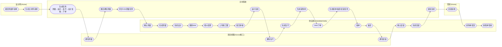

440402076619780096 欧派/定制橱柜 覆盖场景：单独送货、供应商安装

```
预发炯熙账号：13018208201        888888淑娇：        18211057699孙士庆： 18401201995孙艳萍：        18518633381  管家王甜：        18519303851   设计师 项目id： 搜到0096 刘丹  1760104123826017362 崔征云 设计师 1381014366026795960 张永杰 装修工程项目经理 1880011155426595428 张翠苹 管家 1369108082026041962 陈炯熙 管家 1301820820126594595 孙艳萍 管家 18518633381   管家验收使用26651473 董楠 管家 1520118317526676476 陈欣宇 管家 1300612558326679761 王甜 管家 1851930385126769666 毛焱 管家 1348887502628971142 李剑颖 管家 1851470370729162330 焦捷敏 管家 1511792462329350845 连朋朋 管家 1829571158126680681 王晋 套餐设计师 1870019954026604605 刘海龙  18301580160
```

# 一、设计师提交测量申请单

### 1、进入项目详情页


### 2、点击“主材申请单”球区

/assign/pages/apply-measure?projectOrderId=440402076619780096&packageId=69&progress=300


签前测量时间：

签前申请范围：

签后申请范围：

问题：签前申请范围与签后申请范围的区别

### 3、下拉框选择 “欧派-定制橱柜”


### 4、点击“提交”按钮，保存测量申请单并生成主材任务

```

http://preview.steward.home.ke.com/assign-proxy/utopia-hestia/api/designer/measure-apply/operate

```

保存测量申请单：measure_apply

生成主材任务：测量、设计、复尺、设计复核、下单

### 5、点击主材进展，查看主材进度


```
GET http://preview01-i.scm-north-gateway.home.ke.com/edar-starlord/material-task/dispatch/material-progress?projectOrderId=440402076619780096
```

# 二、完成任务

## 1、  设计师在Home完成通知测量任务

### 1.1 进入任务详情页面


```
POST http://preview.igateway.home.ke.com/eden-butler-api/api/material-task/dispatch/material-task-order-detail{"materialCode":"101003","projectOrderId":"440402076619780096","supplierCode":"500207"}
```

### 1.2 点击“去处理”按钮


```
// 调接口获取时间下拉的最早可选择范围POST http://preview.igateway.home.ke.com/utopia-workcenter-biz-api/dispatch/common/visit-time-limit{"taskDispatchNodeIds":["2344592"]}
```

### 1.3 选择时间，点击“提交”按钮


```
POST http://preview01-i.scm-north-gateway.home.ke.com/edar-starlord/material-task/dispatch/handle{"qualified":null,"images":[],"remarks":"完成","taskDispatchNodeId":"2344592","noticeRetainTime":"2022-10-27 00:00:00"}
```

完成通知测量的同时，会激活测量任务，由于角色是供应商，会将测量任务同步给VSS，供应商可在VSS页面操作

### 1.4 修改期望上门时间（非必须）


```
POST http://preview.igateway.home.ke.com/eden-butler-api/starlord/dispatch/common/change-appoint{"currentNoticeTime":"2022-10-28 00:00:00","remarks":"","taskDispatchNodeId":"2344592"}
```

## 2、  供应商在VSS完成测量任务

### 2.1 进入主材任务列表，点击“确认”按钮


### 2.2 填写计划完成时间，点击“提交”按钮


● 供应商的计划完成时间会参照设计师填写的期望完成时间 和 主材任务计算的考核时间

● 供应商填写的计划完成时间不会同步给主材任务（送货/安装任务的会同步）

### 2.3 点击“处理”按钮，去填写测量结果


### 2.4 提交测量结果，完成测量任务


● 调用主材任务的接口完成测量任务

● 测量结果及图片是否会同步给主材任务？

## 3、供应商在VSS和BIM完成设计任务

### 3.1 进入主材任务列表，点击“处理”按钮

● 与测量任务的区别是，设计任务不用先点击“确认”按钮，也就是不用填写计划完成时间。


处理页面策略接口：http://preview01-vss.home.ke.com/vss-proxy/scm-vss/api/vss/taskCollaboration/installer-task/queryDesignStrategy

详情页面接口：http://preview01-i.scm-south-gateway.ke.com/scm-vss/api/vss/taskCollaboration/detail?gbCode=110000&supplierId=500207&taskId=82084

● “客户是否选品”如果选择“否”，将删除所有的未完成的主材任务。

### 3.2 点击“下一步”跳转到bim，自动创建一个项目变更单

如果有在途的变更单，则跳转失败


● 跳转成功，会自动创建一个需求变更单


### 3.3 发起“报价变更”，添加材料SKU、规格及报价单


### 3.4 点击“提交”按钮，弹出下单勾选窗口


### 3.5 上传施工图原文件


### 3.6 提交报价审核，完成设计任务


|   |   |   |
|---|---|---|
|提供方|bizType|备注|
|shuttle-order|need_change_status_change|提交审核(300)，完成设计任务|
|shuttle-order|need_change_audit_state_change|变更审核单状态变更<br><br>同步更新VSS上的审核状态|
||||

● 在这一步，会完成VSS的设计任务，VSS完成后，再消息通知主材任务的设计任务完成。

### 3.7 返回VSS页面


## 4、项目经理在精工完成 通知复尺 任务


## 5、供应商完成复尺任务（同测量任）

复尺：


对应接口：http://preview01-i.scm-south-gateway.ke.com/scm-vss/api/vss/taskCollaboration/detail?gbCode=110000&supplierId=500207&taskId=82077


提交接口：http://preview01-i.scm-south-gateway.ke.com/scm-vss/api/vss/taskCollaboration/confirmTask


获取测量空间：

http://preview01-i.scm-south-gateway.ke.com/scm-vss/api/vss/taskCollaboration/installer-task/queryMeasureMode?gbCode=110000&taskId=82077


复尺页面待提交：


提交接口：http://preview01-i.scm-south-gateway.ke.com/scm-vss/api/vss/taskCollaboration/installer-task/commitMeasureTask

## 5、完成需求变更单，去oms下单，生成主材任务和采购单


## 6、供应商在VSS完成接单任务


接单：


## 7、供应商在VSS完成备货任务


## 8、项目经理在精工完成通知安装任务


## 9、供应商在VSS完成安装任务

### 9.1 进入任务列表，点击“确认”按钮


### 9.2 填写计划完成时间，并同步给主材任务


### 9.3 填写安装结果，并同步给主材任务

安装结果 成交：


安装结果失败：


### 9.4 管家在Home完成安装验收任务


## 10、供应商操作采购单发货

采购单发货：


采购单：


销售单签收：


二：取消场景流程

取消发变更消息

供应商在vss 测量选品的时候点击“否” vss侧测量任务 状态 ”已完成“ 对应的主材侧的 测量任务状态 “已取消” 设计任务状态 “已取消”


主材侧： 测量、复尺、设计、设计复核、下单 均已取消

home App的任务取消：通过反选将主材申请单（测量申请单）的申请范围置空（反选），进行取消任务。

提交审核前一步 使用小工具将价钱刷为0

```mermaid
flowchart LR

%% ===========================
%% 设计师
%% ===========================
subgraph Designer["👨‍🎨 设计师（Home）"]
direction TB
D1["① 提交主材测量申请单"]
D2["② 保存测量申请单"]
D3["③ 通知测量<br/>填写上门时间"]
end

%% ===========================
%% 主材系统
%% ===========================
subgraph System["⚙️ 主材系统"]
direction TB
S1["生成主材任务<br/>测量→设计→复尺→设计复核→下单"]
S2["激活测量任务<br/>同步VSS"]
S3["自动完成设计任务"]
S4["生成采购单、主材任务"]
end

%% ===========================
%% 项目经理
%% ===========================
subgraph PM["👷 项目经理（精工）"]
direction TB
PM1["⑦ 通知复尺"]
PM2["⑬ 通知安装"]
PM3["填写计划完成时间"]
PM4["填写安装结果"]
end

%% ===========================
%% 供应商
%% ===========================
subgraph Supplier["🏭 供应商（VSS）"]
direction TB

V1["④ 确认测量"]
V2["填写计划完成时间"]
V3["完成测量<br/>填写测量结果"]

V4["⑤ 完成设计任务"]

V5["⑧ 完成复尺"]

V6["⑩ 接单"]

V7["⑪ 备货"]

V8["⑫ 采购单发货"]

end

%% ===========================
%% BIM / OMS
%% ===========================
subgraph Platform["🏗 BIM / OMS"]
direction TB

B1["客户选品"]

B2["自动创建项目变更单"]

B3["发起报价变更"]

B4["添加SKU、规格、报价单"]

B5["提交下单"]

B6["⑥ 审核通过"]

B7["⑨ 完成需求变更单"]

B8["OMS下单"]

end

%% ===========================
%% 管家
%% ===========================
subgraph Steward["🏠 管家（Home）"]
direction TB
H1["⑭ 安装验收"]
end

%% ===========================
%% 流程
%% ===========================

D1 --> D2
D2 --> S1

D3 --> S2

S1 --> D3
S2 --> V1

V1 --> V2
V2 --> V3

V3 --> V4

V4 --> B1
B1 --> B2
B2 --> B3
B3 --> B4
B4 --> B5
B5 --> B6

B6 --> S3

S3 --> PM1

PM1 --> V5

V5 --> B7
B7 --> B8
B8 --> S4

S4 --> V6
V6 --> V7
V7 --> V8

V8 --> PM2

PM2 --> PM3
PM3 --> PM4

PM4 --> H1

%% ===========================
%% 样式
%% ===========================

classDef designer fill:#D6EAF8,stroke:#2E86C1;
classDef system fill:#F9E79F,stroke:#B7950B;
classDef supplier fill:#D5F5E3,stroke:#27AE60;
classDef pm fill:#FADBD8,stroke:#C0392B;
classDef bim fill:#FCF3CF,stroke:#B9770E;
classDef steward fill:#E8DAEF,stroke:#8E44AD;

class D1,D2,D3 designer;
class S1,S2,S3,S4 system;
class PM1,PM2,PM3,PM4 pm;
class V1,V2,V3,V4,V5,V6,V7,V8 supplier;
class B1,B2,B3,B4,B5,B6,B7,B8 bim;
class H1 steward;

```




