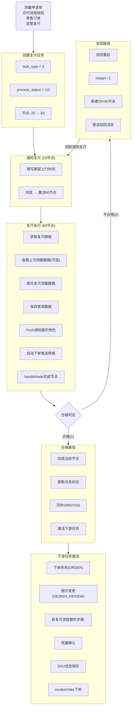

# 复尺任务（RECHECK_SCALE）流转全景

## 一、核心定义

复尺在系统中通过以下枚举定义：
[[starlord项目整理/枚举类和上下游梳理-starlord系统]]

| 枚举 | 值 | 说明 |
|------|-----|------|
| `TaskTypeEnum.RECHECK_SCALE` | value=3, name="复尺", sort=30 | 任务类型，属于下单前(BEFORE_ORDER)阶段，fulfillmentLinkCode=5 |
| `UnifiedTaskCode.RECHECK_SCALE` | `"TDE_RECHECK_SCALE"` | 统一任务编码，描述"复尺父任务" |
| `UnifiedNodeCodeType.NOTICE_RECHECK` | nodeType=20, nodeCode=20000 | "通知复尺"节点 |
| `UnifiedNodeCodeType.RECHECK` | nodeType=60, nodeCode=60000 | "复尺"执行节点 |

对应 `NodeTypeEnum`：
- `NOTIFY_CAN_START(20)` → "通知启动/约工"
- `START(60)` → "启动/提交自检"

关键源代码文件：

| 文件 | 行号 | 说明 |
|------|------|------|
| `edar-starlord-base/.../enumeration/TaskTypeEnum.java` | L22 | `RECHECK_SCALE(3, "复尺", 30, OrderTypeEnum.BEFORE_ORDER, BW_XLS_MODE, 5)` |
| `edar-starlord-base/.../enumeration/UnifiedTaskCode.java` | L11 | `RECHECK_SCALE(TaskTypeEnum.RECHECK_SCALE, "TDE_RECHECK_SCALE", "复尺父任务")` |
| `edar-starlord-base/.../enumeration/UnifiedNodeCodeType.java` | L16-L17 | `NOTICE_RECHECK(20)`, `RECHECK(60)` |
| `edar-starlord-base/.../enumeration/NodeTypeEnum.java` | L15, L18 | `NOTIFY_CAN_START(20)`, `START(60)` |

支持的适配模式（`TaskTypeEnum.MODE_TASK_TYPE_MAP`，L101-109）：
- BW、XLS、HOME2_5、HOME2_5_MANPOWER、DELIVERY_FLOW 模式均支持复尺任务
- SD（送装）和 SELF_BUY（自购）模式不支持复尺

---

## 二、任务创建 — 四种触发路径

### 路径1：测量申请单触发（主要路径）

外部系统（SCM商家端）发起测量申请 → `ScmMeasureApplyEventHandler` 接收 `measure-apply-order` 事件 → 调用 `ScmMeasureApplyServiceImpl.createTask()` 创建复尺任务。

**关键文件**：
- `edar-starlord-service/.../servicev2/impl/ScmMeasureApplyServiceImpl.java`
- `edar-starlord-service/.../service/listener/handler/scm/ScmMeasureApplyEventHandler.java`

### 路径2：交付流程规则自动创建

在 `MaterialCreateV2ServiceImpl.execCreateMaterialProcess()` 中：
- 通过 `MaterialConfigUtil.getTaskTypeByNodeProcessName()` 解析节点流程名称
- 流程名称示例：`"测量-设计-复尺-下单-备货-送货-预埋-安装"`
- 解析到"复尺" → 创建 `TaskTypeEnum.RECHECK_SCALE` 类型任务
- 2.5 模式下，测量/复尺任务的 sourceType 写死为 `MEASURE_APPLY_FORM`

**关键代码**（`MaterialCreateV2ServiceImpl.java:1069-1073`）：
```java
// 2.5 测量复尺写死为1
if (ModeEnum.isHome2_5_MODE(context.getSupportMode().getValue())
        && (TaskTypeEnum.MEASURE.getValue().equals(materialForm.getTaskType())
        || TaskTypeEnum.RECHECK_SCALE.getValue().equals(materialForm.getTaskType()))) {
    taskDispatch.setSourceType(SourceTypeEnum.MEASURE_APPLY_FORM.getType());
}
```

**关键文件**：
- `edar-starlord-service/.../servicev2/impl/MaterialCreateV2ServiceImpl.java` — `execCreateMaterialProcess()`, `buildCondition()`
- `edar-starlord-service/.../servicev2/util/MaterialConfigUtil.java:338-371` — `getTaskTypeByNodeProcessName()`

### 路径3：零售订单直接创建

`MaterialCreateV2ServiceImpl.createMaterialTaskWithDefaultParam()` — 零售订单(sourceType=RETAIL)直接创建复尺任务，并立即完成60节点（设置提交时间、执行人、图片、备注等）。

**关键代码**（`MaterialCreateV2ServiceImpl.java:280-385`）：
- 创建 `TaskDispatch` 记录，`taskType = RECHECK_SCALE`
- 创建首节点 `TaskDispatchNode`，`nodeType = START(60)`，状态为 COMPLETED
- 如果驳回(UNQUALIFIED)，则重启节点，restart +1

### 路径4：定额复尺（供应商编码9999999）

特殊逻辑 — 只生成复尺任务，跳过测量任务。

**关键代码**（`MaterialCreateV2ServiceImpl.java:701-703`）：
```java
// 定额复尺，只生成复尺任务
if (context.isNew() && context.getSupplierCode().equals("9999999")) {
    condition.setTaskTypeIn(Lists.newArrayList(TaskTypeEnum.RECHECK_SCALE.getValue()));
}
```

### 去重逻辑

创建复尺任务前会检查是否已存在相同品类+供应商的复尺任务（`MaterialCreateV2ServiceImpl.java:840-860`），防止重复创建。特殊处理：
- 供应商编码 9999999 的定额复尺直接跳过
- Apollo 配置 `recheckScaleSkipSupplierDuplicateMaterialCodes` 中的品类也跳过供应商重复检查

---

## 三、任务状态流转

```
┌──────────┐      ┌──────────────┐      ┌──────────────┐
│  未激活   │ ───→ │ 激活未完成    │ ───→ │  激活已完成   │
│  (1)     │      │    (2)       │      │    (3)       │
└──────────┘      └──────────────┘      └──────────────┘
                        │                       │
                        │ 驳回(不合格)            │ 合格完成
                        ↓                       ↓
                 ┌──────────────┐       ┌──────────────┐
                 │  重启流程     │       │ 激活下一任务   │
                 │  restart +1  │       │ (下单/报价变更) │
                 └──────────────┘       └──────────────┘
```

### 任务级状态（ProcessStatusEnum）

| 状态 | 值 | 说明 |
|------|-----|------|
| NOT_ACTIVE | 1 | 未激活 — 前置任务未完成，等待激活 |
| UNFINISHED | 2 | 激活未完成 — 已激活，等待执行人操作 |
| FINISHED | 3 | 激活已完成 — 所有节点已完成 |
| SUSPEND_ACTIVE | 4 | 暂停激活 |

### 节点级状态（TaskDispatchNodeStatusEnum）

| 状态 | 说明 |
|------|------|
| UN_ACTIVE | 节点未激活 |
| UNCOMPLETED | 节点激活但未完成 |
| COMPLETED | 节点已完成 |

### 合格/驳回判定（QualifiedEnum）

| 状态 | 值 | 说明 |
|------|-----|------|
| QUALIFIED | 1 | 合格 — 继续下一节点 |
| UNQUALIFIED | 2 | 不合格 — 驳回重启 |

---

## 四、详细流转步骤

### 阶段1：通知复尺（20节点 — NOTIFY_CAN_START）

1. 前置任务（通常是设计任务 DESIGN）完成后，`MaterialActivateV2Service.activateNextTaskDispatch()` 激活复尺任务
2. 20节点被激活，执行人收到通知（Push消息 + 待办）
3. 执行人在20节点填写**期望上门时间**（estimatedTime）
4. 调用 `MaterialHandleV2ServiceImpl.handleNode()` 完成20节点
5. 系统自动激活下一个节点（60节点）

**关键逻辑**（`MaterialMeasureServiceImpl.queryExtendInfo():686-742`）：
- 判断当前用户是否是20节点执行人 + 测量结果未填写 + 上门时间未填写 → 展示【填上门时间】按钮
- 判断当前用户是否是60节点执行人 + 测量结果未填写 → 展示【填测量结果】按钮
- 记录提交历史：首次提交、修改次数

### 阶段2：复尺执行（60节点 — START）

#### 2a. 获取复尺模板

**API**：`GET /api/material-measure/v2/get-task`

**方法**：`MaterialMeasureServiceImpl.getMaterialMeasure(projectOrderId, categoryId, taskDispatchNodeId)`

根据订单版本从不同数据源获取数据：

| 订单版本 | 方法 | 数据来源 |
|----------|------|----------|
| 1.0 订单（PROCESS_V1_0） | `fillRoom()` | `budgetPreviewManager.getSpaceByProjectIDAndCategoryId4Process1()` |
| 2.5 订单（Home2_5_MODE） | `fillRoomV2()` | `budgetPreviewManager.previewLatestProduct()` + `scmManager` SKU信息 |
| 其他订单 | `fillRoomV3()` | `budgetPreviewManager.getSpaceByProjectIDAndCategoryId4Home25()` |

**自动下单品类**（马桶、过门石等）走 `getStoolMeasure()` 方法，根据配置从 Aquaman/Atom 获取复尺数据。

#### 2b. 查看上次测量数据（可选）

**方法**：`MaterialMeasureServiceImpl.getLastMeasureInfoV2(taskDispatchNodeId)`

- 只有当前节点是60节点 + 任务未完成时才展示
- 查找同品类+同供应商+同MDM下已完成的测量或复尺的60节点数据
- 取最新的 restart 版本数据

#### 2c. 提交复尺数据

**API**：`POST /api/material-measure/save-task`

**方法**：`MaterialMeasureServiceImpl.submitMeasureFormTemplate(createMaterialMeasureParam, operator)`（L231-267）

执行流程：

1. **校验**：验证 `taskDispatchNode` 和 `taskDispatch` 存在
2. **保存表单数据**：`measureFormTemplateService.submit(measureFormSubmitParam)` — 写入 `measure_material_detail` 和 `measure_material_unit` 表
3. **发送复尺Push通知**（`measureSubmitPush()`，L274-327）：
   - 仅当 `taskType = RECHECK_SCALE` 时触发
   - 查找同项目+品类+供应商+MDM的报价变更(DESIGN_REVIEW)任务
   - 如果复尺执行人与报价变更执行人**不是同一角色**，向报价变更执行人发送Push通知
   - 通知渠道：工作助手 + 任务提醒
4. **异步推送自动下单参数**（`pushAutoOrderParam()`，L336-369）：
   - 仅 `taskType = RECHECK_SCALE` 时触发
   - 判断是否自动下单品类（`isAutoOrder()`）
   - 北京2.5订单 → `atomManager.resizeDataCommit()`
   - 非2.5订单 → `aquamanManager.changeSkuGroupCommit()`
5. **完成任务节点**：`materialHandleV2Service.handleNode(dispatchHandleParam, operatorDTO)`

#### 自动下单判断逻辑（`isAutoOrder()`，L1030-1044）

```java
private Boolean isAutoOrder(ProjectOrderDto projectOrderDto, String categoryId) {
    // 北京2.5走下单策略配置
    if (ProjectOrderUtil.isBeiJingV2_5(...)) {
        // 调 SCM 下单策略，判断 orderOpportunity = REWORK_COMPLETED 的配置
        List<OrderConfigurationDTO> configs = scmMerchantManager.queryOrderConfigurationList(...);
        return !CollectionUtils.isEmpty(configs);
    }
    // 其他走 Apollo 配置: select.need.special.process.categoryId
    return selectCategoryIds.contains(categoryId);
}
```

### 阶段3：节点完成处理（handleNode）

**方法**：`MaterialHandleV2ServiceImpl.handleNode()`（L148-271）

#### 核心流转逻辑：

```
handleNode(handleParam, operator)
    │
    ├── 零售订单(SourceType.RETAIL) + processCode为空
    │   → completeTaskDispatchNode() 完成节点
    │   → createMaterialTaskWithDefaultParam() 生成默认任务
    │
    ├── 节点未激活(UN_ACTIVE)
    │   → completePreTask() 完成前置任务
    │   → doActivateTaskDispatch() 激活当前任务
    │   → completePreTaskNode() 完成前置节点
    │
    ├── completeTaskDispatchNode() 完成当前节点
    │
    ├── 发IM/Push消息
    │
    ├── 时间变更 → publishTaskDispatchTimeChange()
    │
    ├── 合格完成 (QUALIFIED=1)
    │   → NodeTypeUtil.getNextNodeType() 获取下一节点
    │   → activateNextNode() 激活下一节点
    │
    ├── 驳回 (UNQUALIFIED=2)
    │   → materialRestartV2Service.restartProcess() 重启流程
    │   → 创建新的20节点和60节点，restart +1
    │   → pushMessageWhenRecheckRejected() 推送驳回消息
    │
    ├── 更新 TaskDispatch 的 currentNode
    │
    ├── 同步OMS/VSS消息
    │
    ├── 发布事件：publishTaskNodeChange()、publishTaskDispatchChange()
    │
    ├── 发C端消息（如果任务完成）
    │
    ├── 任务完成 → activateNextTaskDispatch() 激活下游任务
    │
    └── afterHandle() 后置处理
```

#### 后置处理（afterHandle，L273-333）：

1. 任务完成 → 同步 OMS 服务单状态
2. 进展变更写入 Redis 缓存
3. 更新依赖任务考核时间
4. 计算计划完成时间
5. **复尺完成后主动推动报价变更**（HOME2_5_MANPOWER 模式）：
   - 查找同项目的 DESIGN_REVIEW 任务
   - 对未完成的报价变更任务 → `omsMessageSyncService.sendVssNew()` 推送SDM

### 阶段4：复尺完成后的下游流转

```
复尺完成
   │
   ├── 自动下单品类（马桶、过门石等）
   │   └── 复尺提交时已推送规格数据到 Aquaman/Atom
   │
   ├── 普通品类
   │   └── activateNextTaskDispatch() → 激活下一任务
   │         ├── 下单任务 (ORDER)
   │         └── 报价变更任务 (DESIGN_REVIEW)
   │
   └── 新复尺流程 (bizVersion = FUCHI_VERSION_2 = 2)
         │
         ├── saveUsageConfirm() — 用量确认
         │   (API: MaterialMeasureTaskController)
         │
         ├── saveTaskSkuInfo() — SKU信息保存
         │   (API: MaterialMeasureTaskController)
         │
         ├── invokeOrder() — 触发下单 (L2602-2645)
         │   条件：
         │   1. bizVersion == FUCHI_VERSION_2
         │   2. 任务已完成 (processStatus = FINISHED)
         │   3. 用量确认已完成 或 无需变更
         │   4. 尚未下单 (hasOrder ≠ true)
         │   → 调用 scmMerchantManager.createOrder()
         │   → 标记 hasOrder = true
         │
         └── AtomProjectChangeEventHandler
             监听项目变更事件 → 检查已完成复尺
             → 推动报价变更任务推送VSS
```

---

## 五、复尺驳回流程

当复尺数据被驳回（qualified = UNQUALIFIED）时：

1. `MaterialHandleV2ServiceImpl.handleNode()` 检测到 `UNQUALIFIED`
2. 调用 `materialRestartV2Service.restartProcess(taskDispatch, dispatchNode)`
3. 创建新的节点组（20 + 60），restart 计数 +1
4. 推送驳回消息 → `messagePushClient.pushMessageWhenRecheckRejected()`
5. 执行人可在通知复尺页面看到**驳回原因**（`queryTaskRemarkInfo()`，L2011-2045）：
   - 展示上个 restart 批次的60节点 remark
   - 展示驳回标识 `reject = true`

---

## 六、核心数据表

| 表名 | 说明 | 关键字段 |
|------|------|----------|
| `task_dispatch` | 主材任务主表 | id, task_type(3=复尺), process_status, project_order_id, material_code, supplier_code, mode, source_type |
| `task_dispatch_node` | 任务节点表 | id, task_dispatch_id, node_type(20/60), process_status, executor_id, restart, estimated_time, qualified, remarks |
| `task_dispatch_extend` | 任务扩展表 | id, task_dispatch_id, usage_confirm, project_change_no, has_order, sku_info, biz_version |
| `measure_material_detail` | 复尺提交详情 | id, task_dispatch_id, task_dispatch_node_id, images, remark, remarks_filter |
| `measure_material_unit` | 复尺单元数据 | id, task_dispatch_id, category_id, combinatorial_space_id, sku_id, attr_value, sku_info |
| `measure_apply` | 测量申请单 | id, project_order_id, type, range_before_sign, range_after_sign, state |
| `cfg_measure_template` | 测量模板配置 | id, category_id, combinatorial_space_id, attr_json |
| `measure_config_rule` | 交界面配置规则 | id, mdm_code, category_code, task_node(如"3_20"/"3_60"), interface_requirement, example_images |

---

## 七、涉及的核心类

| 类 | 模块 | 职责 |
|----|------|------|
| `MaterialMeasureServiceImpl` | servicev2/impl | 复尺核心服务：模板组装、数据提交、自动下单研判、Push通知 |
| `MaterialHandleV2ServiceImpl` | servicev2/impl | 任务节点流转控制：completeNode、驳回重启、激活下一节点 |
| `MaterialCreateV2ServiceImpl` | servicev2/impl | 任务创建：基于交付流程规则/零售订单创建复尺任务 |
| `ScmMeasureApplyServiceImpl` | servicev2/impl | 测量申请单触发的任务创建 |
| `MaterialActivateV2Service` | servicev2 | 任务激活：activateNextTaskDispatch |
| `MaterialRestartV2Service` | servicev2 | 驳回重启：restartProcess |
| `MaterialMeasureService` | servicev2 | 复尺服务接口 |
| `MaterialHandleV2Service` | servicev2 | 任务处理服务接口 |
| `RecheckScaleAdapterService` | servicev2 | 复尺任务存在性检查适配器 |
| `MaterialMeasureController` | web | Web API 控制器（`/api/material-measure`） |
| `MaterialMeasureTaskController` | web/manpower | Feign API 控制器（`/manpower/task`），实现 `MaterialMeasureTaskFeign` |
| `MeasureConfigRuleController` | web | 交界面规则配置控制器 |
| `AtomProjectChangeEventHandler` | service/listener | 项目变更事件处理 → 推动设计/报价变更任务 |
| `ScmMeasureApplyEventHandler` | service/listener | 测量申请单事件处理 |
| `MaterialConfigUtil` | servicev2/util | 流程名称解析 → 任务类型映射 |
| `MeasureFormTemplateService` | service | 测量表单模板CRUD |
| `MeasureConfigRuleService` | service | 交界面规则匹配 |

---

## 八、关键API接口

| 方法 | 路径 | 说明 |
|------|------|------|
| POST | `/api/material-measure/save-task` | 保存测量复尺数据 |
| GET | `/api/material-measure/v2/get-task` | 获取复尺模板（带nodeId） |
| GET | `/api/material-measure/v3/get-task-resized` | 获取复尺完成时的数据 |
| POST | `/api/material-measure/get-task-measure/last-measure-v2` | 查看上次测量/复尺数据 |
| POST | `/api/material-measure/get-task-measure` | 获取复尺结构化数据 |
| POST | `/api/material-measure/update-task-measure` | 修改测量复尺数据 |
| GET | `/api/material-measure/task/queryRecheckScaleTaskListByUcid` | 查询某人的复尺任务列表 |
| GET | `/api/material-measure/task/queryTaskRemarkInfo` | 查询驳回原因 |
| GET | `/api/material-measure/has-order-receive` | 判断订单是否已接单 |
| GET | `/api/material-measure/has-measure-authority` | 判断是否有操作权限 |
| POST | `/manpower/task/measureApply` | 手动触发复尺任务创建 |
| POST | `/manpower/task/invokeRecheckAgain` | 重新发起复尺（驳回后） |
| POST | `/manpower/task/saveUsageConfirm` | 保存用量确认（新复尺） |
| POST | `/manpower/task/saveTaskSkuInfo` | 保存SKU信息（新复尺） |
| POST | `/manpower/task/queryUsageConfirm` | 查询用量确认 |

---

## 九、关键配置项

| 配置项 | 来源 | 说明 |
|--------|------|------|
| `select.need.special.process.categoryId` | properties | 自动下单品类ID（马桶、过门石等），逗号分隔 |
| `new.fuchi.whitelist` | Apollo JSON | 新复尺白名单：`{"分公司编码": "正签时间阈值"}` |
| `new.fuchi.materialcode.black.list` | properties | 新复尺黑名单品类 |
| `no.default.template.categoryId` | properties | 非默认模板品类（如定制柜 029006010,029006013） |
| `sku.white.list` | properties | SKU白名单品类 |
| `recheckScaleSkipSupplierDuplicateMaterialCodes` | Apollo | 跳过去重检查的品类 |
| `material.measure.interface.config.node.options` | Apollo JSON | 交界面规则节点选项：`[{"code":"3_20","name":"通知复尺"},{"code":"3_60","name":"复尺"}]` |

---

## 十、新复尺流程（FUCHI_VERSION_2）

### 判断条件（`MaterialMeasureServiceImpl.judgeNewFuchiProcess()`, L2581-2599）

```java
public boolean judgeNewFuchiProcess(ProjectOrderDetailBO projectOrder, String materialCode) {
    // 1. 项目订单不能为空
    // 2. 分公司编码不能为空
    // 3. 正签时间不能为空
    // 4. 分公司在新复尺白名单中 + 正签时间在白名单时间之后
    // 5. 品类不在黑名单中
    return true/false;
}
```

### 新复尺与旧复尺的区别

| 特性 | 旧复尺 | 新复尺(bizVersion=2) |
|------|--------|---------------------|
| 用量确认 | 无 | 需要保存用量确认（`saveUsageConfirm`） |
| SKU信息 | 无 | 需要保存SKU信息（`saveTaskSkuInfo`） |
| 下单触发 | 由下游任务负责 | 复尺完成后直接调用 `invokeOrder()` 下单 |
| 数据存储 | 仅 `task_dispatch` + `task_dispatch_node` | 额外使用 `task_dispatch_extend` 存储扩展信息 |

### invokeOrder 下单条件（L2602-2645）

必须同时满足以下四个条件才会触发下单：
1. `taskDispatchExtend.bizVersion == FUCHI_VERSION_2`
2. `taskDispatch.processStatus == FINISHED`
3. `usageConfirm == UNCHANGED` 或 `projectChangeStatus == TRUE`（变更已完成）
4. `hasOrder != TRUE`（尚未下单）

---

## 十一、外部系统交互

| 外部系统 | 交互方式 | 说明 |
|----------|----------|------|
| SCM商家端 | Kafka事件 + Feign | 测量申请单事件触发任务创建；下单配置查询；创建订单 |
| Aquaman | Feign | 非2.5自动下单：`changeSkuGroupCommit`；报价项查询 |
| Atom | Feign | 2.5自动下单：`resizeDataCommit`；foreman复尺项列表 |
| OMS | Feign | 子订单查询（接单状态判断）；服务单状态同步 |
| VSS/SDM | Feign | 任务完成/新节点消息同步；报价变更任务推送 |
| Athena | Feign | 预算预览（报价SKU数据） |
| 作业中心(WorkCenter) | Feign | 任务实例状态同步 |
| Push推送 | HTTP | 工作助手+任务提醒通知 |
| Apollo | 配置中心 | 白名单、黑名单、自动下单品类等动态配置 |

---

## 十二、流程图总结


