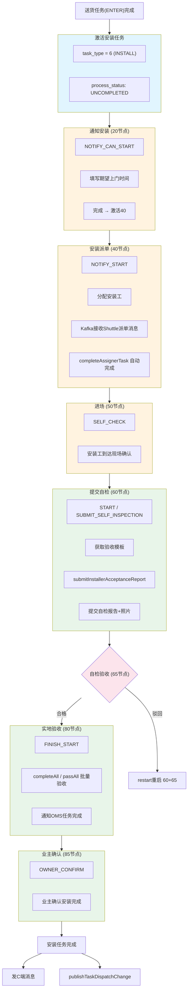

# 安装任务（INSTALL）流转全景

## 一、核心定义

安装任务在系统中通过以下枚举定义：

| 枚举 | 值 | 说明 |
|------|-----|------|
| `TaskTypeEnum.INSTALL` | value=6, name="安装", sort=130 | 任务类型，属于下单后(AFTER_ORDER)阶段，fulfillmentLinkCode=4 |
| `UnifiedTaskCode.INSTALL` | `"TDE_INSTALL"` | 统一任务编码，描述"安装父任务" |

### 安装任务的节点结构

安装任务是所有任务类型中**节点最多**的，共有 7 个标准节点 + 2 个复合虚拟节点：

| UnifiedNodeCodeType | nodeType | nodeCode | 中文名 | unifiedNodeCode | 说明 |
|---------------------|----------|----------|--------|-----------------|------|
| NOTICE_INSTALL | 20 | 20000 | 通知安装 | notice_install | 约工节点，通知安装工 |
| INSTALL_DISPATCH | 40 | 40000 | 派单 | install_dispatch | 派单节点，分配安装工 |
| ENTRY_CONSTRUCTION | 50 | 50000 | 进场 | entry_construction | 安装工进场确认 |
| SUBMIT_SELF_INSPECTION | 60 | 60000 | 提交自检 | submit_self_inspection | 核心执行节点，提交自检报告 |
| SELF_INSPECTION_ACCEPTANCE | 65 | 65000 | 自检验收 | self_inspection_acceptance | 自检验收节点 |
| ON_SITE_ACCEPTANCE | 80 | 80000 | 实地验收 | on_site_acceptance | 验收节点，项目经理验收 |
| OWNER_CONFIRMATION | 85 | 85000 | 业主确认 | owner_confirmation | 终节点，业主确认完成 |

对应 `NodeTypeEnum`：
- `NOTIFY_CAN_START(20)` → 通知安装（约工）
- `NOTIFY_START(40)` → 安装派单
- `SELF_CHECK(50)` → 进场
- `START(60)` → 提交自检
- `SELF_CHECK_ACCEPTANCE(65)` → 自检验收
- `FINISH_START(80)` → 实地验收
- `OWNER_CONFIRM(85)` → 业主确认

**复合虚拟节点**（模板配置用，内部展开为多个实际节点）：
- `V_SUBMIT_SELF_INSPECTION` (nodeType=600, nodeCode=600000) → 展开为 60 + 65（提交自检 + 自检验收）
- `V_ON_SITE_ACCEPTANCE` (nodeType=800, nodeCode=800000) → 展开为 80 + 85（实地验收 + 业主确认）

### 支持的适配模式

`TaskTypeEnum.MODE_TASK_TYPE_MAP` 中支持安装的模式：
- BW（北京被窝）、SD（HOME2.0整装）、XLS（新零售）、HOME2_5、HOME2_5_MANPOWER、DELIVERY_FLOW
- SELF_BUY（自购）模式也支持安装

关键源代码文件：

| 文件 | 说明 |
|------|------|
| `edar-starlord-base/.../enumeration/TaskTypeEnum.java` | `INSTALL(6, "安装", ...)` |
| `edar-starlord-base/.../enumeration/UnifiedNodeCodeType.java:33-44` | 安装任务的 7+2 个节点定义 |
| `edar-starlord-base/.../enumeration/NodeTypeEnum.java` | 节点类型枚举 |
| `edar-starlord-base/.../enumeration/UnifiedTaskCode.java:17` | `INSTALL → TDE_INSTALL` |

---

## 二、任务创建

### 触发路径

安装任务与送货任务（ENTER）紧密关联，创建逻辑在 `MaterialCreateV2ServiceImpl` 中：

**路径1：交付流程规则自动创建**

与复尺任务相同，通过 `MaterialConfigUtil.getTaskTypeByNodeProcessName()` 解析节点流程名称。
流程名称示例：`"测量-设计-复尺-下单-备货-送货-预埋-安装"`，解析到"安装" → 创建 `TaskTypeEnum.INSTALL` 任务。

**路径2：供应链子订单触发**

通过 `ScmMeasureApplyServiceImpl.createOrderTask()` → 基于供应链订单生成安装任务。
下单后的任务（AFTER_ORDER）：接单(ORDER_TAKING) → 备货(STOCK_UP) → 送货(ENTER) → 安装(INSTALL)

**关键代码**（`MaterialCreateV2ServiceImpl.java:501`）：
```java
TaskTypeEnum taskType = Objects.equals(context.getNeedInstall(), 1) 
    ? TaskTypeEnum.INSTALL : TaskTypeEnum.ENTER;
```

安装任务不生成采购单号（`MaterialCreateV2ServiceImpl.java:1295`）：
```java
if (Objects.equals(taskDispatch.getTaskType(), TaskTypeEnum.INSTALL.getValue())) {
    return; // 安装任务不需要采购单号
}
```

### 安装任务的激活

安装任务由前置的送货任务（ENTER）完成后触发激活，激活模式包括：

1. **节点依赖激活**（默认）：`ActivateModeEnum.DEPENDENT_NODE(2)` — 前置送货任务完成 → `activateNextTaskDispatch()` → 激活安装任务
2. **计划时间激活**：`ActivateModeEnum.PLAN_TIME(0)` — 根据模板配置的计划时间激活
3. **立即激活**：`ActivateModeEnum.IMMEDIATELY(1)` — 生成后立即激活
4. **支付条件激活**：`ActivateModeEnum.CUSTOMER_CONTRACT_PAY_RATIO(3)` / `DEPOSIT_FUND_RATIO(4)` — 客户付款比例满足条件后激活
5. **北京特殊供应商直激**：`specialActivitySupplierCodeList` 中的供应商直接 `doActivateTaskDispatch()`

**激活拦截**：北京 2.5 项目会检查尾款支付状态 — 尾款未结清则暂不激活安装任务。

### needInstall 标志

安装任务的创建由 `needInstall` 标志（来自供应链订单信息）决定：
- `needInstall = 1` → 创建 `TaskTypeEnum.INSTALL` 任务
- `needInstall ≠ 1` → 创建 `TaskTypeEnum.ENTER`（送货）任务

关键使用位置（`MaterialCreateV2ServiceImpl.java:501`）：
```java
TaskTypeEnum taskType = Objects.equals(context.getNeedInstall(), 1) 
    ? TaskTypeEnum.INSTALL : TaskTypeEnum.ENTER;
```

### 销售类型映射

安装任务在创建时根据订单类型确定销售类型（`MaterialCreateV2ServiceImpl.java:728-731`）：
- 纯零售订单 + 非精装全案 → `SaleTypeEnum.RETAIL`（纯定软电）

---

## 三、任务状态流转

```
送货任务(ENTER)完成
       │
       ↓
┌──────────────┐
│ 安装任务激活   │
│ taskType = 6  │
└──────┬───────┘
       │
       ↓
┌──────────────────────────────────────────────────────┐
│                  安装任务节点流转                       │
│                                                      │
│  20(通知安装) → 40(派单) → 50(进场) → 60(提交自检)    │
│       ↓                                              │
│  65(自检验收) → 80(实地验收) → 85(业主确认) → 完成    │
│                                                      │
│  复合模式:                                            │
│  600(完工自检=60+65) → 800(实地验收=80+85) → 完成     │
└──────────────────────────────────────────────────────┘
       │
       ↓  (no downstream task — install is the last task in chain)
┌──────────────┐
│ 安装完成      │
│ 发C端消息     │
│ 通知OMS完成   │
└──────────────┘
```

---

## 四、详细流转步骤

### 阶段1：通知安装（20节点 — NOTIFY_CAN_START / NOTICE_INSTALL）

1. 送货任务（ENTER）完成后，`MaterialActivateV2Service` 激活安装任务
2. 20节点被激活，执行人（安装工派单员/供应商）收到通知
3. 执行人填写**期望上门时间**（estimatedTime / noticeRetainTime）
4. 完成20节点 → `handleNode()` → 激活40节点

### 阶段2：安装派单（40节点 — NOTIFY_START / INSTALL_DISPATCH）

1. 40节点激活 → 派单员分配具体的安装工人
2. 通过以下方式完成派单：
   - **自动派单**：派单系统（DISPATCH_SYSTEM 角色）自动完成
   - **手动派单**：安装工派单员（INSTALL_ASSIGNER 角色）分配安装工
3. 关键接口：`InstallerTaskService.completeAssignerTask()`（`InstallerTaskServiceImpl.java:647-673`）

**派单逻辑**：
```java
// InstallerTaskServiceImpl.completeAssignerTask()
if (TaskTypeEnum.INSTALL 且 nodeType 是 NOTIFY_CAN_START 或 NOTIFY_START
    且 executorType 是 INSTALL_ASSIGNER) {
    // 调用 handleNode 完成派单节点
    materialHandleV2Service.handleNode(handleParam, operator);
}
```

4. 派单完成后 → 激活50节点

### 阶段3：进场（50节点 — SELF_CHECK / ENTRY_CONSTRUCTION）

1. 安装工到达施工现场
2. 确认进场 → 完成50节点
3. → 激活60节点

### 阶段4：提交自检（60节点 — START / SUBMIT_SELF_INSPECTION）

这是安装任务的**核心执行节点**，安装工在此提交安装自检报告。

#### 4a. 获取验收模板

**方法**：`AcceptanceReportService.getAcceptanceTemplate()`
- 获取安装自检验收标准模板，包含检查项、验收标准等

#### 4b. 提交自检报告

**方法**：`AcceptanceReportService.submitInstallerAcceptanceReport(InstallerAcceptanceSubmitParam)`
- 安装工提交安装自检结果
- 包含：安装完成照片、检查项结果、备注等

关键代码（`OmsMessageSyncServiceImpl.java:415-427`）：
```java
// 安装工对应的是nodeType=60节点
AcceptanceReportSubmitParamV2 submitParamV2 = BuildAcceptanceReportSubmitParamUtil
    .buildAcceptanceReportParam(param.getProjectOrderId(),
        AcceptanceTypeEnum.MAIN_MATERIAL_INSTALL_SELF_CHECK,  // 主材安装自检
        AcceptanceReportStatusEnum.SUBMIT,
        param.getAcceptanceResult(), ...);
submitParamV2.setBusinessId(String.valueOf(taskDispatchNodeId));
submitParamV2.setBusinessType(BusinessTypeEnum.STARLORD_TASK.getValue());
submitParamV2.setBusinessStatus(BusinessStatusEnum.COMPLETE.getValue());
```

#### 4c. 完成节点

调用 `MaterialHandleV2ServiceImpl.handleNode()` 完成60节点 → 激活65节点。

### 阶段5：自检验收（65节点 — SELF_CHECK_ACCEPTANCE）

1. 对安装工提交的自检报告进行审核验收
2. 验收通过 → 完成65节点 → 激活80节点
3. 验收不通过（驳回）→ restartProcess() 重启 → 重新创建60+65节点

### 阶段6：实地验收（80节点 — FINISH_START / ON_SITE_ACCEPTANCE）

这是安装任务的**验收节点**，项目经理或管家进行实地验收。

#### 批量验收（completeAll / passAll）

**方法**：`InstallerTaskServiceImpl.completeAll()`（L491-517）
```java
// 筛选 FINISH_START(80)节点 + 状态为UNCOMPLETED 的节点
List<TaskDispatchNode> nodes = dispatchNodeDao.listByIds(...)
    .stream().filter(item -> item.getNodeType() == NodeTypeEnum.FINISH_START.getValue()
            && item.getProcessStatus() == UNCOMPLETED).collect(...);

// 完成节点
completeTaskDispatchNode(nodes, images, remarks);
// 完成TaskDispatch
completeTaskDispatch(taskDispatchIds);
// 通知OMS
omsMessageSyncService.notifyOmsTaskFinsh(projectOrderId, orderNos, FINISH_START);
// 发布事件
materialTaskProducer.publishTaskNodeChange(...);
materialCustomerProducer.publishMaterialCustomer(...);
```

**方法**：`InstallerTaskServiceImpl.passAll()`（L520-538）
- 类似 completeAll，但不需要图片和备注
- 直接标记节点为已完成，不触发OMS通知

### 阶段7：业主确认（85节点 — OWNER_CONFIRM / OWNER_CONFIRMATION）

1. 安装最终节点，业主确认安装完成
2. 完成85节点 → 节点流转结束
3. 任务进入 COMPLETED 状态
4. OMS 同步：`sendOmsMsg()` → 当 `FINISH_START(80)` 节点完成时通知OMS（见下方OMS同步章节）

---

## 五、handleNode 通用流程

安装任务的 handleNode 与复尺任务共用同一个 `MaterialHandleV2ServiceImpl.handleNode()` 方法（L148-271），核心流程：

```
handleNode(handleParam, operator)
    │
    ├── 节点未激活(UN_ACTIVE)
    │   → completePreTask() → 递归完成前置任务
    │   → doActivateTaskDispatch() → 激活当前任务
    │   → completePreTaskNode() → 自动完成前置节点
    │
    ├── completeTaskDispatchNode() → 完成当前节点
    │   └── 保存图片、备注、提交时间、操作人
    │
    ├── 合格完成(QUALIFIED=1)
    │   → NodeTypeUtil.getNextNodeType() → 获取下一节点（20→40→50→60→65→80→85→null）
    │   → activateNextNode() → 激活下一节点
    │
    ├── 驳回(UNQUALIFIED=2)
    │   → restartProcess() → 重启流程
    │   → restart +1，重新创建当前节点组
    │
    ├── 更新 TaskDispatch.currentNode
    ├── 同步OMS/VSS消息
    ├── 发布事件
    │
    └── 任务完成 → activateNextTaskDispatch()
        └── 安装是最终任务，完成后无下游任务可激活
```

### 安装任务特殊性

1. **不推送VSS**：`sendVssNew()`（L844-847）明确跳过安装/预埋件：
```java
if (taskDispatch.getTaskType().equals(TaskTypeEnum.INSTALL.getValue())
        || TaskTypeEnum.ONCE_INSTALL.getValue().equals(taskDispatch.getTaskType())) {
    return; // 安装和预埋件不推VSS新节点
}
```

2. **不推VSS完成**：`sendVssFinish()`（L729-730）同样跳过安装：
```java
if (taskType.equals(TaskTypeEnum.INSTALL.getValue()) 
    || TaskTypeEnum.ONCE_INSTALL.getValue().equals(taskType)) {
    return;
}
```

3. **OMS完成通知**：80节点完成时，通过 `sendOmsMsg()` 通知OMS（L196-203）：
```java
// 安装任务节点完成 → 保存并发送OMS
if(nextNodeType == null
    && taskDispatch.getTaskType().equals(TaskTypeEnum.INSTALL.getValue())
    && currentNode.getNodeType().equals(NodeTypeEnum.FINISH_START.getValue())){
    saveSendOms(taskDispatch, currentNode, 1);
}
```

---

## 六、外部系统交互

| 外部系统 | 交互方式 | 说明 |
|----------|----------|------|
| OMS | Feign | 安装完成(80节点)后通知OMS任务完成；子订单查询 |
| 作业中心(WorkCenter) | Feign | 任务实例状态同步 |
| Shuttle（派单系统） | Kafka | 接收安装工分配/改配消息 → `InstallerListener` |
| 验收系统 | Feign | 提交安装自检报告、查询验收模板 |
| Ruban（人员中心） | Feign | 查询安装工信息、上级组长信息 |
| Push推送 | HTTP | 工作助手+任务提醒通知 |

### Kafka 安装工分配事件

`InstallerListener` 监听 `shuttle.order.assign.topic`：
- 接收订单分配/改配安装工消息
- 通过 `EventDrivenSubscriber` 分发到 `AssignInstallerEventHandler` / `ReassignInstallerEventHandler`

---

## 七、核心数据表

| 表名 | 说明 | 关键字段 |
|------|------|----------|
| `task_dispatch` | 主材任务主表 | task_type=6(安装), process_status, node_task(节点路径) |
| `task_dispatch_node` | 任务节点表 | node_type(20/40/50/60/65/80/85), executor_id, executor_type, qualified |
| `task_handle_extension` | 任务处理扩展 | 安装位置信息(location) |
| `supplier_sync_info` | 供应商同步信息 | 送货备注、预约日期 |
| `notice_time_history` | 预约时间变更历史 | 改约次数统计 |
| `acceptance_report` | 验收报告 | 安装自检报告数据 |

---

## 八、涉及的核心类

| 类 | 模块 | 职责 |
|----|------|------|
| `MaterialHandleV2ServiceImpl` | servicev2/impl | 通用节点流转控制：handleNode、completeTaskDispatchNode、afterHandle |
| `TaskDispatchCompleteServiceImpl` | servicev2/impl | **安装完成核心调度器**：验收报告状态驱动完成(completeInstallTask)、施工包状态驱动完成(completePackageTask) |
| `InstallerTaskServiceImpl` | service/impl | 安装任务专用服务：completeAll、passAll、completeAssignerTask、updateInstallerInfo、批量验收 |
| `MaterialTaskInstallerTaskServiceImpl` | service/foreman/impl | 工长端安装任务服务：listMaterialByType、completeAll、passAll |
| `AcceptanceReportServiceImpl` | service/impl | 安装验收报告：submitInstallerAcceptanceReport、queryInstallerAcceptanceReport |
| `OmsMessageSyncServiceImpl` | service/impl | OMS/VSS同步：sendOmsMsg(安装80节点完成)、sendVssNew(跳过安装)、sendVssFinish(跳过安装) |
| `ExecutorV2ServiceImpl` | servicev2/impl | 安装执行人分配：60节点按服务模式分配角色、20/80节点按配置快照分配 |
| `MaterialActivateV2ServiceImpl` | servicev2/impl | 安装激活专有逻辑：尾款支付比例≥95%检查 |
| `MaterialCreateV2ServiceImpl` | servicev2/impl | 安装任务创建：needInstall标志 → INSTALL/ENTER |
| `DeliveryMaterialBizServiceImpl` | servicev2/impl | 施工包关联安装任务创建 |
| `InstallerListener` | service/listener | Kafka监听Shuttle派单消息 |
| `AssignInstallerEventHandler` | service/listener/handler | 安装工分配事件处理（已废弃） |
| `ReassignInstallerEventHandler` | service/listener/handler | 安装工改配事件处理 |
| `WorkCenterProcessChangedEventHandler` | service/listener/handler | 施工包状态变更 → completeHome2_5InstallTask |
| `ProjectVssEventHandler` | service/listener/handler | VSS订单 → 创建安装任务(sourceType=SALE) |
| `PackageChangeAppointEventHandler` | service/listener/handler | 施工包预约变更 → 更新NOTIFY_CAN_START |
| `InstallerTaskController` | web | Feign API（实现InstallerTaskFeign，15端点） |
| `MaterialTaskInstallerTaskController` | web/foreman | 工长端安装任务API |
| `MaterialTaskProducer` | service/producer | 事件发布 |
| `MaterialCustomerProducer` | service/producer | C端消息发布 |

### 安装任务完成的三种驱动路径

| 路径 | 触发源 | 核心方法 | 说明 |
|------|--------|----------|------|
| 直接操作 | 用户在app/web端点击完成 | `handleNode()` | 手动逐个完成节点 |
| 验收报告驱动 | 外部验收系统回调 | `completeInstallTask()` | 验收状态 → 自动完成60/80节点 |
| 施工包驱动(2.5) | 施工包状态变更事件 | `completePackageTask()` | 状态流水 → 自动完成多个节点 |

### 施工包状态 → 安装节点映射

| 施工包状态 | 完成的节点 | 说明 |
|-----------|----------|------|
| > RESERVING | NOTIFY_CAN_START(20) | 通知安装 |
| > DISPATCHING | NOTIFY_START(40) | 派单 |
| > WAIT_APPROACH | SELF_CHECK(50) | 进场 |
| PROCESSING | SELF_CHECK_ACCEPTANCE(65) | 自检验收 |
| SELF_CHECK | START(60) | 提交自检 |
| BUTLER_CHECK | FINISH_START(80) | 实地验收 |
| COMPLETE | OWNER_CONFIRM(85)+FINISH_START(80) | 业主确认 |
| 回退 | SELF_CHECK(50)→START(60)不合格 | 驳回重启 |

---

## 九、关键API接口

| 方法 | 路径 | 说明 |
|------|------|------|
| POST | `/installer/task/listTaskByType` | 按类型列出安装任务 |
| POST | `/installer/task/completeAll` | 批量完成安装验收(80节点) |
| POST | `/installer/task/passAll` | 批量通过安装验收(80节点) |
| POST | `/installer/task/listTask` | 安装任务列表(分页) |
| GET | `/installer/task/taskDetail` | 安装任务详情(含节点流转) |
| GET | `/installer/task/taskAcceptanceDetail` | 安装验收详情 |
| POST | `/installer/task/subordinateTask` | 下属安装任务 |
| POST | `/installer/task/projectCompleteStatus` | 项目安装完成状态 |
| GET | `/installer/task/statusAmount` | 安装任务状态统计 |
| GET | `/installer/task/installTypeAmount` | 安装类型统计(代销/库存) |
| POST | `/installer/task/listMaterialByType` | 按类型列出安装材料 |
| POST | `/installer/task/combineInstallTask` | 合并安装任务 |
| POST | `/installer/task/updateInstallerInfo` | 更新安装工信息 |
| POST | `/installer/task/assignExecutorType` | 分配安装执行角色 |
| POST | `/acceptance/submitInstallerAcceptanceReport` | 提交安装自检报告(60节点) |
| GET | `/acceptance/queryInstallerAcceptanceReport` | 查询安装验收报告 |
| POST | `/acceptance/batchAcceptanceSubmit` | 批量提交验收 |

---

## 十、流程图总结



---

## 十一、安装任务与复尺任务的对比

| 特性 | 安装(INSTALL) | 复尺(RECHECK_SCALE) |
|------|--------------|-------------------|
| orderType | AFTER_ORDER(下单后) | BEFORE_ORDER(下单前) |
| 节点数量 | 7个标准节点 | 2个标准节点(20+60) |
| 复合虚拟节点 | V_SUBMIT_SELF_INSPECTION(600), V_ON_SITE_ACCEPTANCE(800) | 无 |
| VSS同步 | 不推送VSS | 推送VSS |
| OMS同步 | 80节点完成时通知OMS | 任务完成时同步 |
| 验收报告 | 提交安装自检报告 | 提交复尺测量数据 |
| 派单逻辑 | 安装工派单/改配(Kafka) | 无派单 |
| 批量操作 | completeAll/passAll 批量验收 | 无批量操作 |
| 节点完成方式 | 安装工提交自检+验收 | 提交复尺模板数据 |
| 驳回重启 | 从当前节点重启 | 从20节点重启 |
