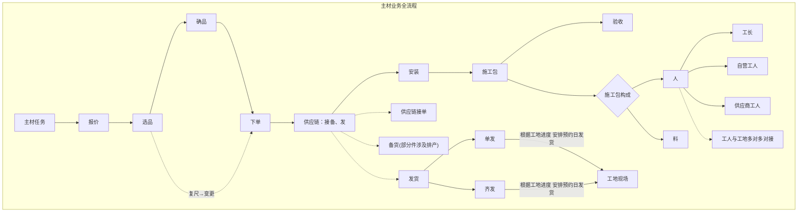

[[starlord项目整理/业务知识沉淀/Home-交付学习新人文档]]展示了Home家装系统map以及交付系统和施工包的简单介绍

下面的为主材任务的流程流转图

施工包：[[starlord项目整理/业务知识沉淀/施工包概念理解]]

与施工包相关的用工平台：用工平台主要是用来在工地协调人和材料的，负责协调什么**人**在什么样的**工地**用什么**工具**对什么**材料**按照**工序**施加**工艺**
[[starlord项目整理/业务知识沉淀/用工平台新人学习文档]]

以及使用ai整理出的[[starlord项目整理/业务知识沉淀/edar-starlord系统新人学习文档]]，目的是用来新人从职责和功能角度理解starlord系统

根据整装项目入手，每一个项目都有很多主材任务，通过项目id查询项目下的主材任务。主材任务由上游系统创建和下发存储在task_dispatch和task_dispatch_node中
![[starlord项目整理/fig/Pasted image 20260709165601.png]]，
主材任务流转至通知复尺、复尺、结束。
![[starlord项目整理/fig/Pasted image 20260709172429.png]]

之后由指定角色执行下单，供应商负责接单备货发货.

材料的履约流程配置是按照这个界面来的，流程是以分公司为单位执行的，如：佛山区域-圣都家居装饰有限公司佛山分公司。具体查看
![[starlord项目整理/fig/Pasted image 20260709173647.png]]

又细分不同品类的规则id

![[starlord项目整理/fig/Pasted image 20260709173928.png]]
以这条规则为例

![[starlord项目整理/fig/Pasted image 20260709174118.png]]

可配置该规则的执行角色如谁去通知复尺，以及节点失败后重启的角色是谁，设置作业耗时时间，以及上门时间。配置完成后将用于具体的分公司。当选择该分公司之后材料就按照该流程执行。
![[starlord项目整理/fig/Pasted image 20260709174211.png]]
配置生成后可以在这里修改
![[starlord项目整理/fig/Pasted image 20260709180538.png]]

履约流程配置会影响施工包的配置，用工平台负责施工包的配置，算是材料履约的另一套配置![[starlord项目整理/fig/Pasted image 20260709183730.png]]
![[starlord项目整理/fig/Pasted image 20260709180959.png]]![[starlord项目整理/fig/Pasted image 20260709181057.png]]
此外验收任务也有一套配置
![[starlord项目整理/fig/Pasted image 20260709181538.png]]
作业中心驱动订单施工包，整装状态的图。如按照如下流程施工：![[starlord项目整理/fig/Pasted image 20260709182439.png]]，与材料履约配置相对，也是一套配置。
![[starlord项目整理/fig/Pasted image 20260709183010.png]]

我干了什么？
入职快两周以来