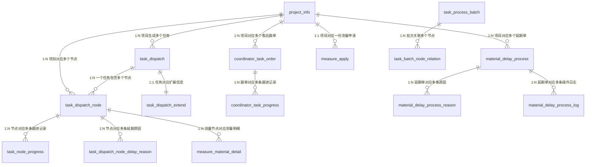

已按你的分类规则完成全库表的标签标注，核心结论：**6张A类核心主表、22张B类关联明细表、50+张C类配置/支撑表、2张D类废弃表**。下面是完整分类清单，可直接复制到Excel使用，末尾附核心表关联关系草图。

---

## 一、全库表分类清单（可直接复制Excel）
### 分类规则回顾
- **A类**：核心业务主表，独立业务实体，重点梳理
- **B类**：关联/明细表，依附A类主表存在，跟着主表一起梳理
- **C类**：配置/日志/同步/支撑表，按需查阅
- **D类**：废弃/无数据表，暂时搁置

| 表名                                             | 表分类 | 表说明                               | 核心关联键                                          |
| :--------------------------------------------- | :-- | :-------------------------------- | :--------------------------------------------- |
| **A类-核心业务主表（共6张）**                             |     |                                   |                                                |
| project_info                                   | A类  | 项目信息表，全库根实体，存储家装项目核心基础信息          | project_order_id（全局唯一关联键）                      |
| task_dispatch                                  | A类  | 主材任务派发表，任务维度核心实体，每个主材对应一条任务       | id（任务主键）、project_order_id                      |
| task_dispatch_node                             | A类  | 任务节点实例表，流程流转最小执行单元，存储节点状态/时间/执行人  | id（节点主键）、task_dispatch_id、project_order_id     |
| coordinator_task_order                         | A类  | 返补跟单任务表，售后返补业务主单据                 | id（跟单主键）、project_order_id、ct_order_no          |
| material_delay_process                         | A类  | 主材延期单表，正式延期申请主单据，带审批流程            | id（延期单主键）、project_order_id                     |
| measure_apply                                  | A类  | 测量申请单表，测量业务申请主单据                  | id（申请单主键）、project_order_id                     |
| **B类-关联/明细表（共22张）**                            |     |                                   |                                                |
| task_dispatch_extend                           | B类  | 任务扩展表，1:1依附任务主表，存储用量/变更单/SKU等扩展字段 | task_dispatch_id                               |
| task_node_progress                             | B类  | 节点进度跟进表，存储异常/延期节点的多次督办记录          | task_dispatch_node_id、project_order_id         |
| task_process_batch                             | B类  | 任务批次表，同类型节点批量调度的业务载体              | project_order_id                               |
| task_batch_node_relation                       | B类  | 批次-节点关联表，批次与节点的多对多映射              | task_batch_id、task_dispatch_node_id            |
| task_dispatch_node_delay_reason                | B类  | 节点延期原因记录表，存储节点延期的标准化原因            | task_dispatch_node_id                          |
| task_dispatch_node_report_relation             | B类  | 节点验收报告关联表，节点与验收报告的映射              | task_dispatch_node_id                          |
| task_estimated_time_change_log                 | B类  | 考核时间变更日志，节点预估/考核时间的调整记录           | task_dispatch_node_id                          |
| task_handle_extension                          | B类  | 任务处理扩展表，存储打卡经纬度等外勤校验数据            | task_dispatch_node_id                          |
| design_review_alteration                       | B类  | 设计复核变更属性表，存储设计复核节点的专属字段           | task_dispatch_node_id                          |
| coordinator_task_progress                      | B类  | 返补跟单进展表，存储跟单的多次跟进记录               | coordinator_task_id                            |
| coordinator_task_order_unit                    | B类  | 跟单单元表，存储跟单下的主材明细单元                | coordinator_task_order_id                      |
| coordinator_retail_record                      | B类  | 纯零售跟单记录表，零售场景专属跟单记录               | ct_order_no                                    |
| material_delay_process_log                     | B类  | 延期单操作日志，存储延期单全流程操作记录              | material_delay_process_id                      |
| material_delay_process_reason                  | B类  | 延期原因明细表，一条延期单对应多条原因明细             | material_delay_process_id                      |
| measure_material_detail                        | B类  | 测量详情表，存储测量节点提交的图片、备注              | task_dispatch_node_id                          |
| measure_material_unit                          | B类  | 测量单元表，存储测量的SKU明细、属性值              | task_dispatch_id                               |
| measure_apply_operate_log                      | B类  | 测量申请操作日志，存储测量申请的增删改记录             | project_order_id                               |
| call_record                                    | B类  | 通话记录表，存储项目相关的所有通话、录音记录            | project_order_id                               |
| task_select_category                           | B类  | 选材明细表，存储项目的主材选材记录                 | project_order_id                               |
| self_buy_remind_record                         | B类  | 业主自购提醒记录表，存储自购提醒的发送状态             | project_order_id                               |
| notice_time_history                            | B类  | 通知时间修改历史，存储通知时间的人工调整记录            | task_dispatch_node_id                          |
| notice_task_info                               | B类  | 通知任务信息表，存储专项通知的发送记录               | project_order_id、biz_id                        |
| **C类-配置/支撑表（共54张，分4子类）**                       |     |                                   |                                                |
| ▶ 新一代流程配置（n_前缀，核心配置体系）                         |     |                                   |                                                |
| n_material_template                            | C类  | 用工任务模板主表，流程模板顶层基础配置               | id（模板主键）                                       |
| n_material_template_unit                       | C类  | 模板维度绑定表，按城市/分公司/套餐/主材绑定模板         | template_id、material_code                      |
| n_material_process_define                      | C类  | 流程定义主表，每套流程的核心入口配置                | process_code + version（流程唯一标识）                 |
| n_material_node_cfg                            | C类  | 节点定义表，定义流程包含的所有节点基础属性             | process_code + version、node_code               |
| n_material_task_cfg                            | C类  | 节点业务配置表，定义执行角色、重启、合并等规则           | process_code + version、node_id                 |
| n_material_route                               | C类  | 流程路由表，定义节点间的流转连线与条件分支             | process_code + version、source_code/target_code |
| n_material_route_time                          | C类  | 路由时间配置表，定义连线上的时间间隔规则              | route_id                                       |
| n_material_node_transfer_condition             | C类  | 节点流转条件表，定义节点激活的前置依赖               | node_id                                        |
| n_material_time_cfg                            | C类  | 考核时间配置表，平台/首次/重启三类考核规则            | process_code + version、node_code、time_type     |
| n_material_time_relation                       | C类  | 考核时间依赖表，定义考核时间的计算基准锚点             | time_id                                        |
| n_material_time_calculate_rule_cfg             | C类  | 节点耗时配置表，定义作业耗时的计算规则               | node_id                                        |
| n_material_period_calculate_hit_craft_cfg      | C类  | 工艺耗时规则表，特殊工艺对应的耗时增量               | node_period_calculate_rule_id                  |
| n_material_period_calculate_hit_house_cfg      | C类  | 户型耗时规则表，房屋类型对应的耗时增量               | node_period_calculate_rule_id                  |
| n_material_push_cfg                            | C类  | 节点推送配置表，定义节点各时机的通知规则              | process_code + version、node_code               |
| n_material_branch                              | C类  | 任务分支表，定义流程中的分支选项                  | branch_code                                    |
| n_material_branch_condition                    | C类  | 分支条件表，定义每个分支的判断条件                 | branch_code                                    |
| n_material_edge                                | C类  | 流程画布坐标表，存储流程图可视化坐标数据              | process_code + version                         |
| n_material_cfg_log                             | C类  | 配置变更日志表，存储所有流程配置的修改记录             | template_code、process_code                     |
| n_material_template_copy_log                   | C类  | 模板复制日志表，存储模板复制操作记录                | source_template_id                             |
| n_material_process_template                    | C类  | 调度流程模板配置表，调度层面的模板基础配置             | template_id                                    |
| n_material_task_process_template               | C类  | 任务节点模板配置表，细粒度节点模板配置               | process_template_id                            |
| ▶ 旧版兼容配置（历史过渡用）                                |     |                                   |                                                |
| material_flow_rule                             | C类  | 旧版材料流程规则主表                        | rule_id                                        |
| material_flow_rule_category                    | C类  | 旧版流程品类规则表                         | rule_id、category_id                            |
| material_flow_rule_unit                        | C类  | 旧版流程维度绑定表                         | rule_id                                        |
| material_flow_rule_template_mapping            | C类  | 旧规则与新模板映射表                        | rule_id、n_template_code                        |
| material_flow_rule_template_record             | C类  | 旧规则修改记录表                          | rule_id                                        |
| delivery_flow_rule                             | C类  | 排程流程规则主表（送货专项）                    | delivery_process_cfg_id                        |
| delivery_flow_rule_category                    | C类  | 排程流程品类规则表                         | rule_id                                        |
| delivery_flow_rule_unit                        | C类  | 排程流程维度绑定表                         | rule_id                                        |
| material_task                                  | C类  | 早期任务模板主表                          | id                                             |
| material_task_node                             | C类  | 早期任务节点模板表                         | material_task_id                               |
| material_task_node_time                        | C类  | 早期节点时间配置表                         | template_node_id                               |
| material_task_node_time_relation               | C类  | 早期时间依赖关系表                         | template_node_time_id                          |
| cfg_material_task_route                        | C类  | 通用任务路由配置表                         | source_id、target_id                            |
| ▶ 基础业务配置                                       |     |                                   |                                                |
| stock_up                                       | C类  | 主材备货周期主表，按主材+供应商配置标准周期            | id、material_code、supplier_code                 |
| stock_up_condition_rule                        | C类  | 备货周期条件规则表，带条件的周期明细                | stock_up_id                                    |
| n_holiday_cfg                                  | C类  | 假期配置主表，节假日/请假全局配置                 | id                                             |
| n_holiday_cfg_detail                           | C类  | 假期配置明细表，按分公司/品类/节点维度细化            | holiday_cfg_id                                 |
| cfg_measure_template                           | C类  | 测量模板配置表，定义测量需填写的属性                | category_id                                    |
| cfg_measure_attr_used                          | C类  | 历史测量属性表，存储历史使用的属性枚举               | attr_id                                        |
| material_measure_interface_config              | C类  | 测量交界面配置主表，测量作业标准规范                | id                                             |
| material_measure_interface_config_category_rel | C类  | 交界面-类目节点关系表                       | rule_id、category_code                          |
| material_measure_interface_config_mdm_rel      | C类  | 交界面-分公司关系表                        | rule_id、mdm_code                               |
| measure_apply_range_type_config                | C类  | 测量范围配置表，定义签前/签后测量范围               | type、material_code                             |
| material_payment_intercept_config              | C类  | 付款拦截配置表，定义尾款拦截的品类范围               | material_code                                  |
| ▶ 系统支撑/日志/同步                                   |     |                                   |                                                |
| operation_log                                  | C类  | 通用操作日志表，全系统用户操作日志                 | user_id、trace_id                               |
| operation_audit                                | C类  | 操作审核表，需审批的业务操作记录                  | biz_key                                        |
| task_create_fail_reason                        | C类  | 任务创建失败表，存储任务自动生成失败的错误记录           | project_order_id                               |
| refresh_data_log                               | C类  | 刷数操作日志表，存储数据修复、批量刷数记录             | project_order_id                               |
| retry_delay_queue                              | C类  | 重试延迟队列表，存储异步失败的重试任务               | message_id                                     |
| event_pub                                      | C类  | 事件发布表，本地消息表，对外发布业务事件              | event_id、event_context_key                     |
| event_sub                                      | C类  | 事件订阅表，接收上游系统事件消息                  | event_id、event_type                            |
| oms_message_sync                               | C类  | OMS消息同步表，存储OMS同步的节点状态             | project_order_id、order_no                      |
| supplier_sync_info                             | C类  | 供应商数据同步表，存储供应商侧配送信息               | task_dispatch_node_id                          |
| thirdparty_data                                | C类  | 第三方数据表，存储外部系统缓存数据                 | type、business_key                              |
| delay_reason_recovery_record                   | C类  | 延期原因回收表，LLM标准化归类的原因数据             | recovery_key                                   |
| message_send_job                               | C类  | 通知发送任务表，存储节点触发的定时通知               | task_dispatch_id、task_dispatch_node_id         |
| **D类-废弃/无数据表（共2张）**                            |     |                                   |                                                |
| n_material_define                              | D类  | 旧版主材模板定义表                         | 注释标注“无用-线上无数据”，已被新配置体系替代                       |
| quotation_booking_scope                        | D类  | 旧版报价单下单范围表                        | 注释标注“无用-线上无数据”，历史废弃                            |

---

## 二、核心表关联关系草图
仅保留A类核心主表 + 关键B类表，突出全库主干关联，`project_order_id` 是全局串联主键。

---

## 三、快速梳理建议
1. **第一步（核心）**：吃透6张A类表的字段与业务含义，掌握 `project_order_id → task_dispatch → task_dispatch_node` 这条主链路
2. **第二步（配套）**：对应每个A类主表，查看它的B类明细表，比如看节点就顺便看节点延期原因、节点跟进记录
3. **第三步（按需）**：需要查配置规则时再翻C类表，优先查n_前缀的新一代配置，旧版配置只在兼容历史数据时关注
4. **第四步（忽略）**：D类2张表直接跳过，不用投入精力