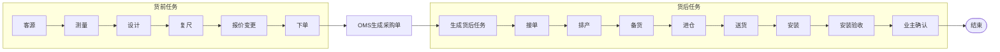
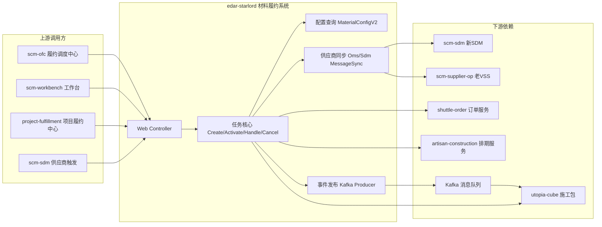
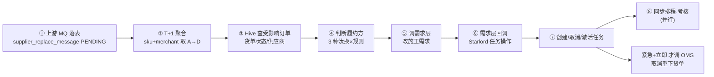

# 新人汇报：材料履约系统（starlord / edar）学习与实践

> 汇报人：刘腾达　|　方向：材料履约系统后端　|　周期：入职 ~3 周（2026.07）
> 本文档基于入职以来的业务梳理、代码研读、需求实践沉淀整理而成，供团队了解新人学习进展与产出。

---

## 一、业务认知

> 本模块用**开发视角**组织：先看材料履约"要管什么"（全景与核心载体）→ 再看主材任务"怎么走完一生"（全链路）→ 最后看全链路"靠谁落地"（协作实体）。

### 1.1 系统定位：我们在家装链路里的位置
从开发视角看，材料履约本质是**协调"货前测量 → 货后安装验收"的全过程**，系统要把这个过程管起来、可追踪；starlord 处在家装链路最末端的**交付层（履约交付层）**。该层核心由两部分构成：

- **履约调度**：施工调度（派单/预约/人员调度）、材料调度（下单/履约/主材进展跟进/产能分配/时效监控）
- **履约作业**：人（用工平台：接单/作业/打卡）、物（采购/仓储/运输/订单中心）
- **基础能力**：人员、商品、材料、供应商等系统支撑

其中**主材任务**是材料履约的核心载体：把"客户需要哪些主材"拆分为可追踪的任务流，串起测量→复尺→设计→报价→下单→接备发→安装→验收的全链路。

### 1.2 主材任务全链路（货前 / 货后的唯一分界 = 正式下单）
既然**主材任务**是核心载体，它的一生是怎样的？答案在一条**全链路**上：以"下单"为唯一分界，下单前是需求确认（货前），下单后才是真正的供应链履约（货后）。

- **货前**：尚未产生真实货物，只是需求确认（测量/复尺/设计/报价）。触发点在前置系统（设计师提交主材申请单），本系统只管理任务。
- **货后**：下单后货物正式产生，由供应链履约（接单/备货/排产/发货/安装）。
- **关键概念**：主材申请单（前置系统生成，是后续一切任务的起点）→ 拆分为 **SKU**（品牌+规格+材质+颜色）→ 每个 SKU 走自己的履约流程。

### 1.3 核心协作实体
全链路要真正跑起来，靠两类实体协作：**施工包**是"安装"的执行单位，**用工平台**是"人、货、工序"的协调中枢，两者把抽象的 SKU 履约流程变成具体的现场作业。
- **施工包**：工人施工动作的管理载体，以"人+料"构成，安装以施工包为单位；支持基装/安装、整装/零售、总工/产业/供应商工人等多种模式。
- **用工平台**：协调"什么人在什么工地用什么工具对什么材料按工序施加工艺"，是履约交付的重点。

### 1.4 一句话业务主线
> 以**前置系统生成的主材申请单**为业务起点，将客户主材需求拆分为具体 SKU；以**下单**作为货前/货后分界，用**货单号**串联供应商履约全过程（接单/备货/发货/安装），并通过商品变更消息、数据聚合、订单关联机制，保证供应商、SKU 与履约任务的一致性。

---

## 二、系统与技术认知

> 本模块按**宏观→微观**递进：先看系统是什么（定位）→ 它在系统间处于什么位置（上下游）→ 它用"配置"适配业务差异（三套配置模式）→ 配置如何变成任务流转（状态机）→ 三者在哪叠加成复杂度（三类复杂点）。

### 2.1 edar-starlord 定位
理解了业务"要管什么"，再看系统"怎么支撑"。**家装交付中台**，核心定位是：**主材任务全生命周期管理的调度引擎 + 配置中心**。
- 任务编排：测量→下单→排产→送货→安装→验收 长链条标准化为可追踪任务流
- 配置驱动：模板/规则配置适配不同品类、城市、供应商的差异
- 多方协同：连接设计师、管家、安装工、跟单员、供应商、业主
- 数据中枢：为 SDM / OMS / 供应链 / 验收等上下游提供任务状态

### 2.2 上下游依赖

### 2.3 三套配置模式（复杂性的来源之一）
前面看到 starlord 是连接上下游的枢纽，要对接千差万别的业务，落到实现上就是**配置驱动**。"适配差异"在历史演进中留下了**三套配置链路**（由 `mode_type` 区分）。核心差异：

| 维度 | mode=5 八合一 | mode=6 全国 | mode=7 排程 |
| --- | --- | --- | --- |
| 适用范围 | 北京被窝 | 圣都等非北京分公司 | 排程材料配置 |
| 配置表 | `material_flow_rule*` | `n_material_template*` | `delivery_flow_rule*` |
| 模板映射 | category→template | template→unit→processDefine | rule→unit→category→processDefine |

> 同一套"材料履约"逻辑，要在不同分公司 / 品类 / 套餐下走完全不同的配置链路，这是系统复杂度的核心来源。代码依据：节点代码经 `CodeJointConvert.jointTaskCode(nodeCode, modeType)` 拼接 —— **配置模式直接决定任务/节点的生成**。那么这些配置是怎么变成任务流转的？见下一节。

### 2.4 任务状态机与激活
配置不是静态的：启动时把 **processChain（JSON 有向图，节点=状态/步骤、边=流转）** 加载进内存，由它**驱动任务的创建与状态流转**。`配置模式(mode_type) → 模板 → 流程定义 → 状态机`，是一条可验证的因果链。主材任务节点类型（常说 20/40/60/80）：
`开始(1)` → `通知启动(20)` → `启动派单(40)` → `进场(50)` → `启动(60)` → `自检验收(65)` → `启动验收(80)` → `业主确认(85)`。
- 任务创建后处于 `NOT_ACTIVE`，到期或条件满足后激活进入 `UNCOMPLETED`，逐节点流转至 `COMPLETED`。
- 激活受**前置条件**约束（尾款拦截、订单状态、依赖节点完成），且存在**新版 / 旧版双激活路径**，新版还需处理多分支、条件路由。

### 2.5 初步识别的系统复杂点（即后续要啃的硬骨头）
把前面几节串起来：**配置维度爆炸（2.3）+ 状态机与激活复杂（2.4）+ 跨系统一致性（上下游联动）** 三者叠加，构成系统真正的复杂度。归纳如下：
1. **配置维度爆炸**：分公司 × 品类 × 套餐 × 节点属性（角色/操作/重启/合并/时间/推送），多张配置表（`n_material_template` / `n_material_node_cfg` / `n_material_route` / `n_material_task_cfg` …）相互关联。
2. **状态机与激活复杂**：双激活路径、前置条件拦截、多分支路由，分支多易错。
3. **跨系统一致性**：需求层 / OMS / SDM / VSS / Cube 多系统通过消息联动，需保证任务、货单、施工需求三方数据一致（如本次在供应商汰换中修复的"状态未闭环"问题）。

---

## 三、我的实践产出

### 3.1 材料履约进展查询工具（前端小工具，自主开发）

> 前面是"认知"，下面进入"落地"。这个自主开发的小工具，正是为了更快看清上一节那张全链路进展图。

**背景与痛点**：入职第一周了解 edar-starlord 时，发现材料履约进度查询路径繁琐——需打开 **3 个不同页面**手动对照，单次约 **5 分钟**，且无法在一个视图同时观测多个供应商的进度。

**功能**：
1. 一键查询：输入项目 ID，秒级返回材料列表、类目详情、履约时间轴
2. 多订单区分：区分同一材料履约流程中的多个下单信息
3. 多供应商观测：同时展示多个接单供应商的履约进度
4. 智能跳转：可跳转主材报价单、商品列表、订单详情
5. 流程阶段判断：根据报价单商品信息自动判断是否经过报价选品阶段

**技术方案**：

| 层级 | 技术 |
| --- | --- |
| 前端 | 单文件 HTML（约 1120 行），原生 JS + CSS，零依赖 |
| 后端代理 | Node.js HTTP 代理（proxy.js，约 186 行），解决 CORS |
| 后端 API | 两个第三方接口（材料报价、履约进度），经本地代理转发 |

关键设计：① 一次 POST `/api/progress` 拿全量数据，按 `materialCode` 内存分组索引，替代"1+N+M"次请求；② 纯内存缓存，切换材料零延迟；③ 检测到"安装"任务时补充查询施工包编号 `packageCode`。

**效果**：

| 对比维度 | 改造前 | 改造后 | 提升 |
| --- | --- | --- | --- |
| 单次查询耗时 | ~5 分钟 | ~30 秒 | **10x** |
| 页面操作 | 3 页手动查找 | 1 键查询 | — |
| 日均 20 次 | 节省 40–60 分钟/天 | | |

**演进与不足**：
- 期间持续迭代：补充订单查询（7.7）、修复乱码（7.8）、整合报价单接口做选品判断（7.9）。
- 不足：部分第三方接口返回体量大、存在重复数据，前端做了整合与缓存来规避，但"预取 vs 缓存"的边界仍需按实际跳转概率权衡；个别跳转能力（如报价详情跳转）尚未完全打磨。

### 3.2 供应商汰换需求（参与开发）

> 本需求按 **问题 → 方案 → 落地** 讲述：先看清"问题"（老商出问题为什么要快速汰换）→ 再看"方案"（五阶段架构 / 判定规则 / 业务编排 / 领域模型 / 设计思想）→ 最后落到"我做了什么"（代码贡献 / 交付清单）。

**问题（背景与触发入口）**：常规汰换之外，业务存在需快速终止老商履约、切换新商的紧急场景（服务异常、质量/合规风险、重大履约事故等）。若不快速汰换，**已发货 / 在途材料会持续由问题商履约**，扩大客诉与损失。上游需求层通过消息 `measure-apply-order-supplier-replacement` 下发汰换指令，由事件处理器 `SupplierReplaceDemandEventHandler` 消费，调用 `SupplierReplaceProcessService.process()` 编排。整个子系统由 `sunbin050` 主导搭建；本人在其基础上完成了**大数据能力接入**与**两处关键增量修复/增强**，并补全了并发正确性分析。

> 分支：`feat/50545697/replacesupplier`

#### 3.2.1 三种汰换方式（差异决定了全部处理规则）

| 类型 | 编码 | 含义 | 处理要点 |
| --- | --- | --- | --- |
| 常规汰换 | 1 | 正常替换，参考已有货单状态决定履约方 | 看老商任务是否**已完成且同步 SDM** |
| 紧急+立即 | 2 | 紧急替换且立即生效，需同步取消 OMS 货单 | 已发货则留老商，未发货切新商并取消货单 |
| 紧急+不立即 | 3 | 紧急替换但当前货单继续由老商完成 | 有货单一律留老商 |

#### 3.2.2 整体架构：五阶段数据流

整个方案一句话概括：**供应商汰换后，Starlord 先收集所有数据并判断最终由谁履约，再交给需求层修改施工需求，需求层完成后通知 Starlord 生成/取消任务，最后同步 OMS、排程等外围系统。**

> 设计关键价值：**先落表 + T+1 聚合**，把一天内多次变更（A→B→C→D）收敛为最终态（A→D），避免反复改任务、产生大量无效任务。

#### 3.2.3 核心业务规则

**a) 履约承接判定（需求层核心逻辑）**

紧急汰换判定矩阵（货单状态 × 汰换类型）：

| 货单状态 ╲ 汰换类型 | 紧急-立即 | 紧急-不立即 |
| --- | --- | --- |
| 无货单（货单未生成） | 新商跟进 | 新商跟进 |
| 有货单·待接单/备货中 | 新商跟进 | 老商继续 |
| 有货单·待发货/待签收 | 老商继续 | 老商继续 |

> 一句话口径：**无货单一律新商跟进；有货单仅「紧急-立即 + 待接单/备货中」切新商，其余全部留老商。**

常规汰换两步判断：
- **判断一**：是否有货单？有 → 老商继续；无 → 进入判断二
- **判断二**：货前服务中是否存在「处理人为供应商角色 且 ≥1 个已完成」的任务？有 → 老商继续；无 → 新商跟进

> 设计理由：货单已生成 = 履约事实已落在该供应商，由其继续更顺；无货单但货前已有该供应商角色的完成项 = 已实质投入，否则尚未实质投入，可切新商。

**b) 新老商角色场景判断（a / b 场景）**

- 新商任务和老商任务**都不是供应商任务** → **a 场景**：老商任务状态全量覆写到新商（保证连续性），不处理老商未完成任务
- 涉及**供应商角色** → **b 场景**：老商任务在途则**取消老商**未完成任务，按实际生成新商
- 角色判定：老商角色看任务/配置，新商角色看配置；两者都可判断 → 区分 a/b，任一不可判断 → 默认 b

**c) 任务处理与外围联动**

| 规则 | 说明 |
| --- | --- |
| 聚合维度 | skuId + merchantId，T+1 批处理 |
| 任务取消 | 老商履约 + b 场景（含供应商任务）→ 取消老商未完成任务 |
| 状态复制 | a 场景（均非供应商）→ 老商任务状态全量覆写到新商 |
| OMS 联动 | **仅紧急+立即**触发 OMS 取消重下，其他方式不动货单 |
| 排程通知 | 所有场景都需通知排程侧供应商变更（当前未接入，为 TODO） |

#### 3.2.4 业务编排内部流程（3.1 ~ 3.6）

`SupplierReplaceProcessServiceImpl.process()` 按如下步骤处理每个 SKU 变更明细（`SkuChangeDetail`，含 `skuId` / `merchantId` / `newSupplierCode` 等）：

| 步骤 | 说明 |
| --- | --- |
| **3.1 老商履约** | 老商已履约的，直接走主材申请单逻辑结束该 SKU 处理 |
| **3.2 生成新商任务** | 调 `ScmMeasureApplyService.createTask` 生成新商主材任务 + 下单任务，查回新商任务并对 `extend.replacement` 打标 |
| **3.3 激活** | 激活时间 < 当前时间则立即激活任务 |
| **3.4 状态复制** | 新商履约 + 新老商均非供应商（a 场景）时，将老商任务状态/节点复制到新商（copyTaskState / copyNodeState） |
| **3.5 并行后置** | 并行执行：货主材+考核、排程（demandChange）、下单 |
| **3.6 紧急汰换→OMS** | `replace_type=2`（紧急+立即汰换）时，先经 **Hive 大数据反查已发货货单**，再调 OMS 取消并重下新商货单 |

> **关键闭环（3.6）**：依赖 Hive 大数据查询能力——通过 `SupplierReplaceHiveManager.queryOrderRange(skuId, merchantId)` 反查「项目单 / 订单号 / 订单状态 / 供应商编码」，命中已发货货单后才驱动 OMS 取消重下。这正是本需求中大数据能力接入的意义所在。

#### 3.2.5 涉及的系统模块与领域模型

> 理解本需求需要掌握的 starlord 系统基础（edar-starlord 为材料域核心系统，Java + Spring + MyBatis 多模块 Maven 工程，包路径 `com.ke.utopia`）。

**分层模块**

| 模块 | 职责 |
| --- | --- |
| `edar-starlord-api` | DTO / Bean / 枚举（如 `SupplierReplaceHiveDTO`、`SupplierReplaceMessageCondition`） |
| `edar-starlord-base` | 基础能力 |
| `edar-starlord-dao` | MyBatis Mapper（337 个 xml，核心表 `task_dispatch` / `task_dispatch_node` / `measure_apply` / `supplier_replace_message`） |
| `edar-starlord-manager` | 业务编排 / 外部调用（含 Hive 大数据调用、企业微信通知等） |
| `edar-starlord-service` | 核心业务逻辑、事件监听、供应商汰换编排 |
| `edar-starlord-web` | Controller、后门（BackDoor）、静态页 |

**核心领域模型**

- **主材任务 `task_dispatch`**：任务派发主表，含 `process_status`(流程状态)、`supplier_code/name`(供应商)、`task_type`(任务类型)、`material_code/name`(材料)、`order_no`(关联货单)、`source_type`、`service_mode`、`estimated_time` 等。
- **任务节点 `task_dispatch_node`**：任务的工序节点（`node_type`、操作人 `operator_id`）。
- **复尺/测量申请 `measure_apply`**：主材测量的业务单，是供应商汰换的数据源头之一。
- **供应商汰换消息 `supplier_replace_message`**：记录「某 SKU + 商户」维度的汰换处理消息，含 `status`(处理中/完成) 与 `fulfill_result`(履约结果：老商/新商)。

**主材任务生命周期（主线）**：复尺申请 → 生成主材任务（`createTask`）→ 任务打标（`extend.replacement`）→ 激活（到激活时间）→ 并行执行（货主材+考核 / 排程 / 下单）→ 履约（老商或新商）→ OMS 货单处理 → 完结。

#### 3.2.6 数据设计要点

- **消息落库**：`MerchantSkuSupplierReplacePayload` 含 skuId / merchantId / old&new Supplier / replaceType / immediateSwitch / categoryId 等；starlord 接收后转 `supplier_replace_message` 记录，状态 `PENDING`
- **中间表** `supplier_replace_message`：status（0 待处理 / 1 处理中 / 2 已处理 / 3 失败），`idx_status_create` 用于聚合捞取
- **需求层接口** `POST /api/supplier-replacement/evaluate`：**只做"谁来履约"的判定，不改任务**；结论持久化到 `receipt_order_service_item`（新增 supplier_code_before / fulfillment_decision 等字段），幂等键 `replacement_event_id + sku + project_order_id`
- **Hive 取数**：`HiveApiUtil.searchHiveApi` 从大数据拉受影响订单（订单 ID / 货单号 / 货单状态 / 供应商），分批 1000 处理

#### 3.2.7 设计思想（为什么这样设计）

- **为什么先落表**：避免 A→B→C→D 连续修改四次任务
- **为什么 T+1**：统一聚合为最终态 A→D，减少任务创建、消除无效任务
- **为什么要经过需求层**：需求才是真实业务，任务是需求产生的结果 → 应是「需求 → 任务」，而非「任务 → 需求」
- **为什么需求层再回调**：保证所有外围系统监听同一个事件（而非各自处理），从源头保证一致性

#### 3.2.8 我的代码贡献（落地①）

> 整体定位：子系统由 `sunbin050` 主导搭建；本人聚焦在**大数据能力接入**与**两处增量修复/增强**，并补全了并发正确性分析。

**① HiveAPI 大数据拉取能力接入（核心贡献）** — 提交 `76c73b73b`（2026-07-14）+ 多笔测试提交
- 新增 `HiveApiNewUtil`（Spring `@Component`，从配置注入 key/secret，委托既有 `HiveApiUtil.searchHiveApi` 做签名/OkHttp/解析），替代旧静态工具，更契合注入式调用
- 新增 `SupplierReplaceHiveManager` 接口 + `Impl`：常量 `HIVE_URL = http://i.data.api.lianjia.com/v2/meta/queryProjectSkuidOrderNo`；方法 `queryOrderRange(List<SkuMerchantPair>)` 按 `skuId+merchantId` 批量反查 `projectOrderId/orderNo/orderStatus/skuId/merchantId/supplierCode`
- 新增 `SupplierReplaceHiveDTO`（`edar-starlord-api` 可序列化传输对象）
- 新增后门 `POST /backdoor/hiveApi/search`（自动注入分区 `pt=昨天` 便于联调）
- `edar-starlord-manager/pom.xml` 新增 `okhttp` / `logging-interceptor` / `guava-retrying`(2.0.0) 依赖；新增 `SupplierReplaceApiTest`
- **业务价值**：打通主材系统与大数据平台的实时查询通道，使第 3.6 步精准识别已发货货单并触发 OMS 取消重下，避免错发/漏发

**② 需求层回调新增"汰换处理成功标记"** — 提交 `d33479452`（2026-07-21）
- 在 `SupplierReplaceProcessServiceImpl.process()` 新增第 5 步 `markReplaceMessagesDone(bo)`：收集 notChange/add/cancel/modify 四列表的 `skuId_merchantId` 维度，反查 `PROCESSING` 消息逐条 `markDone(fulfillResult=新商履约=1)`
- 新增私有方法 `markReplaceMessagesDone` / `collectSkuMerchantPairs` / `collectMeasureDetailPairs`，每层做空值保护
- **业务价值**：补全需求层回调闭环——汰换成功后显式标记消息完成，下游可感知履约结果，避免消息长期停留"处理中"导致重复处理

**③ 新老商任务处理空指针修复** — 提交 `dcd1e8409`（2026-07-20）
- 步骤 3.4 原逻辑 `if (this.isAllNotSupplierConfig(oldTask, newTask, ...))` 在「老商任务不存在对应新商任务」(`newTask==null`) 时触发 NPE，整批汰换中断
- 修复为 `if (newTask != null && this.isAllNotSupplierConfig(...))`，无新商任务的 SKU 安全跳过，流程健壮

**④ 深入分析（并发正确性 + 流程验证）**
- **两次激活竞争分析**：定位任务创建后异步激活（`afterCreate`）与汰换回调中同步激活（`activateIfNeeded`）会两次调用 `doActivateTaskDispatch`，分析其乐观锁 CAS + 事务保护机制，确认各竞态场景正确性
- **a/b 场景取消逻辑验证 + 流程梳理**：验证 a/b 场景任务取消逻辑完整性，梳理考核/排程并行路径（`CompletableFuture` 异步 + 仅「紧急+立即」通知 OMS 换货单）

#### 3.2.9 工作量与提交清单（落地②）

| 序号 | 提交 | 主题 | 日期 |
| --- | --- | --- | --- |
| 1 | `76c73b73b` | [紧急]HiveAPI 拉取数据功能（能力接入） | 2026-07-14 |
| 2 | `dcd1e8409` | [紧急]新老商任务处理（NPE 修复） | 2026-07-20 |
| 3 | `d33479452` | [紧急]需求层回调新增汰换处理成功标记 | 2026-07-21 |
| 4 | `e570cb10e` 等 | [紧急]HiveAPI 拉取数据功能测试（多笔联调提交） | 2026-07-14~ |

**涉及核心文件**：`HiveApiNewUtil.java`（新增）、`SupplierReplaceHiveManager.java`+`impl/`（新增）、`SupplierReplaceHiveDTO.java`（新增）、`BackDoorController.java`（新增 Hive 后门）、`edar-starlord-manager/pom.xml`（okhttp/guava-retrying）、`SupplierReplaceProcessServiceImpl.java`（2 处增量）、`SupplierReplaceApiTest.java`（新增测试）。

#### 3.2.10 汇报话术建议（可直接引用）

- **一句话定位**：负责材料主材任务生命周期系统中的"供应商汰换"需求，重点打通了大数据平台查询通道并补全了需求层回调闭环。
- **技术亮点**：① 基于 OkHttp + 签名工具接入 Hive 大数据 API，为主材汰换提供实时货单反查能力；② 用 Spring 组件化封装（`HiveApiNewUtil`）替代静态工具，提升可注入性与可测性；③ 在核心编排链路中补齐消息完成标记，形成"处理→回调"闭环；④ 修复 3.4 步 NPE 隐患，保障整批汰换不中断。
- **业务价值**：让紧急供应商汰换能精准识别已发货货单并自动触发 OMS 取消重下，避免错发漏发；同时让需求层能实时感知汰换履约结果。

#### 3.2.11 当前进度与跨团队协作

- 需求横跨多系统多团队：主材申请单新消息（xiajun）、下游 OMS/下单层（fuxin、xiajun）、需求层接口（xiajun）、Hive SQL（马福鑫、夏俊）、总体流程梳理（sunbin）、排程调用（白一兵、朱月辉）、货调用（白一兵）。
- 我个人聚焦在**回调层状态闭环 / 激活并发 / Hive 取数链路**这几个接合点；当前需求处于**测试与联调阶段**，相关修复与并发分析已沉淀，正推进联调与上线。

---

## 四、技能与知识沉淀

汇报期内沉淀为三条主线：

**① Java 基础与工程实践**
- 日志框架（SLF4J）、Lombok 构造注解、迭代器正确使用
- HTTP 客户端：`OkHttpClient` 单例化（连接池/线程池/超时配置）、`Retryer` 重试策略、`Assert` 参数校验
- 泛型擦除导致 `JSON.parseObject` 需 `TypeReference`；`Collectors.toMap` 的 merge 处理；`GROUP BY` 与 Java 分组的类比理解

**② Hive 大数据调用与聚合**
- 通过数据工厂创建 API，从 Hive 拉取受影响订单数据（供应商汰换核心数据源）
- 踩坑与经验：必须加分页；大表 `GROUP BY` 代价高、非聚合需求不应带 group；缺索引需提工单；跨分区查询超时定位
- 聚合思想：同一 SKU×店铺多次变更（A→B→C→D）先落库聚合，仅处理最终有效态，避免无效任务

**③ 异常排查 & 调用链分析手册（自主沉淀）**
- 总结"异常堆栈分析四步法"、定位问题三明确（具体问题/原因/影响）
- 形成可复用的线上问题排查 SOP，已作为团队资产沉淀于知识库

---

## 五、复盘反思与下一阶段规划

### 反思
回想入职初期，我曾陷入两个困境，导致对整体业务的理解笼统杂乱：
1. **目标不明确且缺乏沟通**：在未明确自己阶段目标的情况下，没有及时与导师（二哥/明哥）对齐，导致梳理业务逻辑时抓不住重点。
2. **落入"只问业务问题"的陷阱**：只被动追问业务细节，没有就当前梳理方向、计划与导师沟通确认，本末倒置，一度出现"以输出日报为目标"的倾向。

### 改进与现状转变
经过对齐与调整，已从"笼统了解业务"转向"深入代码、能定位并修复问题"：
- 能独立研读核心逻辑（激活、节点流转、供应商汰换全链路）
- 在真实需求中**定位并修复 NPE、补全状态闭环、分析并发正确性**
- 把"学习→输出→复用"作为稳定闭环（学习文档、排查手册、code-to-wiki 工具链）

### 下一阶段规划
1. **完成供应商汰换需求联调与上线**：把已修复的状态闭环 / NPE / 并发问题在联调中验证，推动需求平稳上线。
2. **深入材料配置，定位复杂点并 fix**：针对 2.5 节识别的三类复杂点（配置维度爆炸、状态机/激活、跨系统一致性），逐个拆解，把"知道复杂"推进到"能修复杂"。
3. **把梳理成果产品化**：将供应商汰换、配置链路的理解沉淀为可复用的配置校验 / 智能排查辅助（此前判断 AI 应从"配置校验""智能排查"这类规则明确、ROI 可见的场景切入，后续可在真实需求中验证）。

---

> 目前对业务与系统的理解仍有浅显、可能有误之处，欢迎团队批评指正。
