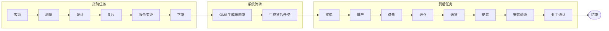
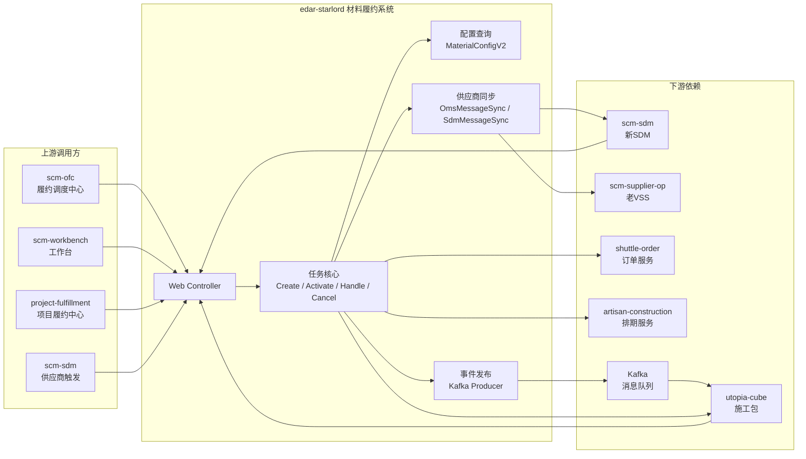
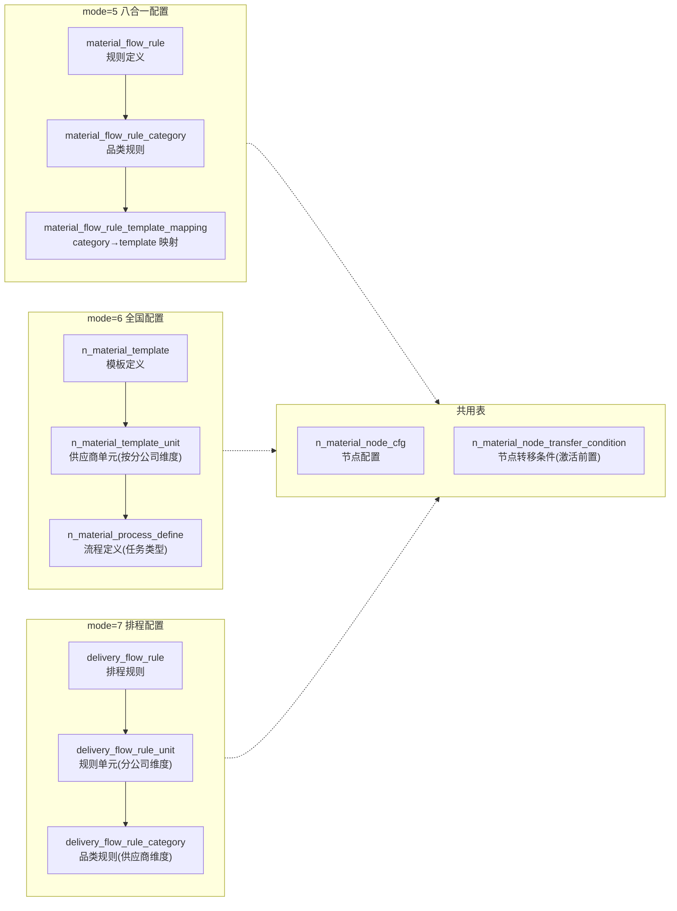
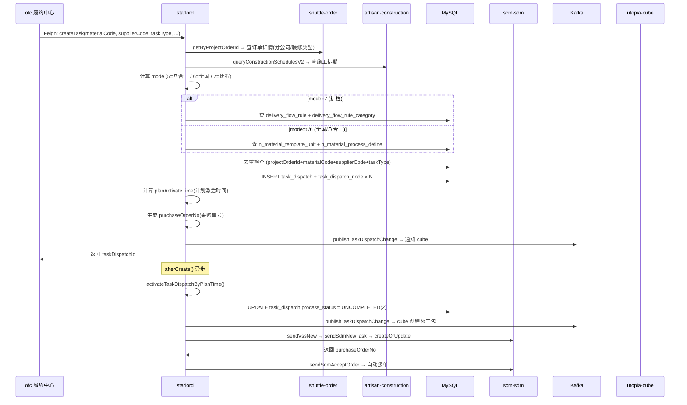
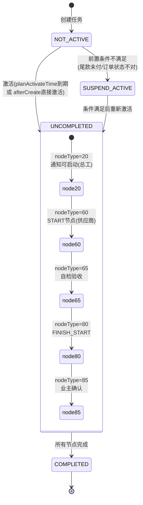
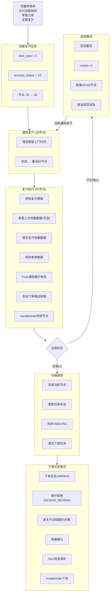
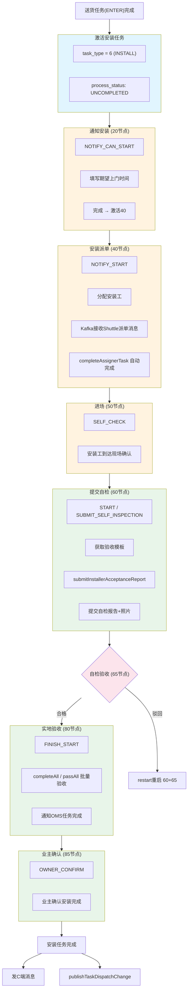
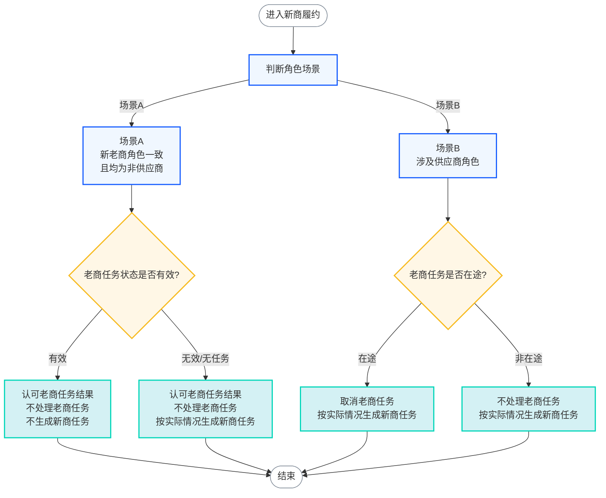

# 内容：
1. 对业务以及系统的了解
2. 入职以来我做了哪些事情
3. 下一阶段的计划
4. 最终目标「暂定」
5. 反思与改进

# 业务以及系统的梳理
## Home系统
总共分为五层、其中我们位于交付层。也叫履约交付层，可分为
1. 履约调度（用于管理）
	- 施工调度：对施工流程的派单、预约、分配、作业、考核、人员调度操作
	- 材料调度：对材料下单、履约以及主材进展跟进、流程调度、产能分配、时效监控操作
2. 履约作业（用于执行）
	- 人-用工平台：人员接单、施工作业、工地播报、人员打卡
	- 物-采购平台、仓储中心、运输中心、材料订单中心，实现材料的采购、存储、运输、以及订单管理。
3. 基础能力（用于履约的支撑，包含人员、商品、材料、供应商等系统支持）
	- 基础能力，通过例如人员系统、供应链系统、商品系统等支持
![[新人串讲/fig/Home系统.png]]

主材任务流程大致如下

[[starlord项目整理/主材任务操作-带图片]]
## 履约调度平台

是用来管理什么人在什么样的工地用什么工具对什么材料按照工序施加工艺的，面向整装订单、零售订单和服务单
重点根据工期、施工订单、工艺等协调人与货的安装交付等任务。
![[新人串讲/fig/Pasted image 20260712165022.png]]
### 用工平台
履约交付平台中重点是用工平台，工期、人、货、配置均为其提供支持
外部依赖：
- 依赖于人、货
- 履约交付的配置层、数据层
- 全交付流程的工期
根据配置和工期来协调人和货的进场和安装管理，实现最终的安装完成
![[新人串讲/fig/Pasted image 20260712164459.png]]
### 用工流程
#### 工艺
首先根据工艺进行划分，可分为：
![[新人串讲/fig/Pasted image 20260712165705.png]]
执行时也基本按照这个工程进行，先拆除、后水电。。。
以上是对工艺的分类和排列
#### 工期
主要分为以下五种，每个工期的作用和使用的的用户不一致
- 底线工期：例如总部规定， 泥木工程最长不能超过15天。那么15天就是**底线工期**。
- 计划工期：基于工期标准配置生成的计划，之后不会变化，对标合同签约时的工期。
- 考核工期：基于考核工期配置生成，面向业务管理和服务商绩效考核使用。它作为内部考核标准，用于评价服务商、项目经理等是否按要求完成施工，不直接作为对客户承诺的工期。
- 实际工期：施工过程中各节点实际发生时间计算得到的工期，真实反映项目执行情况。项目竣工后，会将**实际工期**与**对客承诺工期**进行对比，用于判断是否发生延期。
- 对客承诺工期：面向客户的最终承诺工期，由**计划工期**结合已审批的延期（如业主原因、不可抗力等）调整形成，用于合同履约和客户交付，是判断是否对客延期的依据。

![[新人串讲/fig/Pasted image 20260712165901.png]]

#### 施工包的工作流程图
施工包是工人施工动作的流程管理载体
支持的业务模式：
1）基装施工、材料安装
2）整装、搭售、零售
3）总工工人、产业工人、供应商工人
4）成品保护工、砌墙泥工、地坪工、吊顶工、基装保洁工、油工收尾修补、木门工、橱柜工、定制家具安装工、竣工保洁工、水电后期安装

主要分为基装施工包和安装施工包
![[新人串讲/fig/Pasted image 20260712175818.png]]
### starlord系统
edar-starlord系统是**家装交付中台**，主要职责是进行**主材任务**全生命周期管理的调度引擎以及作为配置中心
图1展示了edar-starlord系统的上下游依赖，上游均通过web controller接入。starlord系统主要根据不同配置实现主材任务的创建激活处理和取消，并同步下游依赖如sdm，vss、以及cube施工包。

其中不同的配置根据ModeEnum的不同值来区分，分为如下七种，但是目前主要使用的是HOME2.5版本。图2展示了 HOME2.5版本下的数据依赖。

| 模型值（value） | Name        | Code    |
| ---------- | ----------- | ------- |
| 1          | 北京被窝        | BEIWO   |
| 2          | HOME2.0整装   | HOME2.0 |
| 3          | 新零售         | （空）     |
| 4          | 业主自购        | （空）     |
| 5          | HOME2.5     | HOME2.5 |
| 6          | HOME2.5用工管理 | HOME2.5 |
| 7          | 排程材料配置      | HOME2.5 |

| 维度       | 5八合一                        | 6全国                             | 7排程                                    |
| -------- | --------------------------- | ------------------------------- | -------------------------------------- |
| **适用范围** | 北京被窝                        | 圣都等非北京分公司                       | 排程材料配置                                 |
| **配置表**  | `material_flow_rule*`       | `n_material_template*`          | `delivery_flow_rule*`                  |
| **模板映射** | category → template mapping | template → unit → processDefine | rule → unit → category → processDefine |
| **节点定义** | `n_material_node_cfg`       | `n_material_node_cfg`           | `n_material_node_cfg` (共用)             |

 图2

---

## 图3
### 任务创建全流程（时序图）

---

节点类型包括：
常说的20 40 60 80分别对应如下表所示

| 常量                    | value | 名称   | 安装名称 |
| --------------------- | ----- | ---- | ---- |
| NODE_START            | 1     | 开始节点 | 开始   |
| NOTIFY_CAN_START      | 20    | 通知启动 | 约工   |
| NOTIFY_START          | 40    | 启动派单 | 派单   |
| SELF_CHECK            | 50    | 进场   | 进场   |
| START                 | 60    | 启动   | 提交自检 |
| SELF_CHECK_ACCEPTANCE | 65    | 自检验收 | 自检验收 |
| FINISH_START          | 80    | 启动验收 | 实地验收 |
| OWNER_CONFIRM         | 85    | 业主确认 | 业主确认 |
### 复尺节点的流转 
[[starlord项目整理/复尺流程]]
#### 任务创建 
维度A：外部触发事件（什么时候触发）

| #   | 触发事件                                             | 入口类                                                                           | 所做操作          | 对应内部机制                         |
| --- | ------------------------------------------------ | ----------------------------------------------------------------------------- | ------------- | ------------------------------ |
| ①   | **测量申请单提交** SCM商家端发 `measure-apply-order` 事件 | `ScmMeasureApplyEventHandler` ↓ `ScmMeasureApplyServiceImpl.createTask()` | 创建复尺任务（含模式判定） | 路径①②③④（根据条件选择）                 |
| ②   | **项目变更完成** 设计变更单完成                           | `AtomProjectChangeEventHandler.invokeRecheckAgain()`                          | 重新创建复尺任务      | `newFuchiMaterialTaskCreate()` |
| ③   | **手动点击"再次复尺"** 用户在前端操作                       | `MaterialMeasureTaskController.invokeRecheckAgain()`                          | 重新创建复尺任务      | `newFuchiMaterialTaskCreate()` |
| ④   | **复尺服务单状态变更** 待验收/已完成/挂起                     | `ServiceOrderServiceImpl.completeNodeByServiceOrder()`                        | 完成已有复尺节点（非创建） | 直接完成 `NodeType.START`          |

维度B：内部创建机制（怎么创建，适用于维度A-① 内部）

路径①（测量申请单提交）内部，根据项目配置走不同的子路径：

| # | 机制 | 代码位置 | 核心逻辑 |
|---|------|---------|---------|
| **① 模板配置查询** | `execCreateMaterialProcess()` → `queryAllMaterialForm()` | 根据模板配置查出该品类/供应商下所有需生成的任务类型（包含复尺） |
| **② 交付流程规则解析** | `buildCondition()` L686-699 → `MaterialConfigUtil.getTaskTypeByNodeProcessName()` | 解析 `nodeProcessName` 字段如 `"测量-设计-复尺-下单-备货-送货-预埋-安装"`，按 `-` 拆串匹配 `TaskTypeEnum` |
| **③ 零售订单直接创建+完成** | `createMaterialTaskWithDefaultParam()` L279 | `sourceType=RETAIL`，直接创建 `RECHECK_SCALE` 并立即完成 node 60，执行人=定制设计师 |
| **④ 定额复尺(9999999)** | `buildCondition()` L701-704 | 供应商编码=9999999 时，`condition.setTaskTypeIn` **只包含** `RECHECK_SCALE`，跳过测量 |

##### 去重逻辑
创建复尺任务前会检查是否已存在相同**品类+供应商**的复尺任务，防止重复创建。
具体的流程如下：

### 安装流程
[[starlord项目整理/安装流程]]
安装任务有 **2 个独立的创建入口**：

|     | 创建路径                                                         | 入口类/方法                                                                    | 说明                                                                                    |
| --- | ------------------------------------------------------------ | ------------------------------------------------------------------------- | ------------------------------------------------------------------------------------- |
| ①   | **VSS供应链订单推单**（主要路径） SCM-OFC 发 `order_info_push_task` 事件 | `ProjectVssEventHandler.handleBiz()` → `VssOrderService.createTask()`     | 供应链订单推单触发，覆盖走VSS的全部订单。区分 `needInstall` 决定创建 INSTALL 还是 ENTER                          |
| ②   | **测量申请单随模板创建** 提交测量申请后随任务链一起创建                           | `ScmMeasureApplyServiceImpl.createTask()` → `execCreateMaterialProcess()` | 测量申请提交时，模板配置链中包含 AFTER_ORDER 的安装任务。受 `isMaterialSchedule`/`isDownServiceOrder` 模式判定影响 |

安装的状态流转为：

## 入职以来我做了哪些事情
### 前端小工具开发

#### 一、背景

入职第一周学习家装业务系统（edar-starlord）时，发现**材料履约进度查询**的操作路径非常繁琐：

- **原始方式**：需打开 **3 个不同页面**，手动对照数据
- **单次耗时**：约 **5 分钟**，操作冗余
- **痛点**：无法在一个视图内直观看到所有材料的履约进展，多个供应商的进度也无法同时观测

### 二、用来干什么的

这是一个**材料履约进展查询工具**，核心功能：

1. **一键查询**：输入项目 ID，秒级返回材料列表、类目详情、履约时间轴
2. **多订单区分**：可区分一个材料履约流程中的多个下单信息
3. **多供应商观测**：同时展示多个接单供应商的履约进度
4. **智能跳转**：支持跳转至主材报价单查询界面、商品列表页、订单详情页
5. **流程阶段判断**：根据报价单中的商品信息自动判断是否经过了报价选品阶段

三、如何实现

技术架构

| 层级         | 技术                                                  |
| ---------- | --------------------------------------------------- |
| **前端**     | 单文件 HTML（约 1120 行），原生 JavaScript + CSS，零依赖          |
| **后端代理**   | Node.js HTTP 代理（`proxy.js`，约 186 行），用于解决 CORS（跨域）问题 |
| **后端 API** | 两个第三方接口（材料报价、履约进度），通过本地代理进行转发                       |

关键设计决策
1. 一次请求拿到所有数据：最初是 1（列表）+ N（每个材料的报价）+ M（每个材料的进度）次请求 → 重构为一次 POST 请求 /api/progress，返回完整的材料列表 + 进度数据，按 materialCode 在内存中分组索引
2. 纯内存缓存：数据一次性拉取完毕后，左侧材料列表和右侧时间轴均从内存中直接读取，点击切换材料零延迟，不重复请求
3. 施工包查询：当检测到「安装」任务时，额外发起请求查询施工包编号 packageCode，补充到时间轴显示
### 四、效果如何

| 对比维度             |   改造前   |  改造后   |  提升倍数   |
| :--------------- | :-----: | :----: | :-----: |
| 单次查询耗时           |  ~5 分钟  | ~30 秒  | **10x** |
| 页面操作             | 3 页手动查找 | 1 键查询  |    —    |
| 查询速度             |    —    |  ↑80%  |    —    |
| 处理速度             |    —    | ↑400%  |    —    |
| 操作流程时间（对比专职接口方案） |    —    | 缩短 40% |    —    |

日常：按日均查询 20 次计，每日节省 **40-60 分钟**。

### 五、哪些方面有提升 + 提升了多少

| 提升维度       | 具体改善                |         量化数据         |
| :--------- | :------------------ | :------------------: |
| **时间效率**   | 3 页手动对照 → 1 键查询     | **10 倍**（5min → 30s） |
| **可视化**    | 无法直观看到进展 → 统一视图     |     效率 **↑80%**      |
| **页面集成度**  | 孤立页面 → 可跳转报价单/商品/订单 |    流程时间 **↓40%**     |
| **信息密度**   | 分散查找 → 一眼看全的布局      |       认知负担显著降低       |
### 供应商汰换需求
- 背景：在常规供应商汰换流程之外，业务中存在一类需要快速终止老商履约、切换新商的紧急场景（例如供应商服务异常、质量问题、突发合规风险、重大履约事故等）。这类场景无法等待老商在途货单自然消化，需要对不同状态的切换供应商进行做差异化处理，供应链需支持决策是让老商继续履约，还是立即切换给新商。
- 方案：整体流程分为两层判断，第一层判断是新商还是老商履约。第二层判断是根据是谁履约并且结合角色场景来判断来对新老商任务的处理。
  核心判定
  第一层：履约结果 = 老商履约 → 全部不处理（短路）
  第二层：履约结果 = 新商履约，按 角色场景 + 老商任务状态

其中角色场景是一个关键概念，就是指货前服务的作业角色（如项目经理、设计师、项目助理，这类属于非供应商角色）。场景分为a,b。若新老商角色一致且均为非供应商则为a，其余则为b。不同角色场景下，新老商根据老商的任务状态去进行处理。

具体情况如下：

|角色场景|老商任务状态|老商处理|新商处理|
|---|---|---|---|
|a（均非供应商）|已生成未完成 / 已完成|不做处理|不新生成|
|a|已取消 / 未生成|不做处理|按配置+用量判断|
|b（含供应商）|已生成未完成|**取消老商任务**|按配置+用量判断|
|b|已完成 / 已取消 / 未生成|不做处理|按配置+用量判断|
## 下一阶段的计划
- 梳理清楚主材任务每一个节点的流转状态：包括触发路径、状态流转、处理结果。
- 然后根据主材任务的流程串联
+ 最终目标是 掌握整个材料了配置，知道它为什么复杂 复杂点有几个 分别在哪里然后fix掉。
## 反思与改进
+ 反思：回想入职两周以来，我陷入了两个困境中。这两个困境导致我两周以来对整体业务的了解笼统杂乱
	+ 一、不明确自己的目标的情况下没有跟二哥和明哥沟通。导致自己在梳理整个业务逻辑时抓不到重点
	+ 二、落入了只能问业务问题的思维陷阱。没有对我当前的梳理方向以及计划进行沟通确认。
+ 改进：
	+ 沟通了解清楚 对当前阶段的重点
	+ 沟通明确自己的下一阶段目标
	+ 有些本末倒置，出现以输出日报为目标