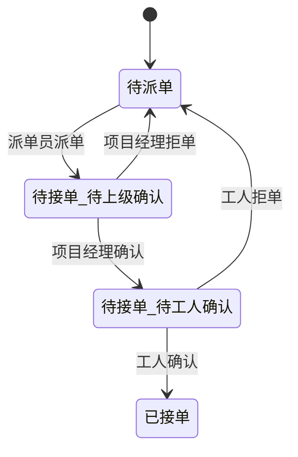

# 安装 / 拆除经营主体用工改造 — 业务逻辑梳理

> 来源：基于 `【待评审0707】安装_拆除经营主体用工改造.md` 及 `prd记录.md`、`产业工人--问题反馈（费用提报）.md`、`派单页面的查询.md`、`约工驳回.md` 梳理。
> 本文件聚焦**业务规则、条件、流程、角色与审批链**，不涉及接口/表结构等技术细节（技术设计见同目录 `安装拆除经营主体用工改造-技术设计文档.md`）。
> 标注 `【待确认】` 的为 PRD 内部矛盾或需向相关方确认的点，未做假设。

---

## 1. 业务背景与核心变化

- **组织变化**：安装、拆除工从原有「整装组织体系」独立，新增「拆除项目经理」「安装项目经理」以**个体工商户为全新经营主体**，专项承接公司安装业务，全权统筹管理工人团队。
- **三件核心改造**（需求清单）：
  1. 作业端改造：支持新角色登录、数据权限变化、查询上级逻辑变更（问题反馈 / 约工驳回 / 整改费用审批 / 请假）。
  2. 用工流程改造：派单新增上级确认流程 + 二级状态机；施工包新增字段；安装工程量确认；刷数。
  3. 字段展示：直营 → 联营（文案章节又写「合营」，见 §10 矛盾点）。
- **涉及业态**：整装/搭售、翻新、零售。

---

## 2. 角色与权限模型

### 2.1 新增角色
| 角色 | 性质 | 说明 |
| --- | --- | --- |
| 安装项目经理 | 新增登录角色 | 个体工商户经营主体，统筹工人团队 |
| 拆除项目经理 | 新增登录角色 | 个体工商户经营主体，统筹工人团队 |
| 安装主管 | 现有 | 沿用，权限不变 |

### 2.2 登录角色获取逻辑
- 手机号登录后，查**服务者中心**岗位：
  - 岗位 = 「安装项目经理」 → 返回角色「安装项目经理」
  - 岗位 = 「拆除项目经理」 → 返回角色「拆除项目经理」
- `【待确认】` 服务者中心侧「安装/拆除项目经理」的岗位 code、数据权限取数 API 是否就绪（prd记录 todo 提到需与服务者中心对齐 `SuperiorWorkTypeQueryRequest`）。

### 2.3 功能权限与数据范围
- 原 tab 页（工地、消息、我的）及功能权限**不变**。
- 数据范围变化：
  - **新增**查询服务者中心，取该项目经理「建立了长期合作关系的工人列表」。
  - 工地页展示：工人列表的施工包。

### 2.4 13 账号特殊规则
- 13 账号（产业工人）需**同时看见原总工制的施工包列表**（与新模式施工包并存展示）。

---

## 3. 开关机制（Feature Toggle）

- 开关维度 = **组织城市 + 工种**。
- 工种范围：定制家具安装工、橱柜工、拆除工。
- 安装、拆除**节奏不一致** → 各自独立开关（不共用一个开关）。
- `【待确认】` 开关具体落地的 Apollo key、由谁配置（cube 还是 minerva/派单平台）未定。

---

## 4. 派单二级确认业务规则（核心状态机）

### 4.1 新流程触发条件（三个同时满足）
1. 派单任务城市 ∈ **开城城市**（开关开启的城市）；
2. `dispatchType` ∈ { 拆除工、橱柜工、定制家具安装工 }；
3. 业态 ∈ { 整装/搭售、翻新、零售 }。

> 不满足以上条件 → 走原有派单流程，无二级确认。

### 4.2 二级状态机
原「待接单」一级状态拆分为两个二级状态：

### 4.3 关键业务规则
- **上级查询逻辑**：班组「长期合作关系」项目经理。
  - 派单工作台（新）确认派单时，若**无法获取**该班组归属项目经理 → **阻断状态流转**，提示派单员「派单失败，无法获取该班组归属项目经理」。
- **自动确认**：对应项目经理在「工地页-全部-派单待处理」下 30min 未处理 → 自动确认。
  - `【待确认】` 自动确认的兜底机制（定时任务 / 派单平台侧）及是否可配置时长未定。
- **施工包新增字段**：在 拆除 / 安装 / 橱柜 施工包 **派单 / 改派 / 返补完成时覆写**「班组归属项目经理 / 体外项目经理」（命名见 §10 矛盾点）。

### 4.4 各动作分支规则
| 动作 | 是否需要两级确认 | 长期合作项目经理缺失 |
| --- | --- | --- |
| 正向派单 | 是 | 不可派单 |
| 批量派单 / 回退后待派单 / 自动派单 | 是（同正向） | 不可派单 |
| 改派 | 否（无需项目经理、工人确认） | 不可派单 |
| 返补 | 否（同工人自动合包约派） | 不可派单 |

---

## 5. 审批链业务规则（问题 / 费用 / 整改 / 约工驳回 / 请假）

> 统一变化：原「查组织树直属上级」改为「查工人长期合作关系的安装/拆除项目经理」（约工驳回、请假、问题反馈、费用一级均如此）。

### 5.1 问题反馈（施工包详情页提报）
- 工人 / 管理者 / **新角色（安装/拆除项目经理）** 均可提报问题。
- 问题单页：仅可查看详情，不可去处理；支持对当前施工包工人提报问题。
- **审批人查询逻辑**：
  - 原有：查组织树直属上级（交付安装专家）
  - 改为：查工人长期合作关系的**安装项目经理**

### 5.2 问题费用审批（验收时项目经理驳回 → 整改单）
| 审批层级 | 原逻辑 | 新逻辑 |
| --- | --- | --- |
| 一级审批 | 组织树上级（交付安装专家） | 工人长期合作关系**安装项目经理** |
| 二级审批（新增） | — | 安装项目经理所在组织负责人 = **工程 COE** |
| 费用超出审批（原二级） | 工程经理 | 上一环节**安装 COE** 的直属上级 |

- 审批处理位置：luban - 用工管理 - 问题审批。
- `【待确认】` 「工程 COE / 安装 COE」在代码中无对应枚举，二级审批与超额审批角色定位待定（prd记录 todo：需与服务者中心对齐岗位）。

### 5.3 约工驳回（工人进场前无进场条件）
- 原有：查组织树上级项目经理
- 改为：查工人长期合作关系项目经理
- 接口：`/utopia-cube/web/package/reappointProblemSubmit`，查上级走 `PersonManager.querySuperiorByWorkType`（服务者中心）。

### 5.4 班组请假
- 原有：查组织树上级负责人
- 改为：查工人长期合作关系项目经理

---

## 6. 工程量确认业务规则

- 触发位置：施工包详情页，工人功能球区新增「工程量确认」（指向与下弹窗【去确认】同页面）。
- 安装施工包卡片新增标签：`未确认工程量` / `已确认工程量`。
- 查询接口由 @陶思宇 提供，施工包前端渲染。
- `【待确认】` cube 侧是否需落库工程量确认状态、还是纯前端展示，未明确。

---

## 7. 数据范围与查询业务规则

### 7.1 工地页 tab 结构
- 一级 tab：全部、待进场、施工中。
- 「全部」下二级 tab（新增项加粗）：全部、**派单待确认（新增）**、问题待审核、约工驳回待审核、待整改、额外项提报。

### 7.2 派单待确认 tab（样式复用工人接单）
- 标题：`派单待确认{任务数量}`。
- 数据范围：派单任务状态 = 「待接单」（即覆盖 待上级确认 + 待工人确认 两个二级状态）。
- 排序：① 待上级确认 > 待工人确认；② 派单时间最新优先。
- 字段：业主姓名+项目地址、标签「待确认」(橙色)、交付专家&项目经理名称、施工包code、考核时间、预计施工时间、施工报价。
- 控件：确认 / 拒单。
  - **拒单**：新增拒单原因页（样式同约工驳回，无需审批，记录进展）。
  - 拒单后通知下游 push 文案动态：`{拒单角色}拒单`（工人拒单→「工人拒单」，项目经理拒单→「项目经理拒单」）。
  - 施工包进展文案：上级确认/拒单 + 操作人 ucid。
  - 工人接单后控件消失，标签变「待工人确认」。

### 7.3 派单页面查询（项目经理查看下属施工包）
- 接口：`/utopia-cube/web/list-package-by-operator-manager`
- 逻辑：先查该角色下作业类型列表 → 返回工人 ID 列表 → 按施工包状态 / 关键字 / 城市查施工包。
- 状态入参为空时走默认（活跃状态：处理中、待上门、已完成）。

---

## 8. 刷数业务规则（开城 / 关城）

### 8.1 前期准备（每次开城前）
- 安装/拆除全切为产业模式；开城城市全切至平台模式（整装/搭售、零售、翻新全案）。
- 拆除普通模式：基装项目经理是否全优判断，拆除工不生效。
- 安装/拆除普通模式：主数据拆包规则、自营施工规则、整装排程 → 配成产业工人模式；自营施工 → 平台模式。
- 拆借模式错配：是否拆除/安装包 → 强制变平台模式（原逻辑为「是否安装包→普通模式」，已改）。
- 项目经理星级：每次上线前改为无限制。

### 8.2 施工包刷数
- 范围：施工包类型 ∈ {定制家具安装工, 橱柜工, 拆除工}；模式=平台；状态 ≤ 待派单；派单任务状态 ≤ 待派单。
- 规则：作业流程 总工制 → 产业制；模式 普通/拆借 → 平台模式。
- `【待确认】` 具体刷数执行方（cube 脚本 vs minerva）未定；原评审结论「施工包取消重新生成」。

### 8.3 派单任务刷数
- 范围：作业工种 ∈ {定制家具安装工, 橱柜工, 拆除工}；类型=平台模式；状态 ≤ 待派单。
- 规则（关键）：
  - **开城时**：存量「待确认」刷为「待工人确认」。
  - **关闭开城时**：「待上级确认」和「待工人确认」统一回退为「待确认」。

---

## 9. 派单工作台（新）展示规则
- 筛选项不新增：选「待接单」时，同时展示「待接单-待工人确认」与「待接单-待上级确认」。
- 列表「派单状态」列新增二级状态展示。

---

## 10. PRD 内部矛盾与待确认清单（不臆造，需相关方拍板）

| # | 矛盾 / 待确认点 | 出处 | 建议确认方 |
| --- | --- | --- | --- |
| C1 | 施工包新增字段命名不一致：需求清单称「**班组归属项目经理**」，派单确认章节称「**班组归属体外项目经理**」 | PRD line40 vs line77 | 数据/产品（姜淇） |
| C2 | 文案不一致：需求清单「直营→**联营**」，文案改造章节「直营→**合营**」 | PRD line41 vs line84 | 产品（姜淇） |
| C3 | 二级状态命名：「派单待确认」(tab/ES packageSecondStatus) 与「待上级确认/待工人确认」(内部二级状态) 是否同一概念需对齐 | PRD line65 / line77 / 派单查询todo | 产品+派单平台 |
| C4 | 「工程 COE / 安装 COE」代码中无对应枚举，二级审批与超额审批角色定位待定 | 5.2 / prd记录 todo | 服务者中心对接 |
| C5 | 开关 Apollo key、30min 自动确认兜底机制、刷数执行方(cube vs minerva) 未定 | §3 / §4.3 / §8 | 研发( cube / 派单平台 ) |
| C6 | 工程量确认 cube 侧是否落库未明确 | §6 | @陶思宇 / 前端 |
| C7 | 工程部取值类型待最终确定（新增工程部类型后取值变更） | PRD line7 变更记录 / line79 | 产品（姜淇） |

---

## 11. 业务规则速查（一句话版）

1. 新角色（安装/拆除项目经理）= 个体工商户经营主体，登录查服务者中心岗位，权限 tab 不变、数据范围变成本人长期合作工人。
2. 开城+指定工种+指定业态 的派单 → 必须先项目经理确认、再工人确认（两级），任一级拒单回待派单。
3. 拿不到班组归属项目经理 → 直接阻断派单。
4. 所有「查上级」类动作（问题审批一级、约工驳回、请假、整改费用一级）统一改为查工人长期合作关系项目经理。
5. 费用审批新增二级（工程 COE），超额改查安装 COE 直属上级。
6. 安装工程量确认仅展示标签 + 去确认入口，查询接口外部提供。
7. 开城刷数把存量「待确认」→「待工人确认」；关城回退「待上级/工人确认」→「待确认」。
8. 字段/文案：直营→联营（或合营，见 C2），新增施工包归属项目经理字段（命名见 C1）。
