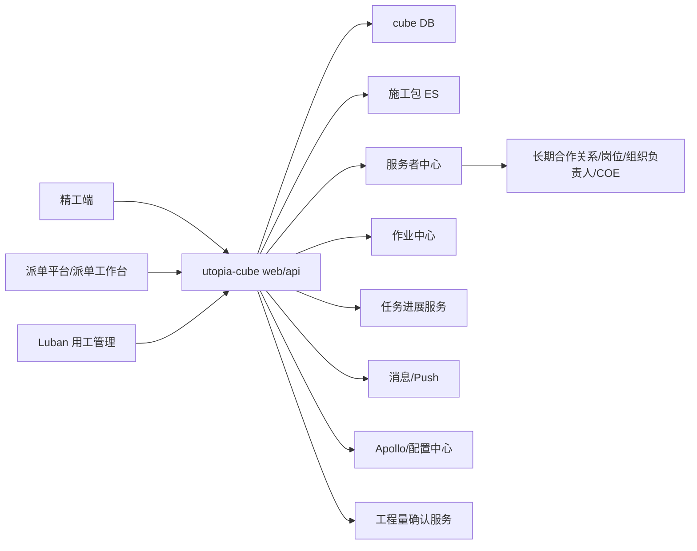
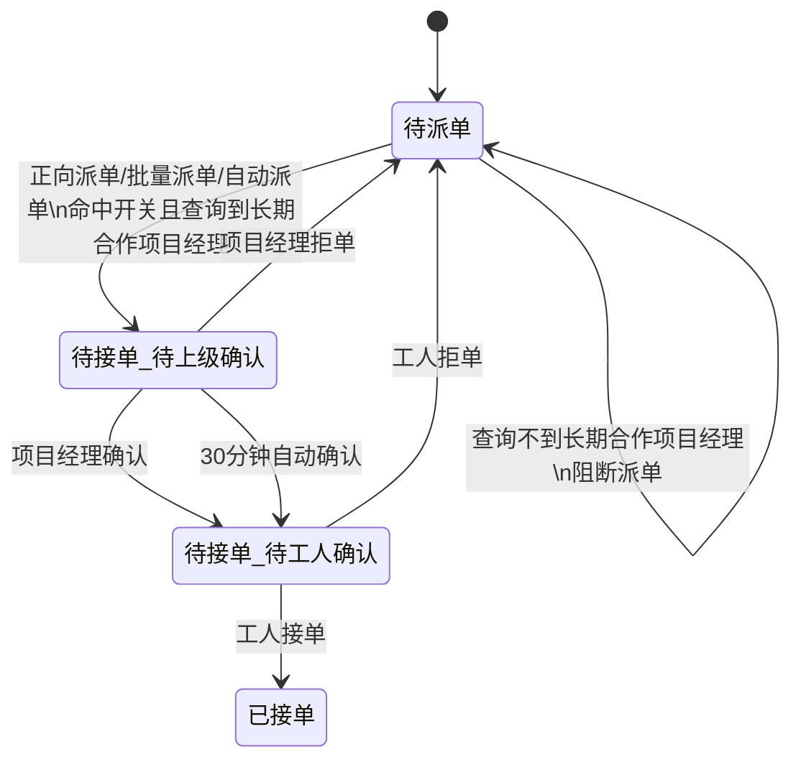
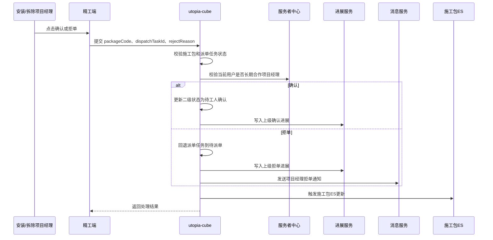
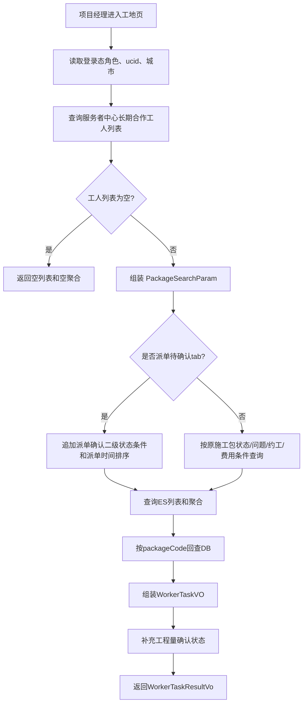
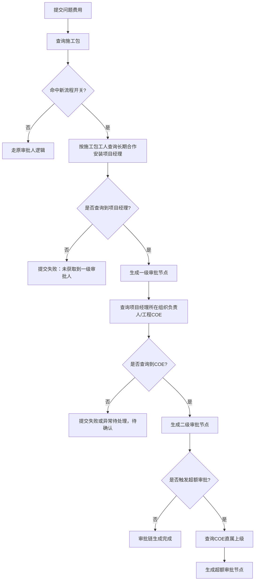

# 安装/拆除经营主体用工改造技术设计文档

## 1、需求背景

安装、拆除工从原有整装组织体系中独立出列，新增「安装项目经理」「拆除项目经理」作为个体工商户经营主体，专项承接安装/拆除相关业务，并统筹长期合作工人团队。经营主体变化后，原用工链路中依赖组织树直属上级的能力需要调整，包括精工端登录与数据权限、派单确认、问题反馈审批、问题费用审批、约工驳回、班组请假等。

本次需求目标是让安装/拆除项目经理能够在精工端查看长期合作工人的施工包并处理派单确认，同时将安装/拆除/橱柜派单任务从原单层「待接单」扩展为二级确认链路：先由项目经理确认，再由工人确认。

需求资料来源：

| 资料 | 路径 |
| --- | --- |
| 产品需求说明 | `/Users/mirror/wiki/需求/安装 拆除经营主体用工改造/【待评审0707】安装_拆除经营主体用工改造.md` |
| PRD 记录 | `/Users/mirror/wiki/需求/安装 拆除经营主体用工改造/prd记录.md` |
| 派单页面查询说明 | `/Users/mirror/wiki/需求/安装 拆除经营主体用工改造/派单页面的查询.md` |
| 约工驳回说明 | `/Users/mirror/wiki/需求/安装 拆除经营主体用工改造/约工驳回.md` |
| 问题费用提报说明 | `/Users/mirror/wiki/需求/安装 拆除经营主体用工改造/产业工人--问题反馈（费用提报）.md` |

代码确认范围：

| 模块 | 代码位置 |
| --- | --- |
| 精工端施工包列表 Controller | `utopia-cube-start/src/main/java/com/ke/utopia/cube/v2/controller/PcController.java` |
| 精工端施工包列表 Service | `utopia-cube-service/src/main/java/com/ke/utopia/cube/service/v2/impl/WorkerServiceImpl.java` |
| 约工驳回 Controller/Service | `PcReappointController.java` / `PcReappointServiceImpl.java` |
| 费用提报 Feign/Service | `PcProblemQuotaFeign.java` / `PcProblemQuotaServiceImpl.java` |
| 施工包状态枚举 | `PackageStatusEnum.java`、`PackageSecondStatusEnum.java` |
| 派单/接单状态枚举 | `DispatchStatusEnum.java` |
| 施工包主模型 | `PackageConstruction.java` |
| 借调任务模型 | `PackageLoanTask.java` |

## 2、需求理解

### 2.1 RD 角度需求理解

施工包系统 cube 当前负责施工包状态、派单/约工、施工包列表、问题/费用提报、约工驳回、进展流水、ES 查询等能力。本次改造不是简单新增角色，而是把安装/拆除相关用工链路中的“管理者”识别逻辑，从组织树上级切到服务者中心的长期合作关系。

本期影响面拆解如下：

| 改造面       | 需求描述                                               | cube 影响                                                                                     |
| --------- | -------------------------------------------------- | ------------------------------------------------------------------------------------------- |
| 登录角色与数据权限 | 精工端新增安装项目经理、拆除项目经理角色；工地页展示其长期合作工人的施工包              | 登录角色来源依赖服务者中心；`/web/list-package-by-operator-manager` 的下属工人查询逻辑需支持长期合作关系                    |
| 派单待确认列表   | 工地页「全部」下新增二级 tab「派单待确认」；展示待上级确认、待工人确认任务            | 施工包列表入参需支持二级状态筛选；ES 需能检索新增状态或新增任务标签                                                         |
| 派单二级确认    | 安装/拆除/橱柜派单由「待接单」拆为「待上级确认」「待工人确认」                   | 需扩展派单任务状态，不建议直接复用现有 `PackageSecondStatusEnum` 施工中二级状态                                       |
| 经理确认/拒单   | 项目经理确认后进入待工人确认；项目经理拒单回退待派单并记录进展                    | 可参考现有借调模式 `confirmManagerAssignment` / `rejectManagerAssignment` 的事件处理，但本需求不是借调模式，需新建平台模式分支 |
| 上级查询改造    | 问题反馈、约工驳回、整改费用审批、请假审批查询长期合作项目经理                    | 现有 `PersonHighServiceApi#querySuperiorByWorkType` 调用点需调整入参语义或切换服务者中心新接口                     |
| 问题费用审批    | 问题单/费用单一级审批为安装项目经理；二级审批为 COE；费用超额审批查上一环节 COE 的直属上级 | `PcProblemQuotaServiceImpl#getFirstApproveUser`、`getSecondApproveUser` 需改造；三级节点生成规则待确认      |
| 工程量确认     | 安装施工包卡片展示工程量确认状态，详情增加入口                            | cube 需接入外部工程量接口或透传前端渲染字段，接口未确认                                                              |
| 存量刷数      | 开城/关城时调整施工包和派单任务状态                                 | 涉及 `package_construction`、`package_loan_task` 或派单平台任务表；最终表与字段需确认                            |
| 文案调整      | “直营”改为“合营/联营”                                      | 页面和枚举文案梳理；是否仅前端处理待确认                                                                        |
| 13 账号兼容   | 产业工人需看见原总工制施工包列表                                   | 当前材料只有一句说明，需 PM 明确数据范围和入口                                                                   |

### 2.2 引申需求

1. 状态模型需要边界清晰：cube 已有 `PackageSecondStatusEnum`，但它描述的是施工中后的施工包二级状态，如施工中、待完工自检、验收中、需整改。本次「待上级确认」「待工人确认」是派单任务二级状态，不宜直接塞入施工中二级状态枚举，除非产品和上下游确认 ES 字段 `packageSecondStatus` 要承载派单待确认标签。
2. ES 与 DB 一致性要纳入设计：`/web/list-package-by-operator-manager` 当前通过 ES 查询施工包，再回查 DB 组装卡片。新增派单待确认 tab 后，ES 必须具备可检索字段或 cube 需要先查派单任务再合并施工包。
3. 长期合作关系查询失败应阻断派单：若派单后无人可确认，会导致任务卡死，因此派单/改派/返补前必须校验能获取班组归属项目经理。
4. 自动确认与人工确认必须幂等：30 分钟自动确认和人工确认可能并发触发，需要状态版本或当前状态校验，避免重复进展、重复消息。
5. 上线需支持城市 + 工种灰度：安装和拆除节奏不一致，开关应同时支持城市、工种，必要时支持业务类型。

### 2.3 本期明确边界

本设计不随意补全以下信息，需在评审中确认：

| 待确认项 | 影响 |
| --- | --- |
| 服务者中心长期合作关系接口名称、入参、出参、岗位枚举 | 决定精工端数据权限、派单阻断、审批人生成 |
| 派单平台是否已有二级状态字段及具体编码 | 决定是否新增 `dispatch_second_status` 或复用外部任务字段 |
| `packageSecondStatus = 派单待确认` 是否由 cube 持久化 | 决定 ES 字段设计和刷数范围 |
| 工程量确认接口路径、参数、返回值和跳转 URL | 决定 cube 是否新增聚合接口 |
| 班组请假接口所属系统和 cube 是否参与 | 当前资料未给出 cube 代码路径 |
| 13 账号兼容的精确规则 | 当前只有需求一句话 |
| 批量派单中部分包查不到项目经理时，是全失败还是部分成功 | 影响接口返回结构和事务边界 |
| 文案“直营”改“合营”还是“联营” | 需求资料中两个说法不完全一致 |

## 3、概要设计

### 3.0 设计思路与折衷

本次采用“开关隔离、派单状态独立扩展、人员关系能力收口”的设计：

1. 开关隔离：新增城市 + 工种开关，只对开城城市且工种命中定制家具安装工、橱柜工、拆除工的施工包生效。未命中开关的施工包继续走原流程。
2. 派单状态独立扩展：将「待上级确认」「待工人确认」建模为派单任务二级状态，避免污染施工中二级状态。若前端列表必须使用 `packageSecondStatus` 聚合，则由 ES 映射一个“列表展示状态”，不直接改变施工包主状态语义。
3. 人员关系收口：新增统一的 `WorkerRelationQueryService` 或等价内部方法，封装“查长期合作项目经理”“查项目经理组织 COE”“查 COE 直属上级”，避免在问题、费用、约工、派单多处重复拼装服务者中心参数。
4. 经理确认能力复用事件思路：现有借调模式已有经理确认/拒单事件，但有限制 `shareMode = BE_ON_LOAN`。本期应抽出通用进展/消息/状态流转能力，而不是直接绕过校验复用旧接口。
5. ES 更新异步化：派单任务状态变化后触发施工包 ES 更新，失败时记录补偿日志或进入重试任务。

### 3.1 系统架构



系统职责：

| 系统          | 本次职责                                          |
| ----------- | --------------------------------------------- |
| utopia-cube | 承载施工包列表、派单任务状态、约工驳回、费用提报、进展记录、ES 同步、开关判断      |
| 精工端         | 安装/拆除项目经理登录后查看长期合作工人施工包；处理派单确认/拒单；展示工程量确认标签   |
| 派单平台        | 派单、改派、批量派单、自动派单；需识别待上级确认/待工人确认二级状态            |
| 服务者中心       | 返回安装/拆除项目经理岗位、长期合作工人关系、项目经理组织负责人/COE、COE 直属上级 |
| Luban       | 问题审批、费用审批后台处理入口                               |
| 作业中心/进展服务   | 施工包任务实例、施工包进展、派单进展写入                          |
| 消息/Push     | 工人拒单、项目经理拒单等文案区分角色                            |
| Apollo      | 城市 + 工种开关、自动确认时间、刷数批次配置                       |
| 工程量确认服务     | 提供安装施工包工程量确认状态与跳转入口，接口待确认                     |

### 3.2 接口列表

#### 3.2.1 安装/拆除项目经理施工包列表

接口描述：安装/拆除项目经理在精工端工地页查询其长期合作工人的施工包列表，支持「全部、待进场、施工中」一级 tab，以及「派单待确认、问题待审核、约工驳回待审核、待整改、额外项提报」等二级筛选。

代码已确认：

| 项 | 内容 |
| --- | --- |
| Controller | `PcController#listPackageConstructionByManager` |
| 路径 | `/utopia-cube/web/list-package-by-operator-manager` |
| 方法 | POST |
| 入参 | `PackageListParam` |
| 返回 | `ResultVO<WorkerTaskResultVo>` |
| 当前查询实现 | `WorkerServiceImpl#listPackageConstructionByManager` |

当前入参：

| 字段 | 类型 | 必填 | 含义 | 代码现状 |
| --- | --- | --- | --- | --- |
| `packageStatus` | Integer | 否 | 施工包一级状态 | 目前注释支持 300 待进场、400 施工中、600 完成；为空默认查 400、300、600 |
| `currentPage` | Integer | 是 | 当前页 | ES 分页 |
| `pageSize` | Integer | 是 | 每页数量 | ES 分页 |
| `keyword` | String | 否 | 搜索关键字 | 当前支持传入 ES 查询；需求中“施工包搜索”被划掉，本期不新增搜索交互 |
| `extraFieldTypeInfoList` | List | 否 | 主管查看扩展字段 | type 1/2/3/4 分别映射问题单、约工驳回、施工包二级状态、额外配额审核标志 |

当前 `extraFieldTypeInfoList` 映射：

| type | 映射字段 | 含义 |
| --- | --- | --- |
| 1 | `packageProblemFormList` | 是否有问题单 |
| 2 | `reappointProblemFormList` | 是否有在审核约工驳回申请单 |
| 3 | `packageSecondStatusList` | 施工包二级状态 |
| 4 | `extraQuotaAuditingFlag` | 额外配额审核标志 |

本次改造：

1. 下属工人查询从当前组织上下级查询，调整为查询服务者中心长期合作关系。
2. 支持安装项目经理、拆除项目经理角色；现有 `QuerySubordinateWorkTypeParam.workTypeCodeList` 中未体现新岗位枚举，需补充服务者中心岗位 code。
3. 「派单待确认」建议新增独立筛选字段 `dispatchConfirmStatusList`，取值为待上级确认、待工人确认。若因前端兼容必须继续放在 `extraFieldTypeInfoList.type = 3`，需明确它是 ES 展示聚合字段，不等同于 `PackageSecondStatusEnum`。
4. 排序规则：待上级确认优先于待工人确认，其次按派单时间倒序。当前代码对 `packageSecondStatusList` 设置的是 `finishTime desc`，需要为派单待确认场景改成派单时间字段，字段名待确认。

建议新增/扩展入参：

| 字段 | 类型 | 必填 | 含义 |
| --- | --- | --- | --- |
| `dispatchConfirmStatusList` | List<Integer/String> | 否 | 派单确认二级状态：待上级确认、待工人确认 |
| `tabKey` | String | 否 | 前端 tab key，如 `dispatch_confirm`，用于避免混用施工包二级状态 |

正常返回：沿用 `WorkerTaskResultVo`。施工包卡片需补充以下展示字段，实际字段名以 `WorkerTaskVO` 扩展为准：

| 字段 | 类型 | 含义 |
| --- | --- | --- |
| `packageCode` | String | 施工包 code |
| `packageStatus` | Integer | 施工包一级状态 |
| `packageSecondStatus` | Integer | 施工包施工阶段二级状态，原语义保留 |
| `dispatchConfirmStatus` | Integer/String | 派单确认二级状态，新增 |
| `dispatchConfirmStatusName` | String | 待上级确认/待工人确认 |
| `homeownerName` | String | 业主姓名 |
| `address` | String | 项目地址 |
| `workerName` | String | 工人姓名 |
| `deliveryExpertName` | String | 交付专家，有则展示 |
| `managerName` | String | 项目经理，有则展示 |
| `assessTime` | Date/String | 考核时间 |
| `expectedConstructionTime` | Date/String | 预计施工时间 |
| `constructionPrice` | BigDecimal | 施工报价 |
| `quantityConfirmStatusName` | String | 已确认工程量/未确认工程量，仅安装施工包展示 |

异常返回：沿用 `ResultVO` 统一异常格式。若服务者中心查询失败，建议返回空列表还是失败需产品确认；技术建议查询失败返回失败，查询成功但无长期合作工人返回空列表。

#### 3.2.2 项目经理确认派单

接口描述：安装/拆除项目经理确认派单，将任务从「待接单-待上级确认」流转到「待接单-待工人确认」。

代码现状：cube 存在 `PcAppointServiceImpl#confirmManagerAssignment(String packageCode)`，但该方法仅允许借调模式 `PackageShareModeEnum.BE_ON_LOAN`，不能直接作为本需求接口使用。

建议接口：

| 项 | 内容 |
| --- | --- |
| 路径 | `/utopia-cube/web/package/dispatch/manager-confirm`，最终以落兵台为准 |
| 方法 | POST |
| 入参 | `ManagerDispatchConfirmParam`，新增 |
| 返回 | `ResultDTO<Boolean>` 或包含最新状态的 DTO |

建议入参：

| 字段 | 类型 | 必填 | 含义 |
| --- | --- | --- | --- |
| `packageCode` | String | 是 | 施工包 code |
| `dispatchTaskId` | Long/String | 是 | 派单任务 ID；若 cube 以 `package_loan_task.id` 承载则为 `loanTaskId` |
| `operatorUcid` | Long/String | 否 | 操作人，优先从登录态取 |

处理逻辑：

1. 查询施工包，校验存在且命中新流程开关。
2. 查询派单任务，校验当前状态为「待接单-待上级确认」。
3. 校验当前登录人为该班组/工人长期合作项目经理。
4. 更新派单二级状态为「待工人确认」。
5. 写入施工包进展和派单进展：操作为“上级确认”，详细进展为“-”，操作人为当前登录人。
6. 触发施工包 ES 更新。

异常场景：

| 场景 | 处理 |
| --- | --- |
| 施工包不存在 | 返回业务异常“未找到对应施工包信息” |
| 派单任务不存在 | 返回业务异常“未找到派单任务” |
| 当前状态不是待上级确认 | 返回业务异常“当前状态不可确认” |
| 当前用户不是长期合作项目经理 | 返回无权限 |
| 自动确认已先执行 | 幂等返回成功或提示状态已变更，策略需统一 |

#### 3.2.3 项目经理拒单

接口描述：安装/拆除项目经理拒绝派单，填写拒单原因，派单任务回退到待派单，记录进展，并通知下游。

代码现状：cube 存在 `PcAppointServiceImpl#rejectManagerAssignment(String packageCode, String cancelReason)`，同样仅允许借调模式，不能直接复用为本需求入口。

建议接口：

| 项 | 内容 |
| --- | --- |
| 路径 | `/utopia-cube/web/package/dispatch/manager-reject`，最终以落兵台为准 |
| 方法 | POST |
| 入参 | `ManagerDispatchRejectParam`，新增 |
| 返回 | `ResultDTO<Boolean>` 或包含最新状态的 DTO |

建议入参：

| 字段 | 类型 | 必填 | 含义 |
| --- | --- | --- | --- |
| `packageCode` | String | 是 | 施工包 code |
| `dispatchTaskId` | Long/String | 是 | 派单任务 ID |
| `rejectReason` | String | 是 | 拒单原因 |
| `operatorUcid` | Long/String | 否 | 操作人，优先从登录态取 |

处理逻辑：

1. 校验施工包、开关、派单任务、长期合作项目经理权限。
2. 校验当前派单二级状态为「待上级确认」。
3. 更新派单任务为待派单，清空或失效原派单确认二级状态。
4. 写入施工包进展和派单进展：操作为“上级拒单”，详细进展为拒单原因。
5. Push 文案中的拒单角色支持变量：`项目经理拒单`、`工人拒单`。
6. 触发施工包 ES 更新。

#### 3.2.4 派单/批量派单/自动派单状态生成

接口描述：派单员在派单平台执行正向派单、批量派单、回退后待派单再次派单、自动派单时，如果命中新流程，派单任务进入「待接单-待上级确认」。

接口路径：待派单平台和 cube 现有入口确认。本设计只描述 cube 侧处理要求。

分支条件：

| 条件 | 规则 |
| --- | --- |
| 城市 | 派单任务城市命中开城城市 |
| 工种 | 定制家具安装工、橱柜工、拆除工 |
| 业态 | 整装/搭售、翻新、零售 |
| 关系 | 能查询到班组/工人的长期合作项目经理 |

场景规则：

| 场景 | 是否需要项目经理确认 | 是否需要工人确认 | 无长期合作项目经理 |
| --- | --- | --- | --- |
| 正向派单 | 是 | 是 | 阻断派单 |
| 批量派单 | 是 | 是 | 单包失败还是整批失败待确认 |
| 回退待派单后再次派单 | 是 | 是 | 阻断派单 |
| 自动派单 | 是 | 是 | 阻断派单并记录原因 |
| 改派 | 否 | 否 | 不可改派 |
| 返补同工人自动合包约派 | 否 | 否 | 不可派单 |

阻断提示：`派单失败，无法获取该班组归属项目经理`。

#### 3.2.5 约工驳回提交

接口描述：工人进场前发现没有进场条件时发起约工驳回，审批人查询由组织树上级项目经理改为长期合作项目经理。

代码已确认：

| 项 | 内容 |
| --- | --- |
| Controller | `PcReappointController#reappointProblemSubmit` |
| 路径 | `/utopia-cube/web/package/reappointProblemSubmit` |
| 方法 | POST |
| 入参 | `ProblemSubmitParam` |
| Service | `PcReappointServiceImpl#reappointProblemSubmit` |

当前入参：

| 字段 | 类型 | 必填 | 含义 |
| --- | --- | --- | --- |
| `packageCode` | String | 是 | 施工包 code |
| `needEnterAgain` | Boolean | 否 | 是否需要二次进场 |
| `problemDetailList` | List | 否 | 问题详情 |
| `operatorUcid` | String | 否 | 操作人 ucId |
| `operatorName` | String | 否 | 操作人名称 |
| `packageType` | Integer | 否 | 施工包类型 |

当前审批人查询逻辑：

```text
SuperiorWorkTypeQueryRequest.ucId = 当前登录人 ucid
targetWorkTypeList = DELIVERY_EXPERT、DELIVERY_INSTALLATION_EXPERT、ERECTOR_MANAGER、ERECTOR_LEADER
workTypeCode = packageConstruction.workerType
status = 1
personManager.querySuperiorByWorkType(request)
```

本次改造：

1. 对命中开关的安装/拆除/橱柜工种，审批人改查工人长期合作项目经理。
2. `ucId` 建议使用施工包工人 `packageConstruction.workerId`，而不是仅使用当前登录人，避免管理者代提报场景查询错人。是否允许项目经理代提报需产品确认。
3. 查询不到长期合作项目经理时，沿用当前风格返回业务异常，提示可调整为“未查询到长期合作项目经理，请联系主管绑定关系后再申请”。
4. 非命中新流程场景保留原组织树查询逻辑。

#### 3.2.6 问题费用提报

接口描述：工人对整改工单提报额外费用时，审批链路从原组织上级调整为长期合作项目经理 + COE + 超额上级。

代码已确认：

| 项 | 内容 |
| --- | --- |
| Feign | `PcProblemQuotaFeign#submitQuota` |
| 路径 | `/utopia-cube/api/pc/problem/order/quota/submit` |
| 方法 | POST |
| 入参 | `PcQuotaApplyParam` |
| Service 关注点 | `PcProblemQuotaServiceImpl#getFirstApproveUser`、`getSecondApproveUser` |

当前入参：

| 字段 | 类型 | 含义 |
| --- | --- | --- |
| `packageCode` | String | 施工包 code |
| `workOrderNo` | String | 问题单号/费用单关联单号 |
| `quotaType` | Integer | 费用类型，1 返补人工费、2 现场整改费 |
| `quotaCode`/`quotaName` | String | 额外项 code/name |
| `quotaPrice` | BigDecimal | 额外项金额 |
| `quotaNum` | BigDecimal | 数量 |
| `applyUcId`/`applyName` | Long/String | 申请人 |
| `auditUcId`/`auditName` | Long/String | 审核人 |
| `totalAmount` | BigDecimal | 合计 |
| `auditPass` | Boolean | 是否一级审批通过 |

审批链路设计：

| 对象 | 一级审批 | 二级审批 | 超额审批 |
| --- | --- | --- | --- |
| 问题单 | 工人长期合作安装项目经理 | 项目经理所在组织负责人/工程 COE | 无 |
| 费用单 | 工人长期合作安装项目经理 | 项目经理所在组织负责人/工程 COE | 上一环节 COE 的直属上级 |

当前代码改造点：

1. `getFirstApproveUser(PackageConstruction)` 当前调用 `querySuperiorByWorkType` 查组织树上级，需按开关切到长期合作项目经理。
2. `getSecondApproveUser(PackageConstruction)` 当前先按工人组织树查询安装专家和管家经理，需改成“安装项目经理所在组织负责人/工程 COE”。这要求一级审批人结果透传给二级审批查询，方法签名建议改为 `getSecondApproveUser(PackageConstruction, UserInfoVO firstApproveUser)`。
3. 超额审批需新增方法 `getOverLimitApproveUser(UserInfoVO coeUser)`，查询 COE 直属上级。超额判断规则、阈值来源当前材料未给出，需确认是否复用现有费用超额规则。

#### 3.2.7 问题反馈

接口描述：工人和管理者角色可在施工包详情提报问题；安装/拆除项目经理可查看问题单详情，不可处理问题单；审批人改查长期合作项目经理。

接口路径：当前资料未提供，代码检索未在本次范围内确认最终 Controller。需补充落兵台接口后再完善参数。

设计要求：

1. 新增角色安装项目经理、拆除项目经理允许进入施工包详情和问题单详情。
2. 管理者对当前施工包工人提报问题时，审批人应按施工包工人长期合作关系生成，不能按管理者本人上级生成。
3. 问题处理入口仍在 Luban 用工管理 - 问题审批。

#### 3.2.8 班组请假

接口描述：班组请假审批人由组织树上级负责人改为工人长期合作项目经理。

接口路径：当前资料未给出，cube 代码路径未确认。若班组请假不在 cube 承载，cube 仅提供人员关系查询能力或不改造。

待确认：

1. 班组请假接口所属系统。
2. 是否复用 `PersonHighServiceApi#querySuperiorByWorkType`。
3. 请假发起人为班组长还是工人，长期合作关系按谁查询。

#### 3.2.9 安装工程量确认状态

接口描述：安装施工包详情功能区新增“工程量确认”入口，卡片展示工程量确认标签。

接口路径：外部同学提供，当前未确认。

建议 cube 聚合接口方案：

| 项 | 内容 |
| --- | --- |
| 路径 | `/utopia-cube/web/package/quantity-confirm/query`，待确认 |
| 方法 | GET/POST，待确认 |
| 入参 | `packageCode`、`projectOrderId` |
| 返回 | `confirmed`、`statusName`、`confirmUrl` |

若前端可直接调用工程量服务，则 cube 只需要在施工包列表返回必要的 `packageCode/projectOrderId`。

#### 3.2.10 ES 同步与派单状态反查

接口描述：派单二级状态变化后，施工包列表需要及时展示派单待确认状态。

当前资料中的待办信息：

1. 需要一个接口返回施工包 code，用于触发 ES 更新。
2. 需要反查派单平台接口获取二级状态 `packageSecondStatus` 或派单二级状态。
3. ES 同步触发接口由相关同学确认。

设计建议：

| 能力 | 建议 |
| --- | --- |
| 状态来源 | 派单任务表/派单平台为准，cube ES 保存冗余展示字段 |
| 同步时机 | 派单成功、经理确认、经理拒单、自动确认、工人确认、工人拒单、开城/关城刷数后 |
| 失败补偿 | 记录 packageCode 到重试任务，支持按 packageCode 手动重建 ES |

## 4. 详细设计

### 4.1 流程图

#### 4.1.1 派单状态流转



伪代码：

```text
dispatch(packageCode, workerId, dispatchContext):
    package = queryPackage(packageCode)
    if not hitSwitch(package.city, package.workerType, package.businessType):
        return oldDispatchFlow()

    manager = relationService.queryLongTermManager(workerId, package.workerType)
    if manager is null:
        throw BizException("派单失败，无法获取该班组归属项目经理")

    saveOrUpdatePackageExternalManager(packageCode, manager)
    task = createOrUpdateDispatchTask(packageCode, workerId)
    task.dispatchStatus = TO_BE_ACCEPTED
    task.dispatchSecondStatus = WAIT_MANAGER_CONFIRM
    task.managerConfirmDeadline = now + 30 minutes
    save(task)
    recordProgress(packageCode, "派单", dispatchContext.operator)
    syncEs(packageCode)
```

#### 4.1.2 项目经理确认/拒单



#### 4.1.3 施工包列表查询



#### 4.1.4 费用审批链生成



### 4.2 数据表设计

#### 4.2.1 现有表与字段确认

代码确认 `package_construction` 当前包含：

| 字段 | 含义 |
| --- | --- |
| `package_code` | 施工包单号 |
| `package_status` | 施工包一级状态 |
| `package_second_status` | 施工中阶段二级状态，V2 mapper 中存在 |
| `worker_pattern_type` | 作业工种模式：1 总工工人、2 产业工人 |
| `deliver_model` | 交付模式：1 项目制、2 产业制 |
| `worker_type` / `worker_type_name` | 工种 code/name |
| `worker_id` / `worker_name` | 工人信息，V2 模型中存在 |
| `group_id` | 班组 id |

代码确认 `package_loan_task` 当前包含：

| 字段 | 含义 |
| --- | --- |
| `package_code` | 施工包 code |
| `loan_type` | 借调类型 |
| `loan_foreman_id` / `loan_foreman_name` | 借调项目经理 |
| `loan_worker_id` / `loan_worker_name` | 借调班组工人 |
| `loan_group_id` / `loan_group_name` | 借调班组 |
| `dispatch_status` | 接单状态：2 已接单、3 待接单、4 已拒单 |

#### 4.2.2 新增班组归属体外项目经理字段

需求要求施工包新增“班组归属体外项目经理”。当前 `PackageConstruction.java` 未看到对应字段，建议新增在施工包扩展表或 `package_construction` 中。考虑该字段需要随派单/改派/返补覆写，并参与列表展示和问题排查，建议落在 `package_construction` 主表或与施工包 1:1 的扩展表。

建议字段：

| 字段 | 类型 | 含义 | 取值来源 |
| --- | --- | --- | --- |
| `external_manager_ucid` | bigint | 班组归属体外项目经理 ucid | 服务者中心长期合作关系 |
| `external_manager_name` | varchar(64) | 班组归属体外项目经理姓名 | 服务者中心 |
| `external_manager_work_type` | varchar(64) | 项目经理岗位/工种 | 服务者中心 |
| `external_manager_org_code` | varchar(64) | 项目经理所在组织编码 | 服务者中心，是否需要待确认 |
| `external_manager_update_time` | datetime | 归属关系更新时间 | cube |

建议 SQL：

```sql
ALTER TABLE `package_construction`
  ADD COLUMN `external_manager_ucid` bigint(20) NOT NULL DEFAULT 0 COMMENT '班组归属体外项目经理ucid' AFTER `group_id`,
  ADD COLUMN `external_manager_name` varchar(64) NOT NULL DEFAULT '' COMMENT '班组归属体外项目经理姓名' AFTER `external_manager_ucid`,
  ADD COLUMN `external_manager_work_type` varchar(64) NOT NULL DEFAULT '' COMMENT '班组归属体外项目经理岗位/工种' AFTER `external_manager_name`,
  ADD COLUMN `external_manager_org_code` varchar(64) NOT NULL DEFAULT '' COMMENT '班组归属体外项目经理组织编码' AFTER `external_manager_work_type`,
  ADD COLUMN `external_manager_update_time` datetime NOT NULL DEFAULT '1970-01-02 00:00:00' COMMENT '班组归属体外项目经理更新时间' AFTER `external_manager_org_code`,
  ADD INDEX `idx_external_manager_ucid` (`external_manager_ucid`);
```

说明：是否直接改主表需 DBA 和项目负责人确认。如果 `package_construction` 数据量大且变更风险高，可改为新增 `package_construction_manager_relation` 1:1 扩展表。

#### 4.2.3 派单任务二级状态字段

如果本次派单任务仍由 `package_loan_task` 承载，建议新增派单二级状态和确认截止时间：

| 字段 | 类型 | 含义 |
| --- | --- | --- |
| `dispatch_second_status` | tinyint | 派单二级状态：1 待上级确认、2 待工人确认 |
| `manager_confirm_deadline` | datetime | 项目经理确认截止时间 |
| `manager_confirm_time` | datetime | 项目经理确认时间 |
| `manager_confirm_type` | tinyint | 1 人工确认、2 自动确认、3 拒单 |
| `manager_reject_reason` | varchar(512) | 项目经理拒单原因 |

建议 SQL：

```sql
ALTER TABLE `package_loan_task`
  ADD COLUMN `dispatch_second_status` tinyint(4) NOT NULL DEFAULT 0 COMMENT '派单二级状态：0无，1待上级确认，2待工人确认' AFTER `dispatch_status`,
  ADD COLUMN `manager_confirm_deadline` datetime NOT NULL DEFAULT '1970-01-02 00:00:00' COMMENT '项目经理确认截止时间' AFTER `dispatch_second_status`,
  ADD COLUMN `manager_confirm_time` datetime NOT NULL DEFAULT '1970-01-02 00:00:00' COMMENT '项目经理确认时间' AFTER `manager_confirm_deadline`,
  ADD COLUMN `manager_confirm_type` tinyint(4) NOT NULL DEFAULT 0 COMMENT '项目经理确认类型：0无，1人工确认，2自动确认，3拒单' AFTER `manager_confirm_time`,
  ADD COLUMN `manager_reject_reason` varchar(512) NOT NULL DEFAULT '' COMMENT '项目经理拒单原因' AFTER `manager_confirm_type`,
  ADD INDEX `idx_dispatch_second_status_deadline` (`dispatch_second_status`, `manager_confirm_deadline`);
```

待确认：派单任务最终是否落在 `package_loan_task`。如果派单平台有独立任务表，则以上字段应加在派单平台任务表，cube 只同步展示状态。

#### 4.2.4 ES 字段

建议 ES 增加以下冗余字段：

| 字段 | 类型 | 含义 |
| --- | --- | --- |
| `dispatchConfirmStatus` | integer/keyword | 派单确认二级状态 |
| `dispatchConfirmStatusName` | keyword | 待上级确认/待工人确认 |
| `dispatchTime` | date | 派单时间，排序使用 |
| `externalManagerUcid` | long/keyword | 班组归属项目经理 ucid |
| `externalManagerName` | keyword | 班组归属项目经理姓名 |
| `quantityConfirmStatus` | integer/keyword | 工程量确认状态 |

#### 4.2.5 数据库中敏感字段加密方案说明

本次建议新增字段主要为人员 ucid、姓名、组织编码、业务状态，不涉及身份证、手机号、银行卡等 C3/C4 高敏字段。人员姓名是否按公司内部敏感等级要求脱敏或加密，需数据安全同学确认；若已有施工包表中姓名明文字段保持现状，本次新增姓名字段建议遵循同等规范。

### 4.3 数据规模与性能评估

1. 项目经理施工包列表当前会先查服务者中心下属工人，再查 ES，再回查 DB 组装 VO。长期合作工人列表如果较大，需要限制单次查询的 workerId 数量，必要时服务者中心分页或按项目经理 ucid 直接提供可管理工人集合。
2. 派单待确认 tab 建议优先走 ES 检索，不建议每次实时调用派单平台批量反查状态，否则列表性能会受外部接口影响。
3. 费用审批提交链路会增加 1 到 3 次服务者中心查询。提交类接口量级相对列表小，可同步查询；需设置超时和业务异常提示。
4. 自动确认任务按 `dispatch_second_status = WAIT_MANAGER_CONFIRM` 且 `manager_confirm_deadline <= now` 扫描，需使用索引 `idx_dispatch_second_status_deadline`，每批建议 100-500 条，失败进入下一轮重试。
5. ES 同步失败需补偿，否则项目经理列表和派单任务状态会出现短期不一致。

### 4.4 特殊功能设计

#### 4.4.1 Apollo 开关

建议新增配置：

```json
{
  "enable": true,
  "cityWorkerTypeList": [
    {
      "cityCode": "110000",
      "workerTypeList": ["custom_furniture_installer", "cabinet_worker", "demolition_worker"],
      "businessTypeList": ["WHOLE_DECORATION", "BUNDLE", "RENOVATE", "RETAIL"]
    }
  ],
  "autoConfirmMinutes": 30
}
```

说明：具体工种 code、业态 code 以 cube 现有枚举和服务者中心枚举为准。

#### 4.4.2 自动确认任务

任务规则：

1. 扫描待上级确认且已超过 `manager_confirm_deadline` 的派单任务。
2. 加锁或基于状态条件更新：只有当前仍为待上级确认才允许更新。
3. 自动确认后状态改为待工人确认，确认类型为自动确认。
4. 进展操作人为“系统”，详细进展为“30分钟未处理自动确认”。
5. 触发 ES 更新。

#### 4.4.3 上级查询统一封装

建议新增内部服务：

| 方法 | 说明 |
| --- | --- |
| `queryLongTermManager(workerUcid, workerType)` | 查询工人长期合作安装/拆除项目经理 |
| `queryManagerCoe(managerUcid, workerType)` | 查询项目经理所在组织负责人/工程 COE |
| `querySuperior(userUcid, targetWorkType)` | 查询指定人员直属上级 |
| `checkManagerPermission(managerUcid, workerUcid, workerType)` | 校验当前用户是否该工人的长期合作项目经理 |

### 4.5 上线步骤

| 步骤 | 操作时间 | 操作人 | 操作内容 | 预期结果 | 验证方案 | 回滚方案 |
| --- | --- | --- | --- | --- | --- | --- |
| 1 | 上线前 T-2 天 | RD/PM/服务者中心 | 确认岗位枚举、长期合作关系接口、COE 查询接口 | 接口契约冻结 | 使用测试 ucid 调通服务者中心 | 未确认则不进入发布 |
| 2 | 上线前 T-1 天 | RD/DBA | 执行 DB 变更 SQL | 新字段/索引创建成功 | databus 或 SQL 查询字段存在 | 字段为新增字段，代码未发布前不影响旧逻辑；如异常按 DBA 规范回滚 |
| 3 | 上线前 T-1 天 | RD | 发布 cube 代码，默认关闭开关 | 老流程不受影响 | 验证非开城城市派单、约工、费用提报正常 | 回滚 cube 版本 |
| 4 | 上线前 T-1 天 | RD/前端 | 发布精工端页面，派单待确认入口受开关控制 | 未开城不可见或无数据 | 测试账号验证页面兼容 | 回滚前端版本 |
| 5 | 开城前 | 业务/RD | 配置主数据拆包规则、自营施工规则、整装排程配置为产业/平台模式 | 新生成施工包模式正确 | 抽查新生成施工包 `worker_pattern_type`、`deliver_model` | 恢复原配置 |
| 6 | 开城前 | RD/运维 | 执行存量刷数脚本 | 命中范围数据按规则更新 | 抽样检查施工包、派单任务、ES | 执行反向刷数脚本；无法精确回滚的数据需提前备份 |
| 7 | 开城 | RD | 打开城市 + 工种开关 | 新流程生效 | 测试派单进入待上级确认；项目经理确认后进入待工人确认 | 关闭开关，新派单回到旧流程 |
| 8 | 开城后 | RD/QA | 验证约工驳回、问题费用审批、派单拒单、自动确认 | 审批人和状态流转符合预期 | 使用固定测试包验证全链路和日志 | 关闭开关，必要时执行状态回退脚本 |

线上验证建议：

1. 派单：开城城市 + 命中工种 + 有长期合作项目经理，派单后项目经理工地页出现派单待确认。
2. 阻断：移除长期合作关系后派单，提示“派单失败，无法获取该班组归属项目经理”。
3. 确认：项目经理点击确认，任务变为待工人确认，按钮消失。
4. 拒单：项目经理填写原因拒单，任务回到待派单，进展显示上级拒单。
5. 自动确认：构造超过 30 分钟任务，定时任务执行后进入待工人确认。
6. 约工驳回：审批人是长期合作项目经理。
7. 费用提报：审批链为安装项目经理、COE、超额上级。
8. ES：状态变更后列表展示与 DB/派单平台一致。

### 4.6 数据迁移

开城刷数范围来自需求资料：

施工包刷数范围：

1. 施工包类型 = 定制家具安装工、橱柜工、拆除工。
2. 施工包类型/模式 = 平台模式。
3. 施工包状态 <= 待派单。
4. 派单任务状态 <= 待派单。

施工包刷数规则：

1. 作业流程从总工制改为产业制。
2. 模式从普通、拆借改为平台模式。
3. 产品评审记录说明“施工包取消重新生成”，因此刷数应只更新必要字段，不重新生成施工包。

派单任务刷数规则：

1. 开城时，将存量「待确认」刷为「待工人确认」。
2. 关城时，将「待上级确认」「待工人确认」统一回退为「待确认」。

待确认：

| 项 | 说明 |
| --- | --- |
| 施工包“平台模式”对应字段 | 可能是 `worker_pattern_type`、`deliver_model`、`shareMode` 或派单平台资源类型，需最终确认 |
| 派单任务表 | 当前 cube 有 `package_loan_task.dispatch_status`，但是否承载本次派单平台任务待确认 |
| 待确认状态编码 | `DispatchStatusEnum.TO_BE_ACCEPTED = 3` 表示待接单；二级状态编码需新增 |
| 刷数脚本入口 | 建议新增临时 fix controller 或离线脚本，执行前备份 packageCode 清单 |

### 4.7 风险点

| 风险 | 影响 | 兜底 |
| --- | --- | --- |
| 长期合作关系接口未按期提供 | 派单无法确认项目经理，审批人无法生成 | 开关延后；非开城城市走旧逻辑 |
| 派单二级状态归属不清 | ES、派单平台、cube 状态不一致 | 评审时明确状态主数据系统，以派单任务为准 |
| 自动确认与人工确认并发 | 重复进展或状态错乱 | 条件更新 + 幂等校验 |
| 批量派单部分失败策略不明确 | 影响派单员操作体验和事务一致性 | PM 明确全失败/部分成功；接口返回失败明细 |
| 存量刷数范围误伤 | 老施工包模式被错误修改 | 刷数前导出 packageCode 白名单和备份字段，灰度执行 |
| ES 同步延迟 | 项目经理列表状态不准 | 状态变更后同步 ES；失败补偿重试 |
| “直营/合营/联营”文案不一致 | 页面验收不通过 | PM 最终确认标准文案 |
| 13 账号兼容规则不清 | 产业工人可见范围异常 | 单独确认账号类型、入口和数据权限规则 |

## 5、待评审确认清单

1. 服务者中心长期合作关系查询接口：接口名、入参、出参、岗位枚举、是否返回班组状态。
2. 新增安装项目经理、拆除项目经理在服务者中心的岗位 code。
3. 派单二级状态字段归属：派单平台表、`package_loan_task`，还是 cube 新表。
4. 「派单待确认」是否复用 `packageSecondStatus`，以及具体枚举值。
5. 批量派单部分失败策略。
6. 工程量确认接口和跳转 URL。
7. 班组请假是否由 cube 改造。
8. 13 账号兼容规则。
9. 文案最终使用“合营”还是“联营”。
10. 存量刷数 SQL 字段与回滚脚本。
