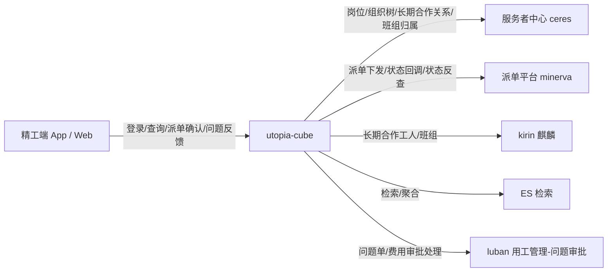
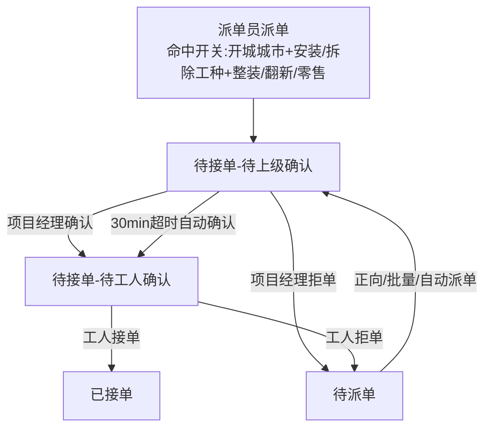
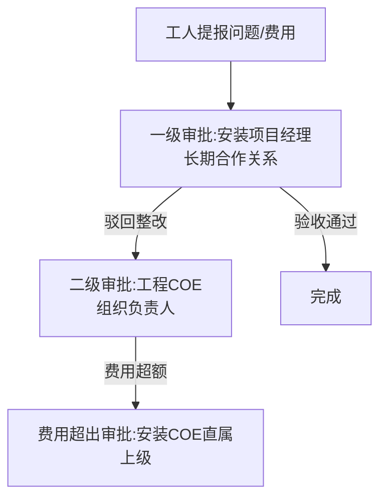

> 技术设计文档 —— 安装 / 拆除经营主体用工改造
>
> 版本：v1.0（初稿，待评审）
> 关联需求：[[安装 拆除经营主体用工改造/【待评审0707】安装_拆除经营主体用工改造]]
> 关联 PRD 记录：[[安装 拆除经营主体用工改造/prd记录]]
> 落兵台（接口归档）：**【待确认】** 需补充 utopia-cube 对应项目地址
>
> 说明：本方案严格基于 utopia-cube 工程现状代码（已逐一核对）与 PRD。凡工程代码与 PRD 未能确认、或 PRD 自身未定稿之处，均以 **【待确认】** 标注并注明需向哪一方确认，**不臆造**。

---

## 1、需求背景（必须）

_简述项目/需求的背景，如项目目标、项目方案、产品功能现状和本期需求变更情况，本次变更预期的收益等等。_

安装、拆除工从原有整装组织体系独立出列，新增"拆除项目经理""安装项目经理"两类个体工商户作为全新经营主体，专项承接公司安装业务，并全权负责统筹管理工人团队。由此带来两条主线变化：

1. **组织架构与工班归属关系变化**：工人与"安装/拆除项目经理"之间以"长期合作关系"绑定，而非原有的"组织树直属上级"关系。
2. **用工流程适配**：派单需新增"上级（项目经理）确认"环节、问题单审批链新增二级审批、安装需确认工程量。

需求方案评审结论（20260717 方案评审）：因需求及时性，**拆分二期上线**；刷数 SOP 修改为"施工包取消重新生成"。

预期收益：支持安装/拆除项目经理在精工端独立作业；用工流程与新的经营主体（个体户）组织关系对齐，审批/派单链路指向正确的责任项目经理。

---

## 2、需求理解（必须）

_1、RD角度需求理解；2、引申需求；3、内容要求（影响面拆解、功能改造点）。_

### 2.1 RD 角度需求理解

本期需求可抽象为 **"角色 + 关系 + 流程"** 三类改造：

| 维度 | 现状（代码核实） | 本期改造 |
|---|---|---|
| 角色 | 精工端已有：安装主管、工长、工程总监等；登录角色经服务者中心岗位返回 | 新增登录角色「安装项目经理」「拆除项目经理」 |
| 关系（数据权限 / 审批人） | 审批人/下属查询均走"组织树直属上级"：`PersonManager.querySuperiorByWorkType`、或 `ceresManager.querySubordinateWorkType` | 改为"工人长期合作关系项目经理"：经服务者中心/麒麟查长期合作关系 |
| 流程（派单） | `DispatchStatusEnum`：`待处理/已接单(2)/待接单(3)/已拒单(4)`；派单员派单 → 工人接单 | 派单任务「待接单」拆二级状态机：`待上级确认` → `待工人确认`；新增项目经理确认/拒单 |
| 字段（施工包） | `package_construction` 无"班组归属项目经理"持久字段，动态经 `IndustryGroupDTOV2.belongForemanUcId` 获取 | 新增 DB 字段，派单/改派/返补完成时覆写 |
| 展示（文案） | `bizModel`：1普通 / 2直营 | "直营"相关展示改为"联营/合营" **【待产品确认】** 见 2.3 |

### 2.2 引申需求（非 PM 明确范围，但影响实现）

- **性能与降级**：新角色的数据权限查询从"组织树"切换为"长期合作关系"后，涉及对服务者中心（ceres）/麒麟（kirin）的额外远程调用，需评估超时与降级（见 4.3、4.7）。
- **存量数据一致性**：开城/关城切换时，派单任务二级状态需在"待确认/待上级确认/待工人确认"之间批量回退，属于刷数 SOP，依赖派单平台（minerva）侧状态一起联动。
- **13 账号**：产业工人需看见"原总工制"的施工包列表，涉及数据权限白名单，机制 **【待确认】**。

### 2.3 影响面拆解（功能改造点清单）

> 标注说明：`新增` / `变更(from→to)` / `删除` / `刷数`；`⚠` 表示 PRD 内部或代码侧存在未定稿点。

1. **角色与登录（新增）**：登录角色新增「安装项目经理」「拆除项目经理」；岗位获取依赖服务者中心返回对应岗位 **【待服务者中心确认】** 岗位 code。
2. **数据权限（变更）**：精工端"工地页/我的"展示工人列表的施工包，从"组织树下属"改为"长期合作关系工人" **【待确认】** 具体取数 API（见 3.2 接口 A）。
3. **查询上级逻辑（变更，多处）**：
   - 问题反馈（含返补）：审批人 组织树直属上级 → 工人长期合作关系安装项目经理；
   - 约工驳回：组织树上级项目经理 → 工人长期合作关系项目经理；
   - 整改费用一级审批：组织树上级（交付安装专家）→ 工人长期合作关系安装项目经理；
   - 整改费用二级审批（新增）：安装项目经理所在组织负责人 = 工程 COE **【待确认】** 角色定义；
   - 费用超出审批（原二级）：上级工程经理 → 上一环节安装 COE 直属上级 **【待确认】** 角色定义；
   - 班组请假：组织树上级负责人 → 工人长期合作关系项目经理。
4. **派单流程（新增二级状态机）**：安装/拆除派单新增项目经理确认/拒单；`待接单` 拆为 `待上级确认` + `待工人确认`；30min 超时自动确认 **【待确认】** 实现方式（定时任务/延时消息）。
5. **施工包字段（新增）**：新增"班组归属项目经理"持久字段（PRD 用工流程章节称"班组归属体外项目经理"，**⚠ 命名不一致，待数据侧统一**）。
6. **工程量确认（新增，安装）**：施工包详情页新增"工程量确认"功能球 + 卡片标签（已确认/未确认），查询接口由 @陶思宇 提供 **【待确认】** cube 侧是否落库。
7. **文案改造（变更）**："直营"→"联营/合营"。⚠ PRD「需求清单」写"联营"，「文案改造」写"合营"，**【待产品确认】** 需统一文案。
8. **工程部修改（⚠ 未定稿）**：待工程部类型新增后，用工流程中工程部取值类型变更 **【待产品确认】**。
9. **刷数（存量）**：施工包 + 派单任务批量改造（见 4.6）。
10. **字段展示**：直营→联营（同上第 7 点）。

---

## 3、概要设计

### 3.0 设计思路与折衷（可选）

- **核心思路**：用工关系由"组织树"切换到"长期合作关系"。代码侧已存在两套可用能力：
  - `DispatchServiceImpl.getGroupBlockByPackageCode()`：经 `ceresManager.sugIndustryWithCriteria` 从 `IndustryGroupDTOV2.belongForemanUcId/Name` 动态取"班组长期合作项目经理"（**当前不落库**）；
  - `KirinManager.longTermWorker(projectOrderId, packageCode, planStartDate, planEndDate, packagePlanCode, foremanUcId, workType)`：经 `dispatchRecommendGroupServiceApi` 取"项目经理下所有班组/长期合作工人"。
  本期优先复用上述能力，将"班组归属项目经理"**持久化**到施工包，避免每次查询都远程调用；数据权限查询视场景切换为长期合作关系接口。
- **派单状态机落点**：派单任务真实状态机在派单平台（minerva，`DispatchOrderStateEnum`）侧维护；cube 通过回调/反查同步到本地。新增的"待上级确认/待工人确认"需在 **minerva 与 cube 两侧对齐编码** **【待派单平台确认】**。PRD 记录建议：经派单平台反查二级状态 `packageSecondStatus`-新增"派单待确认"后完成数据库更新 **【待确认】** 具体同步链路。
- **折衷**：二级审批（工程 COE）与费用超出审批（安装 COE 直属上级）在代码中**目前无对应角色枚举**（仅有工程部/工程经理/工程总监）。若服务者中心无法提供独立"工程 COE/安装 COE"岗位，需明确降级到现有组织树岗位映射 **【待确认】**。

### 3.1 系统架构（必须，可重复使用）

_描述本系统与外部系统的依赖关系和交互、内部模块划分。_



依赖与交互要点：

| 系统 | 职责 | 本需求交互 | 对接 RD / 方 |
|---|---|---|---|
| utopia-cube | 施工包、派单、问题反馈、费用、ES 同步 | 主改造系统 | 本项目 |
| 服务者中心 ceres | 人员岗位、组织树、长期合作关系、班组归属（`IndustryGroupDTOV2`） | 登录岗位、查询上级、班组归属项目经理 | **【待服务者中心确认】** |
| 派单平台 minerva | 派单任务状态机、派单下发 | 新增二级确认状态、状态回调/反查 | **【待派单平台确认】** |
| kirin 麒麟 | 长期合作工人/班组推荐 | 项目经理下长期合作工人查询 | 本项目（已有 `KirinManager`） |
| ES | 施工包列表检索与聚合 | 新增"派单待确认"筛选/聚合 | 本项目 |
| luban | 问题/费用审批后台 | 二级审批节点展示 | **【待确认】** |

### 3.2 接口列表（必须）

_每个接口含：接口描述、接口路径、接口类型、全部参数（含含义）、正常返回、异常返回、返回值类型与枚举。重点章节。_

> 约定：路径前缀统一为 `/utopia-cube`。**【待确认】** 项表示工程代码尚未实现、需在本期定义或与外部系统对齐。

#### A. 精工端施工包列表（改造现有）

- 接口描述：项目经理/主管查看其数据范围内的施工包，支撑"工地页"各二级 tab（含新增"派单待确认"）。本期改造：① 新增角色（安装/拆除项目经理）的数据权限从"组织树下属"改为"长期合作关系工人"；② 支持按新增"派单待确认"状态筛选。
- 接口路径：`/web/list-package-by-operator-manager`（**已实现** `WorkerServiceImpl.listPackageConstructionByManager`，PcController）
- 接口类型：`POST`
- 入参（`PackageListParam`）：

  | 参数 | 类型 | 含义 |
  |---|---|---|
  | packageStatus | Integer | 施工包状态：300 待进场 / 400 施工中 / 600 完成（默认查 PROCESSING/WAIT_APPROACH/COMPLETE） |
  | currentPage / pageSize | Integer | 分页 |
  | keyword | String | 搜索关键字（业主/地址） |
  | extraFieldTypeInfoList | List | 复合筛选：type 1=问题单, 2=在审约工驳回, 3=施工包二级状态, 4=额外项待审核（见 `ExtraTypeEnum`） |
  | **packageSecondStatusList（新增"派单待确认"）** | List<String> | **【待确认】** 是否复用 type=3 二级状态通道，还是新增 type=5 表示"派单待确认"；与 minerva 反查状态对齐 |

- 正常返回：`ResultVO<WorkerTaskResultVo>`（count + aggregationVOList + workerTaskVOList）
- 异常返回：标准 `ResultVO` 异常码；ES 查询失败已 try-catch 降级为空（现有逻辑）。
- 枚举：`PackageStatusEnum`、`DispatchStatusEnum`、`PackageSecondStatusEnum`、`ExtraTypeEnum`。

#### B. 约工驳回提交（改造现有）

- 接口描述：工人进场前无进场条件，提报约工驳回；本期改造审批人"组织树上级项目经理" → "工人长期合作关系项目经理"。
- 接口路径：`/web/package/reappointProblemSubmit`（**已实现** `PcReappointServiceImpl`，PcReappointController）
- 接口类型：`POST`
- 入参（`ProblemSubmitParam`）：`packageCode`、`problemDetailList: List<ProblemDetail>{reasonCode, imageUrls, remark}`
- 涉及改造点：`PcReappointServiceImpl` 内 `querySuperiorByWorkType` 的查询入参（targetWorkTypeList）→ 改为安装/拆除项目经理工种 **【待服务者中心确认】** 具体工种 code。
- 正常/异常返回：标准 `ResultVO`。

#### C. 问题费用提报（改造现有）

- 接口描述：工人对整改工单提报额外费用；一级审批人"组织树上级（交付安装专家）" → "工人长期合作关系安装项目经理"。
- 接口路径：`/api/pc/problem/order/quota/submit`（**已实现** `PcProblemQuotaFeign` / `PcProblemQuotaController` → `submitQuota`）
- 接口类型：`POST`
- 入参（`PcQuotaApplyParam`）：**【待确认】** 完整字段以现有 DTO 为准；本期仅变更一级审批人查询逻辑（`PcProblemQuotaServiceImpl.getFirstApproveUser` 内 `querySuperiorByWorkType` 入参）。
- 正常/异常返回：标准 `ResultVO`；超额时进入"加签审核中"（`QuotaApplyAuditEnum.AUDIT_ADD_SIGN_PROCESS`）。

#### D. 问题反馈 / 返补提交（改造现有）

- 接口描述：工人/管理者在施工包详情页提报问题；审批人查询逻辑改造同上。
- 接口路径：`/web/package/problemSubmit`（**已实现** `PcReconstructionServiceImpl.problemSubmit`）
- 接口类型：`POST`
- 改造点：`PcReconstructionServiceImpl` 内 `querySuperiorByWorkType` 调用的 targetWorkTypeList 调整 **【待确认】**。

#### E. 项目经理确认 / 拒单派单（新增，核心）

- 接口描述：安装/拆除项目经理在派单工作台/工地页"派单待确认"对派单任务进行确认或拒单。
- 接口路径：**【待确认】** 建议 `POST /web/dispatch/managerConfirm` 与 `POST /web/dispatch/managerReject`（具体路径以落兵台为准）。
- 接口类型：`POST`
- 入参（设计草案）：`packageCode`、`dispatchTaskCode`、`operator`（当前项目经理）、拒单时 `rejectReason`。
- 业务规则：
  - 确认：派单任务 `待上级确认` → `待工人确认`；无法获取班组归属项目经理时**阻断**并提示"派单失败，无法获取该班组归属项目经理"。
  - 拒单：派单任务 → 回退 `待派单`；记录进展；push 文案按角色动态为"项目经理拒单"。
  - 30min 超时未处理：自动确认 **【待确认】** 实现方式（定时扫描 / 延时消息）。
- 正常/异常返回：标准 `ResultVO`；异常含"无法获取班组归属项目经理"阻断提示。
- 枚举：新增 `DispatchStatusEnum` 值（建议 `TO_BE_MANAGER_CONFIRM(31,"待接单-待上级确认")`、`TO_BE_WORKER_CONFIRM(32,"待接单-待工人确认")`）**【待派单平台确认】** 编码需与 minerva 对齐。

#### F. 工程量确认查询（新增，安装）

- 接口描述：安装施工包详情页"工程量确认"功能球与卡片标签（已确认/未确认）。
- 接口路径 / cube 侧落库：**【待确认】** 查询接口由 @陶思宇 提供；cube 侧是否新增字段/表或仅前端渲染，待确认。
- 接口类型：**【待确认】**

#### G. 派单待确认列表（编号说明）

- 与接口 A 为同一列表能力（"派单待确认"tab）。是否独立新增接口或复用 A 加状态筛选：**【待确认】**（建议复用 A，以 `extraFieldTypeInfoList` 新增 type 表达，减少新接口）。

---

## 4. 详细设计

### 4.1 流程图（非必须）

#### 4.1.1 派单任务二级状态机（新增）



状态流转文字补充：

1. 派单员派单（命中分支条件）→ `待派单` 变 `待接单-待上级确认`。
2. 项目经理确认 → `待接单-待工人确认`；拒单 → 回退 `待派单`。
3. 工人接单 → `已接单`；拒单 → 回退 `待派单`。
4. 自动确认：项目经理 30min 未处理则自动确认 **【待确认】** 触发机制。
5. 改派 / 返补 / 批量派单 / 回退后待派单 / 自动派单：同正向派单（需项目经理+工人确认）；无长期合作项目经理则不可派单；覆写施工包"班组归属项目经理"。

#### 4.1.2 审批链（问题单 / 费用单）



> ⚠ "工程 COE""安装 COE"在代码中无对应枚举（仅有工程部/工程经理/工程总监）。二级/超额审批的角色定位 **【待确认】**。

### 4.2 数据表设计（非必须）

_新增表/字段：字段名、含义、枚举、类型、长度、取值来源、关联。_

#### 4.2.1 施工包 `package_construction` 新增字段

当前 `PackageConstruction` 已有：`departmentCode/departmentName`（工程部）、`bizModel`(1普通/2直营)、`shareMode`(1普通/2借调)、`packageStatus`、`packageSecondStatus`、`workerId/workerName`、`foremanId/foremanName`、`groupId/groupName/groupCategory`。**无"班组归属项目经理"持久字段。**

新增字段（**⚠ 字段命名 PRD 内部不一致：需求清单"班组归属项目经理" vs 用工流程"班组归属体外项目经理"，待数据侧统一；下列采用 auto-draft 提议名，最终以 DBA 规范为准**）：

| 字段名 | 含义 | 类型 | 长度 | 取值来源 | 关联 |
|---|---|---|---|---|---|
| `group_belong_foreman_id` | 班组归属（体外）项目经理 ID | bigint(20) | — | 派单/改派/返补完成时覆写，来源 `IndustryGroupDTOV2.belongForemanUcId` | 关联工人/班组 |
| `group_belong_foreman_name` | 班组归属（体外）项目经理姓名 | varchar(64) | 64 | 同上 `belongForemanName` | — |

建表/变更语句（**【待确认】** 仅示意，需符合公司 MySQL 规范）：

```sql
ALTER TABLE package_construction
  ADD COLUMN group_belong_foreman_id   BIGINT(20)   DEFAULT NULL COMMENT '班组归属(体外)项目经理ID',
  ADD COLUMN group_belong_foreman_name VARCHAR(64)  DEFAULT ''   COMMENT '班组归属(体外)项目经理姓名';
```

覆写点（代码现状）：`DispatchServiceImpl.handlerDispatch`（写 worker/groupId 同位置）、`handlerReassign`（改派）。本期在以上位置追加覆写 `group_belong_foreman_id/name`。

#### 4.2.2 派单任务状态（外部系统）

派单任务状态机主体在 **minerva（派单平台）** 维护（`DispatchOrderStateEnum`），cube 本地 `DispatchStatusEnum`(0/2/3/4) 与之同步。新增二级状态需 minerva 扩枚举并与 cube 对齐 **【待派单平台确认】**。

#### 4.2.3 工程量确认存储

**【待确认】** cube 侧是否新增字段/表，抑或仅前端经 @陶思宇 接口渲染。

#### 4.2.4 通用字段

新增表/字段遵循默认通用字段规范（id/creator/updater/create_time/update_time/delete_time/memo/is_delete）。

#### 4.2.5 敏感字段加密

本需求无 C3/C4 敏感字段新增，无需加密方案。

### 4.3 数据规模与性能评估（非必须）

- **列表查询**：单项目经理下活跃施工包通常 < 50 条（参考既有设计稿），`listPackageConstructionByManager` 已基于 ES 按 `workerIdList` 检索并异步聚合，新增"派单待确认"筛选不影响量级。
- **远程调用**：新角色数据权限切换为"长期合作关系"后，列表/派单确认会新增对 ceres / kirin 的远程调用。需评估超时与降级（详见 4.7）。
- **刷数脚本**：施工包刷数按城市 + 工种 + 状态条件批量更新（见 4.6）；建议在低峰期分批执行，单批建议 ≤ 1000 条并校验影响行数 **【待确认】** 具体批大小。
- **数据库风险**：常规，无大数据量表新增。

### 4.4 特殊功能设计（可选）

- **开关（Apollo）**：组织城市 + 工种（安装/拆除节奏不一致），控制"开城/关城"。**【待确认】** 具体 apollo key 与粒度（城市级 / 工种级）。开城即启用二级确认 + 平台模式；关城回退。
- **自动确认**：项目经理 30min 未确认自动确认 **【待确认】** 实现方式（定时任务扫描待上级确认且超时记录 / 延时消息队列）。
- **push 文案动态化**：拒单 push 文案按拒单角色变化（工人拒单 / 项目经理拒单），在现有 push 发送处按 operator 角色拼装。
- **ES 同步**：派单状态变更经现有 `syncPackageSecondStatus` / 状态变更 handler 驱动 ES 更新；新增"派单待确认"需同步扩展聚合通道 **【待确认】**。

### 4.5 上线步骤（必须）

_按实际操作步骤罗列；每条含：预期操作时间、操作人、操作系统/命令、预期结果、线上验证方案、回滚方案、验证人、验证结果。_

> ⚠ 以下为步骤框架，**具体时间/命令/git 地址/任务 id 需在上线前补全（【待确认】）**。本需求涉及 cube 服务与（可能的）minerva/ceres 配置联动，属**基础服务**，建议先发配置与 DB 变更、再发代码，并确认可灰度/回滚。

| 步骤 | 操作时间 | 操作人 | 操作系统/命令 | 预期结果 | 线上验证 | 回滚方案 | 验证人 | 验证结果 |
|---|---|---|---|---|---|---|---|---|
| 1. DB 变更 | 【待确认】 | DBA/RD | `ALTER TABLE package_construction ADD COLUMN ...`（见 4.2.1） | 字段新增成功，无锁表 | 查询表结构 | 无（可填默认值，回滚为 DROP COLUMN，需评估） | 【待确认】 | 【待确认】 |
| 2. Apollo 开关预置 | 【待确认】 | RD | 新增开城开关 key，默认关 | 配置生效 | 读取配置 | 改为默认关 | 【待确认】 | 【待确认】 |
| 3. 服务代码上线 | 【待确认】 | RD | cube git 仓库发布（**【待确认】** git 地址） | 服务正常启动，接口可用 | 调登录/列表/派单确认接口 | 回滚至上一版本镜像 | 【待确认】 | 【待确认】 |
| 4. 外部系统联动 | 【待确认】 | 对接 RD | minerva 二级状态对齐 / ceres 岗位配置 | 状态同步正确 | 派单 confirm/reject 全链路 | 关闭开关，代码回滚 | 【待确认】 | 【待确认】 |
| 5. 刷数执行 | 开城前 | RD/业务 | 施工包 + 派单任务刷数脚本（见 4.6） | 存量数据符合规则 | 抽查施工包作业流程/模式、派单状态 | 刷数前全量备份，按需反向更新 | 【待确认】 | 【待确认】 |

> 无法回滚项：DB 字段新增属结构变更，回滚需 DROP COLUMN；若已写入数据，回滚前需备份 **【待确认】** 兜底（周知 DBA 与业务方）。

### 4.6 数据迁移（非必须）

_明确原有场景工具，确定数据迁移/刷数方案。_

#### 4.6.1 前期准备（业务 + 配置）

- 安装/拆除全切为产业模式；开城城市全切至平台模式（整装/搭售、零售、翻新全案）。**【待确认】** 新团装是否纳入（PRD 已划掉"新团装"）。
- 主数据拆包规则、自营施工规则、整装排程配置改为产业工人模式；自营施工配置平台模式。
- 错配拆借模式：现有"是否安装包强制普通模式" → 改为"是否拆除/安装包强制平台模式"。
- 项目经理星级改为无限制；三级审批人名单配置。

#### 4.6.2 存量刷数

**施工包（`package_construction`）**

- 刷数范围：`施工包类型 ∈ {定制家具安装工,橱柜工,拆除工}` 且 `平台模式` 且 `packageStatus ≤ 待派单(200)` 且 `派单任务状态 ≤ 待派单`。
- 刷数规则：作业流程 总工制 → 产业制；模式 普通/拆借 → 平台模式。
- 派单任务（状态主体在 minerva）：开城时存量"待确认" → "待工人确认"；关城时"待上级确认"/"待工人确认"统一回退"待确认"。**【待确认】** 派单任务刷数在 cube 还是 minerva 执行。

#### 4.6.3 工具

- 刷数 SQL / 脚本需提供并评审；建议提供 Dry-run 计数与正式执行两阶段 **【待确认】**。

### 4.7 风险点（可选）

| 风险 | 类型 | 影响 | 兜底策略 |
|---|---|---|---|
| "工程 COE / 安装 COE"无代码枚举 | 技术不确定性 | 二级/超额审批无法定位审批人 | **【待确认】** 明确角色映射或推动服务者中心新增岗位 |
| 长期合作关系查询失败/超时 | 性能/可用 | 派单阻断、列表加载慢 | 复用 `KirinManager`/ceres 调用并加超时与降级；查询不到时阻断并提示"派单失败，无法获取该班组归属项目经理" |
| 派单平台二级状态未对齐 | 上下游依赖 | cube 与 minerva 状态不一致 | 与派单平台正式对齐编码，邮件通知相关方截止时间 |
| 字段命名不一致（班组归属项目经理 vs 体外项目经理） | 需求歧义 | 落库字段与产品预期不符 | 评审前由数据/产品统一命名 |
| 文案不一致（联营 vs 合营） | 需求歧义 | 前端展示错误 | **【待产品确认】** 统一文案 |
| 刷数误操作 | 数据风险 | 存量数据错乱 | 执行前全量备份，分批+计数校验，可反向更新 |
| 开城/关城开关不一致 | 业务 | 部分城市误启用二级确认 | Apollo 开关灰度 + 城市白名单 |

> 所有方案变更、上下游通知须正式邮件通知并确保各方明确变更内容与截止时间点。

---

### 附：代码现状核对要点（供评审追溯）

- 角色/下属查询：`WorkerServiceImpl.listPackageConstructionByManager`（L892）经 `ceresManager.querySubordinateWorkType` 取组织树下属。
- 班组归属项目经理动态获取：`DispatchServiceImpl.getGroupBlockByPackageCode`（L237）经 `ceresManager.sugIndustryWithCriteria` → `IndustryGroupDTOV2.belongForemanUcId/Name`。
- 长期合作工人：`KirinManager.longTermWorker`（L25）经 `dispatchRecommendGroupServiceApi`。
- 查上级：`PersonManager.querySuperiorByWorkType`（→ ceres `PersonHighServiceApi`）；调用点：问题返补 `PcReconstructionServiceImpl`、约工驳回 `PcReappointServiceImpl`、费用一级 `PcProblemQuotaServiceImpl.getFirstApproveUser`、整改二级 `PcReconstructionServiceImpl`。
- 状态枚举：`PackageStatusEnum`、`DispatchStatusEnum`(0/2/3/4)、`PackageSecondStatusEnum`（无"派单待确认"）、`ExtraTypeEnum`（type 1~4）。
- 既有接口：`POST /web/list-package-by-operator-manager`、`POST /web/package/reappointProblemSubmit`、`POST /api/pc/problem/order/quota/submit` 均已存在。
