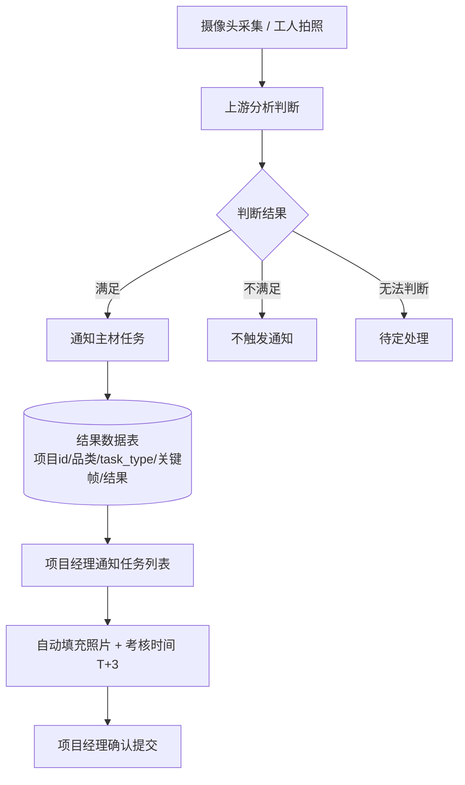
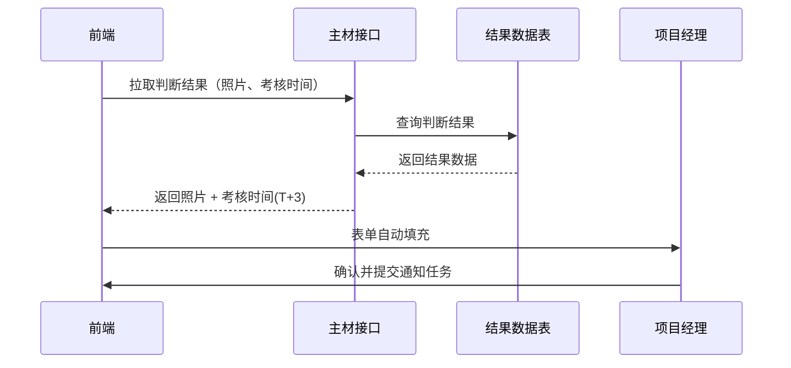
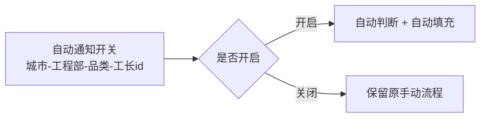

背景：项目经理多任务-提效-通知任务-判断交接面-是否可通知-如何触达    判断可通知的条件
源头；拿到工地的情况-现场    是否满足标准    复杂的任务-
系统的中前置的信息。

本次拿到的任务：室内门             目前可通知判断来自现场，一种是摄像头，工人拍摄的全屋信息（未来音频图像）来判断现场环境来判断是否可通知。

为什么：

作用：

改动：

完成后要观测系统通知占比和驳回率以及及时率（北京和西安）
小师傅触达
首页限时任务

延期包括不在本次品类中的

获取代客权限查看现有逻辑

# 需求背景

当前项目经理有多个通知类任务，处理繁琐影响效率，本次需求针对这个问题进行提效，通过使用工地的摄像头以及工人拍摄的照片进行条件判断。一期只实现通过摄像头和照片的进行判断是否满足通知任务的执行标准，若满足则使用自动提交，当前需要开关（城市-工程部-品类-工长id（暂定））维度来控制，一期只实现自动的填充。但是要项目经理手动提交（这个接口要找到后续要用到）

整体流程是摄像头和工人拍照采集后（先根据四个品类来执行自动通知），上游分析完结果后（满足、不满足、无法判断）将结果通知到主材任务，通知方式（接口、消息待定）结果内容字段暂定包括（项目id，品类，task_type，关键帧图片，判断结果）将结果落在一个新建的数据表中，数据表结构待确定。

项目经理在通知惹怒列表界面执行通知任务，目前是通过项目经理自己提交照片和期望上门时间，希望改造为自动填充，这个自动填充需要前端调用主材的接口拉取刚才的那个表中的照片以及考核时间，考核时间为T+3，这个T+3具体T是由哪里确定的需要明确。

除此之外还有小师傅触达、首页限时任务、push消息逻辑。前两个是需要提供一个批量查询判断结果的接口以及批量执行通知任务的接口，push消息逻辑不明确。

# 需求背景整理

## 业务背景

项目经理名下存在多个通知类任务，处理繁琐、影响效率。本次需求针对此问题进行提效：利用工地摄像头与工人拍摄的照片进行条件判断，判断现场是否满足通知任务的执行标准，从而减少人工判断与操作成本。

## 一期范围

- 仅实现通过摄像头 + 照片判断是否满足通知任务的执行标准；
- 判断满足后，表单**自动填充**，但仍需项目经理手动提交（该提交接口需找到，后续复用）；
- 功能通过开关控制，开关维度暂定：**城市 - 工程部 - 品类 - 工长id**；
- 一期先按四个品类执行自动通知。

## 核心流程

1. **采集**：摄像头采集、工人拍照（全屋信息）；
2. **上游分析**：对采集内容进行判断，输出结果（满足 / 不满足 / 无法判断）；
3. **结果通知**：分析结果通过接口或消息（待定）通知到主材任务；
4. **结果落地**：新建数据表存储结果，字段暂定：项目id、品类、task_type、关键帧图片、判断结果；
5. **自动填充**：项目经理在通知任务列表执行时，前端调用主材接口拉取照片与考核时间，自动填充表单；
6. **考核时间**：T+3（T 由哪里确定，需明确）。

## 配套功能

- **小师傅触达**：需要提供「批量查询判断结果」接口 +「批量执行通知任务」接口；
- **首页限时任务**：同上，需要批量查询 + 批量执行接口；
- **push 消息逻辑**：暂不明确。

## 图示

### 整体业务流程

### 自动填充时序

### 开关控制

## 待明确问题

### 上游 → 主材任务（判断结果通知）

- 通知方式：接口 or 消息，待定；
- **接口字段**（若走接口）：接口归属方、URL、入参 / 出参字段定义、鉴权方式、超时与重试策略；
- **消息字段**（若走消息）：topic / 队列名称、消息协议、消息体字段、幂等与重试机制、消费方；结果内容字段暂定：项目id、品类、task_type、关键帧图片、判断结果——字段类型、取值枚举（满足 / 不满足 / 无法判断）、图片格式与地址存储方式需明确；
- 通知失败的处理：降级、告警、补偿。

### 数据库

- 结果数据表：表名、字段明细（含状态字段）、主键 / 唯一键、索引设计，**表结构待确定**；
- 关键帧图片存储方式（OSS / 对象存储？），是否存 URL；
- 数据量与保留周期、历史数据清理策略；
- 判断结果与主材任务的关联关系（如何回查、如何标记已处理）。

### 前端自动填充（前后端交互）

- **拉取判断结果接口**：入参（项目id / task_type / 品类？）、出参（照片列表、考核时间 T+3）、接口归属方、鉴权；
- **手动提交接口**：项目经理手动提交照片与期望上门时间的现有接口需找到，后续自动填充复用（原文档：这个接口要找到后续要用到）；
- **批量查询判断结果接口**：供小师傅触达、首页限时任务使用，入参 / 出参 / 分页待定；
- **批量执行通知任务接口**：供小师傅触达、首页限时任务使用，入参（项目 / 任务列表）与并发 / 限流待定。

### 考核时间 T+3

- T 的定义与来源（由哪一环节 / 哪个系统确定），待明确；
- 计算规则：自然日 or 工作日、时区、节假日处理。

### push 消息逻辑

- 触达对象、触发时机、消息内容、依赖的判断结果，均不明确；
- 是否与批量接口联动、失败重推策略。

### 开关配置

- 开关维度：城市 - 工程部 - 品类 - 工长id（暂定）；
- 配置入口（后台 / 接口）、生效时机（实时 or 次日）、默认值。

## 待办事项

1. 明确判断结果的通知方式，并确定接口 / 消息字段定义；
2. 确定结果数据表结构（含字段、索引、图片存储、保留策略）；
3. 明确 T+3 中 T 的来源与计算规则；
4. 找到项目经理手动提交接口，确认自动填充复用方案；
5. 定义主材「拉取判断结果」接口的入参 / 出参；
6. 设计小师傅触达、首页限时任务的批量查询 / 批量执行接口；
7. 明确 push 消息完整逻辑；
8. 确定开关配置方案（维度、入口、生效时机）；
9. 上线后观测指标：通知占比、驳回率、及时率（北京 / 西安）。

