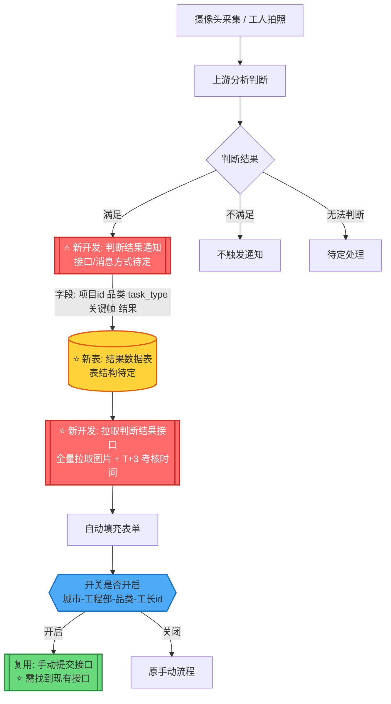
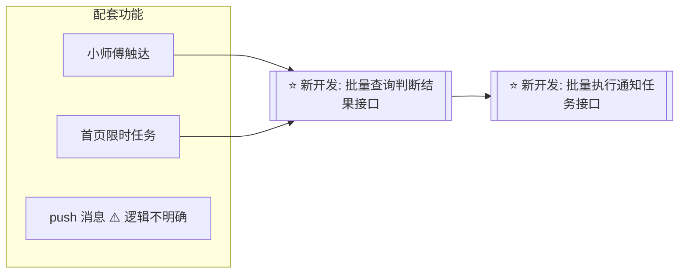

背景：项目经理多任务-提效-通知任务-判断交接面-是否可通知-如何触达    判断可通知的条件
源头；拿到工地的情况-现场    是否满足标准    复杂的任务-
系统的中前置的信息。

本次拿到的任务：室内门             目前可通知判断来自现场，一种是摄像头，工人拍摄的全屋信息（未来音频图像）来判断现场环境来判断是否可通知。

为什么：

作用：

改动：

完成后要观测系统通知占比和驳回率以及及时率（北京和西安）
小师傅触达
首页限时任务

延期包括不在本次品类中的

获取代客权限查看现有逻辑

# 需求背景

当前项目经理有多个通知类任务，处理繁琐影响效率，本次需求针对这个问题进行提效，通过使用工地的摄像头以及工人拍摄的照片进行条件判断。一期只实现通过摄像头和照片的进行判断是否满足通知任务的执行标准，若满足则使用自动提交，当前需要开关（城市-工程部-品类-工长id（暂定））维度来控制，一期只实现自动的填充。但是要项目经理手动提交（这个接口要找到后续要用到）

整体流程是摄像头和工人拍照采集后（先根据四个品类来执行自动通知），上游分析完结果后（满足、不满足、无法判断）将结果通知到主材任务，通知方式（接口、消息待定）结果内容字段暂定包括（项目id，品类，task_type，关键帧图片，判断结果）将结果落在一个新建的数据表中，数据表结构待确定。

项目经理在通知惹怒列表界面执行通知任务，目前是通过项目经理自己提交照片和期望上门时间，希望改造为自动填充，这个自动填充需要前端调用主材的接口拉取刚才的那个表中的照片以及考核时间，考核时间为T+3，这个T+3具体T是由哪里确定的需要明确。

除此之外还有小师傅触达、首页限时任务、push消息逻辑。前两个是需要提供一个批量查询判断结果的接口以及批量执行通知任务的接口，push消息逻辑不明确。

# 需求背景整理

图例：⭐ = 需要开发 / 修改点；不同颜色区分「新开发接口」「新数据库表」「复用现有接口」。

## 一、背景与目标

项目经理名下存在多个通知类任务（本次聚焦：**室内门**复尺通知），处理繁琐、影响效率。本次需求通过工地**摄像头**与工人拍摄的**照片**判断现场环境是否满足复尺通知的执行标准，满足则自动触发通知任务，减少人工判断与操作成本。

核心思路：拿到工地现场情况（源头）→ 判断是否满足标准 → 决定是否可通知、如何触达。

## 二、一期范围

- 仅实现通过摄像头 + 照片判断是否满足通知任务的执行标准；
- 判断满足后表单**自动填充**，但由项目经理**手动提交**（提交接口需找到，后续复用）；
- 开关维度暂定：城市 - 工程部 - 品类 - 工长id；
- 一期先按四个品类执行自动通知；延期品类不在本次范围。

## 三、整体流程（含修改点标注）

修改点：
1. **判断结果通知接口**：上游分析结果 → 主材任务（方式待定：接口 / 消息）；
2. **落库逻辑**：结果数据表结构设计 + 数据表创建；
3. **拉取判断结果接口**（点击去处理时调用）：**全量**拉取图片 + T+3 考核时间，不做条件过滤；
4. **开关判断**：放在自动提交位置，开关维度（城市 / 工程部 / 品类 / 工长id）决定是否放行自动提交；
5. **提交接口**：复用现有手动提交接口（需找到）；开关关闭时走原手动流程。

T+3 中 T 由哪里确定 → **待明确**。上游发消息的时间作为T

开关配置入口、生效时机 → **待明确**。

1、开发接收上游判断结果-并落库的接口
2、数据表创建-结构
3、数据表查询的接口
	1、自动填充的 
	2、小师傅以及首页现实任务的
	3、Mpush消息的 **具体的功能需要看PRD明确 todo** 最后做
4、小师傅首页限定push消息提交要做，以及如何做再定方案 延期没要？

## 六、配套功能（批量接口修改点）
prd-小师傅的查询和执行

小师傅、首页限时任务、Mpush需要批量查询判断结果的接口，以及批量执行通知任务的接口，「todo」

落库字段--待定-不一定对
![[需求/通知复尺自动化/fig/Pasted image 20260812151209.png]]